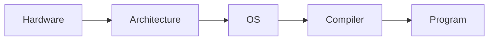

# 시스템 과목 이해하기

> 컴퓨터학과 전공 학습 가이드 101 시리즈 (4/10)


## 이 글에서 다룰 문제

성능 문제를 읽고 장애 원인을 좁히려면 시스템 지식이 꼭 필요합니다.

## 전체 흐름


## Before/After

**Before**: 코드는 그냥 돌아간다고 생각합니다.

**After**: CPU, 메모리, OS가 실제로 어떻게 관여하는지 보입니다.

## 시스템 감각 키우기

### 1단계 — 프로세스 ID

```python
import os
print(os.getpid())
```

### 2단계 — 환경 변수

```python
print(os.environ.get("PATH", ""))
```

### 3단계 — 파일 디스크립터

```python
with open("/etc/hostname") as f:
    print(f.fileno())
```

### 4단계 — 시간 측정

```python
import time
t = time.perf_counter()
sum(range(10_000_000))
print(time.perf_counter() - t)
```

### 5단계 — 메모리 감각

```python
import sys
print(sys.getsizeof([0] * 1000))
```

## 이 코드에서 주목할 점

- 프로세스에는 고유 ID가 있습니다.
- 환경 변수는 프로세스 단위로 보입니다.
- 시간 측정도 결국 시스템 동작과 맞닿아 있습니다.

## 자주 하는 실수 5가지

1. 메모리 주소와 값을 같은 것으로 봅니다.
2. 프로세스와 스레드를 자주 헷갈립니다.
3. 스택과 힙의 역할을 섞어서 이해합니다.
4. 버퍼링이 동작에 주는 영향을 잊습니다.
5. 시스템 호출 비용을 너무 가볍게 봅니다.

## 실무에서는 이렇게 쓰입니다

실무에서 장애 보고서를 읽다 보면 근본 원인이 OS 자원 한계로 이어지는 경우가 많습니다. CPU를 얼마나 쓰는지, 메모리가 어디서 늘어나는지, 파일 디스크립터가 고갈되는지 같은 질문이 결국 시스템 과목에서 배운 개념으로 연결됩니다.

## 체크리스트

- [ ] 프로세스와 스레드의 차이를 설명할 수 있습니다.
- [ ] 메모리 영역을 스택과 힙 기준으로 구분할 수 있습니다.
- [ ] 시스템 호출 비용이 왜 중요한지 이해했습니다.
- [ ] 간단한 코드의 실행 시간을 직접 측정할 수 있습니다.

## 정리 및 다음 단계

시스템 과목은 코드를 더 낮은 층에서 바라보게 만드는 훈련입니다. 운영체제, 메모리, 파일, 시간 같은 개념이 손에 잡히기 시작하면 디버깅 방식도 달라집니다. 다음 글에서는 데이터베이스와 네트워크를 보면서, 프로그램 바깥의 자원과 연결이 어떻게 성능과 안정성에 영향을 주는지 이어서 살펴보겠습니다.

<!-- toc:begin -->
- [컴퓨터학과에서는 무엇을 배우는가](./01-what-cs-majors-learn.md)
- [1학년 과목 이해하기](./02-first-year-subjects.md)
- [자료구조와 알고리즘](./03-data-structures-and-algorithms.md)
- **시스템 과목 이해하기 (현재 글)**
- 데이터베이스와 네트워크 (예정)
- AI와 데이터사이언스 (예정)
- 프로젝트 과목 (예정)
- 전공 공부 방법 (예정)
- 포트폴리오로 연결하기 (예정)
- 졸업 전 갖춰야 할 역량 (예정)
<!-- toc:end -->

## 참고 자료

- [Operating Systems: Three Easy Pieces](https://pages.cs.wisc.edu/~remzi/OSTEP/)
- [Computer Systems: A Programmer's Perspective](https://csapp.cs.cmu.edu/)
- [Crafting Interpreters](https://craftinginterpreters.com/)
- [The Linux Programming Interface](https://man7.org/tlpi/)

Tags: CS, Systems, OS, Architecture, Beginner
