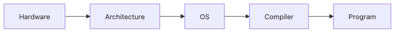

# 시스템 과목 이해하기

코드를 오래 쓰다 보면 결국 같은 질문으로 돌아옵니다. 이 한 줄이 왜 이렇게 동작하는지, 왜 느린지, 왜 같은 코드인데 환경에 따라 다르게 보이는지 궁금해지는 순간이 옵니다.

이 글은 Computer Science Major 101 시리즈의 4번째 글입니다.

## 이 글에서 다룰 문제

- 시스템 과목은 코드 한 줄이 실제로 어떻게 동작하는지 어디까지 설명해 줄까요?
- 운영체제, 컴퓨터 구조, 컴파일러는 왜 함께 배워야 할까요?
- 프로세스, 메모리, 파일, 시간 같은 개념이 디버깅과 성능 분석에 왜 중요할까요?
- 시스템 지식이 없는 상태에서는 어떤 오해가 반복될까요?

## 이 글에서 배울 것

- 운영체제의 의미
- 컴퓨터 구조의 기본 관점
- 컴파일러의 역할
- 시스템 프로그래밍 감각
- 더 나은 디버깅 능력

## 왜 중요한가

성능 문제와 장애 원인 분석은 거의 항상 시스템 지식 위에서 이루어집니다. CPU, 메모리, I/O, 프로세스, 시스템 호출을 모르면 코드 바깥에서 벌어지는 비용을 읽기가 어렵습니다.

## 한눈에 보는 개념



*하드웨어에서 운영체제, 컴파일러, 프로그램 실행으로 이어지는 층*

> 코드는 운영체제와 하드웨어라는 무대 위에서만 실행되므로, 시스템 과목은 그 무대를 읽는 법을 가르칩니다.

코드는 진공 속에서 실행되지 않습니다. 하드웨어 위에 구조가 있고, 운영체제가 자원을 배분하고, 컴파일러가 코드를 번역한 뒤에야 프로그램이 실제로 돌아갑니다. 시스템 과목은 이 무대를 읽는 훈련입니다.

## 핵심 용어

- **운영체제(OS)**: 자원을 관리하는 소프트웨어입니다.
- **프로세스(process)**: 실행 중인 프로그램 단위입니다.
- **스레드(thread)**: 더 가벼운 실행 단위입니다.
- **레지스터(register)**: 가장 빠른 메모리 영역입니다.
- **컴파일러(compiler)**: 코드를 번역하는 도구입니다.

## Before/After

**Before**: 코드는 그냥 돌아간다고 생각합니다.

**After**: CPU, 메모리, 운영체제가 아래에서 어떻게 관여하는지 보입니다.

## 실습: 시스템 감각 만들기

### 1단계 — 프로세스 ID

```python
import os
print(os.getpid())
```

프로그램은 실행되는 순간 운영체제 안에서 하나의 프로세스로 다뤄집니다. 고유 ID가 있다는 사실만으로도 프로그램을 추상적인 코드가 아니라 시스템 자원으로 보게 됩니다.

### 2단계 — 환경 변수

```python
print(os.environ.get("PATH", ""))
```

환경 변수는 프로세스 단위의 실행 맥락입니다. 로컬에서는 되는데 서버에서는 안 되는 문제 중 상당수가 이런 실행 환경 차이와 연결됩니다.

### 3단계 — 파일 디스크립터

```python
with open("/etc/hostname") as f:
    print(f.fileno())
```

파일도 운영체제가 관리하는 자원입니다. 숫자 하나처럼 보이는 디스크립터 뒤에 입출력 모델과 자원 한계가 숨어 있습니다.

### 4단계 — 시간 측정

```python
import time
t = time.perf_counter()
sum(range(10_000_000))
print(time.perf_counter() - t)
```

성능은 느낌으로 판단하지 않습니다. 시간을 재는 순간부터 코드의 비용을 시스템 관점에서 보기 시작할 수 있습니다.

### 5단계 — 메모리 감각

```python
import sys
print(sys.getsizeof([0] * 1000))
```

같은 코드라도 메모리를 얼마나 쓰는지 모르면 비용을 절반만 보고 있는 셈입니다. 시스템 과목은 바로 이런 감각을 붙이는 데 도움을 줍니다.

## 이 코드에서 먼저 볼 점

- 프로세스에는 고유 ID가 있습니다.
- 환경은 프로세스 단위로 붙습니다.
- 시간 측정과 자원 사용은 시스템 감각의 출발점입니다.

## 자주 하는 실수 5가지

1. **메모리 주소와 값을 같은 것으로 보는 일입니다.**
2. **프로세스와 스레드를 혼동하는 일입니다.**
3. **스택과 힙을 섞어 이해하는 일입니다.**
4. **버퍼링이 동작에 미치는 영향을 잊는 일입니다.**
5. **시스템 호출 비용을 너무 가볍게 보는 일입니다.**

## 실무에서는 이렇게 드러납니다

장애 보고서를 읽다 보면 근본 원인이 애플리케이션 코드보다 OS 자원 한계로 이어지는 경우가 많습니다. CPU 사용량, 메모리 부족, 파일 디스크립터 고갈, 느린 I/O 같은 문제는 모두 시스템 과목에서 배우는 기본 개념 위에서 읽힙니다.

## 선배 엔지니어는 이렇게 봅니다

- 코드는 결국 기계 위에서 돌아갑니다.
- 비용은 CPU와 메모리로 나타납니다.
- 동시성의 실제 조건은 운영체제가 정합니다.
- 컴파일러는 실행 형태를 바꿉니다.
- 시스템 호출은 생각보다 비쌉니다.

## 체크리스트

- [ ] 프로세스와 스레드의 차이를 설명할 수 있습니다.
- [ ] 메모리 영역을 대략 구분할 수 있습니다.
- [ ] 시스템 호출 비용이 왜 중요한지 이해했습니다.
- [ ] 간단한 코드의 실행 시간을 직접 측정할 수 있습니다.

## 연습 문제

1. 운영체제를 한 줄로 설명해 보세요.
2. 컴파일러를 한 줄로 설명해 보세요.
3. 프로세스의 의미를 한 줄로 적어 보세요.

## 정리

시스템 과목은 코드를 더 낮은 층에서 읽게 만드는 훈련입니다. 운영체제, 컴퓨터 구조, 컴파일러, 시스템 프로그래밍 개념이 손에 잡히기 시작하면 디버깅 방식과 성능을 보는 시선도 함께 달라집니다. 다음 글에서는 저장과 전달을 맡는 데이터베이스와 네트워크로 이어가겠습니다.

<!-- toc:begin -->
- [컴퓨터학과에서는 무엇을 배우는가](./01-what-cs-majors-learn.md)
- [1학년 과목 이해하기](./02-first-year-subjects.md)
- [자료구조와 알고리즘](./03-data-structures-and-algorithms.md)
- **시스템 과목 이해하기 (현재 글)**
- 데이터베이스와 네트워크 (예정)
- AI와 데이터사이언스 (예정)
- 프로젝트 과목 (예정)
- 전공 공부 방법 (예정)
- 포트폴리오로 연결하기 (예정)
- 졸업 전 갖춰야 할 역량 (예정)
<!-- toc:end -->

## 참고 자료

- [Operating Systems: Three Easy Pieces](https://pages.cs.wisc.edu/~remzi/OSTEP/)
- [Computer Systems: A Programmer's Perspective](https://csapp.cs.cmu.edu/)
- [Crafting Interpreters](https://craftinginterpreters.com/)
- [The Linux Programming Interface](https://man7.org/tlpi/)

Tags: CS, Systems, OS, Architecture, Beginner
