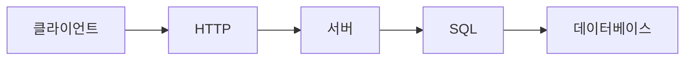

# 데이터베이스와 네트워크

> 컴퓨터학과 전공 학습 가이드 101 시리즈 (5/10)

## 이 글에서 다룰 문제

- 데이터베이스 과목과 네트워크 과목은 왜 거의 모든 서비스의 바닥에 놓일까요?
- SQL, 테이블, 인덱스 같은 개념은 실제 서비스 성능과 어떻게 연결될까요?
- TCP/IP와 HTTP는 어떤 층에서 역할을 나눌까요?
- 저장과 전달이라는 두 축을 함께 이해해야 하는 이유는 무엇일까요?

백엔드나 서비스 개발에 관심이 있는 학생이라면 어느 순간 비슷한 질문을 하게 됩니다. 데이터는 결국 어디에 저장되고, 사용자의 요청은 어떤 경로로 서버에 도착할까요? 기능을 만드는 일은 화면과 코드만으로 끝나지 않습니다. **저장하는 방법과 전달하는 방법**을 이해해야 서비스 전체가 보입니다.

데이터베이스와 네트워크 과목은 성격이 달라 보이지만 현업에서는 거의 한 문장으로 묶입니다. 데이터베이스는 정보를 보관하고, 네트워크는 그 정보를 주고받게 만듭니다. 둘 중 하나만 약해도 서비스는 쉽게 흔들립니다.

이 글에서는 데이터베이스와 네트워크 과목이 각각 무엇을 가르치는지, 왜 함께 배워야 하는지, 그리고 간단한 코드 예시로 무엇을 봐야 하는지 정리하겠습니다.

## 이 글에서 배울 것

- 관계형 데이터베이스와 SQL의 기본 역할
- TCP/IP 모델과 HTTP의 위치
- 데이터베이스와 네트워크가 하나의 서비스 안에서 만나는 방식
- 지연 시간과 장애를 읽는 기본 관점

## 왜 중요한가

현업 백엔드 코드의 상당수는 결국 데이터베이스와 네트워크를 다룹니다. 요청을 받으면 서버는 데이터를 읽거나 쓰고, 다른 서비스와 통신하고, 결과를 다시 응답합니다. 그래서 많은 성능 문제와 장애가 이 두 영역에서 시작됩니다.

코드만 보고는 문제가 없어 보여도 쿼리가 느리거나 네트워크 타임아웃이 길면 전체 서비스가 답답해집니다. 데이터베이스와 네트워크를 함께 이해하면 서비스가 왜 느려지는지, 어디에서 병목이 생기는지 더 차분하게 추적할 수 있습니다.

## 한눈에 보는 흐름



사용자는 HTTP 요청을 보내고, 서버는 그 요청을 받아 SQL로 데이터를 읽거나 씁니다. 이 단순한 흐름 안에 네트워크 지연, 인증, 연결 관리, 인덱스, 트랜잭션 같은 주제가 모두 숨어 있습니다.

## 핵심 용어

- **테이블**: 행과 열로 데이터를 저장하는 기본 구조입니다.
- **기본 키**: 각 행을 고유하게 구분하는 값입니다.
- **인덱스**: 검색 속도를 높이기 위한 자료 구조입니다.
- **패킷**: 네트워크에서 데이터를 나누어 보내는 단위입니다.
- **포트**: 네트워크 연결의 출입구를 구분하는 번호입니다.

## Before/After

**Before**: 데이터베이스를 그냥 블랙박스로 봅니다.

**After**: 쿼리와 지연 시간을 측정 가능한 대상으로 봅니다.

## 저장과 전달은 따로 놀지 않습니다

데이터베이스 과목은 보통 테이블 설계, 정규화, SQL, 인덱스, 트랜잭션을 중심으로 진행됩니다. 여기서 배우는 핵심은 데이터를 그냥 저장하는 것이 아니라 **일관성 있게, 빠르게, 안전하게** 다루는 법입니다. 같은 데이터를 읽더라도 어떤 조건으로 조회하느냐에 따라 비용이 크게 달라집니다.

네트워크 과목은 TCP/IP, 라우팅, 포트, 소켓, HTTP 같은 개념을 중심으로 흘러갑니다. 여기서 중요한 것은 데이터가 이동하는 경로와 규칙입니다. 요청이 언제 실패하고, 재시도는 어디에서 일어나며, 지연 시간은 왜 생기는지 이해하려면 네트워크의 계층 구조를 알아야 합니다.

실무에서는 두 과목이 한 화면에서 만납니다. 사용자가 버튼을 누르면 HTTP 요청이 서버로 들어오고, 서버는 데이터베이스에서 값을 읽어 다시 응답합니다. 서비스 한 번 호출에 두 과목이 동시에 들어 있는 셈입니다.

## 기초 SQL과 소켓 감각 익히기

### 1단계 — 인메모리 SQL

```python
import sqlite3
con = sqlite3.connect(":memory:")
con.execute("CREATE TABLE u(id INT, name TEXT)")
```

아주 작은 메모리 데이터베이스를 열고 테이블을 만듭니다. 데이터베이스 과목에서는 이런 기본 조작을 바탕으로 스키마와 질의를 배웁니다.

### 2단계 — 입력

```python
con.execute("INSERT INTO u VALUES (1, 'kim')")
```

데이터를 넣는 일은 단순해 보여도, 실제로는 타입과 제약 조건, 트랜잭션 경계를 함께 생각해야 합니다.

### 3단계 — 조회

```python
rows = con.execute("SELECT * FROM u WHERE id = 1").fetchall()
```

조회는 서비스 성능과 가장 자주 연결됩니다. 어떤 조건으로 읽는지에 따라 전체 스캔이 될 수도 있고 빠른 탐색이 될 수도 있습니다.

### 4단계 — 인덱스

```python
con.execute("CREATE INDEX ux ON u(id)")
```

인덱스는 빠른 조회를 위한 도구입니다. 다만 읽기를 빠르게 해 주는 대신 쓰기 비용이 늘 수 있다는 점도 함께 봐야 합니다.

### 5단계 — HTTP 호출

```python
import urllib.request
print(urllib.request.urlopen("http://example.com").status)
```

이 코드는 네트워크 관점의 가장 단순한 예시입니다. 요청을 보내고 응답 상태 코드를 확인합니다. 실전에서는 여기에 타임아웃, 재시도, 예외 처리 같은 요소가 더 붙습니다.

## 이 코드에서 주목할 점

- 데이터베이스 연결은 세션 단위로 관리됩니다.
- 인덱스는 조회 지연 시간을 줄일 수 있지만 비용이 공짜는 아닙니다.
- HTTP 상태 코드는 네트워크 결과를 숫자로 보여 주는 신호입니다.

## 자주 하는 실수 5가지

1. WHERE 없이 전체 스캔을 남발하는 일입니다.
2. N+1 쿼리 패턴을 알아채지 못하는 일입니다.
3. 트랜잭션 없이 동시 쓰기를 처리하려는 일입니다.
4. 연결 풀 없이 요청마다 새 연결을 만드는 일입니다.
5. 포트와 프로토콜을 같은 개념처럼 혼동하는 일입니다.

## 실무에서는 이렇게 쓰입니다

실제 장애는 생각보다 거창하지 않게 시작합니다. 데이터베이스 락이 오래 유지되거나, 외부 API 호출이 타임아웃을 반복하거나, 인덱스가 빠진 쿼리가 갑자기 느려지는 식입니다. 데이터베이스와 네트워크를 따로 공부할 때는 잘 안 보이지만, 서비스 운영에서는 둘이 거의 동시에 원인 후보에 올라옵니다.

## 선배 엔지니어는 이렇게 봅니다

- 읽기와 쓰기 비중을 먼저 봅니다.
- 인덱스는 많을수록 좋지 않고 비용과 함께 봅니다.
- 프로토콜은 팀 사이의 계약이라고 생각합니다.
- 지연 시간은 느낌이 아니라 측정값으로 봅니다.
- 오류는 종류별로 나눠야 해결이 빨라집니다.

## 체크리스트

- [ ] 어떤 컬럼에 인덱스가 필요한지 생각해 보았습니다.
- [ ] 트랜잭션 경계를 한 번 적어 보았습니다.
- [ ] 연결 풀의 필요성을 이해했습니다.
- [ ] 네트워크 타임아웃 설정의 의미를 설명할 수 있습니다.

## 연습 문제

1. 기본 키를 한 줄로 설명해 보세요.
2. TCP를 한 줄로 설명해 보세요.
3. HTTP가 무엇을 하는지 한 줄로 적어 보세요.

## 정리 및 다음 단계

데이터베이스와 네트워크는 각각 저장과 전달을 담당하지만 실제 서비스에서는 거의 하나의 흐름처럼 움직입니다. 데이터를 어디에 어떻게 보관할지, 요청을 어떤 규칙으로 주고받을지를 함께 이해해야 서비스의 속도와 안정성을 설명할 수 있습니다. 다음 글에서는 데이터를 다루는 또 다른 큰 축인 AI와 데이터사이언스를 보겠습니다.

<!-- toc:begin -->
- [컴퓨터학과에서는 무엇을 배우는가](./01-what-cs-majors-learn.md)
- [1학년 과목 이해하기](./02-first-year-subjects.md)
- [자료구조와 알고리즘](./03-data-structures-and-algorithms.md)
- [시스템 과목 이해하기](./04-systems-subjects.md)
- **데이터베이스와 네트워크 (현재 글)**
- AI와 데이터사이언스 (예정)
- 프로젝트 과목 (예정)
- 전공 공부 방법 (예정)
- 포트폴리오로 연결하기 (예정)
- 졸업 전 갖춰야 할 역량 (예정)
<!-- toc:end -->

## 참고 자료

- [Database System Concepts](https://www.db-book.com/)
- [SQLite Documentation](https://sqlite.org/docs.html)
- [Computer Networking: A Top-Down Approach](https://gaia.cs.umass.edu/kurose_ross/index.php)
- [MDN HTTP Overview](https://developer.mozilla.org/en-US/docs/Web/HTTP/Overview)

Tags: CS, Database, Network, SQL, Beginner
