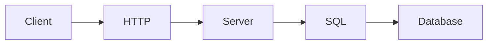

# 데이터베이스와 네트워크

> 컴퓨터학과 전공 학습 가이드 101 시리즈 (5/10)


## 이 글에서 다룰 문제

*백엔드* 의 *대부분* 의 *시간* 이 *DB* 와 *네트워크* 에 쓰입니다.

## 개념 한눈에 보기



## Before/After

**Before**: *DB* 가 *블랙박스*.

**After**: *쿼리* 와 *지연* 이 *측정* 가능.

## 실습: 기초 SQL과 소켓

### 1단계 — 인메모리 SQL

```python
import sqlite3
con = sqlite3.connect(":memory:")
con.execute("CREATE TABLE u(id INT, name TEXT)")
```

### 2단계 — 입력

```python
con.execute("INSERT INTO u VALUES (1, 'kim')")
```

### 3단계 — 조회

```python
rows = con.execute("SELECT * FROM u WHERE id = 1").fetchall()
```

### 4단계 — 인덱스

```python
con.execute("CREATE INDEX ux ON u(id)")
```

### 5단계 — HTTP 호출

```python
import urllib.request
print(urllib.request.urlopen("http://example.com").status)
```

## 이 코드에서 주목할 점

- *DB 연결* 은 *세션* 단위.
- *INDEX* 가 *지연* 을 줄인다.
- *HTTP 상태* 는 *정수*.

## 자주 하는 실수 5가지

1. ***WHERE* 없이 *전체 스캔*.**
2. ***N+1* 쿼리 패턴.**
3. ***트랜잭션* 없는 *동시 쓰기*.**
4. ***연결 풀* 없이 매번 *새 연결*.**
5. ***포트* 와 *프로토콜* 혼동.**

## 실무에서는 이렇게 쓰입니다

장애의 *대부분* 은 *DB 락* 또는 *네트워크 타임아웃* 에서 시작됩니다.

## 체크리스트

- [ ] *인덱스* 계획.
- [ ] *트랜잭션* 경계.
- [ ] *연결 풀* 사용.
- [ ] *타임아웃* 설정.

## 정리 및 다음 단계

다음 글은 *AI와 데이터사이언스* 입니다.

<!-- toc:begin -->
- [컴퓨터학과에서는 무엇을 배우는가](./01-what-cs-majors-learn.md)
- [1학년 과목 이해하기](./02-first-year-subjects.md)
- [자료구조와 알고리즘](./03-data-structures-and-algorithms.md)
- [시스템 과목 이해하기](./04-systems-subjects.md)
- **데이터베이스와 네트워크 (현재 글)**
- AI와 데이터사이언스 (예정)
- 프로젝트 과목 (예정)
- 전공 공부 방법 (예정)
- 포트폴리오로 연결하기 (예정)
- 졸업 전 갖춰야 할 역량 (예정)
<!-- toc:end -->

## 참고 자료

- [Database System Concepts](https://www.db-book.com/)
- [SQLite Documentation](https://sqlite.org/docs.html)
- [Computer Networking: A Top-Down Approach](https://gaia.cs.umass.edu/kurose_ross/index.php)
- [MDN HTTP Overview](https://developer.mozilla.org/en-US/docs/Web/HTTP/Overview)

Tags: CS, Database, Network, SQL, Beginner
