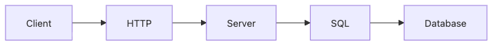

# 데이터베이스와 네트워크

서비스를 만든다는 말은 결국 데이터를 저장하고, 그 데이터를 네트워크를 통해 주고받는다는 뜻입니다. 화면과 코드만으로는 서비스가 완성되지 않는 이유도 여기에 있습니다.

이 글은 Computer Science Major 101 시리즈의 5번째 글입니다.

## 이 글에서 다룰 문제

- 데이터베이스와 네트워크는 왜 거의 모든 서비스의 바닥에 놓일까요?
- SQL, 테이블, 인덱스는 실제 성능과 어떻게 연결될까요?
- TCP/IP와 HTTP는 어떤 층에서 역할을 나눌까요?
- 저장과 전달을 함께 이해해야 하는 이유는 무엇일까요?

## 이 글에서 배울 것

- 관계형 데이터베이스의 의미
- SQL의 역할
- TCP/IP 모델
- HTTP의 위치
- 두 과목이 만나는 지점

## 왜 중요한가

백엔드 코드의 상당수는 결국 데이터베이스와 네트워크를 다룹니다. 많은 장애와 지연도 저장 계층과 통신 계층에서 함께 시작되기 때문에, 두 과목을 따로 배우더라도 머릿속에서는 한 흐름으로 묶어 이해하는 편이 좋습니다.

## 한눈에 보는 개념



*네트워크 요청이 데이터베이스 조회로 이어지는 서비스 기본 경로*

> 서비스는 네트워크가 요청을 옮기고 데이터베이스가 상태를 보관할 때 비로소 완성됩니다.

사용자는 HTTP 요청을 보내고, 서버는 그 요청을 처리한 뒤 SQL로 데이터를 읽거나 씁니다. 이 단순한 경로 안에 지연 시간, 연결 관리, 인덱스, 트랜잭션, 타임아웃 같은 핵심 주제가 모두 들어 있습니다.

## 핵심 용어

- **테이블(table)**: 행과 열로 데이터를 저장하는 구조입니다.
- **기본 키(primary key)**: 각 행을 고유하게 구분하는 값입니다.
- **인덱스(index)**: 더 빠른 조회를 위한 구조입니다.
- **패킷(packet)**: 네트워크에서 데이터를 나눠 보내는 단위입니다.
- **포트(port)**: 연결 대상을 구분하는 번호입니다.

## Before/After

**Before**: 데이터베이스를 블랙박스로 봅니다.

**After**: 쿼리와 지연 시간을 측정 가능한 대상으로 봅니다.

## 실습: SQL과 소켓 감각 익히기

### 1단계 — 인메모리 SQL

```python
import sqlite3
con = sqlite3.connect(":memory:")
con.execute("CREATE TABLE u(id INT, name TEXT)")
```

작은 메모리 데이터베이스를 열고 테이블을 만듭니다. 가장 단순한 예시지만 데이터 저장의 시작점을 보여 주기에 충분합니다.

### 2단계 — 입력

```python
con.execute("INSERT INTO u VALUES (1, 'kim')")
```

값 하나를 넣는 동작 뒤에도 타입, 제약 조건, 트랜잭션 같은 개념이 따라옵니다. 데이터베이스 과목은 바로 이런 배경을 읽게 만듭니다.

### 3단계 — 조회

```python
rows = con.execute("SELECT * FROM u WHERE id = 1").fetchall()
```

조회는 가장 자주 성능과 연결됩니다. WHERE 조건 하나가 전체 스캔과 빠른 탐색을 가를 수 있습니다.

### 4단계 — 인덱스

```python
con.execute("CREATE INDEX ux ON u(id)")
```

인덱스는 조회를 빠르게 해 주지만 공짜는 아닙니다. 읽기 성능과 쓰기 비용 사이의 균형을 보는 습관이 필요합니다.

### 5단계 — HTTP 호출

```python
import urllib.request
print(urllib.request.urlopen("http://example.com").status)
```

네트워크 관점에서는 가장 단순한 예시입니다. 요청을 보내고 응답 상태를 받는 순간, 통신도 측정 가능한 시스템 계약이라는 점이 분명해집니다.

## 이 코드에서 먼저 볼 점

- 데이터베이스 연결은 세션 단위로 관리됩니다.
- 인덱스는 지연 시간을 줄일 수 있지만 비용이 있습니다.
- HTTP 상태 코드는 네트워크 결과를 숫자로 보여 줍니다.

## 자주 하는 실수 5가지

1. **WHERE 없이 전체 스캔을 반복하는 일입니다.**
2. **N+1 쿼리 패턴을 놓치는 일입니다.**
3. **트랜잭션 없이 동시 쓰기를 처리하려는 일입니다.**
4. **연결 풀 없이 요청마다 새 연결을 만드는 일입니다.**
5. **포트와 프로토콜을 같은 개념처럼 혼동하는 일입니다.**

## 실무에서는 이렇게 드러납니다

실제 장애는 거창하지 않게 시작됩니다. 느린 쿼리, 오래 잡힌 락, 외부 API 타임아웃, 재시도 폭증 같은 문제는 데이터베이스와 네트워크를 동시에 이해할 때 훨씬 빨리 좁혀집니다.

## 선배 엔지니어는 이렇게 봅니다

- 읽기와 쓰기 비중을 먼저 봅니다.
- 인덱스는 많을수록 좋은 것이 아닙니다.
- 프로토콜은 팀과 시스템 사이의 계약입니다.
- 지연 시간은 느낌이 아니라 측정값입니다.
- 오류는 종류별로 나눠야 해결이 빨라집니다.

## 체크리스트

- [ ] 어떤 컬럼에 인덱스가 필요한지 생각해 보았습니다.
- [ ] 트랜잭션 경계를 한 번 적어 보았습니다.
- [ ] 연결 풀의 필요성을 이해했습니다.
- [ ] 네트워크 타임아웃 설정의 의미를 설명할 수 있습니다.

## 연습 문제

1. 기본 키를 한 줄로 설명해 보세요.
2. TCP를 한 줄로 설명해 보세요.
3. HTTP의 의미를 한 줄로 적어 보세요.

## 정리

데이터베이스와 네트워크는 각각 저장과 전달을 담당하지만, 실제 서비스에서는 거의 하나의 흐름처럼 움직입니다. 데이터를 어디에 어떻게 보관할지, 요청을 어떤 규칙으로 주고받을지를 함께 이해해야 서비스의 속도와 안정성을 설명할 수 있습니다. 다음 글에서는 데이터와 모델을 다루는 AI와 데이터사이언스로 넘어가겠습니다.

<!-- toc:begin -->
- [컴퓨터학과에서는 무엇을 배우는가](./01-what-cs-majors-learn.md)
- [1학년 과목 이해하기](./02-first-year-subjects.md)
- [자료구조와 알고리즘](./03-data-structures-and-algorithms.md)
- [시스템 과목 이해하기](./04-systems-subjects.md)
- **데이터베이스와 네트워크 (현재 글)**
- AI와 데이터사이언스 (예정)
- 프로젝트 과목 (예정)
- 전공 공부 방법 (예정)
- 포트폴리오로 연결하기 (예정)
- 졸업 전 갖춰야 할 역량 (예정)
<!-- toc:end -->

## 참고 자료

- [Database System Concepts](https://www.db-book.com/)
- [SQLite Documentation](https://sqlite.org/docs.html)
- [Computer Networking: A Top-Down Approach](https://gaia.cs.umass.edu/kurose_ross/index.php)
- [MDN HTTP Overview](https://developer.mozilla.org/en-US/docs/Web/HTTP/Overview)

Tags: CS, Database, Network, SQL, Beginner
