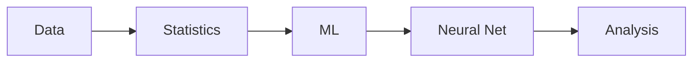

# AI와 데이터사이언스

> 컴퓨터학과 전공 학습 가이드 101 시리즈 (6/10)


## 이 글에서 다룰 문제

*데이터 감각* 이 곧 *현대 엔지니어* 의 *기본기* 입니다.

## 전체 흐름


## Before/After

**Before**: *모델* 만 본다.

**After**: *데이터* 의 *품질* 과 *분포* 를 본다.

## 미니 ML 파이프라인

### 1단계 — 데이터

```python
xs = [1, 2, 3, 4]
ys = [2, 4, 6, 8]
```

### 2단계 — 평균

```python
avg = sum(ys) / len(ys)
```

### 3단계 — 회귀 기울기

```python
def slope(xs, ys):
    mx, my = sum(xs)/len(xs), sum(ys)/len(ys)
    num = sum((x-mx)*(y-my) for x, y in zip(xs, ys))
    den = sum((x-mx)**2 for x in xs)
    return num / den
```

### 4단계 — 예측

```python
m = slope(xs, ys)
pred = m * 5
```

### 5단계 — 평가

```python
mae = sum(abs(m*x - y) for x, y in zip(xs, ys)) / len(xs)
```

## 이 코드에서 주목할 점

- *통계* 가 *모델* 의 기초.
- *예측* 은 *함수* 의 적용.
- *평가* 가 *학습* 을 검증.

## 자주 하는 실수 5가지

1. ***데이터 누수* 를 만든다.**
2. ***훈련/테스트* 를 *섞는다*.**
3. ***스케일링* 없이 *비교* 한다.**
4. ***복잡한 모델* 을 먼저 본다.**
5. ***평가 지표* 를 *모호* 하게 둔다.**

## 실무에서는 이렇게 쓰입니다

데이터 *분포 변화* 를 감지하는 능력이 *모델 운영* 의 *핵심* 입니다.

## 체크리스트

- [ ] *훈련/테스트* 분리.
- [ ] *기준선* 모델.
- [ ] *지표* 명시.
- [ ] *시드* 고정.

## 정리 및 다음 단계

다음 글은 *프로젝트 과목* 입니다.

<!-- toc:begin -->
- [컴퓨터학과에서는 무엇을 배우는가](./01-what-cs-majors-learn.md)
- [1학년 과목 이해하기](./02-first-year-subjects.md)
- [자료구조와 알고리즘](./03-data-structures-and-algorithms.md)
- [시스템 과목 이해하기](./04-systems-subjects.md)
- [데이터베이스와 네트워크](./05-database-and-network.md)
- **AI와 데이터사이언스 (현재 글)**
- 프로젝트 과목 (예정)
- 전공 공부 방법 (예정)
- 포트폴리오로 연결하기 (예정)
- 졸업 전 갖춰야 할 역량 (예정)
<!-- toc:end -->

## 참고 자료

- [An Introduction to Statistical Learning](https://www.statlearning.com/)
- [Deep Learning Book - Goodfellow](https://www.deeplearningbook.org/)
- [Pattern Recognition and Machine Learning](https://www.microsoft.com/en-us/research/uploads/prod/2006/01/Bishop-Pattern-Recognition-and-Machine-Learning-2006.pdf)
- [scikit-learn User Guide](https://scikit-learn.org/stable/user_guide.html)

Tags: CS, AI, DataScience, ML, Beginner
