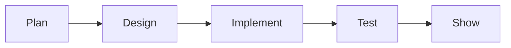

# 프로젝트 과목

> 컴퓨터학과 전공 학습 가이드 101 시리즈 (7/10)


## 이 글에서 다룰 문제

*포트폴리오* 의 *시작* 이 *전공 프로젝트* 인 경우가 많습니다.

## 전체 흐름


## Before/After

**Before**: *과제* 처럼 본다.

**After**: *작은 제품* 으로 본다.

## 프로젝트 미니 플랜

### 1단계 — 문제 정의

```python
problem = "강의 시간표 충돌 검사기"
```

### 2단계 — 사용자

```python
users = ["student", "advisor"]
```

### 3단계 — 핵심 기능

```python
features = ["upload", "detect_conflict", "notify"]
```

### 4단계 — 일정

```python
weeks = {"plan": 1, "build": 6, "test": 2, "demo": 1}
```

### 5단계 — 위험

```python
risks = ["scope_creep", "team_sync", "data_format"]
```

## 이 코드에서 주목할 점

- *문제* 가 *프로젝트* 의 *시작*.
- *사용자* 가 *기능* 을 결정.
- *일정* 이 *현실* 을 만든다.

## 자주 하는 실수 5가지

1. ***기획서* 없이 *바로 코드*.**
2. ***팀 역할* 분리가 모호.**
3. ***주간 회의* 없음.**
4. ***Git 컨벤션* 합의 안 함.**
5. ***회고* 없이 *발표* 로 끝.**

## 실무에서는 이렇게 쓰입니다

스타트업의 *MVP* 는 *전공 프로젝트* 와 거의 *같은 형태* 입니다.

## 체크리스트

- [ ] *문제* 한 줄.
- [ ] *기능* 목록.
- [ ] *일정* 표.
- [ ] *위험* 표.

## 정리 및 다음 단계

다음 글은 *전공 공부 방법* 입니다.

<!-- toc:begin -->
- [컴퓨터학과에서는 무엇을 배우는가](./01-what-cs-majors-learn.md)
- [1학년 과목 이해하기](./02-first-year-subjects.md)
- [자료구조와 알고리즘](./03-data-structures-and-algorithms.md)
- [시스템 과목 이해하기](./04-systems-subjects.md)
- [데이터베이스와 네트워크](./05-database-and-network.md)
- [AI와 데이터사이언스](./06-ai-and-data-science.md)
- **프로젝트 과목 (현재 글)**
- 전공 공부 방법 (예정)
- 포트폴리오로 연결하기 (예정)
- 졸업 전 갖춰야 할 역량 (예정)
<!-- toc:end -->

## 참고 자료

- [The Pragmatic Programmer](https://pragprog.com/titles/tpp20/the-pragmatic-programmer-20th-anniversary-edition/)
- [Mythical Man-Month](https://www.oreilly.com/library/view/mythical-man-month-the/0201835959/)
- [Atlassian Project Management Guide](https://www.atlassian.com/agile/project-management)
- [GitHub Project Boards](https://docs.github.com/en/issues/planning-and-tracking-with-projects)

Tags: CS, Project, Capstone, Teamwork, Beginner
