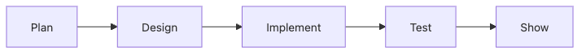

# 프로젝트 과목

전공 후반부에 들어가면 많은 학생이 비슷한 질문을 합니다. 이제까지 배운 것을 어디에 써 보아야 하는지, 과목별 지식을 어떻게 하나의 결과물로 묶어야 하는지 감이 잘 오지 않기 때문입니다.

이 글은 Computer Science Major 101 시리즈의 7번째 글입니다.

## 이 글에서 다룰 문제

- 왜 프로젝트 과목은 전공 후반부의 핵심으로 여겨질까요?
- 팀 프로젝트는 개인 과제와 무엇이 다르고 어떤 준비를 더 요구할까요?
- 문제 정의, 범위 조절, 일정 관리, 시연 준비는 왜 모두 중요할까요?
- 프로젝트 과목이 포트폴리오와 취업 준비로 이어지는 이유는 무엇일까요?

## 이 글에서 배울 것

- 프로젝트의 목적
- 팀 구성
- 기획과 범위 관리
- 산출물 정리
- 데모의 의미

## 왜 중요한가

많은 학생의 첫 포트폴리오는 전공 프로젝트에서 나옵니다. 무엇을 만들었는지뿐 아니라 어떤 판단을 했고, 어떻게 협업했고, 어떤 결과를 남겼는지까지 보여 줄 수 있기 때문입니다.

## 한눈에 보는 개념



*계획부터 설계, 구현, 테스트, 시연으로 이어지는 프로젝트 흐름*

> 프로젝트 과목은 지식을 묻는 수업이 아니라, 제한된 시간 안에 작은 제품을 완성하는 수업에 가깝습니다.

프로젝트는 코드를 먼저 쓰는 활동이 아닙니다. 계획과 설계가 먼저 있고, 구현과 테스트가 뒤따르며, 마지막에는 결과를 보여 주는 시연이 이어집니다. 이 순서를 머릿속에 두면 전공 프로젝트가 훨씬 덜 혼란스럽습니다.

## 핵심 용어

- **범위(scope)**: 이번 프로젝트에서 실제로 다룰 문제의 경계입니다.
- **MVP**: 가장 작은 기능 집합으로 만든 첫 제품입니다.
- **데모(demo)**: 결과물을 직접 보여 주는 시연입니다.
- **이해관계자(stakeholder)**: 결과에 관심을 갖는 사람이나 집단입니다.
- **회고(retrospective)**: 작업이 끝난 뒤 과정을 돌아보는 정리입니다.

## Before/After

**Before**: 프로젝트를 단순한 과제로 봅니다.

**After**: 작은 제품을 만드는 과정으로 봅니다.

## 실습: 프로젝트 미니 플랜

### 1단계 — 문제 정의

```python
problem = "course schedule conflict checker"
```

프로젝트는 문제 한 줄에서 시작합니다. 무엇을 해결하는지 분명해야 기능과 일정이 흔들리지 않습니다.

### 2단계 — 사용자

```python
users = ["student", "advisor"]
```

누가 쓰는지 먼저 정하면 범위를 줄이기 쉽습니다. 사용자 정의가 흐리면 기능도 빠르게 퍼집니다.

### 3단계 — 핵심 기능

```python
features = ["upload", "detect_conflict", "notify"]
```

이 목록이 사실상 MVP의 뼈대입니다. 아이디어를 모두 넣기보다 핵심 기능부터 고르는 편이 프로젝트를 끝까지 끌고 가기 쉽습니다.

### 4단계 — 일정

```python
weeks = {"plan": 1, "build": 6, "test": 2, "demo": 1}
```

일정은 계획을 현실로 바꾸는 장치입니다. 구현만 길게 잡고 테스트와 데모를 뒤로 미루면 막판에 가장 크게 흔들립니다.

### 5단계 — 위험

```python
risks = ["scope_creep", "team_sync", "data_format"]
```

위험 요소를 미리 적어 두면 문제가 생겼을 때 훨씬 차분하게 대응할 수 있습니다. 범위 확장과 팀 간 동기화 문제는 학생 프로젝트에서 특히 흔합니다.

## 이 코드에서 먼저 볼 점

- 문제 정의가 프로젝트의 출발점입니다.
- 사용자가 기능을 결정합니다.
- 일정이 있어야 계획이 실제 작업이 됩니다.

## 자주 하는 실수 5가지

1. **명세 없이 바로 코드를 쓰는 일입니다.**
2. **팀 역할이 모호한 일입니다.**
3. **주간 점검 회의가 없는 일입니다.**
4. **Git 규칙을 정하지 않는 일입니다.**
5. **데모로 끝내고 회고를 남기지 않는 일입니다.**

## 실무에서는 이렇게 드러납니다

스타트업의 초기 MVP는 학생 프로젝트와 꽤 닮아 있습니다. 문제를 작게 자르고, 핵심 사용자에게 필요한 기능부터 만들고, 빠르게 보여 주고, 피드백을 받아 다시 다듬습니다. 그래서 프로젝트 과목 경험은 단순한 학교 과제가 아니라 작은 제품 개발 경험으로 읽힐 수 있습니다.

## 선배 엔지니어는 이렇게 봅니다

- 처음부터 크게 만들지 않습니다.
- 자주 보여 주고 빨리 피드백을 받습니다.
- 문서는 구현 속도를 늦추지 않고 합치는 비용을 줄입니다.
- 회고를 남겨야 다음 프로젝트가 좋아집니다.
- 데모는 결과를 설명하는 가장 강한 순간입니다.

## 체크리스트

- [ ] 문제를 한 줄로 설명할 수 있습니다.
- [ ] 핵심 기능 목록을 적었습니다.
- [ ] 일정표를 만들었습니다.
- [ ] 위험 요소를 미리 정리했습니다.

## 연습 문제

1. MVP를 한 줄로 설명해 보세요.
2. 데모의 의미를 한 줄로 적어 보세요.
3. 회고가 무엇을 남기는지 한 줄로 써 보세요.

## 정리

프로젝트 과목은 전공 지식을 한데 묶어 결과물로 바꾸는 단계입니다. 문제 정의, 사용자 이해, 범위 조절, 협업, 테스트, 시연까지 모두 경험해야 비로소 작은 제품을 만든 감각이 남습니다. 다음 글에서는 이런 과정을 꾸준히 버티게 해 주는 전공 공부 방법을 정리하겠습니다.

<!-- toc:begin -->
- [컴퓨터학과에서는 무엇을 배우는가](./01-what-cs-majors-learn.md)
- [1학년 과목 이해하기](./02-first-year-subjects.md)
- [자료구조와 알고리즘](./03-data-structures-and-algorithms.md)
- [시스템 과목 이해하기](./04-systems-subjects.md)
- [데이터베이스와 네트워크](./05-database-and-network.md)
- [AI와 데이터사이언스](./06-ai-and-data-science.md)
- **프로젝트 과목 (현재 글)**
- 전공 공부 방법 (예정)
- 포트폴리오로 연결하기 (예정)
- 졸업 전 갖춰야 할 역량 (예정)
<!-- toc:end -->

## 참고 자료

- [The Pragmatic Programmer](https://pragprog.com/titles/tpp20/the-pragmatic-programmer-20th-anniversary-edition/)
- [Mythical Man-Month](https://www.oreilly.com/library/view/mythical-man-month-the/0201835959/)
- [Atlassian Project Management Guide](https://www.atlassian.com/agile/project-management)
- [GitHub Project Boards](https://docs.github.com/en/issues/planning-and-tracking-with-projects)

Tags: CS, Project, Capstone, Teamwork, Beginner
