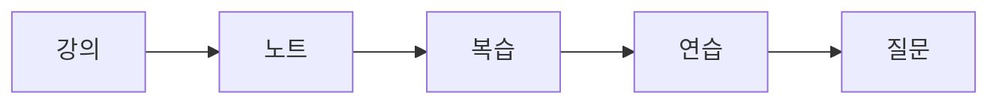

# 전공 공부 방법

> 컴퓨터학과 전공 학습 가이드 101 시리즈 (8/10)

## 이 글에서 다룰 문제

- 같은 시간을 써도 공부 방법에 따라 결과가 크게 달라지는 이유는 무엇일까요?
- 강의를 듣고 노트를 정리하고 복습하고 코딩 연습을 하는 흐름은 어떻게 만드는 것이 좋을까요?
- 시험 직전 몰아서 하는 공부가 전공 과목에서 특히 잘 통하지 않는 이유는 무엇일까요?
- 질문하고 기록하는 습관은 왜 성적보다 더 오래 남을까요?

컴퓨터학과 공부는 단순히 오래 앉아 있는 싸움이 아닙니다. 같은 두 시간을 써도 어떤 학생은 개념이 남고, 어떤 학생은 그날 들은 내용조차 금방 흐려집니다. 차이를 만드는 것은 재능보다 **공부 방식의 구조**인 경우가 많습니다.

전공 과목은 서로 연결되어 있기 때문에 한 번 밀리기 시작하면 그다음 주가 더 버거워집니다. 강의를 듣고 끝내는 방식으로는 점점 따라가기 힘들어집니다. 반대로 루틴, 복습, 코딩 연습, 질문 습관을 묶어 두면 생각보다 안정적으로 올라갈 수 있습니다.

이 글에서는 전공 공부를 길게 버티게 해 주는 기본 습관을 정리하겠습니다.

## 이 글에서 배울 것

- 주간 루틴을 만드는 기본 원리
- 노트 정리와 복습 주기를 나누어 보는 방법
- 코딩 연습을 강의와 연결하는 방법
- 질문과 기록이 학습 속도를 높이는 이유

## 왜 중요한가

전공에서는 마지막 차이를 만드는 요소가 공부 효율인 경우가 많습니다. 같은 강의를 들어도 복습 간격을 어떻게 두는지, 실습을 얼마나 자주 하는지, 질문을 얼마나 빨리 던지는지에 따라 이해 속도가 달라집니다.

특히 컴퓨터과학은 이해와 손 연습이 같이 가야 합니다. 수학 개념을 읽기만 해서는 오래 남지 않고, 코드를 보기만 해서는 구현 감각이 붙지 않습니다. 그래서 공부 방법이 곧 실력의 기반이 됩니다.

## 한눈에 보는 학습 흐름



강의를 듣는 순간이 끝이 아니라 시작입니다. 노트로 핵심을 압축하고, 복습으로 간격을 만들고, 연습으로 손을 움직이고, 질문으로 막힌 부분을 푸는 흐름이 반복돼야 실력이 붙습니다.

## 핵심 용어

- **루틴**: 반복 가능한 일정과 학습 방식입니다.
- **노트**: 강의 핵심을 짧게 정리한 기록입니다.
- **복습**: 이미 본 내용을 다시 꺼내어 확인하는 과정입니다.
- **드릴**: 짧은 문제를 반복해서 푸는 연습입니다.
- **오피스 아워**: 교수나 조교에게 질문할 수 있는 시간입니다.

## Before/After

**Before**: 시험 직전에만 몰아서 공부합니다.

**After**: 주간 루틴 안에 강의와 복습과 연습을 분산합니다.

## 좋은 공부 방법은 거창하지 않습니다

전공 공부를 잘하는 학생이 늘 대단한 비법을 갖고 있는 것은 아닙니다. 대개는 강의를 들은 날 짧게라도 복습하고, 일주일 안에 다시 한 번 보고, 손으로 직접 풀어 보는 과정을 반복합니다. 이 단순한 구조가 누적되면 차이가 커집니다.

또 하나 중요한 점은 과목마다 공부 방식이 조금 달라야 한다는 사실입니다. 알고리즘은 손으로 풀이를 적어 보아야 하고, 운영체제는 개념 사이의 관계를 정리해야 하며, 데이터베이스는 SQL을 직접 돌려 보는 시간이 필요합니다. 루틴은 공통으로 가져가되, 연습 형태는 과목 특성에 맞춰야 합니다.

## 학습 추적 스크립트

### 1단계 — 과목 등록

```python
log = {"algorithms": [], "os": [], "db": []}
```

먼저 어떤 과목을 추적할지 정합니다. 기록은 거창할 필요가 없고, 최소한의 구조만 있어도 충분합니다.

### 2단계 — 학습 기록

```python
log["algorithms"].append({"date": "2026-05-01", "hours": 2})
```

언제, 얼마나 공부했는지 적기만 해도 흐름이 보입니다. 감으로 기억하는 시간은 실제보다 자주 부풀려집니다.

### 3단계 — 복습 표시

```python
def reviewed(entry):
    return entry.get("review", False)
```

복습 여부를 표시하면 단순한 시간 기록이 아니라 학습 주기 기록이 됩니다. 전공 공부에서는 이 차이가 큽니다.

### 4단계 — 주간 합계

```python
total = sum(e["hours"] for e in log["algorithms"])
```

주간 합계를 보면 특정 과목에 시간이 너무 적게 들어가는지 확인할 수 있습니다.

### 5단계 — 약점 추출

```python
weak = [c for c, es in log.items() if sum(e["hours"] for e in es) < 5]
```

약한 과목을 빨리 찾는 것이 중요합니다. 피하고 싶은 과목일수록 더 명확히 적어 두는 편이 좋습니다.

## 이 코드에서 주목할 점

- 기록은 습관을 눈에 보이게 만듭니다.
- 복습 표시가 있어야 간격 학습이 작동합니다.
- 합계를 보면 시간 배분의 편향이 드러납니다.

## 자주 하는 실수 5가지

1. 노트를 받아 적기만 하고 다시 보지 않는 일입니다.
2. 복습 없이 진도만 따라가는 일입니다.
3. 코딩 연습을 시험 직전으로 미루는 일입니다.
4. 질문을 부끄러워해서 막힌 채로 오래 끌고 가는 일입니다.
5. 수면 시간을 줄여 공부량만 늘리려는 일입니다.

## 실무에서는 이렇게 쓰입니다

신입 엔지니어의 성장 속도는 종종 질문 빈도와 기록 습관에서 드러납니다. 막히는 지점을 빨리 드러내고, 해결 과정을 기록하고, 같은 실수를 줄이는 사람이 더 빠르게 적응합니다. 학생 때 만든 학습 습관이 그대로 이어지는 경우가 많습니다.

## 선배 엔지니어는 이렇게 봅니다

- 재능보다 루틴이 오래 갑니다.
- 기록은 쌓일수록 복리처럼 작동합니다.
- 질문은 약점이 아니라 정직한 학습 도구입니다.
- 잠을 줄여 만든 성과는 오래 버티기 어렵습니다.
- 복습이 있어야 배운 내용이 자기 것이 됩니다.

## 체크리스트

- [ ] 주간 학습 루틴을 적어 보았습니다.
- [ ] 노트 정리 형식을 하나 정했습니다.
- [ ] 복습 주기를 간단히라도 만들었습니다.
- [ ] 질문할 목록을 따로 적기 시작했습니다.

## 연습 문제

1. 루틴을 한 줄로 설명해 보세요.
2. 복습이 왜 필요한지 한 줄로 적어 보세요.
3. 오피스 아워를 어떻게 활용할지 한 줄로 써 보세요.

## 정리 및 다음 단계

전공 공부는 의욕만으로 오래 버티기 어렵습니다. 강의, 노트, 복습, 연습, 질문이 하나의 흐름으로 묶여야 누적이 생깁니다. 같은 시간을 써도 방법이 다르면 결과가 크게 달라집니다. 다음 글에서는 이렇게 쌓은 과제와 프로젝트를 바깥에서 보이는 포트폴리오로 연결하는 방법을 보겠습니다.

<!-- toc:begin -->
- [컴퓨터학과에서는 무엇을 배우는가](./01-what-cs-majors-learn.md)
- [1학년 과목 이해하기](./02-first-year-subjects.md)
- [자료구조와 알고리즘](./03-data-structures-and-algorithms.md)
- [시스템 과목 이해하기](./04-systems-subjects.md)
- [데이터베이스와 네트워크](./05-database-and-network.md)
- [AI와 데이터사이언스](./06-ai-and-data-science.md)
- [프로젝트 과목](./07-project-subjects.md)
- **전공 공부 방법 (현재 글)**
- 포트폴리오로 연결하기 (예정)
- 졸업 전 갖춰야 할 역량 (예정)
<!-- toc:end -->

## 참고 자료

- [Make It Stick](https://www.hup.harvard.edu/catalog.php?isbn=9780674729018)
- [A Mind for Numbers - Barbara Oakley](https://barbaraoakley.com/books/a-mind-for-numbers/)
- [Learning How to Learn - Coursera](https://www.coursera.org/learn/learning-how-to-learn)
- [Spaced Repetition - SuperMemo](https://www.supermemo.com/en/articles/theory)

Tags: CS, Study, Habit, Learning, Beginner
