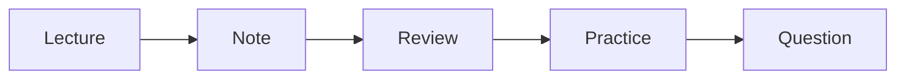

# 전공 공부 방법

같은 시간을 써도 어떤 학생은 개념이 남고, 어떤 학생은 강의 직후부터 빠르게 잊어버립니다. 차이를 만드는 것은 재능보다 공부 방법의 구조인 경우가 많습니다.

이 글은 Computer Science Major 101 시리즈의 8번째 글입니다.

## 이 글에서 다룰 문제

- 같은 시간을 써도 공부 방법에 따라 결과가 크게 달라지는 이유는 무엇일까요?
- 강의, 노트, 복습, 코딩 연습은 어떤 흐름으로 묶는 것이 좋을까요?
- 시험 직전 몰아서 하는 공부가 전공 과목에서 특히 잘 통하지 않는 이유는 무엇일까요?
- 질문하고 기록하는 습관은 왜 오래 남는 차이를 만들까요?

## 이 글에서 배울 것

- 주간 루틴
- 강의 노트
- 복습 주기
- 코딩 드릴
- 질문하는 습관

## 왜 중요한가

전공에서는 남은 차이를 만드는 요소가 공부 효율인 경우가 많습니다. 같은 강의를 들어도 복습 간격, 실습 빈도, 질문 습관이 다르면 이해 속도와 유지 시간이 크게 달라집니다.

## 한눈에 보는 개념



> 전공 공부는 강의를 듣는 순간 끝나는 일이 아니라, 다시 꺼내 보고 손으로 확인하는 순환 구조입니다.

강의를 듣는 순간이 끝이 아니라 시작입니다. 노트로 압축하고, 복습으로 다시 꺼내고, 연습으로 손을 움직이고, 질문으로 막힌 부분을 푸는 흐름이 반복되어야 실력이 붙습니다.

## 핵심 용어

- **루틴(routine)**: 반복 가능한 학습 일정입니다.
- **노트(note)**: 핵심을 짧게 정리한 기록입니다.
- **복습(review)**: 이미 본 내용을 다시 확인하는 과정입니다.
- **드릴(drill)**: 반복 연습 문제입니다.
- **오피스 아워(office hour)**: 교수나 조교에게 질문할 수 있는 시간입니다.

## Before/After

**Before**: 시험 직전에만 몰아서 공부합니다.

**After**: 주간 루틴 안에 강의와 복습과 연습을 분산합니다.

## 실습: 학습 추적 스크립트

### 1단계 — 과목 등록

```python
log = {"algorithms": [], "os": [], "db": []}
```

먼저 무엇을 추적할지 정합니다. 기록은 거창할 필요가 없고, 최소한의 구조만 있어도 충분합니다.

### 2단계 — 학습 기록

```python
log["algorithms"].append({"date": "2026-05-01", "hours": 2})
```

언제 얼마나 공부했는지 적는 것만으로도 감각이 달라집니다. 기억에만 의존하면 실제 시간은 자주 왜곡됩니다.

### 3단계 — 복습 표시

```python
def reviewed(entry):
    return entry.get("review", False)
```

복습 여부를 구분해 두면 단순한 시간 기록이 아니라 학습 주기 기록이 됩니다. 전공 공부에서는 이 차이가 큽니다.

### 4단계 — 주간 합계

```python
total = sum(e["hours"] for e in log["algorithms"])
```

합계를 보면 특정 과목에 시간이 너무 적게 들어가는지 바로 드러납니다. 공부량은 느낌보다 숫자로 보는 편이 훨씬 정확합니다.

### 5단계 — 약한 과목 찾기

```python
weak = [c for c, es in log.items() if sum(e["hours"] for e in es) < 5]
```

피하고 싶은 과목일수록 더 명시적으로 표시해 두는 편이 좋습니다. 약점을 빨리 드러낼수록 보강 비용이 줄어듭니다.

## 이 코드에서 먼저 볼 점

- 기록은 습관을 눈에 보이게 만듭니다.
- 복습 표시가 있어야 간격 학습이 작동합니다.
- 합계는 시간 배분의 편향을 드러냅니다.

## 자주 하는 실수 5가지

1. **노트를 받아 적기만 하고 다시 보지 않는 일입니다.**
2. **복습 없이 진도만 따라가는 일입니다.**
3. **코딩 연습을 시험 직전으로 미루는 일입니다.**
4. **질문을 부끄러워해서 오래 끌고 가는 일입니다.**
5. **수면 시간을 줄여 공부량만 늘리는 일입니다.**

## 실무에서는 이렇게 드러납니다

신입 엔지니어의 성장 속도는 종종 질문 빈도와 기록 습관에서 드러납니다. 막히는 지점을 빨리 드러내고, 해결 과정을 남기고, 같은 실수를 줄이는 사람이 훨씬 빠르게 적응합니다.

## 선배 엔지니어는 이렇게 봅니다

- 재능보다 루틴이 오래 갑니다.
- 기록은 쌓일수록 복리처럼 작동합니다.
- 질문은 약점이 아니라 학습 도구입니다.
- 잠을 줄여 만든 성과는 오래 버티기 어렵습니다.
- 복습이 있어야 배운 내용이 자기 것이 됩니다.

## 체크리스트

- [ ] 주간 루틴을 적어 보았습니다.
- [ ] 노트 정리 형식을 하나 정했습니다.
- [ ] 복습 주기를 만들었습니다.
- [ ] 질문 목록을 따로 적기 시작했습니다.

## 연습 문제

1. 루틴을 한 줄로 설명해 보세요.
2. 복습의 의미를 한 줄로 적어 보세요.
3. 오피스 아워를 어떻게 활용할지 한 줄로 써 보세요.

## 정리

전공 공부는 의욕만으로 오래 버티기 어렵습니다. 강의, 노트, 복습, 연습, 질문이 하나의 흐름으로 묶여야 누적이 생깁니다. 같은 시간을 써도 방법이 다르면 결과는 크게 달라집니다. 다음 글에서는 과제와 프로젝트를 밖에서 읽히는 포트폴리오로 바꾸는 방법을 살펴보겠습니다.

<!-- toc:begin -->
- [컴퓨터학과에서는 무엇을 배우는가](./01-what-cs-majors-learn.md)
- [1학년 과목 이해하기](./02-first-year-subjects.md)
- [자료구조와 알고리즘](./03-data-structures-and-algorithms.md)
- [시스템 과목 이해하기](./04-systems-subjects.md)
- [데이터베이스와 네트워크](./05-database-and-network.md)
- [AI와 데이터사이언스](./06-ai-and-data-science.md)
- [프로젝트 과목](./07-project-subjects.md)
- **전공 공부 방법 (현재 글)**
- 포트폴리오로 연결하기 (예정)
- 졸업 전 갖춰야 할 역량 (예정)
<!-- toc:end -->

## 참고 자료

- [Make It Stick](https://www.hup.harvard.edu/catalog.php?isbn=9780674729018)
- [A Mind for Numbers - Barbara Oakley](https://barbaraoakley.com/books/a-mind-for-numbers/)
- [Learning How to Learn - Coursera](https://www.coursera.org/learn/learning-how-to-learn)
- [Spaced Repetition - SuperMemo](https://www.supermemo.com/en/articles/theory)

Tags: CS, Study, Habit, Learning, Beginner
