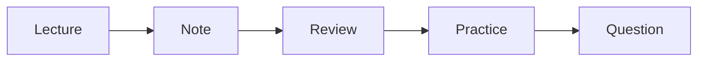

# 전공 공부 방법

> 컴퓨터학과 전공 학습 가이드 101 시리즈 (8/10)

<!-- a-grade-intro:begin -->

**핵심 질문**: *공부 방법* 만 바뀌어도 *같은 시간* 으로 *두 배* 의 *결과* 가 가능할까요?

> 가능합니다. *루틴*, *복습*, *코딩 연습* 의 *조합* 이 핵심입니다.

<!-- a-grade-intro:end -->

## 이 글에서 배울 것

- *주간 루틴*
- *강의 노트* 정리
- *복습 주기*
- *코딩 연습*
- *질문* 습관

## 왜 중요한가

*공부 효율* 이 *전공* 의 *남은 차이* 를 만듭니다.

## 개념 한눈에 보기



## 핵심 용어 정리

- **routine**: *반복* 일정.
- **note**: *요약* 메모.
- **review**: *복습*.
- **drill**: *반복* 연습.
- **office hour**: *상담* 시간.

## Before/After

**Before**: *시험 직전* 만 공부.

**After**: *주간 루틴* 으로 *분산*.

## 실습: 학습 추적 스크립트

### 1단계 — 과목 등록

```python
log = {"algorithms": [], "os": [], "db": []}
```

### 2단계 — 학습 기록

```python
log["algorithms"].append({"date": "2026-05-01", "hours": 2})
```

### 3단계 — 복습 표시

```python
def reviewed(entry):
    return entry.get("review", False)
```

### 4단계 — 주간 합계

```python
total = sum(e["hours"] for e in log["algorithms"])
```

### 5단계 — 약점 추출

```python
weak = [c for c, es in log.items() if sum(e["hours"] for e in es) < 5]
```

## 이 코드에서 주목할 점

- *기록* 이 *습관* 을 만든다.
- *복습 표시* 가 *간격* 을 보여준다.
- *합계* 가 *비중* 을 드러낸다.

## 자주 하는 실수 5가지

1. ***노트* 를 *받아 적기* 만 한다.**
2. ***복습* 없이 *진도* 만 본다.**
3. ***코딩 연습* 을 *시험 전* 으로 미룬다.**
4. ***질문* 을 *부끄러워* 한다.**
5. ***잠* 을 *학습* 으로 메운다.**

## 실무에서는 이렇게 쓰입니다

신입의 *성장 속도* 는 *질문 빈도* 와 *기록 습관* 에 비례합니다.

## 시니어 엔지니어는 이렇게 생각합니다

- *루틴* 이 *재능* 을 이긴다.
- *기록* 이 *복리*.
- *질문* 은 *정직*.
- *잠* 은 *생산성*.
- *복습* 이 *진짜 학습*.

## 체크리스트

- [ ] *루틴* 표.
- [ ] *노트* 양식.
- [ ] *복습* 주기.
- [ ] *질문* 목록.

## 연습 문제

1. *루틴* 한 줄 정의.
2. *복습* 한 줄 정의.
3. *오피스 아워* 의 의미 한 줄.

## 정리 및 다음 단계

다음 글은 *포트폴리오로 연결하기* 입니다.

<!-- toc:begin -->
- [컴퓨터학과에서는 무엇을 배우는가](./01-what-cs-majors-learn.md)
- [1학년 과목 이해하기](./02-first-year-subjects.md)
- [자료구조와 알고리즘](./03-data-structures-and-algorithms.md)
- [시스템 과목 이해하기](./04-systems-subjects.md)
- [데이터베이스와 네트워크](./05-database-and-network.md)
- [AI와 데이터사이언스](./06-ai-and-data-science.md)
- [프로젝트 과목](./07-project-subjects.md)
- **전공 공부 방법 (현재 글)**
- 포트폴리오로 연결하기 (예정)
- 졸업 전 갖춰야 할 역량 (예정)
<!-- toc:end -->

## 참고 자료

- [Make It Stick](https://www.hup.harvard.edu/catalog.php?isbn=9780674729018)
- [A Mind for Numbers - Barbara Oakley](https://barbaraoakley.com/books/a-mind-for-numbers/)
- [Learning How to Learn - Coursera](https://www.coursera.org/learn/learning-how-to-learn)
- [Spaced Repetition - SuperMemo](https://www.supermemo.com/en/articles/theory)

Tags: CS, Study, Habit, Learning, Beginner
