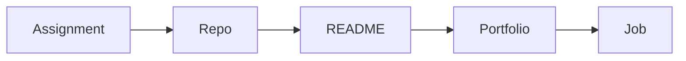

# 포트폴리오로 연결하기

학생 때 만든 과제와 프로젝트는 정리하지 않으면 생각보다 빨리 사라집니다. 로컬 폴더에만 남아 있고 설명도 없다면, 나중에는 만든 사람조차 다시 꺼내 보기 어려워집니다.

이 글은 Computer Science Major 101 시리즈의 9번째 글입니다.

## 이 글에서 다룰 문제

- 전공 과제와 프로젝트는 어떻게 포트폴리오가 될 수 있을까요?
- GitHub 저장소, README, 실행 방법, 데모 링크는 왜 모두 중요할까요?
- 코드만 올려 두는 것과 설명 가능한 결과물을 공개하는 것은 무엇이 다를까요?
- 포트폴리오가 지원 과정에서 대화를 여는 역할을 하는 이유는 무엇일까요?

## 이 글에서 배울 것

- 포트폴리오의 정의
- GitHub 활용
- README 작성
- 문서화 패턴
- 공개의 의미

## 왜 중요한가

지원 단계에서는 눈에 보이는 결과가 있어야 대화가 시작됩니다. 이력서 한 줄보다 저장소와 README, 데모 링크가 훨씬 더 많은 정보를 담고, 문제 해결 방식과 협업 태도까지 보여 줍니다.

## 한눈에 보는 개념



> 과제는 제출로 끝나지만, 포트폴리오는 설명 가능한 저장소와 문서가 붙을 때 시작됩니다.

과제가 자동으로 포트폴리오가 되지는 않습니다. 저장소로 정리하고, README로 맥락을 설명하고, 필요하면 데모를 붙여야 비로소 다른 사람이 읽을 수 있는 결과물이 됩니다.

## 핵심 용어

- **저장소(repo)**: 코드와 문서를 함께 보관하는 공간입니다.
- **README**: 저장소를 열었을 때 가장 먼저 읽는 소개 문서입니다.
- **라이선스(license)**: 사용 조건을 정하는 문서입니다.
- **커밋(commit)**: 변경 기록의 기본 단위입니다.
- **릴리스(release)**: 배포 가능한 특정 버전 묶음입니다.

## Before/After

**Before**: 과제 폴더가 로컬 컴퓨터 안에만 있습니다.

**After**: 공개 저장소와 README, 데모로 정리된 결과물이 남습니다.

## 실습: 미니 포트폴리오 셋업

### 1단계 — 저장소 이름

```python
name = "schedule-checker"
```

이름은 검색성과 첫인상을 좌우합니다. 기능이 드러나는 간결한 이름이 읽는 사람에게 훨씬 친절합니다.

### 2단계 — README 섹션

```python
sections = ["overview", "demo", "stack", "run", "license"]
```

README는 이 정도 축만 있어도 충분히 읽기 좋아집니다. 개요, 데모, 기술 스택, 실행 방법, 라이선스는 거의 모든 프로젝트에서 기본입니다.

### 3단계 — 한 줄 소개

```python
overview = "Conflict checker for course schedules"
```

한 줄 소개는 프로젝트의 문제 정의를 압축해서 보여 줍니다. 길게 설명하기보다 핵심을 한 문장으로 말하는 편이 더 강합니다.

### 4단계 — 실행 명령

```python
run = ["pip install -r requirements.txt", "python app.py"]
```

실행 방법이 없으면 다른 사람이 프로젝트를 검증하기 어렵습니다. README의 친절함은 여기서 크게 갈립니다.

### 5단계 — 데모 링크

```python
demo = "https://example.com/demo"
```

데모는 가장 강한 증거입니다. 배포 링크든 짧은 영상이든 실제 실행 모습을 보여 주면 설명보다 훨씬 빠르게 설득됩니다.

## 이 코드에서 먼저 볼 점

- 이름은 검색성과 기억에 영향을 줍니다.
- README 섹션이 있어야 읽는 사람이 기대치를 맞출 수 있습니다.
- 데모는 말보다 강한 증거입니다.

## 자주 하는 실수 5가지

1. **README를 비워 두는 일입니다.**
2. **커밋 메시지를 모두 update처럼 모호하게 남기는 일입니다.**
3. **라이선스를 빼먹는 일입니다.**
4. **스크린샷이나 데모 없이 설명만 남기는 일입니다.**
5. **실행 방법을 적지 않아 재현이 어려운 상태로 두는 일입니다.**

## 실무에서는 이렇게 드러납니다

면접관과 리뷰어는 종종 코드를 열기 전에 README부터 읽습니다. 프로젝트를 어떻게 소개하는지, 실행 방법을 얼마나 분명하게 적는지, 문서를 어느 정도 신경 쓰는지에서 협업 감각을 빠르게 읽을 수 있기 때문입니다.

## 선배 엔지니어는 이렇게 봅니다

- 공개하는 과정 자체가 학습입니다.
- 코드만큼 문서도 중요합니다.
- 작은 개선 기록도 좋은 증거가 됩니다.
- 라이선스는 기본입니다.
- 데모 링크는 가장 설득력이 강합니다.

## 체크리스트

- [ ] README에 핵심 섹션 다섯 개를 넣었습니다.
- [ ] 라이선스를 추가했습니다.
- [ ] 스크린샷이나 데모를 준비했습니다.
- [ ] 실행 명령을 바로 보이게 적었습니다.

## 연습 문제

1. README를 한 줄로 설명해 보세요.
2. 라이선스의 의미를 한 줄로 적어 보세요.
3. 데모가 왜 강한 증거인지 한 줄로 써 보세요.

## 정리

포트폴리오는 특별한 사람만 만드는 장식물이 아니라, 이미 만든 과제와 프로젝트를 읽을 수 있는 형태로 정리하는 작업입니다. 저장소 이름, README, 실행 방법, 데모, 문서화가 갖춰지면 작은 과제도 충분히 의미 있는 결과물이 됩니다. 다음 글에서는 시리즈를 마무리하며 졸업 전에 갖춰 두면 좋은 역량을 정리하겠습니다.

<!-- toc:begin -->
- [컴퓨터학과에서는 무엇을 배우는가](./01-what-cs-majors-learn.md)
- [1학년 과목 이해하기](./02-first-year-subjects.md)
- [자료구조와 알고리즘](./03-data-structures-and-algorithms.md)
- [시스템 과목 이해하기](./04-systems-subjects.md)
- [데이터베이스와 네트워크](./05-database-and-network.md)
- [AI와 데이터사이언스](./06-ai-and-data-science.md)
- [프로젝트 과목](./07-project-subjects.md)
- [전공 공부 방법](./08-how-to-study-cs.md)
- **포트폴리오로 연결하기 (현재 글)**
- 졸업 전 갖춰야 할 역량 (예정)
<!-- toc:end -->

## 참고 자료

- [Make a README](https://www.makeareadme.com/)
- [Choose a License](https://choosealicense.com/)
- [GitHub Profile README Guide](https://docs.github.com/en/account-and-profile/setting-up-and-managing-your-github-profile/customizing-your-profile/managing-your-profile-readme)
- [Awesome README](https://github.com/matiassingers/awesome-readme)

Tags: CS, Portfolio, GitHub, Career, Beginner
