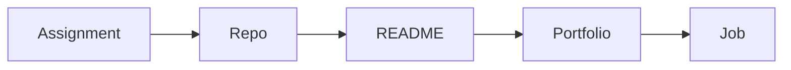

# 포트폴리오로 연결하기

> 컴퓨터학과 전공 학습 가이드 101 시리즈 (9/10)


## 이 글에서 다룰 문제

*보이는 결과* 가 있어야 *지원* 단계에서 *대화* 가 됩니다.

## 개념 한눈에 보기



## Before/After

**Before**: *과제 폴더* 가 *로컬* 에만 있다.

**After**: *공개 저장소* + *README* + *데모*.

## 실습: 미니 포트폴리오 셋업

### 1단계 — 저장소 이름

```python
name = "schedule-checker"
```

### 2단계 — README 섹션

```python
sections = ["overview", "demo", "stack", "run", "license"]
```

### 3단계 — 한 줄 소개

```python
overview = "Conflict checker for course schedules"
```

### 4단계 — 실행 명령

```python
run = ["pip install -r requirements.txt", "python app.py"]
```

### 5단계 — 데모 링크

```python
demo = "https://example.com/demo"
```

## 이 코드에서 주목할 점

- *이름* 이 *검색성* 을 만든다.
- *README* 섹션이 *기대* 를 정렬한다.
- *데모* 가 *증거* 다.

## 자주 하는 실수 5가지

1. ***README* 가 *비어 있다*.**
2. ***커밋 메시지* 가 *모두 'update'*.**
3. ***라이선스* 가 *없다*.**
4. ***스크린샷* 이 *없다*.**
5. ***실행 방법* 이 *불명확*.**

## 실무에서는 이렇게 쓰입니다

면접관은 *코드* 보다 *README* 를 먼저 봅니다.

## 체크리스트

- [ ] *README* 섹션 5개.
- [ ] *라이선스* 추가.
- [ ] *스크린샷*.
- [ ] *실행 명령* 표기.

## 정리 및 다음 단계

다음 글은 *졸업 전 갖춰야 할 역량* 입니다.

<!-- toc:begin -->
- [컴퓨터학과에서는 무엇을 배우는가](./01-what-cs-majors-learn.md)
- [1학년 과목 이해하기](./02-first-year-subjects.md)
- [자료구조와 알고리즘](./03-data-structures-and-algorithms.md)
- [시스템 과목 이해하기](./04-systems-subjects.md)
- [데이터베이스와 네트워크](./05-database-and-network.md)
- [AI와 데이터사이언스](./06-ai-and-data-science.md)
- [프로젝트 과목](./07-project-subjects.md)
- [전공 공부 방법](./08-how-to-study-cs.md)
- **포트폴리오로 연결하기 (현재 글)**
- 졸업 전 갖춰야 할 역량 (예정)
<!-- toc:end -->

## 참고 자료

- [Make a README](https://www.makeareadme.com/)
- [Choose a License](https://choosealicense.com/)
- [GitHub Profile README Guide](https://docs.github.com/en/account-and-profile/setting-up-and-managing-your-github-profile/customizing-your-profile/managing-your-profile-readme)
- [Awesome README](https://github.com/matiassingers/awesome-readme)

Tags: CS, Portfolio, GitHub, Career, Beginner
