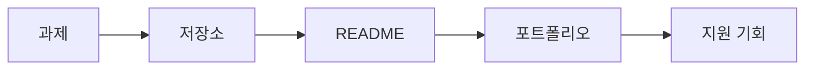

# 포트폴리오로 연결하기

> 컴퓨터학과 전공 학습 가이드 101 시리즈 (9/10)

## 이 글에서 다룰 문제

- 전공 과제와 프로젝트는 어떻게 포트폴리오가 될 수 있을까요?
- GitHub 저장소, README, 실행 방법, 데모 링크는 왜 모두 중요할까요?
- 코드만 올려 두는 것과 설명 가능한 결과물을 공개하는 것은 무엇이 다를까요?
- 취업 준비에서 포트폴리오가 대화를 여는 역할을 하는 이유는 무엇일까요?

학생 때 만든 과제와 프로젝트는 생각보다 쉽게 사라집니다. 로컬 폴더 안에만 남아 있고, 파일 이름은 제각각이고, 무엇을 만들었는지 설명도 없다면 시간이 조금만 지나도 다시 꺼내 보기 어렵습니다. 반대로 같은 결과물이라도 정리해서 공개하면 이야기가 달라집니다. **기록과 문서화가 과제를 증거로 바꾸기 때문**입니다.

포트폴리오는 거대한 작품집일 필요가 없습니다. 오히려 작은 프로젝트라도 문제 정의, 사용한 기술, 실행 방법, 한계와 배운 점이 정리되어 있으면 훨씬 읽기 좋습니다. 많은 면접관과 실무자는 완성도 높은 README 하나로도 지원자의 태도를 꽤 많이 읽습니다.

이 글에서는 전공 과제와 프로젝트를 포트폴리오로 바꾸는 기본 원칙을 정리하겠습니다.

## 이 글에서 배울 것

- 포트폴리오가 무엇을 보여 주는지
- GitHub 저장소를 정리하는 기본 요소
- README를 구성하는 핵심 섹션
- 공개와 문서화가 왜 중요한지

## 왜 중요한가

지원 단계에서는 보이는 결과가 있어야 대화가 시작됩니다. 이력서 한 줄로는 프로젝트의 밀도나 문제 해결 과정을 충분히 보여 주기 어렵습니다. 반면 저장소와 README, 데모 링크가 있으면 어떤 문제를 풀었는지, 얼마나 정리된 방식으로 일했는지 훨씬 구체적으로 설명할 수 있습니다.

또한 포트폴리오는 남에게 보여 주기 위한 것만이 아닙니다. 스스로도 무엇을 만들었고 어디에서 막혔고 무엇을 개선했는지 다시 읽을 수 있습니다. 그래서 포트폴리오 정리는 곧 학습 정리이기도 합니다.

## 한눈에 보는 흐름



과제가 자동으로 포트폴리오가 되지는 않습니다. 저장소로 정리하고, README로 맥락을 설명하고, 필요하면 데모를 붙여야 비로소 다른 사람이 읽을 수 있는 결과물이 됩니다.

## 핵심 용어

- **저장소(repo)**: 코드와 문서를 함께 보관하는 공간입니다.
- **README**: 저장소를 처음 열었을 때 읽게 되는 소개 문서입니다.
- **라이선스**: 코드를 어떤 조건으로 사용할 수 있는지 정하는 문서입니다.
- **커밋**: 변경 내역을 남기는 가장 작은 기록 단위입니다.
- **릴리스**: 배포 가능한 특정 버전을 묶어 보여 주는 단위입니다.

## Before/After

**Before**: 과제 폴더가 로컬 컴퓨터 안에만 있습니다.

**After**: 공개 저장소와 README, 데모로 정리된 결과물이 남습니다.

## 좋은 포트폴리오는 코드보다 맥락이 먼저 보입니다

포트폴리오에서 가장 흔한 실수는 코드만 올려 두고 설명을 거의 남기지 않는 것입니다. 저장소를 열었을 때 이 프로젝트가 무엇을 해결하는지, 어떤 기술을 썼는지, 어떻게 실행하는지, 어디까지 구현했는지가 바로 보여야 합니다. README가 부실하면 프로젝트의 가치도 함께 낮아 보이기 쉽습니다.

또한 모든 프로젝트를 다 거창하게 포장할 필요도 없습니다. 작은 과제라도 핵심이 분명하면 충분합니다. 예를 들어 자료구조 과제라면 어떤 입력을 다루는지, 네트워크 과제라면 어떤 프로토콜을 구현했는지, 팀 프로젝트라면 내가 맡은 역할이 무엇인지 선명하게 적는 편이 좋습니다.

## 미니 포트폴리오 셋업

### 1단계 — 저장소 이름

```python
name = "schedule-checker"
```

이름은 검색성과 첫인상을 좌우합니다. 기능이 드러나는 간결한 이름이 좋습니다.

### 2단계 — README 섹션

```python
sections = ["overview", "demo", "stack", "run", "license"]
```

README는 보통 이 다섯 축만 정리해도 읽기 쉬워집니다. 프로젝트 개요, 데모, 기술 스택, 실행 방법, 라이선스가 핵심입니다.

### 3단계 — 한 줄 소개

```python
overview = "Conflict checker for course schedules"
```

한 줄 소개는 프로젝트의 목적을 빠르게 보여 줍니다. 길게 늘어놓기보다 문제를 한 문장으로 말하는 편이 좋습니다.

### 4단계 — 실행 명령

```python
run = ["pip install -r requirements.txt", "python app.py"]
```

실행 방법이 없으면 다른 사람이 프로젝트를 확인하기 어렵습니다. 최소한 시작 명령은 바로 보이게 두는 편이 좋습니다.

### 5단계 — 데모 링크

```python
demo = "https://example.com/demo"
```

데모는 가장 강한 증거입니다. 실제 실행 화면이나 짧은 영상, 배포 링크가 있으면 프로젝트 이해 속도가 크게 올라갑니다.

## 이 코드에서 주목할 점

- 이름은 검색과 기억에 직접 영향을 줍니다.
- README 섹션이 있어야 읽는 사람이 기대치를 맞출 수 있습니다.
- 데모는 말보다 강한 증거입니다.

## 자주 하는 실수 5가지

1. README가 거의 비어 있는 상태로 두는 일입니다.
2. 커밋 메시지를 모두 update처럼 모호하게 남기는 일입니다.
3. 라이선스를 빼먹는 일입니다.
4. 스크린샷이나 데모 없이 결과를 설명만 하는 일입니다.
5. 실행 방법을 적지 않아 재현이 어려운 상태로 두는 일입니다.

## 실무에서는 이렇게 쓰입니다

면접관이나 리뷰어는 종종 코드를 열기 전에 README부터 읽습니다. 프로젝트를 어떻게 소개하는지, 구조를 얼마나 명확히 설명하는지, 실행 방법을 얼마나 친절하게 적는지를 보면 협업 감각과 문서화 태도를 빠르게 파악할 수 있기 때문입니다.

## 선배 엔지니어는 이렇게 봅니다

- 공개하는 과정 자체가 학습입니다.
- 코드만큼 문서도 중요합니다.
- 작은 PR과 작은 개선도 좋은 기록이 됩니다.
- 라이선스는 기본 예절에 가깝습니다.
- 데모 링크가 있으면 프로젝트 설득력이 크게 올라갑니다.

## 체크리스트

- [ ] README에 핵심 섹션 다섯 개를 넣었습니다.
- [ ] 라이선스를 추가했습니다.
- [ ] 스크린샷이나 데모를 준비했습니다.
- [ ] 실행 명령을 바로 보이게 적었습니다.

## 연습 문제

1. README가 왜 중요한지 한 줄로 설명해 보세요.
2. 라이선스가 무엇을 정하는지 한 줄로 적어 보세요.
3. 데모가 왜 강한 증거인지 한 줄로 써 보세요.

## 정리 및 다음 단계

포트폴리오는 특별한 사람만 만드는 장식물이 아니라, 이미 만든 과제와 프로젝트를 읽을 수 있는 형태로 정리하는 작업입니다. 저장소 이름, README, 실행 방법, 데모, 문서화가 갖춰지면 작은 과제도 충분히 의미 있는 결과물이 됩니다. 다음 글에서는 시리즈를 마무리하며 졸업 전에 꼭 갖춰 두면 좋은 역량을 정리하겠습니다.

<!-- toc:begin -->
- [컴퓨터학과에서는 무엇을 배우는가](./01-what-cs-majors-learn.md)
- [1학년 과목 이해하기](./02-first-year-subjects.md)
- [자료구조와 알고리즘](./03-data-structures-and-algorithms.md)
- [시스템 과목 이해하기](./04-systems-subjects.md)
- [데이터베이스와 네트워크](./05-database-and-network.md)
- [AI와 데이터사이언스](./06-ai-and-data-science.md)
- [프로젝트 과목](./07-project-subjects.md)
- [전공 공부 방법](./08-how-to-study-cs.md)
- **포트폴리오로 연결하기 (현재 글)**
- 졸업 전 갖춰야 할 역량 (예정)
<!-- toc:end -->

## 참고 자료

- [Make a README](https://www.makeareadme.com/)
- [Choose a License](https://choosealicense.com/)
- [GitHub Profile README Guide](https://docs.github.com/en/account-and-profile/setting-up-and-managing-your-github-profile/customizing-your-profile/managing-your-profile-readme)
- [Awesome README](https://github.com/matiassingers/awesome-readme)

Tags: CS, Portfolio, GitHub, Career, Beginner
