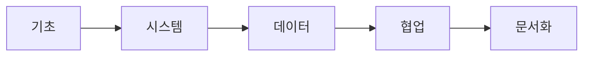

# 졸업 전 갖춰야 할 역량

> 컴퓨터학과 전공 학습 가이드 101 시리즈 (10/10)

## 이 글에서 다룰 문제

- 졸업장만으로는 설명되지 않는 역량은 무엇일까요?
- 기초, 시스템, 데이터, 협업, 문서화라는 다섯 축은 왜 함께 봐야 할까요?
- 학점과 자격증만으로 실력을 설명하기 어려운 이유는 무엇일까요?
- 졸업 직전 스스로를 점검하려면 어떤 기준이 필요할까요?

졸업이 가까워질수록 많은 학생이 비슷한 불안을 느낍니다. 과목은 거의 다 들었는데, 정말 현업에 들어갈 준비가 되었는지는 잘 모르겠다는 감각입니다. 이 불안은 자연스럽습니다. 학교는 과목 단위로 성적을 주지만, 실제 일은 여러 역량이 한꺼번에 움직일 때 성과가 나기 때문입니다.

그래서 졸업 전에는 과목 이름보다 **역량 축**으로 자신을 다시 보는 편이 좋습니다. 자료구조를 아는지, 시스템을 이해하는지, 데이터를 읽을 수 있는지, 협업 도구를 다룰 수 있는지, 문서로 생각을 정리할 수 있는지를 함께 봐야 합니다.

이 글은 시리즈의 마지막 글로, 졸업 전에 점검하면 좋은 다섯 축을 정리합니다.

## 이 글에서 배울 것

- 졸업 전 스스로 점검해야 할 핵심 다섯 축
- 기초 역량과 시스템 감각, 데이터 감각의 차이
- 협업 도구와 문서화 능력이 왜 중요해졌는지
- 다음 학습 계획을 세우는 기준

## 왜 중요한가

첫 직장에 들어간 뒤 처음 몇 달은 생각보다 중요합니다. 이 시기에 기본기가 있으면 배우는 속도가 훨씬 빠르고, 기본기가 비어 있으면 작은 문제에도 쉽게 무너집니다. 그래서 졸업 직전 점검은 단순한 자기 위로가 아니라 경력의 출발점을 다지는 일입니다.

또한 많은 학생이 학점이나 자격증을 실력 전체로 생각하기 쉽습니다. 물론 도움이 되지만 그것만으로는 부족합니다. 실제 실력은 코드, 프로젝트, 협업 기록, 문서, 회고 같은 증거로 더 잘 드러납니다.

## 한눈에 보는 다섯 축



이 다섯 축은 서로 따로 놀지 않습니다. 기초가 있어야 시스템을 이해하고, 시스템과 데이터를 알아야 서비스를 만들고, 협업과 문서화가 있어야 그 결과를 팀 안에서 확장할 수 있습니다.

## 핵심 용어

- **기초 역량**: 자료구조, 알고리즘, 프로그래밍 기본기 같은 바닥 체력입니다.
- **시스템 감각**: 코드가 실제 런타임에서 어떻게 움직이는지 읽는 능력입니다.
- **데이터 감각**: 데이터를 저장하고 해석하고 활용하는 감각입니다.
- **협업**: Git, 코드 리뷰, 이슈 관리처럼 함께 일하는 방식입니다.
- **문서화**: README, 설계 문서, 회고처럼 생각을 글로 남기는 능력입니다.

## Before/After

**Before**: 학점이 곧 역량이라고 생각합니다.

**After**: 증거가 곧 역량이라는 기준으로 자신을 봅니다.

## 졸업 전에는 과목이 아니라 축으로 점검합니다

첫 번째 축은 **기초 역량**입니다. 배열, 리스트, 트리, 그래프, 해시 같은 자료구조를 설명할 수 있고, 기본 알고리즘의 시간 복잡도를 말할 수 있어야 합니다. 언어가 무엇이든 문제를 코드로 바꾸는 힘이 중요합니다.

두 번째 축은 **시스템 감각**입니다. 프로세스와 스레드의 차이, 메모리와 파일 입출력, 네트워크 요청의 흐름, 성능 측정의 기본을 설명할 수 있어야 합니다. 현업에서는 디버깅 능력과 크게 연결됩니다.

세 번째 축은 **데이터 감각**입니다. SQL을 읽고 쓸 수 있는지, 인덱스와 트랜잭션의 의미를 아는지, 간단한 통계량과 모델 평가를 이해하는지 봐야 합니다. 데이터를 다룰 줄 모르면 서비스 이해가 얕아지기 쉽습니다.

네 번째 축은 **협업**입니다. Git 브랜치, 코드 리뷰, 이슈 관리, CI 같은 도구를 써 본 경험은 학생과 실무자의 차이를 줄여 줍니다. 혼자만 알아보는 코드보다, 팀이 함께 다룰 수 있는 코드가 더 중요해지는 시점입니다.

다섯 번째 축은 **문서화**입니다. README, 설계 문서, 회고를 남길 수 있는 사람은 문제 해결 과정을 더 또렷하게 설명합니다. 문서화는 말주변의 문제가 아니라 사고를 정리하는 능력과 연결됩니다.

## 졸업 점검 체크리스트

### 1단계 — 자료구조

```python
fund = ["array", "list", "tree", "graph", "hash"]
```

기초 역량을 빠르게 점검하는 목록입니다. 각 항목을 설명하고 장단점을 말할 수 있는지 확인해 보세요.

### 2단계 — 시스템

```python
sys_topics = ["process", "memory", "io", "network"]
```

시스템 감각은 디버깅 능력과 연결됩니다. 코드가 어디에서 어떤 비용을 쓰는지 감을 잡는 데 필요합니다.

### 3단계 — 데이터

```python
data_topics = ["sql", "stats", "ml_basic"]
```

데이터 저장과 해석의 기본을 한 번에 점검하는 목록입니다. SQL과 통계는 생각보다 자주 다시 등장합니다.

### 4단계 — 협업

```python
collab = ["git", "review", "issues", "ci"]
```

협업 도구를 써 본 경험은 입사 후 적응 속도에 큰 영향을 줍니다.

### 5단계 — 문서화

```python
docs = ["readme", "design_doc", "post_mortem"]
```

문서 목록은 곧 증거 목록입니다. 코드만으로 설명이 어려운 판단을 문서가 보완해 줍니다.

## 이 코드에서 주목할 점

- 이 목록은 자기 점검표 역할을 합니다.
- 각 영역에 3개에서 5개 정도면 점검 축으로 충분합니다.
- 증거는 코드와 문서 두 곳에 함께 남습니다.

## 자주 하는 실수 5가지

1. 자격증만 나열하고 실제 증거를 남기지 않는 일입니다.
2. 학점만 강조하고 프로젝트나 문서를 비워 두는 일입니다.
3. GitHub가 거의 비어 있는 상태로 두는 일입니다.
4. 문서를 한 편도 남기지 않는 일입니다.
5. 회고 없이 경험을 흘려보내는 일입니다.

## 실무에서는 이렇게 쓰입니다

채용과 온보딩에서는 다섯 축의 균형이 중요하게 보입니다. 특정 한 축이 아주 약하면 다른 강점도 함께 흔들릴 수 있습니다. 예를 들어 코드는 잘 쓰는데 문서와 협업이 비어 있으면 팀 안에서 강점을 증명하기 어렵고, 반대로 말은 잘해도 기초가 약하면 실행 단계에서 쉽게 드러납니다.

## 선배 엔지니어는 이렇게 봅니다

- 결국 기본기가 가장 오래 갑니다.
- 시스템 감각은 디버깅 실력으로 이어집니다.
- 데이터는 거의 모든 팀의 공통 언어입니다.
- 협업 기록은 태도를 보여 주는 증거입니다.
- 문서는 시간이 갈수록 자산이 됩니다.

## 체크리스트

- [ ] 다섯 축으로 자기 점검을 해 보았습니다.
- [ ] 각 축에 대응하는 증거를 적어 보았습니다.
- [ ] 가장 약한 영역을 표시했습니다.
- [ ] 다음 학습 계획을 한 줄이라도 세웠습니다.

## 연습 문제

1. 기초 역량이 무엇인지 한 줄로 설명해 보세요.
2. 시스템 감각이 왜 중요한지 한 줄로 적어 보세요.
3. 문서화 능력이 무엇을 남기는지 한 줄로 써 보세요.

## 정리 및 다음 단계

졸업 전에는 과목 이수 여부보다 어떤 역량을 실제로 갖추었는지 점검하는 편이 더 중요합니다. 기초, 시스템, 데이터, 협업, 문서화라는 다섯 축으로 자신을 다시 보면 어디가 비어 있는지 분명해집니다. 이 시리즈는 여기서 마무리하지만, 다음 단계의 공부는 이 다섯 축 중 가장 약한 곳을 메우는 일에서 시작하면 됩니다.

<!-- toc:begin -->
- [컴퓨터학과에서는 무엇을 배우는가](./01-what-cs-majors-learn.md)
- [1학년 과목 이해하기](./02-first-year-subjects.md)
- [자료구조와 알고리즘](./03-data-structures-and-algorithms.md)
- [시스템 과목 이해하기](./04-systems-subjects.md)
- [데이터베이스와 네트워크](./05-database-and-network.md)
- [AI와 데이터사이언스](./06-ai-and-data-science.md)
- [프로젝트 과목](./07-project-subjects.md)
- [전공 공부 방법](./08-how-to-study-cs.md)
- [포트폴리오로 연결하기](./09-build-your-portfolio.md)
- **졸업 전 갖춰야 할 역량 (현재 글)**
<!-- toc:end -->

## 참고 자료

- [Teach Yourself Computer Science](https://teachyourselfcs.com/)
- [Google Engineering Practices](https://google.github.io/eng-practices/)
- [The Missing Semester of Your CS Education](https://missing.csail.mit.edu/)
- [Patterns of Software - Richard Gabriel](https://www.dreamsongs.com/Files/PatternsOfSoftware.pdf)

Tags: CS, Graduation, Skills, Career, Capstone
