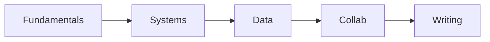

# 졸업 전 갖춰야 할 역량

> 컴퓨터학과 전공 학습 가이드 101 시리즈 (10/10)


## 이 글에서 다룰 문제

*첫 직장* 의 *6개월* 이 *경력 전체* 의 *기준선* 을 만듭니다.

## 전체 흐름


## Before/After

**Before**: *학점* 이 곧 *역량*.

**After**: *증거* 가 곧 *역량*.

## 졸업 점검 체크리스트

### 1단계 — 자료구조

```python
fund = ["array", "list", "tree", "graph", "hash"]
```

### 2단계 — 시스템

```python
sys_topics = ["process", "memory", "io", "network"]
```

### 3단계 — 데이터

```python
data_topics = ["sql", "stats", "ml_basic"]
```

### 4단계 — 협업

```python
collab = ["git", "review", "issues", "ci"]
```

### 5단계 — 문서화

```python
docs = ["readme", "design_doc", "post_mortem"]
```

## 이 코드에서 주목할 점

- *목록* 이 곧 *자기 점검 표*.
- *각 영역* 마다 *3-5개* 면 충분.
- *증거* 가 *코드* 와 *문서* 둘 다.

## 자주 하는 실수 5가지

1. ***자격증* 만 *나열* 한다.**
2. ***학점* 만 *강조* 한다.**
3. ***GitHub* 가 *비어 있다*.**
4. ***문서* 한 편 없다.**
5. ***회고* 가 없다.**

## 실무에서는 이렇게 쓰입니다

채용은 *역량 5축* 의 *균형* 을 봅니다 — 한 축이 *0* 이면 *전체* 가 흔들립니다.

## 체크리스트

- [ ] 5축 *자기 점검*.
- [ ] *증거* 매핑.
- [ ] *부족 영역* 표시.
- [ ] *다음 학습* 계획.

## 정리 및 다음 단계

이 시리즈는 여기서 끝납니다. 다음은 *Capstone Project 101* 입니다.

<!-- toc:begin -->
- [컴퓨터학과에서는 무엇을 배우는가](./01-what-cs-majors-learn.md)
- [1학년 과목 이해하기](./02-first-year-subjects.md)
- [자료구조와 알고리즘](./03-data-structures-and-algorithms.md)
- [시스템 과목 이해하기](./04-systems-subjects.md)
- [데이터베이스와 네트워크](./05-database-and-network.md)
- [AI와 데이터사이언스](./06-ai-and-data-science.md)
- [프로젝트 과목](./07-project-subjects.md)
- [전공 공부 방법](./08-how-to-study-cs.md)
- [포트폴리오로 연결하기](./09-build-your-portfolio.md)
- **졸업 전 갖춰야 할 역량 (현재 글)**
<!-- toc:end -->

## 참고 자료

- [Teach Yourself Computer Science](https://teachyourselfcs.com/)
- [Google Engineering Practices](https://google.github.io/eng-practices/)
- [The Missing Semester of Your CS Education](https://missing.csail.mit.edu/)
- [Patterns of Software - Richard Gabriel](https://www.dreamsongs.com/Files/PatternsOfSoftware.pdf)

Tags: CS, Graduation, Skills, Career, Capstone
