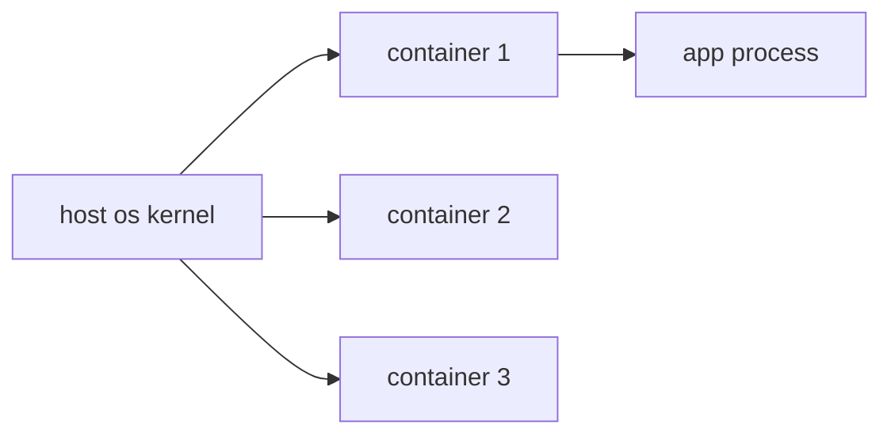

# What is a Container?

> Containers 101 series (1/10)

<!-- a-grade-intro:begin -->

**Core question**: Containers look like tiny VMs — so why are they emphatically *not* VMs?

> *A container is a lightweight package of an isolated process tree that shares the host OS kernel.*

<!-- a-grade-intro:end -->

## What You Will Learn

- The definition of a container
- What gets shared with the host
- The decisive difference from a VM
- The basic Docker workflow
- Five common pitfalls

## Why It Matters

Since 2013, the container has been the default unit of deployment. Without it, modern DevOps is closed off to you.

## Concept at a Glance



## Key Terms

- **Container**: an isolated bundle of processes.
- **Image**: the static template a container starts from.
- **Namespace**: isolates process, network, and filesystem views.
- **cgroups**: caps CPU and memory.
- **Runtime**: the engine that actually runs containers.

## Before/After

**Before**: install directly on a server, then watch it break in production due to environment drift.

**After**: one image runs the same way on any machine.

## Hands-on: Run Your First Container

### Step 1 — Version check

```python
import subprocess

def docker_version():
    res = subprocess.run(["docker", "--version"], capture_output=True, text=True)
    return res.stdout.strip()
```

### Step 2 — Pull image

```python
def pull(image):
    subprocess.run(["docker", "pull", image], check=True)
```

### Step 3 — Run container

```python
def run_nginx():
    subprocess.run(
        ["docker", "run", "-d", "-p", "8080:80", "--name", "web", "nginx:latest"],
        check=True,
    )
```

### Step 4 — Inspect

```python
def ps():
    res = subprocess.run(["docker", "ps"], capture_output=True, text=True)
    return res.stdout
```

### Step 5 — Clean up

```python
def cleanup(name):
    subprocess.run(["docker", "rm", "-f", name], check=True)
```

## What to Notice in This Code

- `-d` runs in the background.
- `-p 8080:80` maps host:container ports.
- `--name` gives you a stable handle.

## Five Common Mistakes

1. **Forgetting port mapping — the container is unreachable.**
2. **Confusing containers with images.**
3. **Skipping cleanup until disk is full.**
4. **Running containers as root.**
5. **Believing the "works on my laptop" myth.**

## How This Shows Up in Production

Developers build the same image on Docker Desktop. CI pushes that image to a registry. Production runs the same image under Kubernetes.

## How a Senior Engineer Thinks

- A container is a process, not a VM.
- Images are *immutable*.
- State lives on volumes, not inside containers.
- Default to non-root.
- Reproducibility is the whole point.

## Checklist

- [ ] Docker installed and verified.
- [ ] Can explain image vs container.
- [ ] Understand port mapping.
- [ ] Know the cleanup commands.

## Practice Problems

1. State the decisive difference between containers and VMs in one line.
2. Describe what happens when `docker run` is invoked without `-d`.
3. Use the class/instance analogy to explain images vs containers.

## Wrap-up and Next Steps

If an image is a template, you have to understand its internals. The next post covers Image and Layer.

<!-- toc:begin -->
- **What is a Container? (current)**
- Image and Layer (upcoming)
- Runtime (upcoming)
- Dockerfile (upcoming)
- Volume (upcoming)
- Network (upcoming)
- Registry (upcoming)
- Container Security (upcoming)
- Containers vs VMs (upcoming)
- Build a Container App (upcoming)
<!-- toc:end -->

## References

- [Docker official docs](https://docs.docker.com/)
- [OCI Image Spec](https://github.com/opencontainers/image-spec)
- [Linux namespaces](https://man7.org/linux/man-pages/man7/namespaces.7.html)
- [cgroups v2](https://www.kernel.org/doc/Documentation/admin-guide/cgroup-v2.rst)

Tags: Containers, Docker, Linux, DevOps, Architecture
