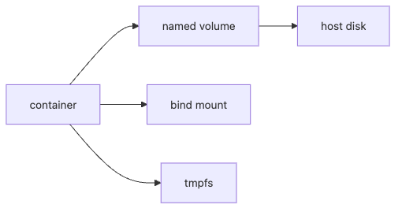

# Volume

Containers are supposed to be easy to replace. Data is not. If you blur that line, local demos may still work while production quietly accumulates backup gaps, permission collisions, and data-loss risk.

This is post 5 in the Containers 101 series.

In this chapter, we compare named volumes, bind mounts, and tmpfs by lifecycle and failure mode, then turn that model into backup and restore habits you can keep in operations.

> Replaceable containers need durable state boundaries. Volumes are where that boundary becomes explicit.

## Questions this chapter answers

- Volumes vs bind mounts vs tmpfs
- Guaranteeing data persistence
- Backup and migration
- Permission gotchas
- Five common pitfalls

## Why It Matters

Containers are immutable, but the data they manage must survive. A bad volume design is a data-loss design.

## Concept at a Glance



*Storage paths for volumes, bind mounts, and tmpfs*
## Key Terms

- **Volume**: a Docker-managed persistent store.
- **Bind mount**: a host path mounted in directly.
- **tmpfs**: an ephemeral, in-memory store.
- **Driver**: hooks for external stores like NFS or EBS.
- **Mount propagation**: how mount events propagate.

## Before/After

**Before**: deleting the container deletes the database data.

**After**: a named volume keeps it safe across container replacements.

## Hands-on: Working with Volumes

### Step 1 — Create

```python
import subprocess

def create(name):
    subprocess.run(["docker", "volume", "create", name], check=True)
```

### Step 2 — Mount and run

```python
def run_db(volume):
    subprocess.run([
        "docker", "run", "-d", "--name", "pg",
        "-v", f"{volume}:/var/lib/postgresql/data",
        "-e", "POSTGRES_PASSWORD=secret",
        "postgres:16",
    ], check=True)
```

### Step 3 — Inspect

```python
def inspect(name):
    res = subprocess.run(
        ["docker", "volume", "inspect", name],
        capture_output=True, text=True, check=True,
    )
    return res.stdout
```

### Step 4 — Back up

```python
def backup(volume, archive):
    subprocess.run([
        "docker", "run", "--rm",
        "-v", f"{volume}:/data:ro",
        "-v", f"{archive}:/backup",
        "alpine", "tar", "czf", "/backup/data.tgz", "-C", "/data", ".",
    ], check=True)
```

### Step 5 — Remove

```python
def remove(name):
    subprocess.run(["docker", "volume", "rm", name], check=True)
```

## What to Notice in This Code

- A named volume is path-independent.
- A tar-runner container standardizes backups.
- Bind mounts are path-dependent — be careful.

## Quick verification and failure signals

```bash
docker volume create pgdata
docker run -d --name pg -v pgdata:/var/lib/postgresql/data -e POSTGRES_PASSWORD=secret postgres:16
docker volume inspect pgdata
docker rm -f pg
docker run -d --name pg -v pgdata:/var/lib/postgresql/data -e POSTGRES_PASSWORD=secret postgres:16
```

**Expected output:**
- `docker volume inspect` shows the Docker-managed mount point.
- Re-creating the container against the same volume preserves the database directory.

**Check first if it fails:**
- If Postgres fails, inspect volume permissions and initialization logs first.
- If you are using a bind mount, confirm host ownership matches the container user.
- A backup plan is incomplete until you test a restore path.

## Five Common Mistakes

1. **Storing DB data inside the container.**
2. **Permission collisions on bind mounts.**
3. **No volume backups.**
4. **Putting persistent data on tmpfs.**
5. **Ignoring constraints of external volume drivers.**

## How This Shows Up in Production

Developers use bind mounts for code hot-reload. Databases use named volumes. Sensitive scratch data lives on tmpfs. Production runs on EBS or NFS drivers.

## How a Senior Engineer Thinks

- Separate state from containers.
- Back up volumes on a schedule.
- Permission models are intentional, never accidental.
- Choose drivers on cost and performance.
- Restore drills beat backups in importance.

## Checklist

- [ ] Persistent data lives on named volumes.
- [ ] Backups run on a schedule.
- [ ] Permissions reviewed.
- [ ] Restore drill once a year.

## Practice Problems

1. Difference between a volume and a bind mount, in one line.
2. One good use case for tmpfs.
3. Risk of keeping DB data inside the container, in one line.

## Wrap-up and Next Steps

Once data has a home, communication is next. The next post covers Network.

<!-- toc:begin -->
## In this series

- [What is a Container?](./01-what-is-a-container.md)
- [Image and Layer](./02-image-and-layer.md)
- [Runtime](./03-runtime.md)
- [Dockerfile](./04-dockerfile.md)
- **Volume (current)**
- Network (upcoming)
- Registry (upcoming)
- Container Security (upcoming)
- Containers vs VMs (upcoming)
- Build a Container App (upcoming)

<!-- toc:end -->

## References

- [Docker volumes](https://docs.docker.com/storage/volumes/)
- [Bind mounts](https://docs.docker.com/storage/bind-mounts/)
- [tmpfs](https://docs.docker.com/storage/tmpfs/)
- [Volume plugins](https://docs.docker.com/engine/extend/plugins_volume/)

Tags: Containers, Docker, Kubernetes, DevOps
