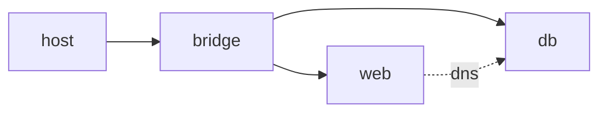

# Network

> Containers 101 series (6/10)

<!-- a-grade-intro:begin -->

**Core question**: How do containers on the same host find each other by *name*?

> *Container networking is mode selection (bridge, host, overlay) plus DNS-based service discovery.*

<!-- a-grade-intro:end -->

This is post 6 in the Containers 101 series.

## What You Will Learn

- The bridge / host / overlay / none modes
- Container-to-container DNS
- Publish (-p) vs expose
- User-defined networks
- Five common pitfalls

## Why It Matters

Both Compose and Kubernetes ride on top of these abstractions. Get the basics right and the rest is easy.

## Concept at a Glance



## Key Terms

- **bridge**: the default virtual L2 network.
- **host**: shares the host network namespace.
- **overlay**: spans multiple hosts.
- **none**: no network at all.
- **expose**: documents an internal port; does not publish it.

## Before/After

**Before**: containers communicate by IP — they break on restart.

**After**: a user-defined bridge gives them DNS names that survive restarts.

## Hands-on: User-Defined Network

### Step 1 — Create

```python
import subprocess

def create_net(name):
    subprocess.run(["docker", "network", "create", name], check=True)
```

### Step 2 — Run DB

```python
def run_db(net):
    subprocess.run([
        "docker", "run", "-d", "--name", "db", "--network", net,
        "-e", "POSTGRES_PASSWORD=secret", "postgres:16",
    ], check=True)
```

### Step 3 — Run app

```python
def run_app(net):
    subprocess.run([
        "docker", "run", "-d", "--name", "app", "--network", net,
        "-p", "8080:8080",
        "-e", "DB_HOST=db",
        "myorg/app:latest",
    ], check=True)
```

### Step 4 — Inspect

```python
def inspect(net):
    res = subprocess.run(
        ["docker", "network", "inspect", net],
        capture_output=True, text=True, check=True,
    )
    return res.stdout
```

### Step 5 — Cleanup

```python
def cleanup(net):
    subprocess.run(["docker", "rm", "-f", "app", "db"])
    subprocess.run(["docker", "network", "rm", net])
```

## What to Notice in This Code

- `DB_HOST=db` uses the DNS name.
- User-defined networks beat the default bridge.
- `-p` only when you actually want external exposure.

## Five Common Mistakes

1. **Using the default bridge — no DNS.**
2. **Publishing the DB with `-p` — public exposure.**
3. **Confusing overlay with bridge.**
4. **Overusing host mode and hitting port collisions.**
5. **Letting unused networks pile up.**

## How This Shows Up in Production

Compose creates a per-project user-defined network. Kubernetes uses a CNI to give every Pod L3 connectivity.

## How a Senior Engineer Thinks

- DNS is the foundation of connection.
- External exposure is an explicit decision.
- Mode choice has security consequences.
- Networks are state — clean them up.
- Compose and K8s abstract things, but the principles do not change.

## Checklist

- [ ] User-defined networks in use.
- [ ] DB is not externally published.
- [ ] Communication via DNS names.
- [ ] Unused networks cleaned up.

## Practice Problems

1. Limitation of the default bridge, in one line.
2. One canonical use of an overlay network.
3. Difference between `expose` and `publish (-p)`, in one line.

## Wrap-up and Next Steps

Once connectivity is solved, the next question is *where to keep images*. The next post covers Registry.

<!-- toc:begin -->
- [What is a Container?](./01-what-is-a-container.md)
- [Image and Layer](./02-image-and-layer.md)
- [Runtime](./03-runtime.md)
- [Dockerfile](./04-dockerfile.md)
- [Volume](./05-volume.md)
- **Network (current)**
- Registry (upcoming)
- Container Security (upcoming)
- Containers vs VMs (upcoming)
- Build a Container App (upcoming)
<!-- toc:end -->

## References

- [Docker networking overview](https://docs.docker.com/network/)
- [Bridge networks](https://docs.docker.com/network/bridge/)
- [Overlay networks](https://docs.docker.com/network/overlay/)
- [DNS in Docker](https://docs.docker.com/network/network-tutorial-standalone/)

Tags: Containers, Docker, Networking, Bridge, DevOps
