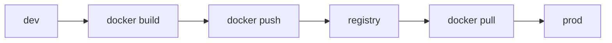

# Registry

> Containers 101 series (7/10)

<!-- a-grade-intro:begin -->

**Core question**: Where does your *built image* live, and *how* do you pull it back later?

> A *registry* is the *remote home* of an image and the *center* of every deployment flow.

<!-- a-grade-intro:end -->

## What You Will Learn

- The role of a *registry*
- The *push / pull* flow
- *Tagging* strategy
- *Docker Hub / ECR / GHCR*
- *Signed image* basics

## Why It Matters

A reproducible image is useless if there is *no place to fetch it from*. *Deployment starts at the registry.*

## Concept at a Glance



## Key Terms

- **registry**: an *image storage server*.
- **repository**: a unit that holds *one image name*.
- **tag**: a *human label* for a version.
- **digest**: an *immutable* SHA identifier.
- **signed image**: an image *signed by Cosign* or similar.

## Before / After

**Before**: shipping images by *USB or scp* leads to *drift*.

**After**: a *registry* with *digests* guarantees *identity*.

## Hands-on: Automate an Image Push

### Step 1 — Login

```python
import subprocess

def login(registry, user, password):
    subprocess.run(
        ["docker", "login", registry, "-u", user, "--password-stdin"],
        input=password.encode(), check=True,
    )
```

### Step 2 — Tag

```python
def tag(local, remote):
    subprocess.run(["docker", "tag", local, remote], check=True)
```

### Step 3 — Push

```python
def push(remote):
    subprocess.run(["docker", "push", remote], check=True)
```

### Step 4 — Read the digest

```python
def digest(remote):
    res = subprocess.run(
        ["docker", "inspect", "--format={{index .RepoDigests 0}}", remote],
        capture_output=True, text=True, check=True,
    )
    return res.stdout.strip()
```

### Step 5 — Verify with pull

```python
def verify_pull(remote_digest):
    subprocess.run(["docker", "pull", remote_digest], check=True)
```

## What to Notice in This Code

- We pin by *digest*, not tag.
- *password-stdin* avoids leaking secrets.
- Push happens *after role separation* only.

## Five Common Mistakes

1. **Using *latest* in production.**
2. **Re-deploying without *digest pinning*.**
3. **Pushing *private* images to a *public* repo.**
4. **Overwriting tags and losing *history*.**
5. **Skipping *signature verification*.**

## How This Shows Up in Production

*GitHub Actions* builds and pushes to GHCR; *Argo CD* watches *digest changes* and rolls out automatically.

## How a Senior Engineer Thinks

- The *digest* is the truth.
- A *tag* is only a name.
- The *registry* needs backups too.
- *Signing* protects the supply chain.
- *Permission separation* is the start of security.

## Checklist

- [ ] Production pinned by *digest*.
- [ ] *Push* permission limited to *CI*.
- [ ] *Signing* policy applied.
- [ ] *Retention* policy configured.

## Practice Problems

1. State the *difference* between tag and digest in one line.
2. Name *one strength* of GHCR.
3. Explain in one line *why* signature verification matters.

## Wrap-up and Next Steps

Once you know *where* to fetch images, the next question is *how to run them safely*. The next post covers *container security*.

<!-- toc:begin -->
- [What is a Container?](./01-what-is-a-container.md)
- [Image and Layer](./02-image-and-layer.md)
- [Runtime](./03-runtime.md)
- [Dockerfile](./04-dockerfile.md)
- [Volume](./05-volume.md)
- [Network](./06-network.md)
- **Registry (current)**
- Container Security (upcoming)
- Containers vs VMs (upcoming)
- Build a Container App (upcoming)
<!-- toc:end -->

## References

- [Docker Hub](https://hub.docker.com/)
- [Amazon ECR](https://docs.aws.amazon.com/AmazonECR/latest/userguide/)
- [GitHub Container Registry](https://docs.github.com/en/packages/working-with-a-github-packages-registry/working-with-the-container-registry)
- [Cosign](https://docs.sigstore.dev/cosign/overview/)

Tags: Containers, Docker, Registry, ECR, DevOps
