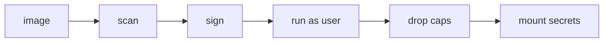

# Container Security

> Containers 101 series (8/10)

<!-- a-grade-intro:begin -->

**Core question**: Just because a *container* is *isolated*, is it really *safe*?

> *Container security* is built on three pillars: *least privilege*, *image trust*, and *runtime policy*.

<!-- a-grade-intro:end -->

## What You Will Learn

- What *non-root* means
- *Capabilities* and *seccomp*
- *Image scanning*
- *Secret* handling
- Enforcing *signed images*

## Why It Matters

A default container runs as *root* with *too many privileges* and easily becomes the *starting point* of a security incident.

## Concept at a Glance



## Key Terms

- **non-root**: running as a *normal user* such as UID 1000.
- **capability**: a *fragment* of root privilege.
- **seccomp**: a *syscall whitelist*.
- **image scanning**: checking *known CVEs*.
- **secret**: stored in a *dedicated system*, not env vars.

## Before / After

**Before**: running as *root* with *every privilege*.

**After**: *non-root + minimal capabilities + seccomp* shrinks the *attack surface*.

## Hands-on: Run a Container Safely

### Step 1 — Scan the image

```python
import subprocess

def scan(image):
    res = subprocess.run(
        ["trivy", "image", "--severity", "HIGH,CRITICAL", image],
        capture_output=True, text=True,
    )
    return res.returncode == 0
```

### Step 2 — Force non-root

```python
def run_nonroot(image):
    subprocess.run([
        "docker", "run", "--rm", "-d",
        "--user", "1000:1000", image,
    ], check=True)
```

### Step 3 — Drop capabilities

```python
def run_min_caps(image):
    subprocess.run([
        "docker", "run", "--rm", "-d",
        "--cap-drop=ALL", "--cap-add=NET_BIND_SERVICE", image,
    ], check=True)
```

### Step 4 — Read-only filesystem

```python
def run_readonly(image):
    subprocess.run([
        "docker", "run", "--rm", "-d",
        "--read-only", "--tmpfs", "/tmp", image,
    ], check=True)
```

### Step 5 — Mount a secret

```python
def run_with_secret(image, secret_path):
    subprocess.run([
        "docker", "run", "--rm", "-d",
        "-v", f"{secret_path}:/run/secrets/db_pw:ro", image,
    ], check=True)
```

## What to Notice in This Code

- *--user* avoids running as root.
- After *--cap-drop=ALL* we add only what is needed.
- *Secrets* are mounted as volumes.

## Five Common Mistakes

1. **Running as *root* and trusting the inside.**
2. **Exposing *secrets* as *env vars*.**
3. **Shipping to production *without scanning*.**
4. **Overusing *privileged* containers.**
5. **Skipping *signature verification*, opening replacement attacks.**

## How This Shows Up in Production

*Kubernetes Pod Security* and *admission controllers* enforce *non-root, no privileged, signed only* policies at *runtime*.

## How a Senior Engineer Thinks

- *Defaults* are *dangerous*.
- *Capabilities* are *added explicitly* only.
- *Secrets* belong to a *dedicated system*.
- *Scanning* is part of the *CI gate*.
- *Signing* starts *supply-chain trust*.

## Checklist

- [ ] *Non-root* user.
- [ ] *cap-drop=ALL* with minimal additions.
- [ ] *Read-only* filesystem.
- [ ] *Secrets* via volumes or a secret manager.

## Practice Problems

1. Explain in one line *why capabilities exist*.
2. Describe the role of *seccomp* in one line.
3. Name one *attack* signed images prevent.

## Wrap-up and Next Steps

With security principles in place, the next topic is the *fundamental difference* between *containers and VMs*. The next post covers *containers vs VMs*.

<!-- toc:begin -->
- [What is a Container?](./01-what-is-a-container.md)
- [Image and Layer](./02-image-and-layer.md)
- [Runtime](./03-runtime.md)
- [Dockerfile](./04-dockerfile.md)
- [Volume](./05-volume.md)
- [Network](./06-network.md)
- [Registry](./07-registry.md)
- **Container Security (current)**
- Containers vs VMs (upcoming)
- Build a Container App (upcoming)
<!-- toc:end -->

## References

- [Docker security](https://docs.docker.com/engine/security/)
- [Kubernetes Pod Security Standards](https://kubernetes.io/docs/concepts/security/pod-security-standards/)
- [Trivy](https://aquasecurity.github.io/trivy/)
- [seccomp profiles](https://docs.docker.com/engine/security/seccomp/)

Tags: Containers, Security, seccomp, Cosign, DevOps
