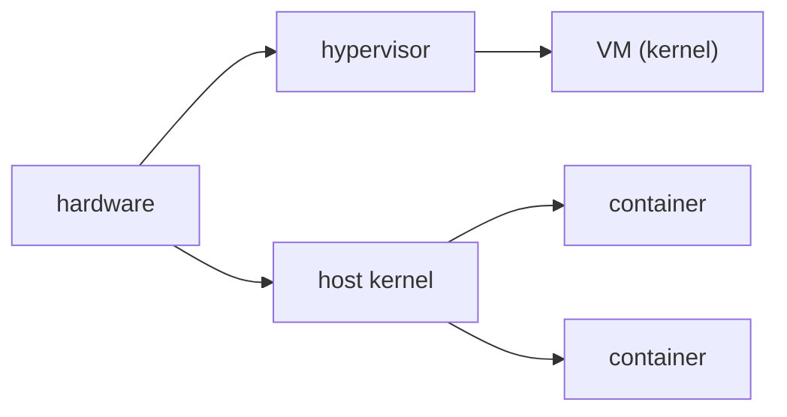

# Containers vs VMs

> Containers 101 series (9/10)

<!-- a-grade-intro:begin -->

**Core question**: If both provide *isolation*, *when* should you choose a *container* and *when* a *VM*?

> *Containers* are *light* because they *share a kernel*; *VMs* offer *strong isolation* with their *own kernel*.

<!-- a-grade-intro:end -->

This is post 9 in the Containers 101 series.

## What You Will Learn

- *Kernel sharing* vs *hypervisor*
- Differences in *isolation level*
- *Startup time* and *resource* comparison
- Right *use cases*
- *Hybrid* approaches (Firecracker, Kata)

## Why It Matters

Choosing *isolation that fits the workload* keeps both *cost* and *security* under control. The two are *complementary*, not competitors.

## Concept at a Glance



## Key Terms

- **hypervisor**: the *virtualization layer* that boots VMs.
- **guest kernel**: the *dedicated kernel* inside a VM.
- **container**: *process isolation* sharing the *host kernel*.
- **microVM**: a *lightweight VM* (Firecracker).
- **gVisor / Kata**: *containers with extra isolation*.

## Before / After

**Before**: running *all workloads* as *VMs* — *slow and expensive*.

**After**: *services* in *containers*, *multi-tenant* in *VMs / microVMs*.

## Hands-on: Compare the Same App Two Ways

### Step 1 — Run as a container

```python
import subprocess, time

def run_container(image):
    t = time.time()
    subprocess.run(["docker", "run", "--rm", "-d", image], check=True)
    return time.time() - t
```

### Step 2 — Run as a VM (concept)

```python
def run_vm(image_path):
    t = time.time()
    subprocess.run([
        "qemu-system-x86_64", "-m", "1024", "-hda", image_path,
        "-display", "none", "-daemonize",
    ], check=True)
    return time.time() - t
```

### Step 3 — Compare memory

```python
def mem_usage(pid):
    res = subprocess.run(
        ["ps", "-o", "rss=", "-p", str(pid)],
        capture_output=True, text=True, check=True,
    )
    return int(res.stdout.strip())
```

### Step 4 — Compare startup time

```python
def compare(image, vm_image):
    return {
        "container_sec": run_container(image),
        "vm_sec": run_vm(vm_image),
    }
```

### Step 5 — Report

```python
def report(stats):
    print(f"container={stats['container_sec']:.2f}s vm={stats['vm_sec']:.2f}s")
```

## What to Notice in This Code

- Containers start in *milliseconds to seconds*.
- VMs start in *seconds to minutes*.
- Measurements are *automated and reproducible*.

## Five Common Mistakes

1. **Putting everything in *containers* — weak *multi-tenant* isolation.**
2. **Putting everything in *VMs* — *cost explosion*.**
3. **Equating *containers* with *security*.**
4. **Forgetting *Mac/Win Docker* hides a *VM*.**
5. **Forcing *kernel-bound* workloads into containers.**

## How This Shows Up in Production

*AWS Fargate and Lambda* layer *containers on Firecracker microVMs* and get *container speed* with *VM-level isolation* at the same time.

## How a Senior Engineer Thinks

- *Isolation level* follows *business need*.
- A *container* may live *inside a VM*.
- *Boot time* shapes the *architecture*.
- *Multi-tenant* is safer at the *VM boundary*.
- *Hybrid* is the *modern default*.

## Checklist

- [ ] *Service isolation* with *containers*.
- [ ] *Tenant isolation* with *VMs / microVMs*.
- [ ] Document the *security tier*.
- [ ] Measure *startup time SLA*.

## Practice Problems

1. Explain in one line why *kernel sharing* makes things light.
2. Name *one case* where a VM beats a container.
3. State the *role* of Firecracker in one line.

## Wrap-up and Next Steps

It is time to *apply* every concept you have learned to *one real app*. The next post covers *building a real container app*.

<!-- toc:begin -->
- [What is a Container?](./01-what-is-a-container.md)
- [Image and Layer](./02-image-and-layer.md)
- [Runtime](./03-runtime.md)
- [Dockerfile](./04-dockerfile.md)
- [Volume](./05-volume.md)
- [Network](./06-network.md)
- [Registry](./07-registry.md)
- [Container Security](./08-container-security.md)
- **Containers vs VMs (current)**
- Build a Container App (upcoming)
<!-- toc:end -->

## References

- [What is a container? (Docker)](https://www.docker.com/resources/what-container/)
- [Firecracker](https://firecracker-microvm.github.io/)
- [Kata Containers](https://katacontainers.io/)
- [gVisor](https://gvisor.dev/)

Tags: Containers, VM, Linux, Hypervisor, DevOps
