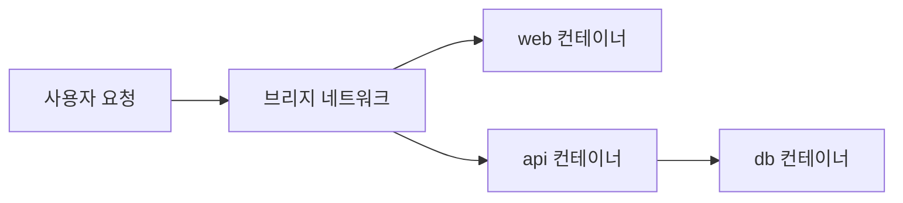

# Containers 101 (1/10): Container란 무엇인가?

이 글은 Containers 101 시리즈의 첫 번째 글입니다.

처음 컨테이너를 배우면 VM을 더 작고 빠르게 만든 기술이라고 이해하기 쉽습니다. 하지만 실제 운영에서 중요한 질문은 “무엇을 복제하는가”가 아니라 “무엇을 공유한 채 어디까지를 격리하는가”입니다.

여기서는 컨테이너를 호스트 커널을 공유하는 격리된 프로세스 묶음으로 정의하고, VM과의 차이와 `docker run`이 실제로 만드는 실행 단위를 함께 정리합니다.


*Containers 101 1장 흐름 개요*
> 컨테이너의 가치는 휴대성입니다. "내 로컬에서는 되는데"가 아니라 "어디서나 같게 된다"가 핵심입니다.

## 먼저 던지는 질문

- 컨테이너를 한 문장으로 정확히 어떻게 정의해야 할까요?
- 컨테이너는 호스트와 무엇을 공유하고, 무엇을 격리할까요?
- VM과의 결정적인 차이는 어디에서 생길까요?

## 왜 중요한가

2013년 이후 컨테이너는 사실상 기본 배포 단위가 되었습니다. 지금의 DevOps, CI/CD, Kubernetes를 이해하려면 결국 컨테이너라는 공통 전제를 먼저 이해해야 합니다.

많은 입문자가 컨테이너를 “가벼운 VM” 정도로 기억합니다. 아주 틀린 표현은 아니지만, 운영 관점에서는 중요한 차이를 가립니다. 컨테이너는 VM처럼 게스트 운영 체제를 통째로 부팅하지 않습니다. 대신 호스트 커널을 공유한 채 애플리케이션 프로세스를 격리해서 실행합니다. 그래서 시작이 빠르고, 밀도가 높고, 같은 이미지를 어디서든 재현하기 쉽습니다.

## 한눈에 보는 개념

호스트 운영 체제의 커널 하나 위에 여러 컨테이너가 올라가고, 각 컨테이너 안에서는 애플리케이션 프로세스가 격리된 것처럼 보입니다. 핵심은 "프로세스 격리"이지 "운영 체제 복제"가 아니라는 점입니다.

이 차이를 가장 쉽게 확인하는 방법은 호스트에서 `ps aux`를 실행하는 것입니다. 컨테이너 안에서 돌아가는 프로세스가 호스트의 프로세스 목록에 그대로 보입니다. VM이라면 게스트 OS 내부 프로세스가 호스트에서 보이지 않습니다.

```bash
# 호스트에서 실행
docker run -d --name demo nginx:1.27-alpine
ps aux | grep nginx
# nginx master/worker 프로세스가 호스트 프로세스 목록에 보임

# 컨테이너 내부에서 실행
docker exec demo ps aux
# PID 1부터 시작하는 별도의 프로세스 트리가 보임
```

이 두 출력의 차이가 namespace의 핵심입니다. 호스트에서는 실제 PID가 보이고, 컨테이너 안에서는 격리된 PID 공간이 보입니다. 같은 프로세스를 다른 시점에서 관찰하는 것이지, 별도 운영 체제가 동작하는 것이 아닙니다.

## 핵심 용어

- **Container**: 격리된 프로세스 묶음입니다.
- **Image**: 컨테이너가 시작할 때 사용하는 정적인 템플릿입니다.
- **Namespace**: 프로세스, 네트워크, 파일시스템 뷰를 분리합니다.
- **cgroups**: CPU와 메모리 사용량 상한을 제어합니다.
- **Runtime**: 컨테이너를 실제로 실행하는 엔진입니다.

이 다섯 용어를 구분하지 못하면 이후 글에서 계속 헷갈립니다. 특히 image와 container를 같은 것으로 생각하거나, Docker 자체를 곧 컨테이너라고 받아들이면 실습과 운영 설명이 모두 흐려집니다.

## 적용 전후

**Before**: 서버에 애플리케이션을 직접 설치하고, 운영에 들어가서 환경 차이 때문에 깨지는 문제를 겪습니다. Python 3.9에서 개발했는데 운영 서버에 Python 3.7이 설치되어 있거나, 로컬에는 있는 시스템 라이브러리가 운영 서버에는 없는 상황이 반복됩니다.

```text
개발자 A 로컬: Ubuntu 22.04, Python 3.11, libpq 15
개발자 B 로컬: macOS 14, Python 3.10, libpq 14
CI 서버:      Amazon Linux 2, Python 3.9, libpq 13
운영 서버:    Debian 11, Python 3.9, libpq 13
→ 각 환경에서 다른 방식으로 실패할 수 있음
```

**After**: 하나의 이미지가 어떤 머신에서든 같은 방식으로 실행됩니다. 이미지 안에 Python 버전, 시스템 라이브러리, 애플리케이션 코드가 모두 포함되어 있으므로 환경 차이 문제가 원천 차단됩니다.

```text
이미지: python:3.11-slim + requirements.txt + app 코드
개발자 A 로컬: docker run → 동일 이미지 실행
개발자 B 로컬: docker run → 동일 이미지 실행
CI 서버:      docker run → 동일 이미지 실행
운영 서버:    docker run → 동일 이미지 실행
→ 모든 환경에서 동일하게 동작
```

컨테이너의 진짜 가치는 속도보다 재현성에 있습니다. "내 노트북에서는 되는데 운영에서는 안 됩니다"라는 말을 줄이는 것이 바로 컨테이너가 해결하는 문제입니다.

## 실습: 첫 번째 컨테이너 실행하기

### 단계 1 — 버전 확인
```python
import subprocess

def docker_version():
    res = subprocess.run(["docker", "--version"], capture_output=True, text=True)
    return res.stdout.strip()
```

먼저 Docker CLI가 정상 설치되었는지 확인합니다. 입문 단계에서는 이 단계를 가볍게 넘기기 쉽지만, 실무에서는 도구 버전부터 확인하는 습관이 중요합니다.

### 단계 2 — 이미지 pull
```python
def pull(image):
    subprocess.run(["docker", "pull", image], check=True)
```

이미지는 실행 전에 먼저 받아 와야 합니다. 여기서 받아 오는 `nginx:latest` 같은 대상이 컨테이너 자체가 아니라 “실행 가능한 정적 템플릿”이라는 점을 분명히 기억해야 합니다.

### 단계 3 — 컨테이너 실행
```python
def run_nginx():
    subprocess.run(
        ["docker", "run", "-d", "-p", "8080:80", "--name", "web", "nginx:latest"],
        check=True,
    )
```

여기서 비로소 컨테이너가 만들어집니다. 즉, 이미지는 설계도이고 컨테이너는 그 설계도로부터 실행된 인스턴스입니다.

### 단계 4 — Inspect

```python
def ps():
    res = subprocess.run(["docker", "ps"], capture_output=True, text=True)
    return res.stdout
```

실행 중인 컨테이너를 확인합니다. 입문자에게 이 출력은 단순한 목록처럼 보이지만, 운영에서는 포트 매핑, 이름, 상태를 읽는 가장 기본적인 관찰 지점입니다.

### 단계 5 — 정리하기
```python
def cleanup(name):
    subprocess.run(["docker", "rm", "-f", name], check=True)
```

정리까지 포함해야 실습이 완성됩니다. 컨테이너는 빠르게 만들고 빠르게 없앨 수 있다는 점이 핵심이기 때문입니다.

## 이 코드에서 먼저 봐야 할 점

- `-d`는 컨테이너를 백그라운드에서 실행합니다.
- `-p 8080:80`은 호스트 포트와 컨테이너 포트를 연결합니다.
- `--name`은 컨테이너를 안정적으로 다시 참조할 수 있게 해 줍니다.

여기서 가장 중요한 포인트는 컨테이너가 결국 “프로세스를 감싼 실행 단위”라는 사실이 그대로 드러난다는 점입니다. 포트도 열고, 이름도 붙이고, 종료도 합니다. VM을 만드는 것보다 훨씬 가볍지만, 그렇다고 추상적인 개념만은 아닙니다.

## 빠른 검증과 장애 신호

```bash
docker --version
docker run -d --name web -p 8080:80 nginx:1.27-alpine
curl -I http://127.0.0.1:8080
docker ps --filter name=web
```

**Expected output:**
- `docker --version`이 정상 버전을 반환합니다.
- `curl -I` 결과에 `HTTP/1.1 200 OK`가 보입니다.
- `docker ps`에 `web`과 `0.0.0.0:8080->80/tcp` 매핑이 보입니다.

**먼저 확인할 것:**
- `docker run`이 실패하면 먼저 로컬 포트 `8080` 충돌을 확인합니다.
- `curl`이 실패하면 `docker logs web`로 컨테이너가 즉시 종료됐는지 확인합니다.
- 서비스 포트가 다른 이미지를 썼다면 컨테이너 내부 리스닝 포트를 다시 점검합니다.

## 자주 하는 실수 5가지

1. **포트 매핑을 빼먹어서 컨테이너에 접근하지 못합니다.**
2. **컨테이너와 이미지를 같은 것으로 혼동합니다.**
3. **정리를 하지 않아 디스크를 불필요하게 채웁니다.**
4. **기본값처럼 root로 실행합니다.**
5. **재현성보다 “내 로컬에서는 된다”는 감각을 믿습니다.**

이 다섯 가지는 모두 초반에 자주 나오는 오해입니다. 특히 2번과 5번은 이후의 Dockerfile, Registry, CI/CD까지 연쇄적으로 영향을 줍니다.

## 운영에서는 이렇게 나타납니다

개발자는 Docker Desktop에서 같은 이미지를 빌드하고, CI는 그 이미지를 레지스트리에 올리며, 운영 환경은 그 이미지를 Kubernetes 같은 오케스트레이터 아래에서 실행합니다. 결국 모든 단계는 같은 이미지를 공유합니다.

이 흐름을 구체적으로 보면 다음과 같습니다.

```text
개발자 로컬  →  git push  →  CI (docker build + test)  →  Registry push
                                                          ↓
운영 환경  ←  Kubernetes pull  ←  Registry (immutable tag)
```

여기서 핵심은 이미지가 한 번 빌드되면 변경 없이 그대로 각 환경을 통과한다는 점입니다. 로컬에서 빌드한 이미지와 운영에서 실행하는 이미지가 바이트 단위로 동일하므로, 환경별 디버깅이 아니라 이미지 자체의 정합성만 검증하면 됩니다.

즉, 컨테이너는 개발 편의 기능이 아니라 배포 계약입니다. 이 관점이 없으면 컨테이너를 실습 도구 정도로만 보게 됩니다.

## 시니어 엔지니어는 이렇게 생각합니다

- 컨테이너는 VM이 아니라 프로세스입니다.
- 이미지는 불변 아티팩트로 다룹니다.
- 상태는 컨테이너 내부가 아니라 별도 저장소에 둡니다.
- root 실행은 기본값이 아니라 제거 대상입니다.
- 재현성이 컨테이너 도입의 핵심 가치입니다.

시니어 엔지니어는 컨테이너를 “잘 뜨는가”보다 “같은 방식으로 계속 다시 띄울 수 있는가”로 평가합니다. 운영에서 중요한 기준은 첫 실행 성공보다 반복 가능한 배포이기 때문입니다.

실제로 시니어 엔지니어가 컨테이너를 도입할 때 가장 먼저 하는 일은 `Dockerfile`을 작성하는 것이 아닙니다. 먼저 "이 서비스의 상태는 어디에 두는가", "장애 시 컨테이너를 버리고 새로 띄울 수 있는가", "이미지 태그를 고정하면 6개월 후에도 같은 결과가 나오는가"를 확인합니다. 이 세 질문에 답이 없으면 컨테이너화 자체가 기술 부채가 됩니다.

## 체크리스트

- [ ] Docker 설치와 버전 확인을 마쳤습니다.
- [ ] image와 container의 차이를 설명할 수 있습니다.
- [ ] 포트 매핑의 의미를 이해합니다.
- [ ] 기본 정리 명령을 알고 있습니다.

## 연습 문제

1. 컨테이너와 VM의 결정적인 차이를 한 줄로 설명해 보세요.
2. `docker run`에서 `-d`를 빼면 어떤 차이가 생기는지 설명해 보세요.
3. class와 instance 비유로 image와 container의 차이를 설명해 보세요.

## 정리와 다음 글

컨테이너를 이해하는 가장 좋은 출발점은 “호스트 커널을 공유하는 격리된 프로세스 묶음”이라는 정의를 정확히 붙잡는 것입니다. 이 정의가 잡히면 왜 이미지가 필요하고, 왜 런타임이 분리되며, 왜 상태를 컨테이너 안에 두면 안 되는지도 자연스럽게 이어집니다.

다음 글에서는 이 컨테이너가 어떤 정적 템플릿, 즉 이미지와 레이어 구조 위에서 만들어지는지 살펴보겠습니다.


## 심화: 컨테이너와 VM을 운영 관점에서 분해해서 보기

컨테이너를 VM과 비교할 때 가장 흔한 오해는 "컨테이너는 VM보다 가볍다"에서 멈추는 것입니다. 이 문장은 사실이지만, 운영 설계에 필요한 정보는 아닙니다. 운영에서 필요한 질문은 "가벼운가"가 아니라 "어떤 경계를 어디까지 신뢰할 수 있는가"입니다. 애플리케이션 운영은 결국 장애 격리, 자원 격리, 보안 경계, 배포 속도의 균형을 잡는 일입니다. 따라서 컨테이너와 VM을 같은 축에서 비교하려면 커널 경계, 시작 시간, 밀도, 관측성, 복구 전략을 함께 봐야 합니다.

다음 표는 실무에서 자주 검토하는 항목을 한 번에 보여 줍니다.

| 항목 | 컨테이너 | VM |
| --- | --- | --- |
| 격리 기준 | Linux namespace + cgroup | Hypervisor + guest OS |
| 커널 | 호스트 커널 공유 | 게스트 커널 독립 |
| 시작 시간 | 보통 ms~수초 | 보통 수초~수분 |
| 리소스 오버헤드 | 낮음 | 상대적으로 큼 |
| 밀도 | 높은 편 | 낮은 편 |
| 보안 경계 | 커널 공유 전제의 논리적 격리 | 커널 분리 기반 강한 경계 |
| 패치 단위 | 이미지 교체 + 호스트 커널 패치 | VM 이미지 + 게스트 OS 패치 |
| 대표 사용처 | 마이크로서비스, CI 작업, 배치 | 강한 테넌트 격리, 커스텀 OS 요구 |

이 표의 핵심은 어느 한쪽이 절대적으로 우수하다는 결론이 아닙니다. 예를 들어 팀 내부 서비스, 내부망 API, 짧은 수명 배치 작업은 컨테이너의 기동 속도와 높은 밀도가 매우 큰 장점이 됩니다. 반면 강한 규제 환경에서 테넌트 간 경계를 최대화해야 하거나, 커널 독립성이 요구되는 워크로드는 VM이 더 자연스럽습니다. 운영 아키텍처는 도구 선호가 아니라 경계 요구사항으로 결정해야 합니다.

## Linux 격리 메커니즘: namespace와 cgroup을 함께 이해하기

컨테이너가 "격리된 프로세스"라는 설명은 맞지만, 실제 구현은 두 축으로 나뉩니다. 첫 번째 축은 namespace로, 프로세스가 보는 세상을 나눕니다. 두 번째 축은 cgroup으로, 프로세스가 소비할 수 있는 자원을 제한합니다. 둘은 역할이 다르지만 항상 함께 동작합니다.

### namespace는 "보이는 범위"를 나눕니다

- pid namespace: 프로세스 번호 공간을 분리합니다.
- net namespace: 네트워크 인터페이스, 라우팅 테이블, 포트 공간을 분리합니다.
- mnt namespace: 마운트 포인트와 파일시스템 뷰를 분리합니다.
- uts namespace: 호스트명과 도메인명을 분리합니다.
- ipc namespace: 프로세스 간 통신 자원을 분리합니다.
- user namespace: UID/GID 매핑을 분리해 root 위험을 낮춥니다.

namespace만으로는 자원 폭주를 막을 수 없습니다. 예를 들어 프로세스가 자신만의 네트워크 공간을 가진다고 해도 CPU를 100% 계속 사용하는 문제는 남습니다. 그래서 반드시 cgroup이 함께 필요합니다.

### cgroup은 "쓸 수 있는 양"을 제한합니다

- cpu.max: CPU 시간 상한을 제어합니다.
- memory.max: 메모리 상한을 설정합니다.
- pids.max: 생성 가능한 프로세스 수를 제한합니다.
- io.max: 디스크 I/O 사용량을 제한합니다.

다음은 개념 확인용 예시입니다.

```bash
docker run --rm -d --name cpu-test --cpus="0.5" alpine sh -c "while true; do :; done"
docker run --rm -d --name mem-test --memory="256m" alpine sh -c "tail -f /dev/null"
docker inspect cpu-test --format '{{json .HostConfig.NanoCpus}}'
docker inspect mem-test --format '{{json .HostConfig.Memory}}'
```

이 명령은 단순하지만 중요한 사실을 보여 줍니다. 컨테이너는 추상적인 개념이 아니라, 실제로 CPU/메모리 제한을 가진 프로세스 집합입니다. 즉, "컨테이너를 이해한다"는 말은 namespace와 cgroup의 역할 차이를 설명할 수 있다는 뜻입니다.

## 운영 시나리오로 보는 선택 기준

아래는 실제 팀에서 자주 나오는 의사결정 시나리오입니다.

1) 내부 서비스 40개를 빠르게 배포해야 하는 경우
- 우선 선택: 컨테이너
- 이유: 이미지 기반 재현성, 빠른 롤링 업데이트, 높은 밀도

2) 고객별 강한 격리 경계가 필요한 SaaS 멀티테넌트
- 우선 선택: VM 또는 microVM
- 이유: 커널 경계 독립성이 요구됨

3) 빌드/테스트 파이프라인의 임시 실행 환경
- 우선 선택: 컨테이너
- 이유: 빠른 기동, 정리 용이성, 동일한 빌드 환경 재현

4) 특정 커널 모듈 의존 워크로드
- 우선 선택: VM 검토
- 이유: 호스트 커널 공유 제약 회피 필요

결론은 명확합니다. 컨테이너는 배포 속도와 개발 생산성에서 큰 이점을 주지만, 보안 경계 요구가 커질수록 VM 또는 보강된 런타임 조합을 함께 검토해야 합니다.

## 실무 체크 포인트: 처음부터 문서화해야 할 항목

컨테이너 도입 초기에 아래 항목을 문서화하면 이후 사고 비용을 크게 줄일 수 있습니다.

- 컨테이너 기본 리소스 제한값(CPU, 메모리, pids)
- 기본 실행 사용자(root 금지 여부)
- 로그 수집 경로(stdout/stderr 기준)
- 상태 데이터 외부화 원칙(volume, DB, object storage)
- 이미지 태그 정책과 digest 고정 정책

이 다섯 항목이 정의되지 않으면 팀마다 다른 습관으로 컨테이너를 쓰게 됩니다. 그러면 같은 Dockerfile을 써도 운영 결과가 달라지고, 장애가 발생했을 때 복구 속도가 급격히 느려집니다.

## 실무 확장: 격리와 자원 제어를 눈으로 확인하기

컨테이너를 추상 개념으로만 이해하면 운영에서 바로 적용하기 어렵습니다. 여기서는 namespace와 cgroup이 실제로 어떤 신호로 드러나는지 최소한의 관찰 루틴으로 정리합니다.

### 네임스페이스 확인 루틴

```bash
docker run --rm -d --name ns-demo nginx:1.27
docker inspect -f '{{.State.Pid}}' ns-demo
ls -l /proc/<PID>/ns
```

`/proc/<PID>/ns`를 보면 `mnt`, `pid`, `net`, `uts` 같은 항목이 분리되어 있는 것을 확인할 수 있습니다. 이 값이 다르다는 것은 호스트와 컨테이너가 다른 뷰를 본다는 뜻입니다.

### cgroup 제한 확인 루틴

```bash
docker run --rm -d --name cg-demo --cpus 0.5 --memory 256m nginx:1.27
docker stats --no-stream cg-demo
docker inspect -f '{{json .HostConfig.Memory}}' cg-demo
```

이 세 줄만 확인해도 “격리”가 말이 아니라 설정과 관찰 가능한 상태라는 점이 분명해집니다. 컨테이너는 프로세스를 감추는 기술이 아니라, 프로세스를 의도한 경계 안에 두는 운영 단위입니다.

### Docker Compose로 격리 경계 문서화하기

```yaml
services:
  web:
    image: nginx:1.27
    cpus: 0.50
    mem_limit: 256m
    pids_limit: 256
```

운영 팀이 컨테이너를 안전하게 다루려면 `docker run` 옵션을 기억에 의존하기보다 Compose 파일로 경계를 선언하는 편이 낫습니다. 코드 리뷰에서 격리 수준을 함께 검토할 수 있기 때문입니다.

### 네트워크 경계 도식



브리지 네트워크를 기준으로 보면, 모든 컨테이너를 외부에 노출할 필요가 없다는 점이 분명해집니다. 운영에서는 “누가 누구에게 연결 가능한가”를 먼저 결정하고 포트를 열어야 합니다.

## 실무 확장: 컨테이너 정의를 팀 표준으로 고정하기

팀 합의 문장을 먼저 고정하면 문서, 코드 리뷰, 장애 회고가 일관성을 가집니다.

- 컨테이너는 **호스트 커널을 공유하는 격리된 프로세스 실행 단위**입니다.
- 이미지는 **실행 템플릿**이고, 컨테이너는 **실행 인스턴스**입니다.
- 성능 최적화보다 먼저 **격리 경계와 재현성**을 검증합니다.

이 세 문장만 공유해도 “컨테이너가 VM과 같냐” 같은 논쟁이 줄고, 장애 원인을 계층별로 나눠 보는 습관이 자리잡습니다.

## 처음 질문으로 돌아가기

- **컨테이너를 한 문장으로 정확히 어떻게 정의해야 할까요?**
  - 컨테이너는 호스트 커널을 공유하는 격리된 프로세스 묶음입니다. 가상 머신처럼 완전히 독립된 OS가 아니라 커널은 공유하되, 파일시스템·네트워크·PID 네임스페이스로 프로세스를 격리한 것입니다.
- **컨테이너는 호스트와 무엇을 공유하고, 무엇을 격리할까요?**
  - 커널·시스템 콜·CPU·메모리는 공유합니다. 격리되는 것은 프로세스 뷰, 파일시스템 루트, 네트워크 인터페이스, 포트 번호입니다.
- **VM과의 결정적인 차이는 어디에서 생길까요?**
  - VM은 게스트 OS를 통째로 부팅하기 때문에 부팅 시간이 길고 밀도가 낮습니다. 컨테이너는 프로세스만 실행하므로 밀리초 단위로 시작되고, 같은 호스트에 수백 개를 올릴 수 있습니다.
  - 본문의 기준은 Container란 무엇인가?를 한 덩어리 개념으로 보지 않고 입력, 처리, 검증, 운영 신호가 만나는 경계로 나누어 확인하는 것입니다.
- **컨테이너는 호스트와 무엇을 공유하고, 무엇을 격리할까요?**
  - 커널과 시스템 콜 인터페이스를 공유합니다. 격리되는 것은 PID 공간, 파일시스템 루트, 네트워크 인터페이스, 사용자 ID 매핑입니다. 본문에서 `/proc/<PID>/ns`를 확인한 실습이 이 경계를 직접 보여 줍니다.
- **VM과의 결정적인 차이는 어디에서 생길까요?**
  - 커널 경계입니다. VM은 게스트 커널을 별도로 부팅하므로 부팅 시간과 오버헤드가 크고, 대신 격리 강도가 높습니다. 컨테이너는 호스트 커널을 공유하므로 밀리초 단위로 시작하고 밀도가 높지만, 커널 취약점이 곧 모든 컨테이너의 취약점이 됩니다. 운영 설계에서는 이 트레이드오프를 워크로드 성격에 맞게 결정해야 합니다.

<!-- toc:begin -->
## 시리즈 목차

- **Container란 무엇인가? (현재 글)**
- Image와 Layer (예정)
- Runtime (예정)
- Dockerfile (예정)
- Volume (예정)
- Network (예정)
- Registry (예정)
- Container Security (예정)
- Containers vs VMs (예정)
- 실전 컨테이너 앱 만들기 (예정)

<!-- toc:end -->

## 참고 자료

- Containers 101 예제 코드: https://github.com/yeongseon-books/book-examples/tree/main/containers-101/ko
- [Docker 공식 문서](https://docs.docker.com/)
- [OCI Image Spec](https://github.com/opencontainers/image-spec)
- [Linux namespaces](https://man7.org/linux/man-pages/man7/namespaces.7.html)
- [cgroups v2](https://www.kernel.org/doc/Documentation/admin-guide/cgroup-v2.rst)

Tags: Containers, Docker, Kubernetes, DevOps
