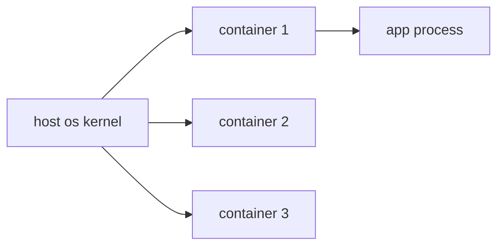

# Container란 무엇인가?

> Containers 101 시리즈 (1/10)


## 이 글에서 다룰 문제

컨테이너는 2013년 이후 배포의 기본 단위로 자리 잡았습니다. 이 개념을 이해해야 현대 DevOps 흐름을 자연스럽게 따라갈 수 있습니다.

## 전체 흐름


## Before/After

**Before**: 서버에 직접 설치해서 환경 차이 때문에 쉽게 깨집니다.

**After**: 이미지 하나로 어디서나 같은 방식으로 실행합니다.

## 첫 컨테이너 실행

### 1단계 — 버전 확인

```python
import subprocess

def docker_version():
    res = subprocess.run(["docker", "--version"], capture_output=True, text=True)
    return res.stdout.strip()
```

### 2단계 — 이미지 pull

```python
def pull(image):
    subprocess.run(["docker", "pull", image], check=True)
```

### 3단계 — 컨테이너 실행

```python
def run_nginx():
    subprocess.run(
        ["docker", "run", "-d", "-p", "8080:80", "--name", "web", "nginx:latest"],
        check=True,
    )
```

### 4단계 — 상태 확인

```python
def ps():
    res = subprocess.run(["docker", "ps"], capture_output=True, text=True)
    return res.stdout
```

### 5단계 — 정리

```python
def cleanup(name):
    subprocess.run(["docker", "rm", "-f", name], check=True)
```

## 이 코드에서 주목할 점

- `-d`는 백그라운드 실행 옵션입니다.
- `-p 8080:80`은 호스트와 컨테이너 사이의 포트 매핑입니다.
- `--name`으로 컨테이너 식별자를 붙입니다.

## 자주 하는 실수 5가지

1. **포트 매핑을 빼먹어서 외부에서 접근하지 못합니다.**
2. **컨테이너와 이미지를 같은 것으로 오해합니다.**
3. **정리 명령을 빼먹어서 디스크가 금방 찹니다.**
4. **아무 생각 없이 root로 컨테이너를 실행합니다.**
5. **로컬에서만 되면 충분하다고 착각합니다.**

## 실무에서는 이렇게 쓰입니다

개발자는 Docker Desktop에서 같은 이미지를 빌드하고, CI는 그 이미지를 registry에 푸시하며, 프로덕션은 Kubernetes에서 같은 이미지를 실행합니다.

## 체크리스트

- [ ] Docker 설치를 확인했습니다.
- [ ] 이미지와 컨테이너의 차이를 설명할 수 있습니다.
- [ ] port mapping의 의미를 이해했습니다.
- [ ] 정리 명령을 익혔습니다.

## 정리 및 다음 단계

이미지가 템플릿이라면 이제 그 내부 구조를 봐야 합니다. 다음 글은 Image와 Layer입니다.

<!-- toc:begin -->
- **Container란 무엇인가? (현재 글)**
- Image와 Layer (예정)
- Runtime (예정)
- Dockerfile (예정)
- Volume (예정)
- Network (예정)
- Registry (예정)
- Container Security (예정)
- Container와 VM 차이 (예정)
- 실전 컨테이너 앱 만들기 (예정)
<!-- toc:end -->

## 참고 자료

- [Docker 공식 문서](https://docs.docker.com/)
- [OCI Image Spec](https://github.com/opencontainers/image-spec)
- [Linux namespaces](https://man7.org/linux/man-pages/man7/namespaces.7.html)
- [cgroups v2](https://www.kernel.org/doc/Documentation/admin-guide/cgroup-v2.rst)

Tags: Containers, Docker, Linux, DevOps, Architecture
