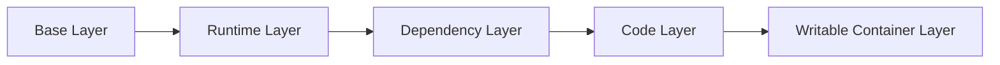

# Containers 101 (2/10): Image와 Layer

이 글은 Containers 101 시리즈의 두 번째 글입니다.

이미지는 파일 하나처럼 보이지만, 레이어 순서 하나가 빌드 시간과 전송 비용, 취약점 표면까지 바꿉니다. 같은 앱인데도 어떤 팀은 캐시를 거의 못 쓰고, 어떤 팀은 바뀐 부분만 다시 만들어 빠르게 배포하는 이유가 여기서 갈립니다.

여기서는 이미지가 왜 레이어 스택으로 설계되는지, OverlayFS와 캐시, digest 기반 재현성이 왜 이 구조에서 나오는지 설명합니다.

## 먼저 던지는 질문

- 컨테이너 이미지는 왜 굳이 여러 레이어로 나뉠까요?
- 레이어 하나는 정확히 어떤 역할을 할까요?
- OverlayFS는 이 레이어들을 어떻게 겹쳐 보이게 만들까요?

## 큰 그림


*Containers 101 2장 흐름 개요*

이 그림은 이미지가 여러 레이어로 구성되며, 각 레이어가 특정 Dockerfile 명령에 대응한다는 점을 보여 줍니다. 변경된 레이어만 다시 빌드하고, 나머지는 캐시를 재사용하는 흐름을 추적할 수 있습니다.

> 레이어는 단순한 저장 형식이 아니라 빌드 캐시, 전송 효율, 보안 표면을 동시에 결정하는 설계 단위입니다. "무엇이 바뀌었는가"를 레이어 단위로 추적할 수 있으면 빌드와 배포의 문제 추적이 해시 단위로 가능해집니다.

## 왜 중요한가

레이어를 이해하지 못하면 Dockerfile을 제대로 최적화할 수 없습니다. 같은 애플리케이션인데도 어떤 팀은 빌드에 30초가 걸리고, 어떤 팀은 5분이 걸리는 이유가 대부분 여기에 있습니다.

입문자에게 이미지는 하나의 파일처럼 보이기 쉽습니다. 하지만 실제 이미지는 읽기 전용 변경 묶음인 레이어들이 쌓인 구조입니다. 이 구조 덕분에 베이스 이미지를 재사용하고, 변경된 부분만 다시 빌드하고, 네트워크로는 달라진 부분만 전송할 수 있습니다.

## 한눈에 보는 개념

아래쪽은 운영 체제나 런타임 같은 공통 기반이고, 위쪽으로 갈수록 애플리케이션 고유 변경이 쌓입니다. 실행 시에는 여기에 쓰기 가능한 컨테이너 레이어가 하나 더 붙습니다.

이 구조를 직접 확인하려면 다음 명령을 실행합니다.

```bash
docker pull python:3.12-slim
docker image inspect python:3.12-slim --format '{{json .RootFS.Layers}}' | python3 -m json.tool
```

출력을 보면 4~5개의 sha256 해시가 배열로 나옵니다. 각 해시가 하나의 레이어이고, 결국 이미지는 "이 레이어들을 순서대로 쌓아라"라는 선언입니다. 이 선언이 OCI Image Spec의 manifest이고, 레이어 재사용의 기반입니다.

예를 들어 `python:3.12-slim` 위에 `requirements.txt`만 설치한 이미지를 빌드하면, 기존 4개 레이어는 그대로 재사용되고 새 레이어 1개만 추가됩니다. 네트워크로도 새 레이어만 전송하면 되므로 CI/CD 속도에 직접 기여합니다.

## 핵심 용어

- **Layer**: 읽기 전용 변경 묶음입니다.
- **Base image**: 맨 아래에 놓이는 운영 체제 또는 런타임 기반 레이어입니다.
- **OverlayFS**: 여러 레이어를 하나의 파일시스템처럼 보이게 하는 방식입니다.
- **Manifest**: 이미지 구성 정보를 가리키는 메타데이터입니다.
- **Digest**: 이미지 내용을 식별하는 해시입니다.

여기서 digest와 tag를 구분하는 감각이 특히 중요합니다. tag는 사람이 붙인 이름이고, digest는 실제 내용의 동일성을 보장하는 식별자입니다.

## 적용 전후

**Before**: 소스 코드 한 줄만 바뀌어도 이미지 전체를 다시 빌드합니다. CI 파이프라인이 5분 이상 걸리고, 네트워크로 수백 MB를 매번 전송합니다.

```text
Dockerfile:
  FROM python:3.12-slim
  COPY . .                  ← 모든 파일 복사
  RUN pip install -r requirements.txt
  CMD ["python", "main.py"]

결과: 코드 1줄 변경 → pip install 재실행 → 전체 재빌드 (~4분)
```

**After**: 위쪽 레이어만 다시 빌드하므로 몇 초 안에 끝납니다.

```text
Dockerfile:
  FROM python:3.12-slim
  COPY requirements.txt .   ← 의존성 파일만 먼저
  RUN pip install -r requirements.txt
  COPY . .                  ← 소스는 마지막
  CMD ["python", "main.py"]

결과: 코드 1줄 변경 → COPY 레이어만 재실행 → 캐시 활용 (~8초)
```

즉, 레이어는 단순한 저장 형식이 아니라 빌드 속도와 배포 효율을 좌우하는 핵심 메커니즘입니다. 레이어 순서를 설계하는 것이 곧 빌드 비용을 설계하는 것입니다.

## 실습: 이미지 내부 들여다보기

### 단계 1 — Pull and inspect

```python
import subprocess, json

def inspect(image):
    res = subprocess.run(
        ["docker", "image", "inspect", image],
        capture_output=True, text=True, check=True,
    )
    return json.loads(res.stdout)
```

이미지 메타데이터를 읽어서 구조를 확인합니다. 실무에서는 문제를 감으로 추측하기보다 `inspect` 출력부터 보는 습관이 중요합니다.

### 단계 2 — History

```python
def history(image):
    res = subprocess.run(
        ["docker", "history", "--no-trunc", image],
        capture_output=True, text=True, check=True,
    )
    return res.stdout
```

각 레이어가 어떤 명령에서 만들어졌는지 추적합니다. Dockerfile 수정이 이미지 크기와 캐시에 어떤 영향을 주는지 읽을 수 있는 출발점입니다.

### 단계 3 — Layer hashes

```python
def layer_sizes(image):
    data = inspect(image)
    return [layer for layer in data[0]["RootFS"]["Layers"]]
```

실제 레이어 해시 목록을 확인합니다. 이미지가 말 그대로 여러 레이어의 스택이라는 사실이 여기서 분명해집니다.

### 단계 4 — Digest

```python
def digest(image):
    return inspect(image)[0]["Id"]
```

이미지의 내용 식별자를 확인합니다. 운영에서는 tag보다 digest를 기준으로 재현성을 확보하는 경우가 많습니다.

### 단계 5 — Compare two builds

```python
def diff(a, b):
    return set(layer_sizes(a)) ^ set(layer_sizes(b))
```

두 빌드 사이에서 어떤 레이어가 달라졌는지 비교합니다. 캐시가 왜 깨졌는지 추적할 때 유용한 접근입니다.

## 이 코드에서 먼저 봐야 할 점

- `RootFS.Layers`에는 실제 레이어 해시가 들어 있습니다.
- `history`는 각 레이어를 만든 명령을 보여 줍니다.
- digest는 이미지 내용이 같은지를 보장합니다.

이 세 가지를 함께 보면 “왜 이번 빌드가 느렸는가”, “왜 이미지가 갑자기 커졌는가”, “왜 같은 tag인데 결과가 다르게 보이는가” 같은 질문에 훨씬 빨리 답할 수 있습니다.

## 빠른 검증과 장애 신호

```bash
docker pull python:3.12-slim
docker image inspect python:3.12-slim --format "{{json .RootFS.Layers}}"
docker history python:3.12-slim
docker inspect --format "{{index .RepoDigests 0}}" python:3.12-slim
```

**Expected output:**
- `RootFS.Layers`에 여러 레이어 해시가 배열로 출력됩니다.
- `docker history`에 각 레이어의 명령과 크기가 보입니다.
- push된 이미지라면 `RepoDigests`로 불변 식별자를 확인할 수 있습니다.

**먼저 확인할 것:**
- 레이어 수가 과하면 Dockerfile의 `RUN` 분리를 먼저 점검합니다.
- digest가 비어 있으면 아직 로컬 전용 이미지인지 확인합니다.
- 이미지가 크면 build context와 multi-stage 사용 여부를 봅니다.

## 자주 하는 실수 5가지

1. **RUN 명령을 지나치게 잘게 쪼개 레이어를 불필요하게 늘립니다.**
2. **`COPY .`로 필요 없는 파일까지 이미지에 넣습니다.**
3. **`apt update`와 `apt install`을 분리해 캐시를 어색하게 만듭니다.**
4. **빌드 산출물을 최종 이미지에 그대로 남겨 이미지가 커집니다.**
5. **`latest` 태그만 믿고 재현성을 잃습니다.**
이 실수들은 모두 레이어를 "보이지 않는 내부 구현"으로만 볼 때 나옵니다. 레이어는 운영 비용에 직접 연결되는 설계 요소입니다.

각 실수의 운영 영향을 구체적으로 보면:

- **실수 1 (레이어 과다)**: 레이어가 20개를 넘으면 pull 시간이 늘고, 캐시 관리가 복잡해집니다. `RUN apt-get update && apt-get install -y pkg1 pkg2 && rm -rf /var/lib/apt/lists/*`처럼 의미 단위로 통합하는 것이 기본입니다.
- **실수 2 (build context 비대화)**: `.git` 폴더가 context에 포함되면 수십 MB가 불필요하게 전송됩니다. `.dockerignore`에 `.git`, `node_modules`, `__pycache__`를 반드시 추가해야 합니다.
- **실수 3 (apt 분리)**: `RUN apt-get update`와 `RUN apt-get install`을 별도 레이어로 두면, update 캐시가 오래된 패키지 목록을 가리켜 설치가 실패할 수 있습니다.
- **실수 4 (빌드 잔여물)**: gcc, make 같은 빌드 도구가 final image에 남으면 이미지 크기와 CVE 수가 함께 늘어납니다.
- **실수 5 (latest 의존)**: `latest`는 mutable 태그입니다. 어제와 오늘의 `latest`가 다를 수 있으므로, 운영에서는 반드시 digest를 함께 기록해야 합니다.

## 운영에서는 이렇게 나타납니다

실무에서는 multi-stage build로 빌드 도구와 런타임을 분리하고, `.dockerignore`로 build context를 줄이며, 배포 시에는 digest pin으로 재현성을 고정합니다. 즉, 레이어 이해가 곧 운영 품질로 이어집니다.

특히 CI/CD 파이프라인에서 레이어 설계가 직접 보이는 장면들이 있습니다.

| 상황 | 원인 | 해결 |
| --- | --- | --- |
| CI 빌드가 5분 이상 | `COPY . .`이 의존성 설치 앞에 위치 | 의존성 파일 먼저 복사, 소스는 나중에 |
| 이미지가 1.5GB 초과 | 빌드 도구가 final stage에 남아 있음 | multi-stage로 결과만 복사 |
| 배포 후 동작이 달라짐 | 같은 tag에 다른 digest push | digest pin + 배포 manifest 기록 |
| 스캐너에서 HIGH 취약점 발견 | 불필요한 패키지가 이미지에 포함 | slim/distroless 베이스 + 최소 설치 |

이 표의 모든 항목은 결국 "레이어를 어떻게 구성했는가"로 귀결됩니다. 이미지 빌드를 단순히 "도커파일 작성"으로 보지 않고, "레이어 설계"로 보는 시점이 필요합니다.

### 실제 운영 사고 예시

한 팀에서 배포 후 API 응답 시간이 2배로 느려졌습니다. 원인을 추적해 보니 이미지 크기가 200MB에서 1.2GB로 커져 있었습니다. `docker history`로 확인하니 개발자가 디버깅용으로 추가한 `RUN apt-get install gdb strace`가 final stage에 남아 있었습니다. 불필요한 패키지가 이미지를 키웠고, pull 시간 증가가 콜드 스타트를 느리게 만들었습니다.

```bash
# 문제 확인
docker history myapp:v2.3.1 --no-trunc | grep -i "apt-get"
# 해결: multi-stage에서 디버깅 도구는 builder에만 둘 것
```

이 사고는 레이어 인식 없이는 발견하기 어렵습니다. `docker history`를 PR 리뷰 시 기본 체크 항목으로 두면 예방할 수 있습니다.

## 시니어 엔지니어는 이렇게 생각합니다

- 자주 바뀌지 않는 명령과 자주 바뀌는 명령의 순서를 구분합니다.
- multi-stage build를 기본 패턴으로 봅니다.
- `latest`는 편의용 이름이지 운영 기준이 아니라고 봅니다.
- `.dockerignore`도 Dockerfile만큼 중요하게 다룹니다.
- 이미지 크기는 곧 공격 표면이라고 생각합니다.
시니어 엔지니어는 레이어를 단지 빌드 속도 관점에서만 보지 않습니다. 보안, 전송 비용, 캐시 효율, 재현성까지 한 번에 연결해서 봅니다.

예를 들어 Dockerfile PR 리뷰에서 시니어가 확인하는 항목은 다음과 같습니다.

```text
1. 빠르게 바뀌는 레이어가 아래쪽에 있지 않은가?
   → 캐시 효율 확인
2. final stage에 빌드 도구(gcc, make, pip wheel)가 남아 있지 않은가?
   → 이미지 크기 + 공격 표면 확인
3. 비밀 파일(.env, credentials)이 레이어에 포함되지 않았는가?
   → 레이어는 삭제해도 히스토리에 남음
4. USER 지시어로 non-root 실행을 보장하는가?
   → 보안 기본값 확인
5. digest가 빌드 로그에 기록되는가?
   → 재현성 확보
```

이 다섯 가지를 자동 체크로 만들면 이미지 품질이 개인 역량에 의존하지 않게 됩니다. 팀 기본값이 되면 신규 멤버도 같은 기준으로 이미지를 만듭니다.

## 체크리스트

- [ ] multi-stage build를 사용하고 있습니다.
- [ ] `.dockerignore`를 작성했습니다.
- [ ] 운영 환경에서는 digest pin을 사용합니다.
- [ ] 이미지 스캔을 활성화했습니다.
- [ ] 이미지 크기를 200MB 이하로 유지하고 있습니다.
- [ ] `docker history`로 레이어 구성을 확인하는 습관이 있습니다.
- [ ] CI에서 BuildKit 캐시를 활용하고 있습니다.
- [ ] 빌드 시 레이어 수가 10개를 넘지 않는지 정기적으로 점검합니다.

## 연습 문제

1. 레이어 캐시가 깨지는 가장 흔한 이유를 한 줄로 적어 보세요.
2. multi-stage build가 특히 유리한 상황을 하나 들어 보세요.
3. tag와 digest의 차이를 한 줄로 설명해 보세요.

## 정리와 다음 글

이미지는 여러 레이어가 쌓여 만들어지는 정적 아티팩트입니다. 이 구조를 이해하면 Dockerfile을 왜 특정 순서로 써야 하는지, 왜 캐시가 깨지는지, 왜 운영에서 digest를 중요하게 보는지가 자연스럽게 연결됩니다.

다음 글에서는 이렇게 준비된 이미지를 실제로 누가 어떻게 실행하는지, 즉 Runtime 계층을 살펴보겠습니다.


## 심화: 멀티스테이지 빌드와 레이어 캐싱을 실전으로 연결하기

이미지 최적화의 핵심은 "작게 만든다"가 아니라 "변경 비용을 통제한다"입니다. 대부분의 팀에서 배포가 느려지는 이유는 애플리케이션 코드 양보다 Dockerfile 레이어 설계가 비효율적이기 때문입니다. 특히 의존성 설치 단계와 소스 복사 단계의 순서를 잘못 두면, 사소한 코드 수정에도 전체 의존성을 재설치하게 되어 빌드 시간이 급격히 늘어납니다.

다음은 Python 서비스 기준의 멀티스테이지 Dockerfile 예시입니다.

```dockerfile
FROM python:3.12-slim AS builder
WORKDIR /app
COPY requirements.txt .
RUN pip install --upgrade pip && pip wheel --wheel-dir /wheels -r requirements.txt
COPY . .
RUN pip wheel --wheel-dir /wheels .

FROM python:3.12-slim AS runtime
WORKDIR /app
COPY --from=builder /wheels /wheels
RUN pip install --no-cache-dir /wheels/* && rm -rf /wheels
COPY app ./app
USER 1000
CMD ["python", "-m", "app.main"]
```

이 구조의 장점은 명확합니다. 빌드에 필요한 컴파일 단계는 builder에 격리되고, runtime에는 실행에 필요한 결과물만 남습니다. 따라서 최종 이미지 크기가 줄고 취약점 표면도 함께 줄어듭니다.

## 레이어 캐싱 전략: 자주 바뀌는 것과 덜 바뀌는 것을 분리

캐시 적중률을 높이려면 레이어 순서를 데이터 변경 빈도 기준으로 설계해야 합니다.

- 덜 바뀌는 레이어: 베이스 이미지, OS 패키지, requirements.txt
- 자주 바뀌는 레이어: 애플리케이션 소스, 템플릿, 정적 자원

아래 표는 흔한 패턴과 개선 패턴을 비교합니다.

| 패턴 | 결과 | 개선 방향 |
| --- | --- | --- |
| `COPY . .`를 초반에 배치 | 소스 한 줄 변경에도 의존성 재설치 | 의존성 파일만 먼저 복사 |
| RUN 명령 지나치게 분리 | 레이어 증가, 캐시 관리 복잡 | 의미 단위로 통합 |
| 빌드 결과물을 최종 이미지에 그대로 포함 | 이미지 비대화, 공격 표면 증가 | 멀티스테이지로 결과만 복사 |
| `.dockerignore` 부재 | 불필요 파일 전송 증가 | 컨텍스트 최소화 |

`.dockerignore`도 반드시 함께 써야 합니다.

```text
.git
__pycache__/
*.pyc
.venv/
node_modules/
.env
coverage/
```

컨텍스트가 줄어들면 빌드 시작 자체가 빨라지고, CI 환경의 네트워크 전송 비용도 줄어듭니다.

## OverlayFS 관점에서 레이어를 읽는 방법

레이어는 단순 파일 묶음이 아니라 변경 델타입니다. OverlayFS는 lowerdir(읽기 전용 레이어들)과 upperdir(쓰기 가능 레이어)을 합쳐 하나의 파일시스템처럼 보여 줍니다. 이 구조를 이해하면 왜 삭제가 실제 삭제가 아니라 whiteout으로 표현되는지, 왜 레이어 순서가 결과 파일시스템에 직접 영향을 주는지 자연스럽게 이해됩니다.

운영 디버깅에서 특히 중요한 포인트는 다음입니다.

- 이미지가 갑자기 커졌다면 어느 레이어에서 대용량 파일이 추가되었는지 `docker history`로 먼저 확인합니다.
- 캐시가 계속 깨진다면 Dockerfile 변경이 아니라 build context 변경(.git, generated file)인지 점검합니다.
- 같은 태그인데 동작이 다르면 digest가 동일한지 확인합니다.

다음 명령 조합은 원인 추적의 기본입니다.

```bash
docker history --no-trunc myapp:dev
docker image inspect myapp:dev --format '{{json .RootFS.Layers}}'
docker inspect --format '{{index .RepoDigests 0}}' myapp:dev
```

## CI에서 빌드 시간을 줄이는 실전 전략

로컬보다 CI에서 빌드가 느린 이유는 캐시 재사용 구조가 약하기 때문입니다. BuildKit과 원격 캐시를 사용하면 개선할 수 있습니다.

```bash
DOCKER_BUILDKIT=1 docker build   --cache-from type=registry,ref=ghcr.io/example/myapp:buildcache   --cache-to type=registry,ref=ghcr.io/example/myapp:buildcache,mode=max   -t ghcr.io/example/myapp:sha-<gitsha> .
```

이 방식은 매 빌드마다 바뀐 레이어만 다시 계산하게 만들기 때문에, 팀 전체 빌드 시간이 안정적으로 줄어듭니다. 특히 의존성이 큰 Python/Node 프로젝트에서 효과가 큽니다.

## 운영 체크리스트: 이미지/레이어 품질 기준

- 멀티스테이지 사용 여부
- final stage에 빌드 도구 잔존 여부
- root 실행 여부
- 이미지 digest 기록 여부
- 취약점 스캔 결과(HIGH/CRITICAL) 기준 충족 여부

이 기준을 PR 리뷰 항목으로 고정하면, 이미지 품질이 개인 숙련도에 의존하지 않고 팀 기본값으로 자리잡습니다.

## 실무 확장: 레이어 분석을 운영 지표로 연결하기

레이어를 이해하는 목적은 단순히 이미지 용량을 줄이는 데 있지 않습니다. 빌드 시간, 캐시 적중률, 전송량, 취약점 스캔 비용을 함께 줄이는 것이 핵심입니다.

### 이미지 레이어 요약 스크립트

```bash
docker history --no-trunc myapp:dev
docker image inspect myapp:dev --format '{{json .RootFS.Layers}}'
```

`history`와 `RootFS.Layers`를 함께 보면 어느 명령이 큰 레이어를 만들었는지 빠르게 파악할 수 있습니다. 특히 `COPY . .` 위치가 뒤쪽에 있으면 사소한 코드 변경에도 캐시가 무효화됩니다.

### 멀티스테이지 패턴

```dockerfile
FROM python:3.12-slim AS builder
WORKDIR /app
COPY requirements.txt .
RUN pip install --prefix=/install -r requirements.txt
COPY . .
RUN python -m compileall .

FROM python:3.12-slim AS runtime
WORKDIR /app
COPY --from=builder /install /usr/local
COPY --from=builder /app /app
CMD ["python", "main.py"]
```

빌드 도구와 런타임 환경을 분리하면 최종 이미지가 작아지고 공격 표면도 줄어듭니다. 같은 앱이라도 레이어 구성이 달라지면 배포 속도와 보안 리스크가 함께 달라집니다.

### Compose 기반 캐시 재사용 예시

```yaml
services:
  api:
    build:
      context: .
      dockerfile: Dockerfile
    image: myorg/myapp:dev
```

로컬 개발에서도 Compose를 쓰면 팀원 간 빌드 경로가 일치해 캐시 전략을 재현하기 쉽습니다. “내 환경에서는 빠른데 CI는 느린” 문제를 줄이는 데 효과적입니다.

### 레이어 관찰 다이어그램



위 구조에서 변경 빈도가 높은 레이어를 위로 올리는 것이 캐시 최적화의 기본입니다. 운영 지표로 보면 빌드 시간의 분산이 줄고, 실패 시 재시도 비용도 줄어듭니다.

## 실무 확장: digest 고정 배포

태그는 사람이 읽기 편하지만, 재현성은 digest로 확보됩니다.

```bash
docker pull myorg/myapp@sha256:<digest>
docker run --rm myorg/myapp@sha256:<digest>
```

릴리스 노트에는 `tag`와 `digest`를 함께 남겨야 합니다. 그래야 장애 복구 시 정확히 같은 이미지를 재기동할 수 있습니다.

## 처음 질문으로 돌아가기

- **레이어 하나는 정확히 어떤 역할을 할까요?**
  - Dockerfile의 각 명령(`RUN`, `COPY`, `ADD`)이 하나의 읽기 전용 변경 레이어를 만듭니다. 이전 레이어와 달라진 파일만 담기므로, 데이터 번복이 없습니다. `docker history`로 각 레이어의 출처 명령과 크기를 확인할 수 있습니다.
- **캐시가 외 깨지는지 어떻게 알 수 있을까요?**
  - Docker는 빌드 시 각 레이어의 입력(명령어 + context 파일)이 이전 빌드와 동일한지 비교합니다. `COPY . .`이 앱 코드보다 위에 있으면, 코드 한 줄 변경에도 그 아래 모든 레이어가 재실행됩니다. 본문에서 "덜 바뀌는 것을 아래에, 자주 바뀌는 것을 위에" 배치하라고 강조한 이유입니다.
- **OverlayFS는 이 레이어들을 어떻게 겹쳐 보이게 만들까요?**
  - OverlayFS는 lowerdir(읽기 전용 레이어 스택)와 upperdir(컨테이너의 쓰기 레이어)를 합쳐 하나의 파일시스템으로 보여 줍니다. 파일 읽기는 위에서 아래로 찾고, 쓰기는 항상 upperdir에서 일어납니다. 삭제는 whiteout 파일로 표시하므로 실제 레이어 원본은 변경되지 않습니다.

<!-- toc:begin -->
## 시리즈 목차

- [Containers 101 (1/10): Container란 무엇인가?](./01-what-is-a-container.md)
- **Image와 Layer (현재 글)**
- Runtime (예정)
- Dockerfile (예정)
- Volume (예정)
- Network (예정)
- Registry (예정)
- Container Security (예정)
- Containers vs VMs (예정)
- 실전 컨테이너 앱 만들기 (예정)

<!-- toc:end -->

## 참고 자료

- Containers 101 예제 코드: https://github.com/yeongseon-books/book-examples/tree/main/containers-101/ko
- [Docker — about storage drivers](https://docs.docker.com/storage/storagedriver/)
- [OverlayFS](https://docs.kernel.org/filesystems/overlayfs.html)
- [OCI Image Spec — manifest](https://github.com/opencontainers/image-spec/blob/main/manifest.md)
- [Multi-stage builds](https://docs.docker.com/build/building/multi-stage/)

Tags: Containers, Docker, Kubernetes, DevOps
