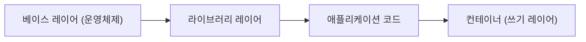

# Image와 Layer

## 이 글에서 다룰 문제

- 이미지는 왜 파일 묶음 하나가 아니라 여러 레이어로 나뉠까요?
- Dockerfile에서 명령 순서가 빌드 시간에 큰 차이를 만드는 이유는 무엇일까요?
- OverlayFS는 읽기 전용 레이어와 컨테이너 쓰기 레이어를 어떻게 겹쳐 보여 줄까요?
- `docker history`, digest, `RootFS.Layers`는 각각 무엇을 확인할 때 쓸까요?
- 레이어 캐시를 깨뜨리는 흔한 실수는 무엇일까요?

> Containers 101 시리즈 (2/10)

이미지를 처음 보면 단순한 압축 파일처럼 느껴집니다. 하지만 컨테이너 이미지는 그렇게 만들어지지 않습니다. 컨테이너 생태계는 이미지를 여러 레이어로 쪼개서 저장하고, 필요한 레이어만 다시 쓰고, 바뀐 부분만 전송하도록 설계됐습니다. 그래서 이미지를 이해하면 빌드 속도, 배포 시간, 캐시 효율, 최종 이미지 크기까지 한 번에 읽히기 시작합니다.

이 글에서는 이미지가 실제로 어떤 구조를 가지는지, 레이어가 왜 필요한지, 그리고 이 구조를 알면 Dockerfile을 어떻게 더 빠르고 더 작게 만들 수 있는지 입문자 관점에서 차근차근 설명하겠습니다.

> 레이어형 이미지는 재사용, 캐시, 전송 최적화를 한 번에 해결합니다. 컨테이너를 이해할 때 가장 먼저 잡아야 할 설계 중심축도 바로 여기입니다.

## 왜 중요한가

레이어를 모르면 Dockerfile을 사실상 운에 맡기게 됩니다. 코드 한 줄이 바뀌었는데 왜 전체 이미지가 다시 빌드되는지, 왜 어떤 빌드는 30초인데 어떤 빌드는 1분 넘게 걸리는지, 왜 같은 베이스 이미지를 쓰는 프로젝트끼리 다운로드 시간이 다른지 설명할 수 없기 때문입니다. 반대로 레이어 구조를 이해하면 빌드 캐시가 깨지는 지점과 유지되는 지점을 예측할 수 있습니다.

## 한눈에 보는 구조



이 그림에서 아래쪽 레이어일수록 더 안정적이고, 위쪽 레이어일수록 더 자주 바뀐다고 보면 이해가 쉽습니다. 운영체제와 런타임은 자주 바뀌지 않지만, 애플리케이션 코드는 훨씬 자주 바뀝니다. 그래서 빌드 시스템은 바뀌지 않은 아래 레이어를 다시 만들지 않고 그대로 재사용합니다.

## 핵심 용어

- 레이어: 변경 사항을 담는 읽기 전용 묶음입니다.
- 베이스 이미지: 가장 아래쪽에 놓이는 운영체제 또는 런타임 레이어입니다.
- OverlayFS: 여러 레이어를 한 파일시스템처럼 겹쳐 보여 주는 방식입니다.
- 매니페스트: 이미지가 어떤 레이어들로 구성되는지 가리키는 메타데이터입니다.
- digest: 이미지 내용을 해시로 고정한 불변 식별자입니다.

## Before / After

Before에서는 소스 한 줄이 바뀔 때마다 이미지를 처음부터 다시 굽는다고 생각합니다.

After에서는 바뀐 상위 레이어만 다시 빌드합니다. 그래서 시간이 분 단위에서 수십 초, 경우에 따라 몇 초로 줄어듭니다.

## 실습: 이미지 내부 들여다보기

### 1단계 — pull 후 검사

```python
import subprocess, json

def inspect(image):
    res = subprocess.run(
        ["docker", "image", "inspect", image],
        capture_output=True, text=True, check=True,
    )
    return json.loads(res.stdout)
```

이 함수는 이미지 메타데이터 전체를 읽어 옵니다. 실제 레이어 목록, 설정값, 루트 파일시스템 정보를 여기서 확인할 수 있습니다.

### 2단계 — 히스토리 확인

```python
def history(image):
    res = subprocess.run(
        ["docker", "history", "--no-trunc", image],
        capture_output=True, text=True, check=True,
    )
    return res.stdout
```

`docker history`는 각 레이어가 어떤 명령에서 생겼는지 추적할 때 가장 먼저 보는 도구입니다. Dockerfile을 바꾼 뒤 캐시가 어디서부터 무효화됐는지 읽을 때 특히 유용합니다.

### 3단계 — 레이어 해시 확인

```python
def layer_sizes(image):
    data = inspect(image)
    return [layer for layer in data[0]["RootFS"]["Layers"]]
```

함수 이름은 `layer_sizes`이지만 실제로는 `RootFS.Layers`에 기록된 레이어 해시 목록을 돌려줍니다. 즉, 이미지가 어떤 읽기 전용 레이어들로 구성되는지 확인하는 코드입니다.

### 4단계 — digest 확인

```python
def digest(image):
    return inspect(image)[0]["Id"]
```

digest는 태그보다 훨씬 믿을 만한 식별자입니다. 태그는 같은 이름이 다른 내용을 가리킬 수 있지만, digest는 내용이 같으면 같고 다르면 다릅니다.

### 5단계 — 두 빌드 비교

```python
def diff(a, b):
    return set(layer_sizes(a)) ^ set(layer_sizes(b))
```

이 비교는 두 이미지 사이에서 어떤 레이어가 달라졌는지 빠르게 확인할 때 쓸 수 있습니다. 캐시 전략을 점검할 때 가장 단순하면서도 효과적인 방법입니다.

## 이 코드에서 볼 점

- `RootFS.Layers`에는 실제 레이어 해시가 들어 있습니다.
- `history`를 보면 각 레이어 뒤에 어떤 명령이 있었는지 추적할 수 있습니다.
- digest는 태그가 아니라 내용 동일성을 기준으로 이미지를 확인하게 해 줍니다.

## 자주 하는 실수 5가지

1. RUN 명령을 너무 잘게 쪼개서 레이어 수만 늘립니다.
2. `COPY .`로 불필요한 파일까지 모두 이미지에 넣습니다.
3. `apt update`와 `apt install`을 분리해서 캐시를 불안정하게 만듭니다.
4. 빌드 산출물을 최종 런타임 이미지에 그대로 남깁니다.
5. `latest` 태그만 믿고 재현 가능성을 잃습니다.

## 실무에서는 이렇게 쓰입니다

실무에서는 멀티 스테이지 빌드를 기본 패턴처럼 사용합니다. 빌드 도구와 런타임을 분리해 최종 이미지를 작게 만들고, `.dockerignore`로 빌드 컨텍스트를 최소화해 불필요한 파일 전송을 막습니다. 배포 단계에서는 digest로 이미지를 고정해 같은 버전이 어디서나 같은 내용을 가리키도록 맞춥니다.

## 실무에서는 이렇게 생각한다

- 잘 바뀌지 않는 명령은 위쪽이 아니라 아래쪽, 즉 캐시를 오래 살릴 수 있는 위치에 둡니다.
- 멀티 스테이지 빌드는 선택이 아니라 기본값에 가깝습니다.
- `latest`는 편해 보여도 운영에서는 사고를 부르기 쉽습니다.
- `.dockerignore`는 Dockerfile만큼 중요합니다.
- 이미지 크기는 곧 전송 비용이자 공격 표면입니다.

## 체크리스트

- [ ] 멀티 스테이지 빌드를 사용하고 있습니다.
- [ ] `.dockerignore`가 있습니다.
- [ ] 프로덕션 배포에서 digest pinning을 사용합니다.
- [ ] 이미지 스캔을 켰습니다.

## 연습 문제

1. 레이어 캐시가 가장 자주 깨지는 이유를 한 줄로 설명해 보세요.
2. 멀티 스테이지 빌드가 특히 유리한 상황을 하나 적어 보세요.
3. 태그와 digest의 차이를 한 줄로 설명해 보세요.

## 정리 및 다음 단계

이미지는 컨테이너의 템플릿이지만, 그 템플릿이 왜 빠르고 재사용 가능하게 설계됐는지는 레이어 구조를 봐야 이해됩니다. 이제 이미지가 어떻게 쌓이는지 봤으니, 다음에는 그 이미지를 실제로 실행하는 주체를 보겠습니다. 다음 글은 Runtime입니다.

<!-- toc:begin -->
- [Container란 무엇인가?](./01-what-is-a-container.md)
- **Image와 Layer (현재 글)**
- Runtime (예정)
- Dockerfile (예정)
- Volume (예정)
- Network (예정)
- Registry (예정)
- Container Security (예정)
- Container와 VM 차이 (예정)
- 실전 컨테이너 앱 만들기 (예정)
<!-- toc:end -->

## 참고 자료

- [Docker — about storage drivers](https://docs.docker.com/storage/storagedriver/)
- [OverlayFS](https://docs.kernel.org/filesystems/overlayfs.html)
- [OCI Image Spec — manifest](https://github.com/opencontainers/image-spec/blob/main/manifest.md)
- [Multi-stage builds](https://docs.docker.com/build/building/multi-stage/)

Tags: Containers, Docker, Image, Layer, DevOps
