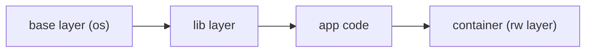

# Image와 Layer

> Containers 101 시리즈 (2/10)


## 이 글에서 다룰 문제

*레이어* 를 *모르면* *Dockerfile 최적화* 도 *없습니다*. *빌드 1분 vs 30초* 가 여기서 갈립니다.

## 개념 한눈에 보기



## Before/After

**Before**: *변경 한 줄* 로 *전체 이미지* 재빌드.

**After**: *상위 레이어* 만 다시 빌드 → *수십 초*.

## 실습: 레이어 들여다 보기

### 1단계 — pull 후 검사

```python
import subprocess, json

def inspect(image):
    res = subprocess.run(
        ["docker", "image", "inspect", image],
        capture_output=True, text=True, check=True,
    )
    return json.loads(res.stdout)
```

### 2단계 — 히스토리

```python
def history(image):
    res = subprocess.run(
        ["docker", "history", "--no-trunc", image],
        capture_output=True, text=True, check=True,
    )
    return res.stdout
```

### 3단계 — 레이어별 크기 합산

```python
def layer_sizes(image):
    data = inspect(image)
    return [layer for layer in data[0]["RootFS"]["Layers"]]
```

### 4단계 — Digest 확인

```python
def digest(image):
    return inspect(image)[0]["Id"]
```

### 5단계 — 비교 (Before/After 빌드)

```python
def diff(a, b):
    return set(layer_sizes(a)) ^ set(layer_sizes(b))
```

## 이 코드에서 주목할 점

- *RootFS.Layers* 가 실제 *레이어 해시*.
- *history* 로 *각 레이어* 의 *명령* 추적.
- *Digest* 로 *동일성* 보장.

## 자주 하는 실수 5가지

1. ***모든 명령* 을 *한 RUN* 에 묶지 않음 → *레이어 폭증*.**
2. ***COPY .* 가 *불필요한 파일* 까지 포함.**
3. ***apt update* 와 *install* 분리 → *캐시 무효*.**
4. ***대용량 빌드 결과물* 을 *최종 이미지* 에 포함.**
5. ***태그 latest* 로 *재현성* 상실.**

## 실무에서는 이렇게 쓰입니다

*Multi-stage build* 로 *빌드 도구* 와 *런타임* 분리, *.dockerignore* 로 *전송 최소화*, *digest 핀* 으로 *재현성* 확보.

## 체크리스트

- [ ] *Multi-stage* 적용.
- [ ] *.dockerignore* 존재.
- [ ] *Digest 핀* 사용.
- [ ] *이미지 스캔* 도입.

## 정리 및 다음 단계

이미지가 *어떻게 구성* 되는지 봤으니 *무엇이 실행* 하는지를 봐야 합니다. 다음 글은 *Runtime*.

<!-- toc:begin -->
- [Container란 무엇인가?](./01-what-is-a-container.md)
- **Image와 Layer (현재 글)**
- Runtime (예정)
- Dockerfile (예정)
- Volume (예정)
- Network (예정)
- Registry (예정)
- Container Security (예정)
- Container와 VM 차이 (예정)
- 실전 컨테이너 앱 만들기 (예정)
<!-- toc:end -->

## 참고 자료

- [Docker — about storage drivers](https://docs.docker.com/storage/storagedriver/)
- [OverlayFS](https://docs.kernel.org/filesystems/overlayfs.html)
- [OCI Image Spec — manifest](https://github.com/opencontainers/image-spec/blob/main/manifest.md)
- [Multi-stage builds](https://docs.docker.com/build/building/multi-stage/)

Tags: Containers, Docker, Image, Layer, DevOps
