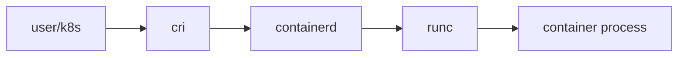

# Runtime

> Containers 101 시리즈 (3/10)


## 이 글에서 다룰 문제

Kubernetes 1.24부터 dockershim이 제거되었습니다. 런타임 계층을 이해해야 디버깅 포인트를 제대로 잡을 수 있습니다.

## 전체 흐름


## Before/After

**Before**: Docker만 알면 충분하다고 생각합니다.

**After**: containerd, runc, CRI의 역할을 구분해서 봅니다.

## containerd 직접 다루기

### 1단계 — 클라이언트 (의사 코드)

```python
import subprocess

def ctr_version():
    res = subprocess.run(["ctr", "version"], capture_output=True, text=True)
    return res.stdout
```

### 2단계 — 이미지 pull

```python
def ctr_pull(image):
    subprocess.run(["ctr", "image", "pull", image], check=True)
```

### 3단계 — 컨테이너 만들기

```python
def ctr_run(image, name):
    subprocess.run(
        ["ctr", "run", "-d", image, name],
        check=True,
    )
```

### 4단계 — 목록

```python
def ctr_list():
    res = subprocess.run(["ctr", "containers", "ls"], capture_output=True, text=True)
    return res.stdout
```

### 5단계 — 정리

```python
def ctr_kill(name):
    subprocess.run(["ctr", "task", "kill", name])
    subprocess.run(["ctr", "container", "rm", name])
```

## 이 코드에서 주목할 점

- `ctr`는 containerd를 직접 들여다볼 때 쓰는 디버그용 CLI입니다.
- `task`와 `container`는 분리된 개념입니다.
- Kubernetes 환경에서는 `crictl`을 함께 이해해야 합니다.

## 자주 하는 실수 5가지

1. **Docker만 익히고 containerd 계층을 무시합니다.**
2. **Kubernetes 노드에서 docker CLI로만 디버깅하려고 합니다.**
3. **런타임 버전과 호스트 OS의 조합을 점검하지 않습니다.**
4. **rootless 런타임 옵션을 검토하지 않습니다.**
5. **runc의 seccomp 기본값을 모르고 지나갑니다.**

## 실무에서는 이렇게 쓰입니다

Kubernetes 노드는 containerd를 많이 쓰고, 디버깅은 crictl로 하며, 로컬 개발은 Docker Desktop을 쓰는 식으로 환경마다 도구가 달라집니다.

## 체크리스트

- [ ] containerd와 runc의 차이를 설명할 수 있습니다.
- [ ] CRI의 역할을 이해했습니다.
- [ ] crictl 도구의 용도를 알고 있습니다.
- [ ] OCI 표준의 위치를 알고 있습니다.

## 정리 및 다음 단계

런타임이 이미지를 실행하려면 먼저 이미지를 만드는 방법을 알아야 합니다. 다음 글은 Dockerfile입니다.

<!-- toc:begin -->
- [Container란 무엇인가?](./01-what-is-a-container.md)
- [Image와 Layer](./02-image-and-layer.md)
- **Runtime (현재 글)**
- Dockerfile (예정)
- Volume (예정)
- Network (예정)
- Registry (예정)
- Container Security (예정)
- Container와 VM 차이 (예정)
- 실전 컨테이너 앱 만들기 (예정)
<!-- toc:end -->

## 참고 자료

- [containerd 공식 문서](https://containerd.io/docs/)
- [runc 저장소](https://github.com/opencontainers/runc)
- [Kubernetes CRI](https://kubernetes.io/docs/concepts/architecture/cri/)
- [OCI 표준](https://opencontainers.org/)

Tags: Containers, Runtime, containerd, runc, DevOps
