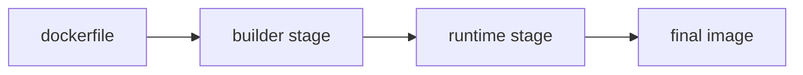

# Dockerfile

> Containers 101 시리즈 (4/10)


## 이 글에서 다룰 문제

*Dockerfile* 은 *팀 전체* 의 *생산성* 과 *보안* 을 *직접* 결정합니다. *제대로 한 번* 쓰면 *수년* 을 갑니다.

## 전체 흐름


## Before/After

**Before**: *단일 단계* 빌드 → *900MB* 이미지.

**After**: *multi-stage* + *slim* 베이스 → *80MB*.

## Python 앱 Dockerfile (의사 텍스트)

### 1단계 — 베이스 선택

```python
def base_stage():
    return [
        "FROM python:3.12-slim AS builder",
        "WORKDIR /app",
    ]
```

### 2단계 — 의존성 먼저

```python
def deps_stage():
    return [
        "COPY requirements.txt .",
        "RUN pip install --user -r requirements.txt",
    ]
```

### 3단계 — 코드 복사

```python
def code_stage():
    return [
        "COPY . .",
    ]
```

### 4단계 — 런타임 단계

```python
def runtime_stage():
    return [
        "FROM python:3.12-slim",
        "WORKDIR /app",
        "COPY --from=builder /root/.local /root/.local",
        "COPY --from=builder /app .",
        "ENV PATH=/root/.local/bin:$PATH",
    ]
```

### 5단계 — 비루트 + 실행

```python
def finalize():
    return [
        "RUN useradd -m app && chown -R app:app /app",
        "USER app",
        "CMD [\"python\", \"main.py\"]",
    ]
```

## 이 코드에서 주목할 점

- *requirements.txt* 를 *코드보다 먼저* 복사 → *캐시*.
- *--from=builder* 로 *이전 단계* 결과 복사.
- *USER app* 으로 *root 회피*.

## 자주 하는 실수 5가지

1. ***COPY .* 를 *먼저* 해서 *캐시 무효*.**
2. ***apt update* 만 단독 실행 → *오래된 캐시*.**
3. ***루트* 로 실행.**
4. ***ENV* 에 *비밀* 저장.**
5. ***LATEST* 베이스 이미지 사용.**

## 실무에서는 이렇게 쓰입니다

*Multi-stage* 로 *빌드 도구* 분리, *.dockerignore* 로 *전송 최소화*, *digest 핀* 으로 *재현성*, *비루트* 사용자.

## 체크리스트

- [ ] *Multi-stage* 적용.
- [ ] *.dockerignore* 작성.
- [ ] *비루트* 사용자.
- [ ] *digest 핀* 사용.

## 정리 및 다음 단계

이미지가 만들어지면 *데이터* 를 어디 둘지가 다음 문제. 다음 글은 *Volume*.

<!-- toc:begin -->
- [Container란 무엇인가?](./01-what-is-a-container.md)
- [Image와 Layer](./02-image-and-layer.md)
- [Runtime](./03-runtime.md)
- **Dockerfile (현재 글)**
- Volume (예정)
- Network (예정)
- Registry (예정)
- Container Security (예정)
- Container와 VM 차이 (예정)
- 실전 컨테이너 앱 만들기 (예정)
<!-- toc:end -->

## 참고 자료

- [Dockerfile 레퍼런스](https://docs.docker.com/engine/reference/builder/)
- [Multi-stage builds](https://docs.docker.com/build/building/multi-stage/)
- [Dockerfile 모범 사례](https://docs.docker.com/develop/develop-images/dockerfile_best-practices/)
- [BuildKit secrets](https://docs.docker.com/build/building/secrets/)

Tags: Containers, Docker, Dockerfile, Build, DevOps
