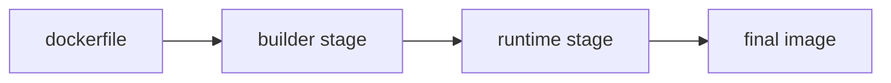

# Dockerfile

> Containers 101 시리즈 (4/10)


## 이 글에서 다룰 문제

Dockerfile은 팀 전체의 생산성과 보안 수준에 직접 영향을 줍니다. 한 번 제대로 정리해 두면 오랫동안 재사용할 수 있습니다.

## 전체 흐름


## Before/After

**Before**: 단일 단계 빌드라서 이미지가 900MB까지 커집니다.

**After**: multi-stage와 slim 베이스를 써서 80MB 수준으로 줄입니다.

## Python 앱 Dockerfile (의사 텍스트)

### 1단계 — 베이스 선택

```python
def base_stage():
    return [
        "FROM python:3.12-slim AS builder",
        "WORKDIR /app",
    ]
```

### 2단계 — 의존성 먼저

```python
def deps_stage():
    return [
        "COPY requirements.txt .",
        "RUN pip install --user -r requirements.txt",
    ]
```

### 3단계 — 코드 복사

```python
def code_stage():
    return [
        "COPY . .",
    ]
```

### 4단계 — 런타임 단계

```python
def runtime_stage():
    return [
        "FROM python:3.12-slim",
        "WORKDIR /app",
        "COPY --from=builder /root/.local /root/.local",
        "COPY --from=builder /app .",
        "ENV PATH=/root/.local/bin:$PATH",
    ]
```

### 5단계 — 비루트 + 실행

```python
def finalize():
    return [
        "RUN useradd -m app && chown -R app:app /app",
        "USER app",
        "CMD [\"python\", \"main.py\"]",
    ]
```

## 이 코드에서 주목할 점

- `requirements.txt`를 코드보다 먼저 복사하면 빌드 캐시를 더 오래 활용할 수 있습니다.
- `--from=builder`로 이전 단계 결과만 골라서 가져옵니다.
- `USER app`으로 root 실행을 피합니다.

## 자주 하는 실수 5가지

1. **`COPY . .`를 먼저 실행해서 캐시를 불필요하게 깨뜨립니다.**
2. **`apt update`만 따로 실행해서 오래된 캐시를 남깁니다.**
3. **루트 사용자로 그대로 실행합니다.**
4. **`ENV`에 비밀 값을 직접 넣습니다.**
5. **`latest` 태그만 믿고 베이스 이미지를 고정하지 않습니다.**

## 실무에서는 이렇게 쓰입니다

실무에서는 multi-stage로 빌드 도구를 분리하고, `.dockerignore`로 전송량을 줄이며, digest 핀으로 재현성을 높이고, 비루트 사용자로 실행합니다.

## 체크리스트

- [ ] multi-stage 빌드를 적용했습니다.
- [ ] `.dockerignore`를 작성했습니다.
- [ ] 비루트 사용자를 적용했습니다.
- [ ] digest 핀을 사용했습니다.

## 정리 및 다음 단계

이미지가 만들어지면 다음에는 데이터를 어디 둘지 결정해야 합니다. 다음 글은 Volume입니다.

<!-- toc:begin -->
- [Container란 무엇인가?](./01-what-is-a-container.md)
- [Image와 Layer](./02-image-and-layer.md)
- [Runtime](./03-runtime.md)
- **Dockerfile (현재 글)**
- Volume (예정)
- Network (예정)
- Registry (예정)
- Container Security (예정)
- Container와 VM 차이 (예정)
- 실전 컨테이너 앱 만들기 (예정)
<!-- toc:end -->

## 참고 자료

- [Dockerfile 레퍼런스](https://docs.docker.com/engine/reference/builder/)
- [Multi-stage builds](https://docs.docker.com/build/building/multi-stage/)
- [Dockerfile 모범 사례](https://docs.docker.com/develop/develop-images/dockerfile_best-practices/)
- [BuildKit secrets](https://docs.docker.com/build/building/secrets/)

Tags: Containers, Docker, Dockerfile, Build, DevOps
