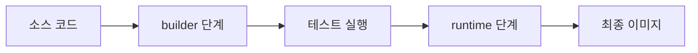

# Containers 101 (4/10): Dockerfile

이 글은 Containers 101 시리즈의 네 번째 글입니다.

Dockerfile은 단순히 이미지가 빌드되도록 만드는 텍스트 파일이 아닙니다. 명령 순서 하나가 캐시 적중률을 바꾸고, 베이스 이미지 선택 하나가 취약점 수와 전송 크기를 바꾸며, 실행 사용자 설정 하나가 기본 보안 수준을 바꿉니다.

여기서는 캐시 친화적인 작성 순서, multi-stage build, 비root 실행, 비밀값 처리 같은 운영 기본값을 실제 Dockerfile 설계 관점에서 정리합니다.

## 먼저 던지는 질문

- Dockerfile의 명령 순서는 왜 그렇게 중요할까요?
- 캐시 친화적인 작성 방식은 빌드 시간을 어떻게 바꿀까요?
- multi-stage build는 어떤 문제를 해결할까요?

## 큰 그림


*Containers 101 4장 흐름 개요*

Dockerfile은 한 줄 한 줄이 하나의 레이어 명령이 되고, 빌드 캐시 전략은 이 순서에 완전히 달려 있습니다. 무엇을 앞에 쓰고 무엇을 뒤에 쓰는지가 빌드 시간을 정합니다.

> Dockerfile의 핵심은 명령 개수가 아니라 어느 명령까지 캐시할 수 있고, 어느 명령에서 캐시가 무효화되는지입니다.

## 왜 중요한가

Dockerfile 하나가 팀의 생산성과 보안 수준을 동시에 좌우합니다. 한 번 제대로 작성해 두면 빌드 시간, 이미지 크기, 취약점 노출 면적, 온보딩 비용까지 장기간 영향을 받습니다.

같은 애플리케이션이라도 Dockerfile이 다르면 결과는 크게 달라집니다. 어떤 이미지는 900MB가 넘고 빌드도 느리지만, 어떤 이미지는 slim 베이스와 multi-stage 덕분에 100MB 아래로 작아지고 훨씬 빨리 빌드됩니다. 이 차이는 애플리케이션 코드보다 Dockerfile 구조에서 먼저 나옵니다.

## 한눈에 보는 개념

빌드용 스테이지와 실행용 스테이지를 분리하면, 최종 이미지는 필요한 결과물만 포함하고 불필요한 도구는 버릴 수 있습니다.

아래는 단일 스테이지와 멀티스테이지의 차이를 한눈에 보여 줍니다.

```text
[ 단일 스테이지 ]
  FROM python:3.12
  → apt, gcc, pip, wheel, 소스, 테스트 도구 전부 포함
  → 최종 이미지 약 900MB

[ 멀티스테이지 ]
  Stage 1 (builder): pip wheel + pytest → 산출물만 추출
  Stage 2 (runtime): python:3.12-slim + 산출물만 복사
  → 최종 이미지 약 80MB
```

이 구조를 채택하면 이미지 크기뿐 아니라 CVE 스캔 결과도 극적으로 달라집니다. 불필요한 패키지가 없으면 취약점 노출 면적 자체가 줄어들기 때문입니다.

빌드 캐시는 Dockerfile 명령 순서에 의존합니다. Docker는 각 명령의 입력(명령 텍스트 + COPY 대상 파일의 체크섬)이 이전 빌드와 동일하면 해당 레이어를 재사용합니다. 따라서 변경 빈도가 낮은 명령을 위에, 자주 바뀌는 명령을 아래에 놓는 것이 핵심 원칙입니다.

## 핵심 용어

- **FROM**: 베이스 이미지를 지정합니다.
- **WORKDIR**: 이후 명령이 실행될 작업 디렉터리를 정합니다.
- **COPY/ADD**: 파일을 이미지 안으로 복사합니다.
- **RUN**: 빌드 시점 명령을 실행합니다.
- **CMD/ENTRYPOINT**: 컨테이너 실행 시 기본 명령을 정의합니다.

이 명령들은 문법만 외우는 것으로 끝나지 않습니다. 어느 순서에 놓는지가 캐시 효율과 이미지 구조를 결정합니다.

## 적용 전후

**Before — 단일 스테이지, 순서 무시**

```dockerfile
FROM python:3.12
COPY . /app
WORKDIR /app
RUN apt-get update && apt-get install -y gcc
RUN pip install -r requirements.txt
CMD ["python", "main.py"]
```

문제점:
- 소스를 먼저 복사하므로 코드 한 줄 수정 시 의존성도 다시 설치됩니다.
- gcc 등 빌드 도구가 최종 이미지에 남아 크기가 900MB를 넘습니다.
- root로 실행되어 컨테이너 탈출 시 호스트 권한 확대 위험이 있습니다.

**After — 멀티스테이지, 캐시 친화 순서**

```dockerfile
# Stage 1: build
FROM python:3.12-slim AS builder
WORKDIR /build
COPY requirements.txt .
RUN pip install --no-cache-dir --prefix=/install -r requirements.txt
COPY . .
RUN pytest -q

# Stage 2: runtime
FROM python:3.12-slim
WORKDIR /app
COPY --from=builder /install /usr/local
COPY --from=builder /build/app ./app
RUN useradd -m app && chown -R app:app /app
USER app
EXPOSE 8000
CMD ["python", "-m", "app.main"]
```

개선 효과:
- 의존성 파일을 먼저 복사 → 코드 변경 시 의존성 레이어 캐시 재사용
- 빌드 도구가 최종 이미지에 포함되지 않음 → 80MB 이하
- 비root 실행 → 컨테이너 보안 기본값 확보
- 빌드 단계에서 테스트 실행 → 깨진 코드가 이미지로 만들어지지 않음

결국 Dockerfile 최적화는 취향 문제가 아니라 빌드 시간과 배포 비용을 줄이는 구조적 개선입니다.

## 실습: Python 앱 Dockerfile 구성하기

### 단계 1 — Base

```python
def base_stage():
    return [
        "FROM python:3.12-slim AS builder",
        "WORKDIR /app",
    ]
```

빌드 스테이지의 출발점을 정의합니다. 어떤 베이스 이미지를 고르느냐가 최종 이미지 크기와 취약점 표면에 직접 영향을 줍니다.

### 단계 2 — Dependencies first

```python
def deps_stage():
    return [
        "COPY requirements.txt .",
        "RUN pip install --user -r requirements.txt",
    ]
```

의존성 파일을 코드보다 먼저 복사하는 이유는 캐시를 최대한 살리기 위해서입니다. 실제 현업에서 빌드 시간을 줄이는 가장 기본적인 패턴입니다.

### 단계 3 — Code

```python
def code_stage():
    return [
        "COPY . .",
    ]
```

의존성 설치가 끝난 뒤에야 애플리케이션 코드를 복사합니다. 자주 바뀌는 레이어를 위로 올리는 전형적인 캐시 전략입니다.

### 단계 4 — Runtime stage

```python
def runtime_stage():
    return [
        "FROM python:3.12-slim",
        "WORKDIR /app",
        "COPY --from=builder /root/.local /root/.local",
        "COPY --from=builder /app .",
        "ENV PATH=/root/.local/bin:$PATH",
    ]
```

최종 스테이지는 실행에 필요한 결과만 가져옵니다. 빌드 도구를 남기지 않는 것이 multi-stage의 핵심입니다.

### 단계 5 — Non-root and run

```python
def finalize():
    return [
        "RUN useradd -m app && chown -R app:app /app",
        "USER app",
        "CMD [\"python\", \"main.py\"]",
    ]
```

마지막 단계에서 비root 사용자로 전환합니다. 보안은 나중에 덧붙이는 옵션이 아니라 Dockerfile 안에서 기본값으로 잡아야 합니다.

## 이 코드에서 먼저 봐야 할 점

- `requirements.txt`를 코드보다 먼저 복사해야 캐시가 살아납니다.
- `--from=builder`는 이전 스테이지의 결과만 가져옵니다.
- `USER app`은 root 실행을 피하게 해 줍니다.

이 세 가지를 이해하면 작은 Dockerfile에서도 성능, 크기, 보안을 함께 개선할 수 있습니다. 실무에서는 이 세 지점이 리뷰의 기본 체크포인트가 됩니다.

## 빠른 검증과 장애 신호

```bash
docker build -t demo-app:dev .
docker image inspect demo-app:dev --format "user={{.Config.User}} size={{.Size}}"
```

**Expected output:**
- 의존성 레이어가 소스 코드 레이어보다 먼저 배치됩니다.
- `Config.User`가 비어 있지 않으면 비root 기본값이 들어간 상태입니다.

**먼저 확인할 것:**
- 의존성이 매번 다시 깔리면 `COPY requirements.txt` 위치를 먼저 봅니다.
- root로 뜨면 `USER`가 최종 스테이지에 있는지 확인합니다.
- 이미지가 크면 빌드 도구가 최종 스테이지에 남았는지 점검합니다.

## 자주 하는 실수 5가지

1. **`COPY .`를 너무 먼저 써서 캐시를 죽입니다.**
   - 소스 파일이 바뀔 때마다 의존성 설치까지 다시 실행됩니다. CI에서 매번 5분씩 빌드가 걸리는 원인의 대부분이 이것입니다.

2. **`apt update`를 따로 실행해 오래된 캐시를 남깁니다.**
   - `RUN apt-get update`와 `RUN apt-get install`을 분리하면, update 레이어가 캐시된 채로 install이 실패할 수 있습니다. 항상 한 RUN에서 update + install + 정리를 끝냅니다.

3. **컨테이너를 root로 실행합니다.**
   - 취약점이 발견되면 공격자가 root 권한으로 호스트 파일시스템에 접근할 수 있습니다. `USER` 명령을 누락하면 기본값이 root입니다.

4. **비밀값을 `ENV`에 직접 넣습니다.**
   - `docker history`로 누구나 값을 볼 수 있습니다. BuildKit `--mount=type=secret`을 사용하거나 런타임에 환경 변수로 주입해야 합니다.

5. **베이스 이미지를 `latest`로 둡니다.**
   - 어제 동작하던 빌드가 오늘 깨질 수 있습니다. 운영에서는 `python:3.12.3-slim@sha256:...`처럼 digest까지 고정합니다.

이 다섯 가지는 초반에는 사소해 보여도 운영에서는 반복 비용으로 돌아옵니다. 느린 빌드, 큰 이미지, 취약점 노출, 재현성 저하가 모두 여기서 시작됩니다.

## 운영에서는 이렇게 나타납니다

운영 환경에서는 multi-stage로 빌드 도구를 분리하고, `.dockerignore`로 build context를 줄이며, digest pin으로 재현성을 확보합니다. 컨테이너는 비root 사용자로 실행되고, 이미지 스캔은 CI 파이프라인의 일부가 됩니다.

아래는 실제 CI 파이프라인에서 Dockerfile 품질을 강제하는 흐름입니다.

```text
PR 생성 → Lint (hadolint) → Build → Scan (trivy) → Size 체크 → 테스트 → Merge
```

각 단계에서 확인하는 항목:

| 단계 | 도구 | 실패 조건 |
| --- | --- | --- |
| Lint | hadolint | DL3008(버전 미고정), DL3002(root 실행) |
| Build | docker build | 빌드 실패, 테스트 실패 |
| Scan | trivy, grype | Critical/High 취약점 발견 |
| Size | 스크립트 | 이전 대비 20% 이상 증가 |

```bash
# hadolint 예시
hadolint Dockerfile

# trivy 스캔 예시
trivy image --severity HIGH,CRITICAL myapp:test

# 이미지 크기 비교
PREV=$(docker image inspect myapp:prod --format '{{.Size}}')
CURR=$(docker image inspect myapp:test --format '{{.Size}}')
echo "이전: $PREV → 현재: $CURR"
```

이 파이프라인이 자리 잡으면 Dockerfile 품질이 개인 역량에 의존하지 않고 시스템으로 강제됩니다. 즉, 좋은 Dockerfile은 개발 편의를 넘어서 운영 기본 정책을 담는 문서입니다.

## 시니어 엔지니어는 이렇게 생각합니다

- Dockerfile도 애플리케이션 코드처럼 리뷰합니다.
- 캐시 친화적인 순서는 곧 팀 생산성이라고 봅니다.
- 비밀값은 ENV가 아니라 build arg나 BuildKit secret 같은 별도 경로로 다룹니다.
- 베이스 이미지는 작고 검증된 것을 선택합니다.
- 이미지 스캔은 선택이 아니라 CI 기본 단계로 봅니다.

### Dockerfile 리뷰에서 묻는 질문

시니어 엔지니어가 PR에서 Dockerfile을 볼 때 던지는 질문은 정해져 있습니다.

1. **캐시**: 코드 한 줄 고쳤을 때 몇 번째 레이어부터 다시 빌드되는가?
2. **크기**: final stage에 빌드 도구나 테스트 코드가 남아 있지 않은가?
3. **보안**: root로 실행되는가? ENV에 시크릿이 있는가?
4. **재현성**: 베이스 이미지가 태그 대신 digest로 고정되어 있는가?
5. **관찰성**: HEALTHCHECK가 있는가? 로그는 stdout으로 나오는가?

```bash
# 리뷰 시 빠른 확인 명령
docker build -t review-target .
docker history review-target --no-trunc | head -20
docker image inspect review-target --format '{{.Config.User}}'
docker image inspect review-target --format '{{.Config.Healthcheck}}'
```

시니어 엔지니어는 Dockerfile을 "빌드가 되면 끝"으로 보지 않습니다. 시간이 지나도 빠르고 안전하게 유지되는가를 기준으로 봅니다.

## 체크리스트

- [ ] multi-stage build를 사용합니다.
- [ ] `.dockerignore`를 작성했습니다.
- [ ] 비root 사용자로 실행합니다.
- [ ] 운영에서는 digest pin을 사용합니다.

## 연습 문제

1. 왜 `COPY requirements.txt`가 `COPY .`보다 먼저 와야 하는지 한 줄로 설명해 보세요.
2. multi-stage build의 대표 장점을 하나 적어 보세요.
3. Dockerfile에서 비밀값을 안전하게 다루는 방법 하나를 제안해 보세요.

## 정리와 다음 글

Dockerfile은 이미지 빌드 결과를 규정하는 핵심 설계 문서입니다. 명령 순서, 캐시 전략, multi-stage, 비root 실행이라는 네 가지 축을 잡으면 작은 앱도 훨씬 더 운영 친화적으로 만들 수 있습니다.

실무에서는 이 네 가지에 `.dockerignore`, 태그 전략, CI 스캔을 더해야 완전한 Dockerfile 운영 체계가 됩니다. 한 사람이 잘 쓰는 것보다 팀 전체가 같은 템플릿을 쓰는 것이 장기적으로 더 큰 효과를 냅니다.

다음 글에서는 이미지가 아니라 상태를 어디에 둘 것인지, 즉 Volume 설계를 살펴보겠습니다.


## 심화: 멀티스테이지 Dockerfile을 운영 표준으로 만드는 방법

Dockerfile을 잘 작성하는 팀과 그렇지 않은 팀의 차이는 문법 지식이 아니라 기본 템플릿의 유무에서 갈립니다. 개인이 매번 처음부터 작성하면 품질 편차가 커지고, 결과적으로 빌드 시간과 보안 수준이 일정하지 않게 됩니다. 따라서 팀 단위로는 "권장 Dockerfile 템플릿"과 "리뷰 체크리스트"를 함께 운영해야 합니다.

아래 예시는 Python 서비스용 운영 템플릿입니다.

```dockerfile
FROM python:3.12-slim AS builder
WORKDIR /build
COPY requirements.txt .
RUN pip install --upgrade pip && pip wheel --wheel-dir /wheels -r requirements.txt
COPY . .
RUN pip wheel --wheel-dir /wheels .

FROM python:3.12-slim
WORKDIR /app
COPY --from=builder /wheels /wheels
RUN pip install --no-cache-dir /wheels/* && rm -rf /wheels
COPY app ./app
RUN useradd -m app && chown -R app:app /app
USER app
ENV PYTHONUNBUFFERED=1
CMD ["python", "-m", "app.main"]
```

## 레이어 캐싱 전략을 Dockerfile 규칙으로 고정하기

다음 규칙을 팀 규약으로 고정하면 캐시 효율이 크게 안정됩니다.

1. 의존성 파일(`requirements.txt`, `poetry.lock`)을 소스보다 먼저 복사합니다.
2. `COPY . .`는 최대한 뒤로 보냅니다.
3. OS 패키지 설치는 하나의 RUN에서 정리까지 끝냅니다.
4. 빌드 전용 도구는 final stage에 남기지 않습니다.

예시:

```dockerfile
RUN apt-get update && apt-get install -y --no-install-recommends curl   && rm -rf /var/lib/apt/lists/*
```

이 패턴은 레이어 크기를 줄이고 취약점 스캔 노이즈도 낮춥니다.

## BuildKit과 비밀값 처리

실무에서 흔한 실수는 토큰이나 패스워드를 `ENV` 또는 `ARG`에 직접 넣는 것입니다. 빌드 히스토리나 이미지 레이어에 흔적이 남을 수 있으므로 권장되지 않습니다. BuildKit secret mount를 사용하면 흔적을 줄일 수 있습니다.

```bash
DOCKER_BUILDKIT=1 docker build   --secret id=pipconf,src=$HOME/.pip/pip.conf   -t myapp:secure .
```

Dockerfile:

```dockerfile
RUN --mount=type=secret,id=pipconf,target=/etc/pip.conf     pip install --no-cache-dir -r requirements.txt
```

## 팀 리뷰 체크리스트

| 점검 항목 | Pass 기준 |
| --- | --- |
| 멀티스테이지 사용 | builder/runtime 분리 |
| 비root 실행 | `USER` 명시 |
| 캐시 친화 순서 | deps 먼저, code 나중 |
| 비밀값 처리 | ENV 직접 주입 없음 |
| 이미지 크기 | 이전 버전 대비 증가 원인 설명 |

리뷰에서 이 체크리스트를 통과하지 못하면 병합하지 않는 규칙을 두면, Dockerfile 품질이 조직 차원에서 유지됩니다.

## 배포 안정성을 높이는 태그 전략

Dockerfile 품질과 함께 태그 전략도 중요합니다.

- 개발: `myapp:dev-<gitsha>`
- 스테이징: `myapp:stg-<gitsha>`
- 운영: digest pin(`myapp@sha256:...`)

운영에서는 태그보다 digest를 기준으로 배포해야 재현성을 보장할 수 있습니다.


## 추가 실무 노트: 빌드 실패를 줄이는 Dockerfile 운영 규칙

빌드 실패의 많은 부분은 Dockerfile 자체보다 입력 아티팩트의 불안정성에서 옵니다. 따라서 Dockerfile과 함께 다음 규칙을 묶어야 합니다.

- lock file 필수(requirements.txt, poetry.lock)
- base image 버전 고정(`python:3.12.3-slim`)
- 빌드 컨텍스트 크기 제한(예: 50MB 이하)
- CI에서 이미지 크기 회귀 검사

```bash
docker build -t myapp:test .
docker image inspect myapp:test --format '{{.Size}}'
```

이미지 크기와 빌드 시간을 매 릴리스에서 기록하면 성능 퇴화를 조기에 발견할 수 있습니다.


## 추가 정리: 운영 적용 전 최종 점검 질문

아래 질문은 도구 지식이 아니라 운영 준비도를 확인하기 위한 질문입니다. 각 질문에 문서와 명령으로 답할 수 있어야 실제 팀 운영에서 반복 가능한 품질을 만들 수 있습니다.

1. 이 구성은 새 팀원이 같은 절차로 재현할 수 있는가?
2. 실패했을 때 어디서 원인을 확인해야 하는지 런북이 있는가?
3. 보안 기본값(root 금지, 최소 권한, 시크릿 분리)이 강제되는가?
4. 버전과 아티팩트 동일성(digest, lock file)이 보장되는가?
5. 데이터/네트워크/권한 경계가 문서로 정의되어 있는가?

다음은 공통 점검 명령 예시입니다.

```bash
# 아티팩트 동일성
docker inspect --format '{{index .RepoDigests 0}}' <image>

# 실행 상태
docker ps --format 'table {{.Names}}	{{.Status}}	{{.Ports}}'

# 로그 관측
docker logs --tail 100 <container>

# 네트워크/볼륨 구조
docker network ls
docker volume ls
```

이 명령 자체가 중요한 것이 아니라, 팀이 같은 순서로 문제를 좁혀 가는 절차를 공유한다는 점이 중요합니다. 컨테이너 운영의 성숙도는 개인의 숙련도보다 팀의 표준화 수준에서 결정됩니다. 따라서 시리즈 학습의 최종 목표는 기능 이해가 아니라 운영 계약의 명문화입니다.

## 실무 확장: 멀티스테이지 빌드를 팀 표준으로 만드는 법

Dockerfile은 앱 실행법을 적는 파일이면서 동시에 빌드 파이프라인의 계약 문서입니다. 그래서 파일 한 장에 개발 편의와 운영 안정성을 함께 담아야 합니다.

### 표준 멀티스테이지 예시

```dockerfile
FROM python:3.12-slim AS builder
WORKDIR /src
COPY requirements.txt .
RUN pip install --no-cache-dir --prefix=/install -r requirements.txt
COPY . .
RUN pytest -q

FROM python:3.12-slim AS runtime
WORKDIR /app
COPY --from=builder /install /usr/local
COPY --from=builder /src/app /app
USER 10001:10001
EXPOSE 8000
CMD ["python", "main.py"]
```

빌드 단계에서 테스트를 수행하고 런타임 단계에는 필요한 산출물만 복사하면 이미지 크기와 공격 표면이 동시에 줄어듭니다.

### 캐시 친화적 순서

- 변경이 적은 파일(`requirements.txt`)을 먼저 복사합니다.
- 의존성 설치를 코드 복사보다 앞에 둡니다.
- 변경이 잦은 앱 코드는 마지막에 복사합니다.

이 순서를 지키면 코드 한 줄 수정 시 의존성 레이어를 재사용할 가능성이 커집니다.

### Compose와 Dockerfile 계약 맞추기

```yaml
services:
  api:
    build:
      context: .
      target: runtime
    ports:
      - "8000:8000"
```

Compose에서 `target`을 명시하면 로컬과 CI가 같은 단계 이미지를 사용합니다. 개발 단계 이미지를 운영에 올리는 실수를 줄일 수 있습니다.

### 빌드 흐름 도식



## 실무 확장: 보안 기본값을 Dockerfile에 고정하기

- `USER`를 명시해 루트 실행을 피합니다.
- 불필요한 패키지를 설치하지 않습니다.
- `HEALTHCHECK`로 기본 관찰 지점을 제공합니다.

```dockerfile
HEALTHCHECK --interval=30s --timeout=3s CMD python -c "import urllib.request; urllib.request.urlopen('http://127.0.0.1:8000/health')"
```

`.dockerignore` 역시 보안과 성능을 동시에 지키는 필수 파일입니다.

```text
# .dockerignore
.git
.env
__pycache__
*.pyc
.venv
tests/
docs/
.coverage
htmlcov/
```

이 파일이 없으면 `.env`에 들어 있는 시크릿이 build context로 들어가고, `.git` 디렉터리가 컨텍스트 크기를 수백 MB 늘릴 수 있습니다.

운영에서 가장 좋은 Dockerfile은 "읽기 쉽고, 재현 가능하며, 안전한 기본값"을 함께 제공하는 Dockerfile입니다.

## 처음 질문으로 돌아가기

- **Dockerfile의 명령 순서는 왜 그렇게 중요할까요?**
  - Docker는 각 명령을 레이어로 만들고, 앞 레이어가 캐시 히트하면 뒤의 명령까지 전부 생략될 수 있습니다. 반대로 앞 명령 하나의 입력이 바뀌면 그 이후 모든 레이어를 다시 만들어야 합니다. 따라서 변경 빈도가 낮은 명령(베이스 이미지, 의존성 설치)을 위에, 자주 바뀌는 명령(소스 코드 복사)을 아래에 놓는 것이 빌드 시간을 줄이는 핵심 원칙입니다.
- **캐시 친화적인 작성 방식은 빌드 시간을 어떻게 바꿀까요?**
  - 소스 코드는 마지막에 복사하고, 의존성 설치는 먼저 합니다. 실제로 이 패턴을 적용하면 코드만 수정한 빌드에서 의존성 레이어 전체를 재사용할 수 있어, CI 빌드 시간이 5분에서 30초로 줄어드는 경우도 흔합니다. 대규모 모노레포에서는 이 차이가 하루 수십 회 누적됩니다.
- **multi-stage build는 어떤 문제를 해결할까요?**
  - 빌드 도구(gcc, npm, pytest 등)와 소스 코드를 포함한 커다란 빌드 이미지에서 최종 산출물만 추출해 작은 런타임 이미지로 옮깁니다. 900MB 이미지가 80MB로 줄어들면 전송 시간, 저장 비용, 취약점 노출 면적이 모두 개선됩니다.

<!-- toc:begin -->
## 시리즈 목차

- [Containers 101 (1/10): Container란 무엇인가?](./01-what-is-a-container.md)
- [Containers 101 (2/10): Image와 Layer](./02-image-and-layer.md)
- [Containers 101 (3/10): Runtime](./03-runtime.md)
- **Dockerfile (현재 글)**
- Volume (예정)
- Network (예정)
- Registry (예정)
- Container Security (예정)
- Containers vs VMs (예정)
- 실전 컨테이너 앱 만들기 (예정)

<!-- toc:end -->

## 참고 자료

- Containers 101 예제 코드: https://github.com/yeongseon-books/book-examples/tree/main/containers-101/ko
- [Dockerfile 레퍼런스](https://docs.docker.com/engine/reference/builder/)
- [Multi-stage builds](https://docs.docker.com/build/building/multi-stage/)
- [Dockerfile 모범 사례](https://docs.docker.com/develop/develop-images/dockerfile_best-practices/)
- [BuildKit secrets](https://docs.docker.com/build/building/secrets/)

Tags: Containers, Docker, Kubernetes, DevOps
