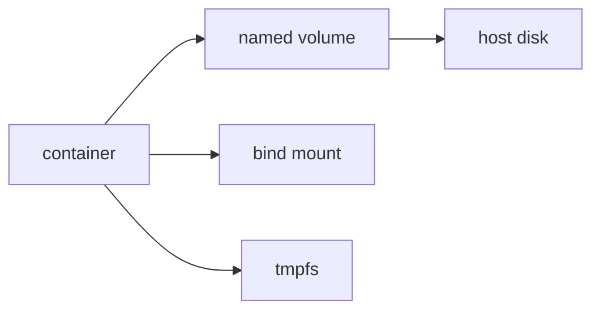

# Volume

> Containers 101 시리즈 (5/10)


## 이 글에서 다룰 문제

*컨테이너* 는 *불변* 이지만 *데이터* 는 *살아있어야* 합니다. *볼륨 설계 실패* 는 *데이터 유실* 입니다.

## 개념 한눈에 보기



## Before/After

**Before**: *컨테이너 삭제* → *DB 데이터* 사라짐.

**After**: *Named volume* 에 보관 → *컨테이너 교체* 도 안전.

## 실습: Volume 다루기

### 1단계 — 생성

```python
import subprocess

def create(name):
    subprocess.run(["docker", "volume", "create", name], check=True)
```

### 2단계 — 마운트해 실행

```python
def run_db(volume):
    subprocess.run([
        "docker", "run", "-d", "--name", "pg",
        "-v", f"{volume}:/var/lib/postgresql/data",
        "-e", "POSTGRES_PASSWORD=secret",
        "postgres:16",
    ], check=True)
```

### 3단계 — 검사

```python
def inspect(name):
    res = subprocess.run(
        ["docker", "volume", "inspect", name],
        capture_output=True, text=True, check=True,
    )
    return res.stdout
```

### 4단계 — 백업

```python
def backup(volume, archive):
    subprocess.run([
        "docker", "run", "--rm",
        "-v", f"{volume}:/data:ro",
        "-v", f"{archive}:/backup",
        "alpine", "tar", "czf", "/backup/data.tgz", "-C", "/data", ".",
    ], check=True)
```

### 5단계 — 정리

```python
def remove(name):
    subprocess.run(["docker", "volume", "rm", name], check=True)
```

## 이 코드에서 주목할 점

- *Named volume* 은 *경로 독립*.
- *tar 컨테이너* 로 *백업* 표준화.
- *Bind mount* 는 *경로 의존* 이라 *주의*.

## 자주 하는 실수 5가지

1. ***DB 데이터* 를 *컨테이너 안* 에 둠.**
2. ***Bind mount* 의 *권한* 충돌.**
3. ***Volume 백업* 부재.**
4. ***tmpfs* 에 *영속 데이터* 저장.**
5. ***외부 driver* 의 *제약* 무시.**

## 실무에서는 이렇게 쓰입니다

*개발* 은 *Bind mount* 로 *코드 핫리로드*, *DB* 는 *Named volume*, *민감 임시* 는 *tmpfs*, *프로덕션* 은 *EBS/NFS driver*.

## 체크리스트

- [ ] *영속 데이터* 는 *Named volume*.
- [ ] *백업* 정기 실행.
- [ ] *권한* 점검.
- [ ] *복원 테스트* 연 1회.

## 정리 및 다음 단계

데이터가 자리잡았으면 *통신* 이 다음입니다. 다음 글은 *Network*.

<!-- toc:begin -->
- [Container란 무엇인가?](./01-what-is-a-container.md)
- [Image와 Layer](./02-image-and-layer.md)
- [Runtime](./03-runtime.md)
- [Dockerfile](./04-dockerfile.md)
- **Volume (현재 글)**
- Network (예정)
- Registry (예정)
- Container Security (예정)
- Container와 VM 차이 (예정)
- 실전 컨테이너 앱 만들기 (예정)
<!-- toc:end -->

## 참고 자료

- [Docker volumes](https://docs.docker.com/storage/volumes/)
- [Bind mounts](https://docs.docker.com/storage/bind-mounts/)
- [tmpfs](https://docs.docker.com/storage/tmpfs/)
- [Volume plugins](https://docs.docker.com/engine/extend/plugins_volume/)

Tags: Containers, Docker, Volume, Storage, DevOps
