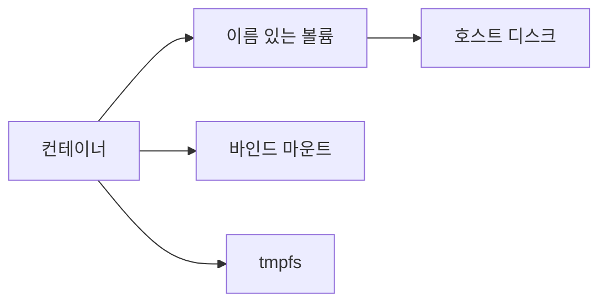

# Volume

## 이 글에서 다룰 문제

- 컨테이너가 사라진 뒤에도 데이터가 남게 하려면 무엇을 써야 할까요?
- volume, bind mount, tmpfs는 수명과 용도가 어떻게 다를까요?
- 데이터베이스는 왜 컨테이너 내부가 아니라 별도 저장소에 둬야 할까요?
- 백업과 복원은 어떤 식으로 자동화할 수 있을까요?
- 권한 충돌이나 잘못된 드라이버 선택은 어떤 문제를 만들까요?

> Containers 101 시리즈 (5/10)

컨테이너는 교체를 전제로 설계됩니다. 이미지도 불변이고, 실행 중인 컨테이너도 언제든 다시 만들 수 있다는 가정이 깔려 있습니다. 그런데 애플리케이션이 다루는 데이터는 정반대입니다. 데이터베이스 파일, 업로드 파일, 캐시, 세션, 백업 아카이브는 컨테이너보다 오래 살아남아야 합니다. 이 둘을 분리하지 못하면 컨테이너를 잘 쓰는 것이 아니라 컨테이너 때문에 데이터를 잃는 구조가 됩니다.

이 글에서는 Docker가 제공하는 volume, bind mount, tmpfs를 구분하고, 어떤 데이터를 어디에 두는 것이 맞는지 입문자 눈높이에서 정리하겠습니다.

> 상태는 컨테이너 안이 아니라 별도 저장소에 둬야 합니다. volume, bind mount, tmpfs의 차이를 아는 순간부터 데이터 유실을 피할 수 있습니다.

## 왜 중요한가

컨테이너는 애플리케이션을 빠르게 배포하게 해 주지만, 데이터는 그 속도보다 훨씬 보수적으로 다뤄야 합니다. 저장 위치를 잘못 고르면 컨테이너 교체 한 번에 데이터가 사라질 수 있고, 반대로 저장은 되더라도 권한 문제나 성능 문제 때문에 운영이 불안정해질 수 있습니다. 볼륨 설계는 곧 데이터 안정성 설계입니다.

## 한눈에 보는 구조



이 그림은 데이터가 컨테이너 내부에 머물지 않고 바깥 저장소에 연결된다는 사실을 보여 줍니다. 이름 있는 볼륨은 Docker가 관리하는 영속 저장소이고, bind mount는 호스트의 특정 경로를 그대로 연결하는 방식입니다. tmpfs는 메모리 기반이므로 빠르지만 컨테이너가 내려가면 내용도 함께 사라집니다.

## 핵심 용어

- volume: Docker가 관리하는 영속 저장소입니다.
- bind mount: 호스트 경로를 컨테이너 안에 직접 연결하는 방식입니다.
- tmpfs: 메모리 안에만 존재하는 임시 저장소입니다.
- driver: NFS, EBS 같은 외부 저장소를 연결하는 확장 지점입니다.
- mount propagation: 마운트 이벤트가 어느 범위까지 전파되는지 다루는 개념입니다.

## Before / After

Before에서는 데이터베이스 파일을 컨테이너 내부에 둡니다. 이 경우 컨테이너를 삭제하면 데이터도 함께 사라집니다.

After에서는 이름 있는 볼륨에 데이터를 둡니다. 컨테이너를 교체해도 데이터는 그대로 남습니다.

## 실습: volume 다루기

### 1단계 — 생성

```python
import subprocess

def create(name):
    subprocess.run(["docker", "volume", "create", name], check=True)
```

먼저 볼륨을 하나 만듭니다. 이름 있는 볼륨은 특정 호스트 경로를 직접 기억할 필요가 없어서 이식성과 관리 편의성이 좋습니다.

### 2단계 — 마운트해 실행

```python
def run_db(volume):
    subprocess.run([
        "docker", "run", "-d", "--name", "pg",
        "-v", f"{volume}:/var/lib/postgresql/data",
        "-e", "POSTGRES_PASSWORD=secret",
        "postgres:16",
    ], check=True)
```

이 예제는 PostgreSQL 데이터 디렉터리를 볼륨에 연결합니다. 컨테이너는 교체돼도 `/var/lib/postgresql/data`의 실제 데이터는 볼륨 쪽에 남습니다.

### 3단계 — 검사

```python
def inspect(name):
    res = subprocess.run(
        ["docker", "volume", "inspect", name],
        capture_output=True, text=True, check=True,
    )
    return res.stdout
```

inspect 결과를 보면 볼륨이 어떤 드라이버를 쓰는지, 실제 마운트 지점이 어디인지, 어떤 메타데이터를 갖는지 확인할 수 있습니다.

### 4단계 — 백업

```python
def backup(volume, archive):
    subprocess.run([
        "docker", "run", "--rm",
        "-v", f"{volume}:/data:ro",
        "-v", f"{archive}:/backup",
        "alpine", "tar", "czf", "/backup/data.tgz", "-C", "/data", ".",
    ], check=True)
```

별도 tar 컨테이너를 띄워 볼륨 내용을 읽기 전용으로 마운트하고 아카이브를 만드는 방식은 단순하면서도 자동화하기 좋습니다. 직접 호스트 경로를 가정하지 않아도 된다는 점도 장점입니다.

### 5단계 — 제거

```python
def remove(name):
    subprocess.run(["docker", "volume", "rm", name], check=True)
```

볼륨 삭제는 신중해야 합니다. 컨테이너를 내리는 것과 달리, 볼륨을 지우면 그 안의 영속 데이터도 함께 없어집니다.

## 이 코드에서 볼 점

- 이름 있는 볼륨은 호스트 경로에 직접 의존하지 않습니다.
- tar를 실행하는 전용 컨테이너를 쓰면 백업 절차를 표준화하기 쉽습니다.
- bind mount는 호스트 경로에 의존하므로 개발 환경마다 차이가 나기 쉽습니다.

## 자주 하는 실수 5가지

1. 데이터베이스 파일을 컨테이너 내부에 둡니다.
2. bind mount 권한 모델을 확인하지 않아 읽기·쓰기 충돌을 만듭니다.
3. 볼륨 백업을 전혀 하지 않습니다.
4. tmpfs에 영속 데이터까지 넣습니다.
5. 외부 볼륨 드라이버의 성능과 제약을 검토하지 않습니다.

## 실무에서는 이렇게 쓰입니다

개발 환경에서는 bind mount로 로컬 코드를 바로 연결해 핫리로드를 살리고, 데이터베이스는 이름 있는 볼륨에 둡니다. 민감한 임시 데이터나 꼭 디스크에 남기고 싶지 않은 데이터는 tmpfs에 두기도 합니다. 프로덕션에서는 EBS나 NFS 같은 외부 드라이버를 붙여 운영 환경의 백업, 확장, 장애 복구 정책과 맞춥니다.

## 실무에서는 이렇게 생각한다

- 상태는 컨테이너와 분리합니다.
- 백업은 언젠가가 아니라 일정에 맞춰 자동화합니다.
- 권한 모델은 우연히 맞는 것이 아니라 의도적으로 설계합니다.
- 드라이버 선택은 비용과 성능을 함께 보고 결정합니다.
- 백업보다 더 중요한 것은 실제 복원 훈련입니다.

## 체크리스트

- [ ] 영속 데이터는 이름 있는 볼륨에 둡니다.
- [ ] 백업이 일정에 따라 자동 실행됩니다.
- [ ] 권한 모델을 검토했습니다.
- [ ] 최소 연 1회 복원 훈련을 합니다.

## 연습 문제

1. volume과 bind mount의 차이를 한 줄로 설명해 보세요.
2. tmpfs가 특히 잘 맞는 사용 사례를 하나 적어 보세요.
3. 데이터베이스 파일을 컨테이너 내부에 둘 때의 위험을 한 줄로 설명해 보세요.

## 정리 및 다음 단계

컨테이너는 쉽게 교체할 수 있어야 하고, 데이터는 그 교체를 견뎌야 합니다. 그래서 애플리케이션과 상태 저장소를 분리하는 것이 컨테이너 운영의 기본 원칙이 됩니다. 이제 데이터가 어디에 있어야 하는지 봤으니, 다음에는 컨테이너들이 서로 어떻게 통신하는지 보겠습니다. 다음 글은 Network입니다.

<!-- toc:begin -->
- [Container란 무엇인가?](./01-what-is-a-container.md)
- [Image와 Layer](./02-image-and-layer.md)
- [Runtime](./03-runtime.md)
- [Dockerfile](./04-dockerfile.md)
- **Volume (현재 글)**
- Network (예정)
- Registry (예정)
- Container Security (예정)
- Container와 VM 차이 (예정)
- 실전 컨테이너 앱 만들기 (예정)
<!-- toc:end -->

## 참고 자료

- [Docker volumes](https://docs.docker.com/storage/volumes/)
- [Bind mounts](https://docs.docker.com/storage/bind-mounts/)
- [tmpfs](https://docs.docker.com/storage/tmpfs/)
- [Volume plugins](https://docs.docker.com/engine/extend/plugins_volume/)

Tags: Containers, Docker, Volume, Storage, DevOps
