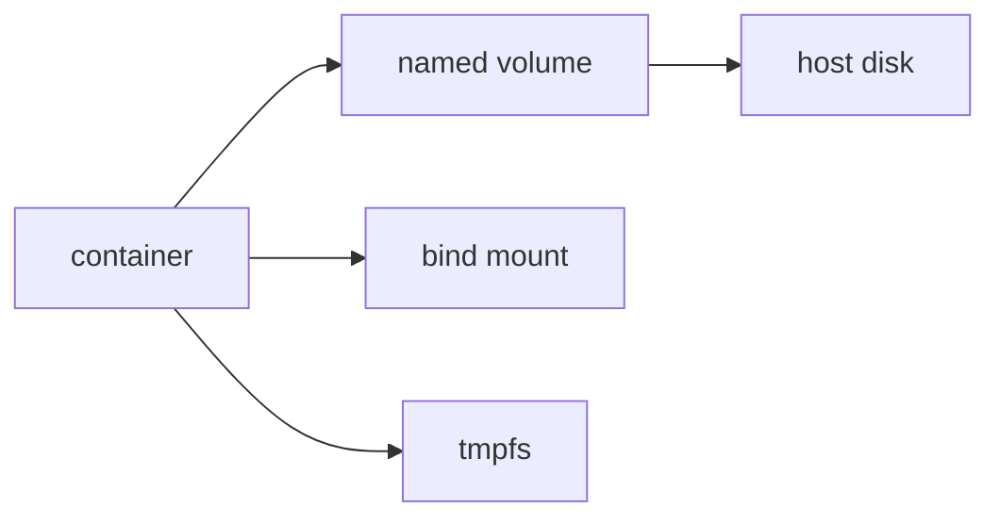

# Volume

이 글은 Containers 101 시리즈의 다섯 번째 글입니다.

## 이 글에서 다룰 문제

- volume, bind mount, tmpfs는 무엇이 다를까요?
- 컨테이너를 지워도 데이터를 남기려면 어떤 선택을 해야 할까요?
- 백업과 복구는 어떤 방식으로 접근해야 할까요?
- 권한 문제는 왜 자주 발생할까요?
- 상태를 컨테이너 내부에 두면 왜 위험할까요?

> 컨테이너는 불변 아티팩트이지만 데이터는 살아남아야 합니다. 상태는 컨테이너 안이 아니라 volume에 두고, volume과 bind mount와 tmpfs를 목적에 맞게 구분해야 데이터 손실을 피할 수 있습니다.

## 왜 중요한가

컨테이너는 쉽게 만들고 없앨 수 있어야 합니다. 반대로 데이터는 그렇게 사라지면 안 됩니다. 잘못된 스토리지 설계는 결국 데이터 손실 설계입니다.

입문 단계에서는 컨테이너 파일시스템 안에 데이터를 그냥 두고 시작하기 쉽습니다. 하지만 데이터베이스나 업로드 파일처럼 살아남아야 하는 상태를 컨테이너 내부에 두면, 컨테이너 교체 순간 곧바로 문제가 생깁니다. 그래서 volume을 배우는 순간부터 컨테이너와 상태를 분리해서 생각해야 합니다.

## 한눈에 보는 개념



세 가지는 모두 마운트 방식이지만 목적이 다릅니다. named volume은 지속성, bind mount는 호스트 경로 연결, tmpfs는 메모리 기반 임시 저장이 중심입니다.

## 핵심 용어

- **Volume**: Docker가 관리하는 영속 저장소입니다.
- **Bind mount**: 호스트 경로를 컨테이너 안에 직접 연결합니다.
- **tmpfs**: 메모리 기반의 임시 저장소입니다.
- **Driver**: NFS, EBS 같은 외부 저장소를 연결하는 확장 지점입니다.
- **Mount propagation**: 마운트 이벤트가 어떻게 전파되는지 정의합니다.

실무에서 가장 많이 쓰는 조합은 개발용 bind mount와 운영용 named volume입니다. 둘은 비슷해 보여도 운영 성격이 다릅니다.

## Before / After

**Before**: 컨테이너를 삭제하면 데이터베이스 데이터도 함께 사라집니다.

**After**: named volume이 컨테이너 교체와 무관하게 데이터를 지켜 줍니다.

즉, 상태를 어디에 둘지 결정하는 순간부터 애플리케이션의 운영 안정성이 달라집니다.

## 실습: Volume 다루기

### Step 1 — Create

```python
import subprocess

def create(name):
    subprocess.run(["docker", "volume", "create", name], check=True)
```

먼저 명시적으로 volume을 만듭니다. 이름이 있는 volume은 특정 호스트 경로에 덜 의존하므로 운영과 이관에 유리합니다.

### Step 2 — Mount and run

```python
def run_db(volume):
    subprocess.run([
        "docker", "run", "-d", "--name", "pg",
        "-v", f"{volume}:/var/lib/postgresql/data",
        "-e", "POSTGRES_PASSWORD=secret",
        "postgres:16",
    ], check=True)
```

데이터베이스 상태를 컨테이너 내부가 아니라 volume에 붙입니다. 여기서부터 컨테이너 교체와 데이터 생존을 분리해 볼 수 있습니다.

### Step 3 — Inspect

```python
def inspect(name):
    res = subprocess.run(
        ["docker", "volume", "inspect", name],
        capture_output=True, text=True, check=True,
    )
    return res.stdout
```

volume 메타데이터를 확인합니다. 어떤 드라이버를 쓰는지, 실제 마운트 지점이 어디인지 점검할 수 있습니다.

### Step 4 — Back up

```python
def backup(volume, archive):
    subprocess.run([
        "docker", "run", "--rm",
        "-v", f"{volume}:/data:ro",
        "-v", f"{archive}:/backup",
        "alpine", "tar", "czf", "/backup/data.tgz", "-C", "/data", ".",
    ], check=True)
```

백업도 별도 컨테이너로 표준화할 수 있습니다. 이 방식은 운영 환경이 달라져도 같은 절차를 유지하기 쉽다는 장점이 있습니다.

### Step 5 — Remove

```python
def remove(name):
    subprocess.run(["docker", "volume", "rm", name], check=True)
```

영속 저장소는 삭제도 의도적으로 해야 합니다. 컨테이너와 달리 volume 삭제는 곧 데이터 삭제라는 뜻이기 때문입니다.

## 이 코드에서 먼저 봐야 할 점

- named volume은 특정 경로에 직접 묶이지 않습니다.
- tar 실행용 임시 컨테이너로 백업 절차를 표준화할 수 있습니다.
- bind mount는 호스트 경로 의존성이 크므로 더 신중해야 합니다.

이 포인트를 이해하면 개발 편의용 마운트와 운영용 영속 저장소를 구분하는 감각이 생깁니다.

## 자주 하는 실수 5가지

1. **DB 데이터를 컨테이너 내부에 저장합니다.**
2. **bind mount에서 권한 충돌을 방치합니다.**
3. **volume 백업을 만들지 않습니다.**
4. **영속 데이터에 tmpfs를 사용합니다.**
5. **외부 volume driver의 제약을 무시합니다.**

이 실수들은 대부분 “컨테이너는 쉽게 바뀌지만 데이터는 남아야 한다”는 원칙을 놓칠 때 발생합니다.

## 운영에서는 이렇게 나타납니다

개발 환경에서는 소스 코드 hot-reload를 위해 bind mount를 쓰는 경우가 많고, 데이터베이스는 named volume을 사용합니다. 민감한 임시 데이터는 tmpfs에 두고, 운영 환경에서는 EBS나 NFS 같은 외부 드라이버를 붙이기도 합니다.

즉, 스토리지 선택은 성격이 다른 데이터를 분류하는 작업입니다. 한 가지 방식으로 모두 해결하려고 하면 운영에서 무너집니다.

## 시니어 엔지니어는 이렇게 생각합니다

- 상태는 컨테이너와 분리합니다.
- volume 백업은 정기 작업으로 만듭니다.
- 권한 모델은 우연이 아니라 의도적으로 설계합니다.
- 드라이버 선택은 비용과 성능을 함께 봅니다.
- 백업보다 복구 훈련이 더 중요하다고 생각합니다.

시니어 엔지니어는 “백업이 있다”는 말보다 “복구를 실제로 해 봤다”는 사실을 더 신뢰합니다. 상태 저장의 완성은 저장이 아니라 복구 가능성에 있기 때문입니다.

## 체크리스트

- [ ] 영속 데이터는 named volume에 둡니다.
- [ ] 백업이 주기적으로 실행됩니다.
- [ ] 권한 모델을 검토했습니다.
- [ ] 최소 연 1회 복구 훈련을 합니다.

## 연습 문제

1. volume과 bind mount의 차이를 한 줄로 설명해 보세요.
2. tmpfs가 적합한 사용 사례 하나를 적어 보세요.
3. DB 데이터를 컨테이너 내부에 둘 때의 위험을 한 줄로 설명해 보세요.

## 정리와 다음 글

컨테이너는 상태를 담는 곳이 아니라 상태를 연결하는 실행 단위입니다. volume, bind mount, tmpfs를 구분해서 써야 데이터 보존과 운영 편의성을 함께 잡을 수 있습니다.

다음 글에서는 데이터가 아니라 통신 관점으로 넘어가, 컨테이너들이 서로를 어떻게 찾고 연결하는지 Network를 살펴보겠습니다.

<!-- toc:begin -->
- [Container란 무엇인가?](./01-what-is-a-container.md)
- [Image와 Layer](./02-image-and-layer.md)
- [Runtime](./03-runtime.md)
- [Dockerfile](./04-dockerfile.md)
- **Volume (현재 글)**
- Network (예정)
- Registry (예정)
- Container Security (예정)
- Container와 VM 차이 (예정)
- 실전 컨테이너 앱 만들기 (예정)
<!-- toc:end -->

## 참고 자료

- [Docker volumes](https://docs.docker.com/storage/volumes/)
- [Bind mounts](https://docs.docker.com/storage/bind-mounts/)
- [tmpfs](https://docs.docker.com/storage/tmpfs/)
- [Volume plugins](https://docs.docker.com/engine/extend/plugins_volume/)

Tags: Containers, Docker, Volume, Storage, DevOps
