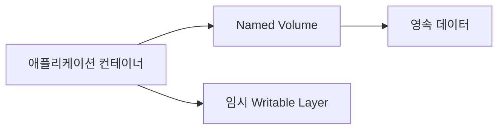

# Containers 101 (5/10): Volume

컨테이너는 빨리 만들고 지울 수 있어야 하지만, 데이터는 그러면 안 됩니다. 이 차이를 구분하지 못하면 실습 단계에서는 편해 보여도 운영에서는 백업 실패, 권한 충돌, 데이터 유실이 바로 드러납니다.

이 글은 Containers 101 시리즈의 5번째 글입니다.

여기서는 named volume, bind mount, tmpfs가 각각 어떤 수명주기와 위험을 가지는지, 백업과 복구를 어떤 절차로 표준화해야 하는지 설명합니다.


*Containers 101 5장 흐름 개요*
> Volume의 핵심은 컨테이너를 지워도 데이터를 남기는 메커니즘입니다. 비상태 컨테이너와 상태를 가진 데이터 저장소를 분리하는 것이 설계의 출발점입니다.

## 먼저 던지는 질문

- volume, bind mount, tmpfs는 무엇이 다를까요?
- 컨테이너를 지워도 데이터를 남기려면 어떤 선택을 해야 할까요?
- 백업과 복구는 어떤 방식으로 접근해야 할까요?

## 왜 중요한가

컨테이너는 쉽게 만들고 없애는 것이 장점입니다. 반대로 데이터는 그렇게 사라지면 안 됩니다. 잘못된 스토리지 설계는 결국 데이터 손실 설계입니다.

입문 단계에서는 컨테이너 파일시스템 안에 데이터를 그냥 두고 시작하기 쉽습니다. 하지만 데이터베이스나 업로드 파일처럼 살아남아야 하는 상태를 컨테이너 내부에 두면, 컨테이너 교체 순간 곧바로 문제가 생깁니다. 그래서 volume을 배우는 순간부터 컨테이너와 상태를 분리해서 생각해야 합니다.

실제로 운영에서 발생하는 데이터 유실 사고의 대부분은 이 분리를 하지 않은 채 컨테이너를 재시작하거나 업데이트하는 순간 발생합니다. 특히 `docker-compose down -v`로 volume까지 삭제하는 실수는 입문자가 가장 많이 겪는 사고입니다.

## 한눈에 보는 개념

세 가지는 모두 마운트 방식이지만 목적이 다릅니다. named volume은 지속성, bind mount는 호스트 경로 연결, tmpfs는 메모리 기반 임시 저장이 중심입니다.

```text
[ named volume ]
  Docker가 경로를 관리 → /var/lib/docker/volumes/<name>/_data
  컨테이너 삭제해도 데이터 유지
  예: DB 데이터, 업로드 파일

[ bind mount ]
  호스트 절대 경로를 직접 연결 → -v /home/user/src:/app
  호스트 환경에 강하게 의존
  예: 개발 중 소스 코드 hot-reload

[ tmpfs ]
  메모리에만 존재 → 컨테이너 종료 시 소멸
  디스크에 흔적을 남기지 않음
  예: 임시 토큰, 세션 파일
```

선택 기준은 데이터의 수명입니다. 컨테이너보다 오래 살아야 하는 데이터는 named volume, 컨테이너와 함께 사라져도 되는 데이터는 tmpfs, 개발 중 호스트와 실시간 동기해야 하는 데이터는 bind mount를 쓰는 것이 기본 원칙입니다.

## 핵심 용어

- **Volume**: Docker가 관리하는 영속 저장소입니다. 기본 드라이버는 `local`이며, `/var/lib/docker/volumes/` 아래에 데이터가 저장됩니다.
- **Bind mount**: 호스트의 절대 경로를 컨테이너 안에 직접 노출합니다. 개발 중 소스 코드 동기에 유용하지만, 호스트 환경에 강하게 의존합니다.
- **tmpfs**: 메모리에만 존재하는 임시 저장소입니다. 컨테이너 종료 시 자동으로 소멸하며, 디스크에 흔적을 남기지 않습니다.
- **Driver**: NFS, EBS, GlusterFS 같은 외부 저장소를 연결하는 확장 지점입니다. `docker volume create --driver <name>`으로 지정합니다.
- **Mount propagation**: 마운트 이벤트가 호스트와 컨테이너 사이에서 어떻게 전파되는지 정의합니다. 대부분의 경우 기본값(`rprivate`)을 쓰면 충분합니다.

실무에서 가장 많이 쓰는 조합은 개발용 bind mount와 운영용 named volume입니다. 둘은 비슷해 보여도 운영 성격이 다릅니다.

## 적용 전후

**Before — 컨테이너 내부에 데이터 저장**

```bash
docker run -d --name pg -e POSTGRES_PASSWORD=secret postgres:16
# 컨테이너 삭제 시 데이터 전체 유실
docker rm -f pg
```

문제점:
- 컨테이너를 삭제하거나 업데이트하면 DB 데이터가 사라집니다.
- 백업할 경로가 명확하지 않습니다.
- 컨테이너 writable layer는 성능도 떨어집니다.

**After — named volume으로 분리**

```bash
docker volume create pgdata
docker run -d --name pg \
  -v pgdata:/var/lib/postgresql/data \
  -e POSTGRES_PASSWORD=secret \
  postgres:16

# 컨테이너를 삭제해도 데이터는 그대로
docker rm -f pg
docker volume inspect pgdata  # Mountpoint 확인

# 새 컨테이너로 같은 데이터 재연결
docker run -d --name pg \
  -v pgdata:/var/lib/postgresql/data \
  -e POSTGRES_PASSWORD=secret \
  postgres:16
```

개선 효과:
- 컨테이너를 자유롭게 교체할 수 있습니다(버전 업그레이드, 재시작).
- 백업 대상 경로가 명확합니다(`docker volume inspect`로 확인).
- 스토리지 드라이버를 바꿸면 외부 스토리지(EBS, NFS)로도 이전 가능합니다.

즉, 상태를 어디에 둘지 결정하는 순간부터 애플리케이션의 운영 안정성이 달라집니다.

## 실습: Volume 다루기

### 단계 1 — Create

```python
import subprocess

def create(name):
    subprocess.run(["docker", "volume", "create", name], check=True)
```

먼저 명시적으로 volume을 만듭니다. 이름이 있는 volume은 특정 호스트 경로에 덜 의존하므로 운영과 이관에 유리합니다.

### 단계 2 — 마운트 후 실행
```python
def run_db(volume):
    subprocess.run([
        "docker", "run", "-d", "--name", "pg",
        "-v", f"{volume}:/var/lib/postgresql/data",
        "-e", "POSTGRES_PASSWORD=secret",
        "postgres:16",
    ], check=True)
```

데이터베이스 상태를 컨테이너 내부가 아니라 volume에 붙입니다. 여기서부터 컨테이너 교체와 데이터 생존을 분리해 볼 수 있습니다.

### 단계 3 — Inspect

```python
def inspect(name):
    res = subprocess.run(
        ["docker", "volume", "inspect", name],
        capture_output=True, text=True, check=True,
    )
    return res.stdout
```

volume 메타데이터를 확인합니다. 어떤 드라이버를 쓰는지, 실제 마운트 지점이 어디인지 점검할 수 있습니다.

### 단계 4 — 백업하기
```python
def backup(volume, archive):
    subprocess.run([
        "docker", "run", "--rm",
        "-v", f"{volume}:/data:ro",
        "-v", f"{archive}:/backup",
        "alpine", "tar", "czf", "/backup/data.tgz", "-C", "/data", ".",
    ], check=True)
```

백업도 별도 컨테이너로 표준화할 수 있습니다. 이 방식은 운영 환경이 달라져도 같은 절차를 유지하기 쉽다는 장점이 있습니다.

### 단계 5 — Remove

```python
def remove(name):
    subprocess.run(["docker", "volume", "rm", name], check=True)
```

영속 저장소는 삭제도 의도적으로 해야 합니다. 컨테이너와 달리 volume 삭제는 곧 데이터 삭제라는 뜻이기 때문입니다.

## 이 코드에서 먼저 봐야 할 점

- named volume은 특정 경로에 직접 묶이지 않습니다.
- tar 실행용 임시 컨테이너로 백업 절차를 표준화할 수 있습니다.
- bind mount는 호스트 경로 의존성이 크므로 더 신중해야 합니다.

이 포인트를 이해하면 개발 편의용 마운트와 운영용 영속 저장소를 구분하는 감각이 생깁니다.

## 빠른 검증과 장애 신호

```bash
docker volume create pgdata
docker run -d --name pg -v pgdata:/var/lib/postgresql/data -e POSTGRES_PASSWORD=secret postgres:16
docker volume inspect pgdata
docker rm -f pg
docker run -d --name pg -v pgdata:/var/lib/postgresql/data -e POSTGRES_PASSWORD=secret postgres:16
```

**Expected output:**
- `docker volume inspect`에 Docker가 관리하는 마운트 지점이 보입니다.
- 같은 volume을 다시 붙이면 컨테이너를 지워도 데이터 디렉터리가 유지됩니다.

**먼저 확인할 것:**
- DB가 안 뜨면 volume 권한과 초기화 로그를 먼저 봅니다.
- bind mount라면 호스트 경로 소유권이 컨테이너 사용자와 맞는지 확인합니다.
- 백업은 복구 절차까지 시험해야 의미가 있습니다.

## 자주 하는 실수 5가지

1. **DB 데이터를 컨테이너 내부에 저장합니다.**
   - `docker rm`으로 컨테이너를 지우면 데이터도 함께 사라집니다. 운영에서 가장 치명적인 실수입니다.

2. **bind mount에서 권한 충돌을 방치합니다.**
   - 컨테이너 내부 UID(ex: 1000)와 호스트 파일 소유자가 다르면 쓰기 실패가 발생합니다. macOS/Windows의 Docker Desktop은 자동 변환이 있지만 Linux에서는 직접 맞춰야 합니다.

3. **volume 백업을 만들지 않습니다.**
   - "나중에 하지"라고 미루다가 디스크 장애로 데이터를 잃습니다. 이미 여러 번 당한 후에야 자동화를 만드는 팀이 많습니다.

4. **영속 데이터에 tmpfs를 사용합니다.**
   - tmpfs는 컨테이너 종료 시 사라집니다. 세션 토큰이나 임시 파일에만 적합합니다.

5. **외부 volume driver의 제약을 무시합니다.**
   - EBS는 단일 AZ에만 마운트 가능하고, NFS는 네트워크 지연이 있습니다. 드라이버별 제약을 모르고 설계하면 운영에서 장애로 돌아옵니다.

이 실수들은 대부분 "컨테이너는 쉽게 바뀌지만 데이터는 남아야 한다"는 원칙을 놓칠 때 발생합니다.

## 운영에서는 이렇게 나타납니다

개발 환경에서는 소스 코드 hot-reload를 위해 bind mount를 쓰는 경우가 많고, 데이터베이스는 named volume을 사용합니다. 민감한 임시 데이터는 tmpfs에 두고, 운영 환경에서는 EBS나 NFS 같은 외부 드라이버를 붙이기도 합니다.

아래는 환경별 마운트 전략을 정리한 표입니다.

| 환경 | DB 데이터 | 소스 코드 | 시크릿 | 로그 |
| --- | --- | --- | --- | --- |
| 로컬 개발 | named volume | bind mount | .env 파일 | stdout |
| CI/CD | 임시 volume | 이미지 내장 | 환경변수 | stdout |
| 스테이징 | 관리형 DB | 이미지 내장 | Secret Manager | 외부 수집기 |
| 운영 | EBS/NFS volume | 이미지 내장 | Secret Manager | 외부 수집기 |

```bash
# 운영 환경에서 volume driver 확인
docker volume inspect pgdata --format '{{.Driver}}'

# 마운트 상태 확인
docker inspect pg --format '{{json .Mounts}}' | jq .
```

즉, 스토리지 선택은 성격이 다른 데이터를 분류하는 작업입니다. 한 가지 방식으로 모두 해결하려고 하면 운영에서 무너집니다.

## 시니어 엔지니어는 이렇게 생각합니다

- 상태는 컨테이너와 분리합니다.
- volume 백업은 정기 작업으로 만듭니다.
- 권한 모델은 우연이 아니라 의도적으로 설계합니다.
- 드라이버 선택은 비용과 성능을 함께 봅니다.
- 백업보다 복구 훈련이 더 중요하다고 생각합니다.

### 복구 훈련 체크리스트

시니어 엔지니어는 백업 스크립트가 있는지보다 복구를 실제로 해 봤는지를 더 중요하게 봅니다.

| 항목 | 확인 질문 |
| --- | --- |
| 백업 존재 | 마지막 백업 파일이 언제 생성되었는가? |
| 복구 시간 | 전체 복구에 몇 분 걸리는가? |
| 데이터 무결성 | 복구 후 애플리케이션이 정상 작동하는가? |
| 자동화 | 복구 절차가 스크립트화되어 있는가? |

```bash
# 복구 훈련 스크립트 예시
docker volume rm pgdata
docker volume create pgdata
docker run --rm -v pgdata:/data -v $PWD/backups:/backup \
  alpine sh -c "cd /data && tar xzf /backup/pgdata.tgz"
docker run -d --name pg -v pgdata:/var/lib/postgresql/data \
  -e POSTGRES_PASSWORD=secret postgres:16
# 데이터 확인
docker exec pg psql -U postgres -c '\\dt'
```

시니어 엔지니어는 "백업이 있다"는 말보다 "복구를 실제로 해 봤다"는 사실을 더 신뢰합니다. 상태 저장의 완성은 저장이 아니라 복구 가능성에 있기 때문입니다.

## 체크리스트

- [ ] 영속 데이터는 named volume에 둡니다.
- [ ] 백업이 주기적으로 실행됩니다.
- [ ] 권한 모델을 검토했습니다.
- [ ] 최소 연 1회 복구 훈련을 합니다.

## 연습 문제

1. volume과 bind mount의 차이를 한 줄로 설명해 보세요.
2. tmpfs가 적합한 사용 사례 하나를 적어 보세요.
3. DB 데이터를 컨테이너 내부에 둘 때의 위험을 한 줄로 설명해 보세요.

## 정리와 다음 글

컨테이너는 상태를 담는 곳이 아니라 상태를 연결하는 실행 단위입니다. volume, bind mount, tmpfs를 구분해서 써야 데이터 보존과 운영 편의성을 함께 잡을 수 있습니다.

실무에서 이 세 가지를 제대로 쓰려면 먼저 데이터 분류표를 만들고, 각 유형에 맞는 저장소를 배정한 뒤, 백업/복구 자동화까지 갖춰야 합니다. 특히 "백업이 있다"와 "복구를 해 봤다"는 완전히 다른 성숙도입니다. 전자는 안심감을 줌 뿐이지만, 후자는 실제 장애에서 복구 시간을 줄여 줍니다.

데이터 분류표를 만들 때는 '이 데이터가 사라지면 서비스가 멈추는가?'를 기준으로 삼으면 됩니다. 멈추는 데이터는 named volume + 외부 백업, 재생성 가능한 데이터는 tmpfs나 ephemeral storage, 개발 편의용 데이터는 bind mount로 배정합니다.

다음 글에서는 데이터가 아니라 통신 관점으로 넘어가, 컨테이너들이 서로를 어떻게 찾고 연결하는지 Network를 봅니다.

## 심화: 볼륨, 바인드 마운트, 데이터 영속성 패턴

상태 데이터를 다루는 순간 컨테이너 운영은 단순 실행 문제를 넘어 데이터 수명주기 설계 문제로 바뀝니다. 특히 개발 환경에서 bind mount의 편의성에 익숙해진 뒤 운영에서도 같은 습관을 유지하면 권한 충돌, 이관 어려움, 백업 누락이 자주 발생합니다. 따라서 마운트 방식을 목적별로 분리하는 기준이 필요합니다.

아래 표는 세 가지 기본 마운트 방식의 차이를 정리합니다.

| 항목 | named volume | bind mount | tmpfs |
| --- | --- | --- | --- |
| 저장 위치 관리 | Docker가 관리 | 호스트 경로 직접 지정 | 메모리 |
| 재현성 | 높은 편 | 호스트 의존 큼 | 낮음(재시작 시 소멸) |
| 성능 특성 | 일반적 | 환경에 따라 상이 | 빠름 |
| 대표 사용처 | DB 데이터, 영속 캐시 | 소스 코드 핫리로드 | 임시 민감 데이터 |
| 운영 위험 | 삭제 시 데이터 손실 | 권한/경로 의존 | 영속 데이터 부적합 |

## 데이터 영속성 패턴 3가지

### 패턴 1: 데이터베이스는 named volume 기본

```bash
docker volume create pgdata
docker run -d --name db   -e POSTGRES_PASSWORD=secret   -v pgdata:/var/lib/postgresql/data   postgres:16
```

이 패턴은 컨테이너 교체와 데이터 보존을 분리합니다. 운영에서 가장 중요한 기본값입니다.

### 패턴 2: 개발 코드만 bind mount

```bash
docker run --rm -it   -v "$PWD":/app   -w /app   python:3.12-slim python -m app.main
```

개발 편의는 높지만 운영 배포에는 적합하지 않습니다. 호스트 경로와 권한에 강하게 의존하기 때문입니다.

### 패턴 3: 시크릿 임시 파일은 tmpfs

```bash
docker run --rm -d   --tmpfs /run/secrets:size=1m,mode=0700   myapp:dev
```

민감한 임시 데이터가 디스크에 남지 않도록 관리할 수 있습니다.

## 백업/복구 절차를 표준화하기

백업 파일이 존재하는 것과 복구 가능한 것은 다릅니다. 아래처럼 백업과 복구를 모두 자동화해야 합니다.

```bash
# backup
docker run --rm   -v pgdata:/data:ro   -v "$PWD/backups":/backup   alpine tar czf /backup/pgdata.tgz -C /data .

# restore
docker run --rm   -v pgdata:/data   -v "$PWD/backups":/backup   alpine sh -c "cd /data && tar xzf /backup/pgdata.tgz"
```

복구 테스트를 주기적으로 하지 않으면 백업은 문서상의 절차에 머무르게 됩니다.

## 권한 모델 설계

bind mount에서 가장 흔한 문제는 UID/GID 불일치입니다. 컨테이너 내부 사용자와 호스트 파일 소유자가 다르면 쓰기 실패가 발생합니다. 운영 정책으로 다음을 권장합니다.

- 애플리케이션은 non-root 사용자로 실행
- 마운트 경로 권한을 배포 스크립트에서 명시적으로 설정
- 데이터 경로와 로그 경로를 분리

## 운영 체크리스트

- 데이터 성격별 저장소 분류표 존재 여부
- 영속 데이터의 volume 정책 문서화 여부
- 백업 및 복구 자동화 스크립트 보유 여부
- 복구 리허설 주기 정의 여부
- 볼륨 삭제 권한 최소화 여부

이 체크리스트가 갖춰져야 컨테이너 수명주기와 데이터 수명주기가 충돌하지 않습니다.

## 추가 실무 노트: 데이터 분류표를 먼저 만든 뒤 마운트를 선택하기

운영에서는 먼저 데이터를 분류하고, 그 뒤에 마운트를 선택해야 합니다.

- 영구 데이터: DB, 사용자 업로드, 감사 로그
- 재생성 가능한 데이터: 캐시, 임시 변환 파일
- 민감 임시 데이터: 토큰, 세션 조각

분류표가 있으면 선택이 명확해집니다.

| 데이터 유형 | 권장 저장소 |
| --- | --- |
| 영구 데이터 | named volume 또는 관리형 DB |
| 재생성 캐시 | named volume 또는 tmpfs |
| 민감 임시 데이터 | tmpfs + 짧은 TTL |

이 표를 시스템 설계 문서에 포함하면 팀 간 논쟁을 줄이고 운영 기준을 일관되게 유지할 수 있습니다.

## 추가 정리: 운영 적용 전 최종 점검 질문

아래 질문은 도구 지식이 아니라 운영 준비도를 확인하기 위한 질문입니다. 각 질문에 문서와 명령으로 답할 수 있어야 실제 팀 운영에서 반복 가능한 품질을 만들 수 있습니다.

1. 이 구성은 새 팀원이 같은 절차로 재현할 수 있는가?
2. 실패했을 때 어디서 원인을 확인해야 하는지 런북이 있는가?
3. 보안 기본값(root 금지, 최소 권한, 시크릿 분리)이 강제되는가?
4. 버전과 아티팩트 동일성(digest, lock file)이 보장되는가?
5. 데이터/네트워크/권한 경계가 문서로 정의되어 있는가?

다음은 공통 점검 명령 예시입니다.

```bash
# 아티팩트 동일성
docker inspect --format '{{index .RepoDigests 0}}' <image>

# 실행 상태
docker ps --format 'table {{.Names}}	{{.Status}}	{{.Ports}}'

# 로그 관측
docker logs --tail 100 <container>

# 네트워크/볼륨 구조
docker network ls
docker volume ls
```

이 명령 자체가 중요한 것이 아니라, 팀이 같은 순서로 문제를 좁혀 가는 절차를 공유한다는 점이 중요합니다. 컨테이너 운영의 성숙도는 개인의 숙련도보다 팀의 표준화 수준에서 결정됩니다. 따라서 시리즈 학습의 최종 목표는 기능 이해가 아니라 운영 계약의 명문화입니다.

## 실무 확장: 데이터 경계를 설계하지 않으면 재시작에서 손실이 난다

볼륨을 쓰는 이유는 단순 저장이 아니라 수명 주기가 다른 데이터를 분리하기 위해서입니다. 컨테이너 수명과 데이터 수명을 분리하지 않으면 재시작과 재배포 때 문제가 반복됩니다.

### 볼륨 설계 기준

- 데이터베이스 데이터: named volume 또는 외부 스토리지
- 캐시/임시 파일: 컨테이너 writable layer 또는 tmpfs
- 설정 파일: 읽기 전용 bind mount

### Compose 볼륨 패턴

```yaml
services:
  db:
    image: postgres:16
    volumes:
      - pgdata:/var/lib/postgresql/data
  app:
    image: myorg/app:latest
    volumes:
      - ./config:/app/config:ro
volumes:
  pgdata:
```

읽기/쓰기 권한을 분리하면 운영 실수를 줄일 수 있습니다. 특히 설정 파일은 `:ro`를 기본값으로 두는 것이 안전합니다.

### 볼륨 점검 명령

```bash
docker volume ls
docker volume inspect pgdata
docker run --rm -v pgdata:/data alpine ls -al /data
```

운영 중에는 “데이터가 정말 볼륨에 있는가”를 정기적으로 확인해야 합니다. 경로 오타 하나로 데이터를 컨테이너 레이어에 쓰는 경우가 자주 발생합니다.

### 데이터 경계 도식



## 실무 확장: 백업과 복구 루틴

```bash
docker run --rm -v pgdata:/data -v $(pwd):/backup alpine tar czf /backup/pgdata.tgz -C /data .
```

볼륨 전략은 백업 전략과 함께 설계되어야 완성됩니다. 저장 위치만 정하고 복구 절차를 문서화하지 않으면 실제 장애에서 복구 시간이 길어집니다.

## 처음 질문으로 돌아가기

- **volume, bind mount, tmpfs는 무엇이 다를까요?**
  - volume은 Docker가 경로를 관리하는 영속 저장소로, 컨테이너를 삭제해도 데이터가 남습니다. bind mount는 호스트의 특정 경로를 컨테이너에 직접 노출하므로 호스트 환경에 강하게 의존합니다. tmpfs는 메모리에만 존재하므로 컨테이너가 종료되면 사라지며, 민감한 임시 데이터를 디스크에 남기지 않을 때 적합합니다.
- **컨테이너를 지워도 데이터를 남기려면 어떤 선택을 해야 할까요?**
  - named volume을 써야 합니다. `docker volume create`로 만들고 `-v <name>:<path>`로 컨테이너에 마운트하면, `docker rm`으로 컨테이너를 지우더라도 volume은 남습니다. 새 컨테이너에 같은 volume을 붙이면 데이터가 그대로 있습니다.
- **백업과 복구는 어떤 방식으로 접근해야 할까요?**
  - 일반 파일은 별도 컨테이너에서 volume을 읽기 전용으로 마운트한 뒤 `tar`로 압축하는 패턴이 기본입니다. 데이터베이스라면 `pg_dump`/`pg_restore` 같은 애플리케이션 수준 백업을 함께 사용합니다. 가장 중요한 것은 백업 존재 여부가 아니라 복구 훈련을 주기적으로 하는 것입니다.

<!-- toc:begin -->
## 시리즈 목차

- [Containers 101 (1/10): Container란 무엇인가?](./01-what-is-a-container.md)
- [Containers 101 (2/10): Image와 Layer](./02-image-and-layer.md)
- [Containers 101 (3/10): Runtime](./03-runtime.md)
- [Containers 101 (4/10): Dockerfile](./04-dockerfile.md)
- **Volume (현재 글)**
- Network (예정)
- Registry (예정)
- Container Security (예정)
- Containers vs VMs (예정)
- 실전 컨테이너 앱 만들기 (예정)

<!-- toc:end -->

## 참고 자료

- Containers 101 예제 코드: https://github.com/yeongseon-books/book-examples/tree/main/containers-101/ko
- [Docker volumes](https://docs.docker.com/storage/volumes/)
- [Bind mounts](https://docs.docker.com/storage/bind-mounts/)
- [tmpfs](https://docs.docker.com/storage/tmpfs/)
- [Volume plugins](https://docs.docker.com/engine/extend/plugins_volume/)

Tags: Containers, Docker, Kubernetes, DevOps
