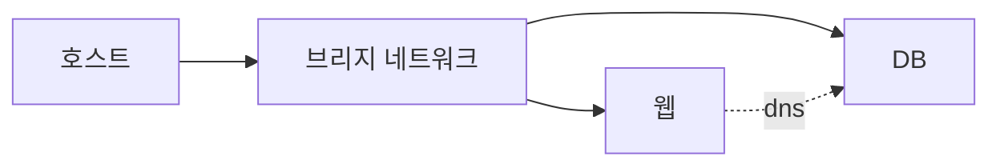

# Network

## 이 글에서 다룰 문제

- 같은 호스트에서 돌아가는 컨테이너는 서로를 어떻게 찾을까요?
- bridge, host, overlay, none 모드는 각각 언제 쓰는 걸까요?
- IP가 아니라 이름으로 통신하게 하려면 무엇이 필요할까요?
- `-p`로 포트를 publish하는 것과 `expose`의 차이는 무엇일까요?
- 기본 bridge를 그대로 쓰면 어떤 제약이 생길까요?

> Containers 101 시리즈 (6/10)

컨테이너 네트워크는 처음엔 단순해 보입니다. 웹 컨테이너 하나 띄우고 `-p 8080:80`만 붙이면 바로 접속되기 때문입니다. 하지만 컨테이너가 두 개 이상이 되는 순간 이야기가 달라집니다. 웹 애플리케이션은 데이터베이스를 찾아야 하고, 서비스는 이름으로 서로를 참조해야 하며, 어떤 포트는 내부 전용으로 숨기고 어떤 포트만 외부에 열어야 합니다.

Compose와 Kubernetes도 결국 이런 기본 추상화 위에 올라갑니다. 그래서 컨테이너 네트워크 기초를 제대로 이해하면 이후의 오케스트레이션 개념도 훨씬 쉽게 받아들일 수 있습니다.

> 컨테이너 네트워킹은 네트워크 모드 선택과 DNS 기반 서비스 디스커버리의 조합입니다.

## 왜 중요한가

컨테이너끼리 IP 주소로 직접 통신하게 두면 재시작이나 재배치 때 연결이 쉽게 깨집니다. 반대로 사용자 정의 네트워크와 DNS 이름을 쓰면 인스턴스가 다시 떠도 애플리케이션 설정을 크게 바꾸지 않아도 됩니다. 외부 노출을 어디까지 허용할지도 네트워크 설계에서 결정됩니다.

## 한눈에 보는 구조



사용자 정의 bridge 네트워크를 만들면 같은 네트워크에 붙은 컨테이너들은 이름으로 서로를 찾을 수 있습니다. 그래서 웹 컨테이너에서 데이터베이스를 `db` 같은 서비스 이름으로 참조하게 만들 수 있습니다.

## 핵심 용어

- bridge: 호스트 안에서 기본으로 쓰는 가상 L2 네트워크입니다.
- host: 컨테이너가 호스트 네트워크 네임스페이스를 공유하는 모드입니다.
- overlay: 여러 호스트를 가로질러 연결하는 네트워크입니다.
- none: 네트워크 연결을 주지 않는 모드입니다.
- expose: 내부 포트를 문서화할 뿐 외부에 공개하지는 않는 설정입니다.

## Before / After

Before에서는 컨테이너끼리 IP 주소를 직접 써서 통신합니다. 컨테이너가 재시작되면 IP가 바뀔 수 있어 설정이 쉽게 깨집니다.

After에서는 사용자 정의 bridge 네트워크를 만들고 DNS 이름으로 통신합니다. 컨테이너가 다시 떠도 이름 기반 연결은 계속 유지됩니다.

## 실습: 사용자 정의 네트워크 만들기

### 1단계 — 네트워크 생성

```python
import subprocess

def create_net(name):
    subprocess.run(["docker", "network", "create", name], check=True)
```

먼저 사용자 정의 네트워크를 만듭니다. 기본 bridge보다 이 방식이 더 예측 가능하고, 이름 기반 통신도 여기서부터 시작됩니다.

### 2단계 — DB 실행

```python
def run_db(net):
    subprocess.run([
        "docker", "run", "-d", "--name", "db", "--network", net,
        "-e", "POSTGRES_PASSWORD=secret", "postgres:16",
    ], check=True)
```

DB 컨테이너를 같은 네트워크에 붙입니다. 아직 외부 포트를 열지 않았기 때문에 이 DB는 네트워크 내부에서만 접근할 수 있습니다.

### 3단계 — 앱 실행

```python
def run_app(net):
    subprocess.run([
        "docker", "run", "-d", "--name", "app", "--network", net,
        "-p", "8080:8080",
        "-e", "DB_HOST=db",
        "myorg/app:latest",
    ], check=True)
```

앱 컨테이너는 `DB_HOST=db`로 데이터베이스를 찾습니다. 여기서 중요한 점은 IP가 아니라 컨테이너 이름을 DNS 이름처럼 쓰고 있다는 사실입니다.

### 4단계 — 검사

```python
def inspect(net):
    res = subprocess.run(
        ["docker", "network", "inspect", net],
        capture_output=True, text=True, check=True,
    )
    return res.stdout
```

inspect 결과를 보면 네트워크에 어떤 컨테이너가 붙어 있는지, 각 엔드포인트가 어떤 설정을 갖는지 확인할 수 있습니다.

### 5단계 — 정리

```python
def cleanup(net):
    subprocess.run(["docker", "rm", "-f", "app", "db"])
    subprocess.run(["docker", "network", "rm", net])
```

사용하지 않는 네트워크가 계속 쌓이면 추적과 운영이 어려워집니다. 실습 뒤에는 정리 습관까지 같이 익히는 편이 좋습니다.

## 이 코드에서 볼 점

- `DB_HOST=db`는 IP가 아니라 DNS 이름을 사용합니다.
- 사용자 정의 네트워크는 기본 bridge보다 관리성과 연결 안정성이 좋습니다.
- `-p`는 외부에서 접근이 필요할 때만 붙여야 합니다.

## 자주 하는 실수 5가지

1. 기본 bridge만 써서 DNS 이름 기반 연결을 놓칩니다.
2. DB 포트까지 `-p`로 외부에 공개합니다.
3. overlay와 bridge의 목적을 혼동합니다.
4. host 모드를 남용해 포트 충돌을 만듭니다.
5. 사용하지 않는 네트워크를 정리하지 않아 환경이 지저분해집니다.

## 실무에서는 이렇게 쓰입니다

Docker Compose는 프로젝트 단위로 사용자 정의 네트워크를 자동으로 만듭니다. 그래서 서비스 이름만으로 서로를 참조할 수 있습니다. Kubernetes는 더 큰 규모에서 CNI를 이용해 Pod마다 네트워크 연결을 부여하지만, 이름 기반 서비스 디스커버리와 내부·외부 노출을 구분한다는 핵심 원리는 그대로 이어집니다.

## 실무에서는 이렇게 생각한다

- 연결의 기반은 IP보다 DNS 이름입니다.
- 외부 노출은 기본값이 아니라 명시적 결정이어야 합니다.
- 네트워크 모드 선택은 보안 결과까지 함께 바꿉니다.
- 네트워크도 상태처럼 관리 대상이므로 정리가 필요합니다.
- Compose와 Kubernetes가 추상화해 주더라도 원리는 달라지지 않습니다.

## 체크리스트

- [ ] 사용자 정의 네트워크를 사용합니다.
- [ ] DB는 외부에 공개하지 않습니다.
- [ ] 서비스 간 통신은 DNS 이름으로 합니다.
- [ ] 불필요한 네트워크를 정리합니다.

## 연습 문제

1. 기본 bridge의 가장 큰 제약을 한 줄로 설명해 보세요.
2. overlay 네트워크가 잘 맞는 상황을 하나 적어 보세요.
3. `expose`와 `publish (-p)`의 차이를 한 줄로 설명해 보세요.

## 정리 및 다음 단계

컨테이너 네트워크의 핵심은 복잡한 설정이 아니라 관계를 명확히 나누는 데 있습니다. 내부 통신은 이름으로 안정적으로 연결하고, 외부 노출은 필요한 것만 열어 두는 방식이 기본입니다. 이제 컨테이너들이 서로 어떻게 통신하는지 봤으니, 다음에는 그 컨테이너 이미지를 어디에 보관하고 어떻게 다시 가져오는지 보겠습니다. 다음 글은 Registry입니다.

<!-- toc:begin -->
- [Container란 무엇인가?](./01-what-is-a-container.md)
- [Image와 Layer](./02-image-and-layer.md)
- [Runtime](./03-runtime.md)
- [Dockerfile](./04-dockerfile.md)
- [Volume](./05-volume.md)
- **Network (현재 글)**
- Registry (예정)
- Container Security (예정)
- Container와 VM 차이 (예정)
- 실전 컨테이너 앱 만들기 (예정)
<!-- toc:end -->

## 참고 자료

- [Docker networking overview](https://docs.docker.com/network/)
- [Bridge networks](https://docs.docker.com/network/bridge/)
- [Overlay networks](https://docs.docker.com/network/overlay/)
- [DNS in Docker](https://docs.docker.com/network/network-tutorial-standalone/)

Tags: Containers, Docker, Networking, Bridge, DevOps
