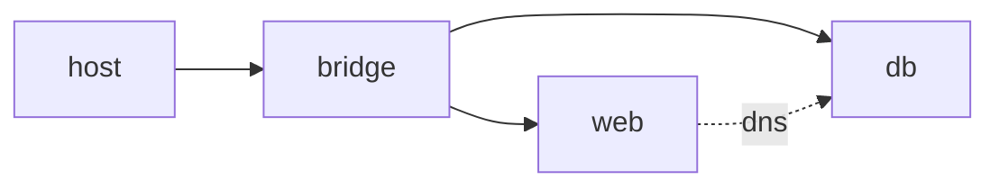

# Network

> Containers 101 시리즈 (6/10)

<!-- a-grade-intro:begin -->

**핵심 질문**: 같은 호스트의 컨테이너가 *서로* 어떻게 *이름* 으로 연결될까요?

> *컨테이너 네트워크 는 *bridge*, *host*, *overlay* 의 *모드 선택* 과 *DNS 기반 디스커버리* 로 작동합니다.*

<!-- a-grade-intro:end -->

## 이 글에서 배울 것

- *bridge / host / overlay / none* 모드
- *컨테이너 간 DNS*
- *publish (-p)* 와 *expose*
- *user-defined network*
- 흔한 함정 5가지

## 왜 중요한가

*Compose* 와 *Kubernetes* 모두 *네트워크 추상화* 위에서 동작합니다. *기초* 가 *전부* 입니다.

## 개념 한눈에 보기



## 핵심 용어 정리

- **bridge**: *기본* 가상 *L2* 네트워크.
- **host**: *호스트 네임스페이스* 공유.
- **overlay**: *여러 호스트* 를 잇는 가상 네트워크.
- **none**: *네트워크 없음*.
- **expose**: *내부* 포트 *문서화* 만.

## Before/After

**Before**: *컨테이너* 가 *IP* 로 통신 → *재시작* 시 *깨짐*.

**After**: *user-defined bridge* 의 *DNS* 로 *이름* 통신.

## 실습: 사용자 정의 네트워크

### 1단계 — 네트워크 생성

```python
import subprocess

def create_net(name):
    subprocess.run(["docker", "network", "create", name], check=True)
```

### 2단계 — DB 실행

```python
def run_db(net):
    subprocess.run([
        "docker", "run", "-d", "--name", "db", "--network", net,
        "-e", "POSTGRES_PASSWORD=secret", "postgres:16",
    ], check=True)
```

### 3단계 — App 실행

```python
def run_app(net):
    subprocess.run([
        "docker", "run", "-d", "--name", "app", "--network", net,
        "-p", "8080:8080",
        "-e", "DB_HOST=db",
        "myorg/app:latest",
    ], check=True)
```

### 4단계 — 검사

```python
def inspect(net):
    res = subprocess.run(
        ["docker", "network", "inspect", net],
        capture_output=True, text=True, check=True,
    )
    return res.stdout
```

### 5단계 — 정리

```python
def cleanup(net):
    subprocess.run(["docker", "rm", "-f", "app", "db"])
    subprocess.run(["docker", "network", "rm", net])
```

## 이 코드에서 주목할 점

- *DB_HOST=db* 는 *DNS 이름* 사용.
- *user-defined* 네트워크가 *기본 bridge* 보다 *유리*.
- *-p* 는 *외부 노출* 시에만.

## 자주 하는 실수 5가지

1. ***기본 bridge* 사용 → *DNS 부재*.**
2. ***DB* 에 *-p* 부여 → *외부 노출*.**
3. ***overlay* 와 *bridge* 혼동.**
4. ***host* 모드 남용으로 *포트 충돌*.**
5. ***네트워크 정리* 없이 *누적*.**

## 실무에서는 이렇게 쓰입니다

*Compose* 가 *서비스마다* *user-defined* 네트워크 자동 생성, *Kubernetes* 는 *CNI* 로 *Pod 간* *L3* 통신.

## 시니어 엔지니어는 이렇게 생각합니다

- *DNS* 가 *연결의 기본*.
- *외부 노출* 은 *명시적 결정*.
- *모드 선택* 이 *보안 영향*.
- *네트워크* 도 *상태* 다 (정리 필요).
- *Compose/K8s* 가 *추상* 해도 *원리* 는 같다.

## 체크리스트

- [ ] *user-defined* 네트워크 사용.
- [ ] *DB* 는 *외부 비공개*.
- [ ] *DNS 이름* 으로 통신.
- [ ] *불필요 네트워크* 정리.

## 연습 문제

1. *기본 bridge* 의 *한계* 한 줄로.
2. *overlay 네트워크* 의 *대표 용도* 한 가지.
3. *expose* 와 *publish (-p)* 의 *차이* 한 줄로.

## 정리 및 다음 단계

연결이 잡혔으면 *이미지* 를 *어디에 보관* 할지가 다음. 다음 글은 *Registry*.

<!-- toc:begin -->
- [Container란 무엇인가?](./01-what-is-a-container.md)
- [Image와 Layer](./02-image-and-layer.md)
- [Runtime](./03-runtime.md)
- [Dockerfile](./04-dockerfile.md)
- [Volume](./05-volume.md)
- **Network (현재 글)**
- Registry (예정)
- Container Security (예정)
- Container와 VM 차이 (예정)
- 실전 컨테이너 앱 만들기 (예정)
<!-- toc:end -->

## 참고 자료

- [Docker networking overview](https://docs.docker.com/network/)
- [Bridge networks](https://docs.docker.com/network/bridge/)
- [Overlay networks](https://docs.docker.com/network/overlay/)
- [DNS in Docker](https://docs.docker.com/network/network-tutorial-standalone/)

Tags: Containers, Docker, Networking, Bridge, DevOps
