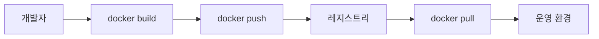

# Registry

## 이 글에서 다룰 문제

- 빌드한 이미지는 어디에 저장해야 다시 꺼내 쓸 수 있을까요?
- registry, repository, tag, digest는 각각 무엇을 뜻할까요?
- push와 pull 흐름은 어떤 순서로 진행될까요?
- `latest` 대신 digest pinning을 쓰는 이유는 무엇일까요?
- Docker Hub, ECR, GHCR은 어떤 기준으로 고르면 될까요?

> Containers 101 시리즈 (7/10)

이미지를 잘 빌드하는 것만으로는 배포가 끝나지 않습니다. 같은 이미지를 다른 개발자도 받아야 하고, CI도 받아야 하며, 운영 환경도 정확히 같은 내용을 다시 내려받아야 합니다. 결국 이미지는 어딘가에 안전하게 저장돼 있어야 하고, 그 저장소는 단순 파일 서버가 아니라 버전과 권한, 배포 흐름을 함께 관리할 수 있어야 합니다.

그 역할을 맡는 것이 registry입니다. 컨테이너 세계에서 registry는 이미지의 원격 저장소이자 배포 파이프라인의 출발점입니다. 이 글에서는 registry의 구조와 push·pull 흐름, 태그와 digest의 차이, 운영에서 자주 놓치는 보안 포인트를 함께 정리하겠습니다.

> registry는 이미지의 원격 집이자 모든 배포 흐름의 중심입니다.

## 왜 중요한가

이미지가 재현 가능해도 가져올 장소가 없으면 운영에서는 아무 의미가 없습니다. 더 정확히 말하면, 이미지를 어디서 어떤 이름으로 가져오는지 신뢰할 수 있어야 배포도 신뢰할 수 있습니다. registry를 대충 쓰면 태그가 덮어써지고, 어떤 이미지가 실제 운영에 올라갔는지 추적이 어려워지며, 비공개 이미지를 공개 저장소에 밀어 넣는 사고도 생깁니다.

## 한눈에 보는 흐름



이 흐름은 단순해 보여도 배포에서 가장 중요한 계약을 담고 있습니다. 로컬에서 만든 이미지를 registry에 올리고, 다른 환경은 registry에서 다시 받아 옵니다. 이 과정이 일관돼야만 개발 환경, CI, 프로덕션이 같은 이미지를 공유할 수 있습니다.

## 핵심 용어

- registry: 이미지를 저장하고 배포하는 서버입니다.
- repository: 하나의 이미지 이름 아래 버전들이 모이는 단위입니다.
- tag: 사람이 읽기 쉬운 버전 라벨입니다.
- digest: 내용을 해시로 고정한 불변 식별자입니다.
- signed image: Cosign 같은 도구로 서명한 이미지입니다.

## Before / After

Before에서는 이미지를 파일처럼 복사하거나 임시 스크립트로 옮깁니다. 이렇게 하면 어느 파일이 최신인지, 실제로 같은 이미지인지 쉽게 흔들립니다.

After에서는 registry를 기준으로 이미지를 저장하고 digest로 동일성을 확인합니다. 운영 환경이 받아 가는 대상도 더 명확해집니다.

## 실습: 이미지 push 자동화하기

### 1단계 — 로그인

```python
import subprocess

def login(registry, user, password):
    subprocess.run(
        ["docker", "login", registry, "-u", user, "--password-stdin"],
        input=password.encode(), check=True,
    )
```

로그인 단계에서는 자격 증명을 안전하게 넘기는 방식이 중요합니다. `--password-stdin`을 쓰면 비밀번호가 명령행 인자로 노출되는 일을 줄일 수 있습니다.

### 2단계 — 태그

```python
def tag(local, remote):
    subprocess.run(["docker", "tag", local, remote], check=True)
```

태그는 사람이 읽는 이름입니다. 예를 들어 `myapp:1.2.3`처럼 버전을 붙이면 배포 흐름을 훨씬 추적하기 쉬워집니다.

### 3단계 — push

```python
def push(remote):
    subprocess.run(["docker", "push", remote], check=True)
```

push는 로컬 이미지를 원격 registry로 올리는 단계입니다. 보통은 개발자 개인보다는 CI가 이 권한을 갖도록 운영하는 편이 안전합니다.

### 4단계 — digest 조회

```python
def digest(remote):
    res = subprocess.run(
        ["docker", "inspect", "--format={{index .RepoDigests 0}}", remote],
        capture_output=True, text=True, check=True,
    )
    return res.stdout.strip()
```

태그만 확인하면 같은 이름 아래 다른 내용이 들어와도 놓치기 쉽습니다. digest를 읽으면 실제 배포 대상을 불변 값으로 고정할 수 있습니다.

### 5단계 — pull 검증

```python
def verify_pull(remote_digest):
    subprocess.run(["docker", "pull", remote_digest], check=True)
```

digest로 다시 pull해 보면 registry에 올라간 대상이 정확히 무엇인지 검증할 수 있습니다. 운영 배포에서도 이 패턴을 그대로 가져가면 재현성이 크게 좋아집니다.

## 이 코드에서 볼 점

- 운영 기준으로는 태그보다 digest pinning이 더 중요합니다.
- `password-stdin`은 비밀 노출 위험을 낮춥니다.
- push 권한은 역할 분리 뒤에 최소 범위로 주는 편이 안전합니다.

## 자주 하는 실수 5가지

1. 프로덕션에서 `latest`만 사용합니다.
2. digest로 고정하지 않고 재배포합니다.
3. 비공개 이미지를 공개 저장소로 잘못 push합니다.
4. 태그를 덮어써서 과거 이력을 잃습니다.
5. 서명 검증 단계를 생략합니다.

## 실무에서는 이렇게 쓰입니다

실무에서는 GitHub Actions 같은 CI가 이미지를 빌드한 뒤 GHCR이나 ECR에 push합니다. 이후 Argo CD 같은 배포 도구는 태그가 아니라 digest 변화를 기준으로 롤아웃을 진행하기도 합니다. 이렇게 해야 누가 언제 무엇을 배포했는지 더 명확하게 남습니다.

## 실무에서는 이렇게 생각한다

- 진실은 태그가 아니라 digest에 있습니다.
- 태그는 편한 이름일 뿐 불변 식별자가 아닙니다.
- registry도 백업과 보존 정책이 필요합니다.
- 서명은 공급망 보안의 출발점입니다.
- 권한 분리는 보안의 기본입니다.

## 체크리스트

- [ ] 프로덕션 이미지는 digest로 고정합니다.
- [ ] push 권한은 CI에만 줍니다.
- [ ] 서명 정책을 적용합니다.
- [ ] retention 정책을 설정합니다.

## 연습 문제

1. tag와 digest의 차이를 한 줄로 설명해 보세요.
2. GHCR의 장점을 하나 적어 보세요.
3. 이미지 서명 검증이 왜 필요한지 한 줄로 설명해 보세요.

## 정리 및 다음 단계

이미지는 빌드보다 배포에서 더 오래 살아남습니다. 그래서 어디에 저장하는지, 어떤 이름으로 가리키는지, 무엇으로 동일성을 확인하는지가 운영 품질을 좌우합니다. 이제 이미지를 어디에서 받아 와야 하는지 정리했으니, 다음에는 그 이미지를 어떻게 더 안전하게 실행할지 보겠습니다. 다음 글은 Container Security입니다.

<!-- toc:begin -->
- [Container란 무엇인가?](./01-what-is-a-container.md)
- [Image와 Layer](./02-image-and-layer.md)
- [Runtime](./03-runtime.md)
- [Dockerfile](./04-dockerfile.md)
- [Volume](./05-volume.md)
- [Network](./06-network.md)
- **Registry (현재 글)**
- Container Security (예정)
- Container와 VM 차이 (예정)
- 실전 컨테이너 앱 만들기 (예정)
<!-- toc:end -->

## 참고 자료

- [Docker Hub](https://hub.docker.com/)
- [Amazon ECR](https://docs.aws.amazon.com/AmazonECR/latest/userguide/)
- [GitHub Container Registry](https://docs.github.com/en/packages/working-with-a-github-packages-registry/working-with-the-container-registry)
- [Cosign](https://docs.sigstore.dev/cosign/overview/)

Tags: Containers, Docker, Registry, ECR, DevOps
