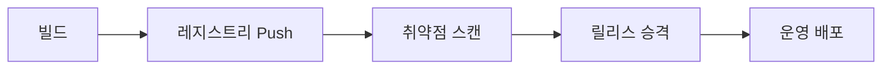

# Containers 101 (7/10): Registry

이미지를 잘 빌드해도 어디엔가 안정적으로 올리고 다시 가져올 수 없다면 배포는 완성되지 않습니다. 배포 파이프라인이 흔들리는 팀을 보면 대개 tag와 digest를 구분하지 못하거나, 누가 push 권한을 가지는지 설계하지 못한 경우가 많습니다.

여기서는 레지스트리를 단순한 저장소가 아니라 배포 동일성을 보장하는 시스템으로 보고, push와 pull, digest pin, 서명 정책의 출발점을 함께 설명합니다.


*Containers 101 7장 흐름 개요*
> Registry의 핵심은 어디에 이미지가 보관되는가보다, tag와 digest로 어떻게 추적하고 어느 버전을 배포할지 결정하는 것입니다.

## 먼저 던지는 질문

- 빌드한 이미지는 어디에 저장해 두어야 할까요?
- push와 pull 흐름은 배포에서 어떤 역할을 할까요?
- tag와 digest는 왜 구분해서 써야 할까요?

## 왜 중요한가

이미지를 재현 가능하게 잘 만들었다고 해도, 어디선가 다시 가져올 수 없다면 배포는 성립하지 않습니다. 배포는 결국 레지스트리에서 시작됩니다. 레지스트리가 없으면 빌드와 실행 사이에 신뢰할 수 있는 연결 고리가 없는 셋입니다.

초기 학습 단계에서는 `docker build`까지만 해 보고 끝나는 경우가 많습니다. 하지만 팀 단위 운영으로 넘어가는 순간, 누가 이미지를 올리고 누가 가져오며 무엇을 기준으로 동일성을 보장할지 정해야 합니다. 그 기준이 바로 레지스트리와 digest입니다.

실제 운영 장애에서 레지스트리 문제가 차지하는 비중은 놓습니다. 토큰 만료로 pull 실패, tag 덮어쓰기로 잘못된 버전 배포, 보존 정책 부재로 스토리지 불기 등이 대표적입니다. 레지스트리를 단순 저장소가 아니라 배포 계약 시스템으로 다루어야 이런 사고를 예방할 수 있습니다.

주요 레지스트리 비교:

| 레지스트리 | 특징 | 적합 용도 |
| --- | --- | --- |
| Docker Hub | 공개 이미지 중심, rate limit 있음 | 오픈소스 / 학습 |
| GHCR | GitHub 통합, Actions 연동 우수 | GitHub 기반 팀 |
| ECR | AWS IAM 통합, 리전별 동작 | AWS 운영 환경 |
| GCR/Artifact Registry | GCP IAM 통합 | GCP 운영 환경 |
| Harbor | 자체 호스팅, 취약점 스캔 내장 | 보안 요구사항 높은 환경 |

## 한눈에 보는 개념

개발 환경에서 만든 이미지는 레지스트리에 올라가고, 운영 환경은 다시 그 이미지를 당겨 옵니다. 이 흐름이 일관되어야 같은 아티팩트를 여러 환경에서 재사용할 수 있습니다.

```text
┌────────────┐     push      ┌───────────────┐     pull      ┌────────────┐
│  CI 빌드   │ ────────▶ │   Registry    │ ────────▶ │  운영 서버  │
│  (build)   │               │ (GHCR/ECR/Hub) │               │  (deploy)  │
└────────────┘               └──────┬────────┘               └────────────┘
                                    │
                             digest (sha256:...)
                           동일성 보장 기준
```

이 구조에서 핵심은 tag가 아니라 digest입니다. tag는 사람이 읽기 위한 이름일 뿐이고, digest가 실제 내용의 동일성을 보장합니다. 운영 배포는 반드시 digest를 기준으로 해야 재현성이 확보됩니다.

## 핵심 용어

- **registry**: 이미지를 원격에 저장하는 서버입니다. Docker Hub, GHCR, ECR, GCR, Harbor 등이 대표적입니다.
- **repository**: 하나의 이미지 이름을 담는 단위입니다. `ghcr.io/myorg/myapp`이 하나의 repository입니다.
- **tag**: 사람이 읽기 쉬운 버전 이름입니다. `latest`, `v1.2.3`, `git-abc123` 같은 형식을 쓱니다. 같은 tag를 다른 이미지에 재할당할 수 있어 불변이 아닙니다.
- **digest**: 불변 내용을 식별하는 SHA-256 기반 식별자입니다. 이미지 내용이 1바이트라도 달라지면 digest가 바뀝니다.
- **manifest**: 이미지의 레이어 구성, 플랫폼 정보를 담은 JSON 문서입니다. multi-arch 이미지는 manifest list로 여러 플랫폼을 하나의 tag로 묶습니다.
- **signed image**: Cosign 같은 도구로 서명한 이미지입니다. 공급망 공격을 방어하는 첫 번째 단계입니다.

운영에서는 tag보다 digest가 진실에 가깝습니다. tag는 바뀌어도 digest는 이미지 내용이 바뀌지 않는 한 고정됩니다.

## 적용 전후

**Before**: 이미지를 USB나 `scp`로 옮겨 환경마다 결과가 어긋니다.

```bash
# Before — 수동 전달
docker save myapp:latest | gzip > myapp.tar.gz
scp myapp.tar.gz prod-server:/tmp/
ssh prod-server 'docker load < /tmp/myapp.tar.gz'
# 문제: 어떤 버전인지 추적 불가, 무결성 검증 없음
```

**After**: 레지스트리와 digest pin을 사용해 같은 이미지를 정확히 재배포합니다.

```bash
# After — 레지스트리 + digest
docker pull ghcr.io/myorg/myapp@sha256:abc123...
# CI가 push, 운영은 digest로 pull — 동일성 보장
```

즉, 레지스트리는 편의 기능이 아니라 배포 동일성을 확보하는 기반입니다.

## 실습: 이미지 Push 자동화하기

### 단계 1 — Login

```python
import subprocess

def login(registry, user, password):
    subprocess.run(
        ["docker", "login", registry, "-u", user, "--password-stdin"],
        input=password.encode(), check=True,
    )
```

인증은 배포 흐름의 첫 단계입니다. 특히 `--password-stdin`을 써야 비밀값이 프로세스 목록이나 셸 기록에 덜 노출됩니다. CI에서는 토큰 기반 인증을 권장합니다.

### 단계 2 — Tag

```python
def tag(local, remote):
    subprocess.run(["docker", "tag", local, remote], check=True)
```

로컬 이미지에 원격 레지스트리용 이름을 붙입니다. 이때 tag는 사람을 위한 이름이지, 불변성을 보장하는 식별자는 아니라는 점이 중요합니다.

### 단계 3 — Push

```python
def push(remote):
    subprocess.run(["docker", "push", remote], check=True)
```

이제 이미지를 레지스트리에 업로드합니다. 팀 운영에서는 보통 개발자 개인이 아니라 CI만 push 권한을 가지게 설계합니다.

### 단계 4 — 다이제스트 읽기
```python
def digest(remote):
    res = subprocess.run(
        ["docker", "inspect", "--format={{index .RepoDigests 0}}", remote],
        capture_output=True, text=True, check=True,
    )
    return res.stdout.strip()
```

업로드 후에는 digest를 읽습니다. 운영 배포가 tag 기준인지 digest 기준인지에 따라 재현성 수준이 크게 달라집니다. CI 파이프라인에서 push 직후 digest를 환경변수나 파일로 기록해 두면 이후 승격 단계에서 동일성을 검증할 수 있습니다.

### 단계 5 — pull로 검증
```python
def verify_pull(remote_digest):
    subprocess.run(["docker", "pull", remote_digest], check=True)
```

digest 기준으로 다시 pull 해 보면 실제 배포가 어떤 대상을 가리키는지 분명해집니다. 같은 이름이 아니라 같은 내용을 가리키는 것입니다.

## 이 코드에서 먼저 봐야 할 점

- 운영에서는 tag가 아니라 digest로 고정하는 편이 안전합니다.
- `password-stdin`은 비밀값 노출을 줄입니다.
- push 권한은 역할 분리 이후에만 주는 편이 좋습니다.

이 세 가지를 놓치면 배포 동일성과 공급망 보안이 동시에 흔들릴 수 있습니다.

## 빠른 검증과 장애 신호

```bash
docker login ghcr.io -u "$GITHUB_USER" --password-stdin
docker tag myapp:dev ghcr.io/example/myapp:1.0.0
docker push ghcr.io/example/myapp:1.0.0
docker inspect --format "{{index .RepoDigests 0}}" ghcr.io/example/myapp:1.0.0
```

**Expected output:**
- push 이후 `RepoDigests`에 `@sha256:` 형태 digest가 생깁니다.
- 같은 digest로 pull 하면 어떤 환경에서도 같은 내용을 다시 받습니다.

**먼저 확인할 것:**
- 인증 실패 시 토큰 권한을 먼저 점검합니다.
- digest가 기대와 다르면 push 직전 tag 대상이 맞는지 봅니다.
- 운영 배포에서는 `latest`만 남기지 말고 digest를 기록합니다.

## 자주 하는 실수 5가지

1. **운영에서 `latest`를 사용합니다.** `latest`는 버전 정보가 없어 롤백 대상을 특정할 수 없습니다. 장애 시 "어제까지 잘 되던 버전"을 찾을 수 없는 상황이 됩니다.
2. **digest pin 없이 재배포합니다.** tag만 쓰면 누군가 같은 tag를 덮어쓴 경우 다른 이미지가 배포됩니다. 반드시 digest로 고정해야 합니다.
3. **비공개 이미지를 공개 저장소에 올립니다.** 인증 정보, 내부 코드, 시크릿이 들어간 이미지를 public repo에 push하면 영구적으로 노출됩니다.
4. **같은 tag를 덮어써 이력을 잃습니다.** immutable tag 정책을 쓰지 않으면 `v1.2.3`이 어제와 오늘 다른 이미지를 가리킬 수 있습니다. 추적이 불가능해집니다.
5. **서명 검증을 생략합니다.** 이미지가 실제로 우리 팀 CI에서 나온 것인지 검증하지 않으면 공급망 공격에 취약해집니다.

레지스트리 관련 사고는 대개 "그 정도는 괜찮겠지"라는 편의주의에서 시작합니다. 하지만 운영에서는 그 작은 편의가 큰 추적 불가능성으로 돌아옵니다.

## 운영에서는 이렇게 나타납니다

실무에서는 GitHub Actions가 이미지를 빌드해 GHCR이나 ECR로 push하고, Argo CD 같은 배포 시스템이 digest 변화를 감지해 롤아웃하기도 합니다. 즉, 레지스트리는 CI와 CD 사이를 잇는 중심축입니다.

| 단계 | 역할 | 레지스트리 상호작용 |
| --- | --- | --- |
| CI 빌드 | 이미지 생성 | push + digest 기록 |
| 취약점 스캔 | 보안 검증 | pull 후 스캔 |
| 스테이징 배포 | 검증 환경 테스트 | digest로 pull |
| 운영 배포 | 라이브 서비스 | digest로 pull |
| 롤백 | 이전 버전 복원 | 이전 digest로 pull |

이 흐름에서 레지스트리는 단순 저장소가 아니라 배포 계약의 중심입니다.

## 시니어 엔지니어는 이렇게 생각합니다

- 진실의 기준은 digest라고 봅니다. tag는 사람을 위한 이름일 뿐, 배포 결정에 tag만 쓰는 구성을 PR에서 지적합니다.
- tag는 단지 사람이 읽기 쉬운 이름일 뿐이라고 생각합니다. CI 출력에서 digest를 자동 기록하는 파이프라인을 기본으로 둡니다.
- 레지스트리 자체도 백업 대상이라고 봅니다. 레지스트리가 날아가면 전체 배포가 멈추므로 미러링이나 DR 계획을 세웁니다.
- 서명은 공급망 신뢰의 시작이라고 생각합니다. Cosign + 정책 엔진으로 "서명된 이미지만 배포"를 강제합니다.
- push 권한 분리가 보안의 첫 단계라고 봅니다. 개발자 개인이 운영 레포에 직접 push할 수 없는 구조를 기본으로 설계합니다.

시니어 엔지니어는 "이미지를 어디에 두는가"보다 "누가 어떤 권한으로 어떤 식별자를 배포하는가"를 더 중요하게 봅니다. 그 기준이 있어야 운영 이력과 사고 추적이 가능해집니다.

## 체크리스트

- [ ] 운영 배포는 digest로 고정합니다.
- [ ] push 권한을 CI로 제한했습니다.
- [ ] 이미지 서명 정책을 적용했습니다.
- [ ] 보존 정책을 설정했습니다.
- [ ] immutable tag 정책을 활성화했습니다.
- [ ] 취약점 스캔을 CI 파이프라인에 포함했습니다.
- [ ] pull 실패 시 재시도 정책이 적용되어 있습니다.

검증 명령 예시:

```bash
# digest 확인
docker inspect --format='{{index .RepoDigests 0}}' ghcr.io/myorg/myapp:1.4.3

# 서명 검증
cosign verify ghcr.io/myorg/myapp:1.4.3

# 보존 정책 확인 (GHCR)
gh api orgs/myorg/packages/container/myapp/versions --jq '.[].metadata.container.tags'
```

## 연습 문제

1. tag와 digest의 차이를 한 줄로 설명해 보세요.
2. GHCR의 장점 하나를 적어 보세요.
3. 서명 검증이 왜 중요한지 한 줄로 설명해 보세요.

## 정리와 다음 글

레지스트리는 빌드 결과를 실제 배포 아티팩트로 전환하는 장소입니다. push, pull, digest, 서명을 함께 이해해야 비로소 같은 이미지를 안전하게 여러 환경으로 전달할 수 있습니다.

실무에서 레지스트리를 제대로 쓰려면 세 가지를 순서대로 정하면 됩니다. 첫째, tag 체계를 팀 표준으로 고정합니다. 둘째, 배포는 반드시 digest로 고정합니다. 셋째, push 권한을 CI로 제한합니다. 이 세 가지가 갖춰지면 레지스트리는 단순 저장소가 아니라 배포 신뢰 체계의 중심이 됩니다.

다음 글에서는 이 이미지를 어떻게 더 안전하게 실행할지, 즉 Container Security를 봅니다.

## 심화: 레지스트리를 배포 계약으로 다루는 방법

레지스트리는 이미지 저장소를 넘어 배포 신뢰 체계의 중심입니다. 실무에서는 "이미지를 올린다"보다 "어떤 식별자를 기준으로 배포를 재현하는가"가 더 중요합니다. 따라서 태그 운영, digest 고정, 권한 분리, 보존 정책을 함께 설계해야 합니다.

## 태그 전략과 digest 전략을 분리하기

- 태그: 사람이 이해하기 위한 라벨
- digest: 시스템이 동일성을 보장하기 위한 식별자

권장 패턴:

- CI 빌드 결과: `myapp:git-<sha>`
- 릴리스 라벨: `myapp:1.4.2`
- 운영 배포: `myapp@sha256:<digest>`

이 패턴을 쓰면 릴리스 노트는 태그로 읽고, 실제 배포는 digest로 고정할 수 있습니다.

## 권한 모델

다음 표는 최소 권한 원칙 기준의 기본 예시입니다.

| 역할 | 권한 |
| --- | --- |
| 개발자 로컬 계정 | pull 중심, 제한적 push |
| CI 서비스 계정 | build/push 가능 |
| 운영 배포 계정 | pull only |
| 보안 감사 계정 | 읽기 및 메타데이터 조회 |

개발자 개인 계정이 운영 리포지토리에 직접 push하는 구조는 추적성과 통제가 약해집니다. 가능하면 CI만 push하도록 제한하는 편이 안전합니다.

## 이미지 서명과 검증

이미지 무결성을 보강하려면 서명 절차를 넣어야 합니다.

```bash
cosign sign ghcr.io/example/myapp:1.4.2
cosign verify ghcr.io/example/myapp:1.4.2
```

배포 시스템에서는 "서명 검증 통과 이미지만 배포" 규칙을 둘 수 있습니다. 공급망 공격 관점에서 매우 중요한 방어선입니다.

## 보존 정책과 비용 관리

레지스트리는 무한 저장소가 아닙니다. 태그 보존 정책을 정의하지 않으면 비용이 빠르게 증가합니다.

권장 기준:

- `release-*`: 장기 보관
- `git-*`: 최근 N개 또는 N일 보관
- `pr-*`: 단기 보관 후 자동 삭제

## 운영 체크리스트

- 배포는 digest 기준인지 여부
- CI 전용 push 권한 구성 여부
- 이미지 서명/검증 파이프라인 존재 여부
- 레지스트리 보존 정책 적용 여부
- 감사 로그(누가 무엇을 push했는지) 보관 여부

이 다섯 항목이 갖춰져야 레지스트리가 단순 저장소가 아니라 신뢰 가능한 배포 플랫폼이 됩니다.

## 추가 실무 노트: 릴리스 파이프라인에서 레지스트리 이벤트 관리

레지스트리 이벤트를 운영 지표로 보면 배포 품질을 정량화할 수 있습니다.

- 하루 push 횟수
- 실패한 push 비율
- 태그 덮어쓰기 빈도
- 서명 검증 실패 횟수

이 지표를 대시보드에 올려 두면 공급망 품질 저하를 조기에 감지할 수 있습니다.

또한 운영 리포지토리에서는 immutable tag 정책을 활성화해 동일 태그 재사용을 막는 편이 좋습니다.

## 추가 정리: 운영 적용 전 최종 점검 질문

아래 질문은 도구 지식이 아니라 운영 준비도를 확인하기 위한 질문입니다. 각 질문에 문서와 명령으로 답할 수 있어야 실제 팀 운영에서 반복 가능한 품질을 만들 수 있습니다.

1. 이 구성은 새 팀원이 같은 절차로 재현할 수 있는가?
2. 실패했을 때 어디서 원인을 확인해야 하는지 런북이 있는가?
3. 보안 기본값(root 금지, 최소 권한, 시크릿 분리)이 강제되는가?
4. 버전과 아티팩트 동일성(digest, lock file)이 보장되는가?
5. 데이터/네트워크/권한 경계가 문서로 정의되어 있는가?

다음은 공통 점검 명령 예시입니다.

```bash
# 아티팩트 동일성
docker inspect --format '{{index .RepoDigests 0}}' <image>

# 실행 상태
docker ps --format 'table {{.Names}}	{{.Status}}	{{.Ports}}'

# 로그 관측
docker logs --tail 100 <container>

# 네트워크/볼륨 구조
docker network ls
docker volume ls
```

이 명령 자체가 중요한 것이 아니라, 팀이 같은 순서로 문제를 좁혀 가는 절차를 공유한다는 점이 중요합니다. 컨테이너 운영의 성숙도는 개인의 숙련도보다 팀의 표준화 수준에서 결정됩니다. 따라서 시리즈 학습의 최종 목표는 기능 이해가 아니라 운영 계약의 명문화입니다.

## 추가 보강: 레지스트리 운영 장애 사례와 예방책

레지스트리 장애는 보통 저장소 다운보다 운영 절차 부재에서 시작합니다. 대표 사례는 다음과 같습니다.

- 같은 태그를 여러 파이프라인이 덮어써서 어떤 이미지가 배포됐는지 추적 불가
- 만료된 토큰으로 pull이 간헐 실패해 롤아웃 지연
- 보존 정책 부재로 스토리지 급증 및 비용 초과

예방책은 단순합니다.

- immutable tag 정책 활성화
- 배포는 digest만 허용
- pull 실패 시 재시도와 백오프 정책 적용
- 월 단위 보존 정책 점검

이 네 가지를 지키면 레지스트리는 단순 파일 저장소가 아니라 신뢰 가능한 배포 인프라로 동작합니다.

## 추가 보강: 태그 승격(promotion) 워크플로

안정적인 릴리스 팀은 같은 이미지를 다시 빌드하지 않고 태그만 승격합니다. 예를 들어 `git-<sha>` 태그로 테스트를 통과한 이미지를 `stg`와 `prod`로 승격하는 방식입니다.

- build 단계: `myapp:git-abc123`
- 검증 통과 후: `myapp:stg` 또는 릴리스 태그 부여
- 운영 배포: 승격된 태그의 digest를 고정

이 패턴은 환경별 재빌드를 줄이고, "테스트한 것과 배포한 것"의 동일성을 보장합니다. 특히 장애 대응 시 이전 digest로 즉시 롤백하기가 쉬워집니다.

```bash
docker pull ghcr.io/example/myapp:git-abc123
docker tag ghcr.io/example/myapp:git-abc123 ghcr.io/example/myapp:1.4.3
docker push ghcr.io/example/myapp:1.4.3
```

운영에서는 최종적으로 `1.4.3` 태그가 아니라 해당 digest를 배포 매니페스트에 기록해야 합니다.

## 실무 확장: 레지스트리 전략은 태그 정책에서 시작한다

레지스트리는 파일 저장소가 아니라 배포 신뢰성을 결정하는 시스템입니다. 어떤 태그를 언제 만들고, 어떤 digest를 어디에 승격하는지 정책을 먼저 고정해야 합니다.

### 권장 태그 체계

- `:git-<sha>`: 변경 이력 추적용
- `:main` 또는 `:edge`: 최신 개발 브랜치
- `:vX.Y.Z`: 릴리스 버전
- `@sha256:<digest>`: 재현 가능한 실행 식별자

### CI 업로드 예시

```bash
docker build -t ghcr.io/myorg/myapp:git-${GIT_SHA} .
docker push ghcr.io/myorg/myapp:git-${GIT_SHA}
docker inspect --format='{{index .RepoDigests 0}}' ghcr.io/myorg/myapp:git-${GIT_SHA}
```

push 직후 digest를 기록해야 이후 승격 과정에서 동일성을 검증할 수 있습니다.

### Compose 배포 입력 고정

```yaml
services:
  api:
    image: ghcr.io/myorg/myapp@sha256:aaaaaaaaaaaaaaaaaaaaaaaaaaaaaaaaaaaaaaaaaaaaaaaaaaaaaaaaaaaaaaaa
```

운영에서는 태그 대신 digest 고정 이미지를 우선 사용합니다. 태그 재지정으로 인한 재현 실패를 막을 수 있습니다.

### 레지스트리 흐름 다이어그램



## 실무 확장: 이미지 계층과 전송 비용

레이어 재사용률이 낮으면 레지스트리 전송량이 급격히 증가합니다. Dockerfile 구조를 함께 최적화해야 레지스트리 비용과 배포 시간이 함께 줄어듭니다.

```bash
docker manifest inspect ghcr.io/myorg/myapp:git-${GIT_SHA}
```

Manifest를 읽으면 플랫폼별 이미지와 레이어 참조 관계를 확인할 수 있습니다.

## 처음 질문으로 돌아가기
- **빌드한 이미지는 어디에 저장해 두어야 할까요?**
  - 컨테이너 이미지 전용 레지스트리(Docker Hub, GHCR, ECR, GCR, Harbor 등)에 저장합니다. 로컬 파일이나 scp로 전달하면 버전 추적이 불가능하고 무결성 검증도 할 수 없습니다. 레지스트리는 단순 저장소가 아니라 배포 동일성의 기반입니다.
- **push와 pull 흐름은 배포에서 어떤 역할을 할까요?**
  - push는 CI에서 빌드한 이미지를 레지스트리에 업로드하는 단계이고, pull은 운영 환경이 그 이미지를 가져와 실행하는 단계입니다. 이 두 단계 사이에 digest가 동일성을 보장합니다.
- **tag와 digest는 왜 구분해서 써야 할까요?**
  - tag는 사람이 붙인 이름으로 언제든 다른 이미지에 재할당될 수 있습니다. digest는 이미지 내용의 SHA-256 해시로 불변입니다. 운영 배포는 digest로 고정해야 "어제 잘 되던 버전"을 정확히 재현할 수 있습니다.

<!-- toc:begin -->
## 시리즈 목차

- [Containers 101 (1/10): Container란 무엇인가?](./01-what-is-a-container.md)
- [Containers 101 (2/10): Image와 Layer](./02-image-and-layer.md)
- [Containers 101 (3/10): Runtime](./03-runtime.md)
- [Containers 101 (4/10): Dockerfile](./04-dockerfile.md)
- [Containers 101 (5/10): Volume](./05-volume.md)
- [Containers 101 (6/10): Network](./06-network.md)
- **Registry (현재 글)**
- Container Security (예정)
- Containers vs VMs (예정)
- 실전 컨테이너 앱 만들기 (예정)

<!-- toc:end -->

## 참고 자료

- Containers 101 예제 코드: https://github.com/yeongseon-books/book-examples/tree/main/containers-101/ko
- [Docker Hub](https://hub.docker.com/)
- [Amazon ECR](https://docs.aws.amazon.com/AmazonECR/latest/userguide/)
- [GitHub Container Registry](https://docs.github.com/en/packages/working-with-a-github-packages-registry/working-with-the-container-registry)
- [Cosign](https://docs.sigstore.dev/cosign/overview/)

Tags: Containers, Docker, Kubernetes, DevOps
