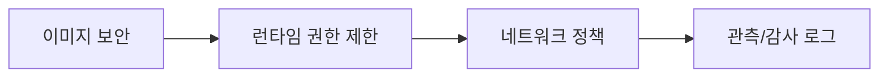

# Containers 101 (8/10): Container Security

이 글은 Containers 101 시리즈의 여덟 번째 글입니다.

컨테이너는 격리되어 있으니 기본적으로 안전할 것처럼 느껴집니다. 하지만 기본값 그대로 실행하면 root 사용자, 과한 capability, 느슨한 시크릿 처리, 검증 없는 이미지가 그대로 운영에 들어가기도 합니다.

여기서는 non-root, capability 축소, seccomp, 읽기 전용 파일시스템, 이미지 스캔과 서명이 어떻게 하나의 보안 기본선으로 이어지는지 정리합니다.


*Containers 101 8장 흐름 개요*
> Container Security의 핵심은 root로 실행하지 않는 것, 최소 권한 원칙, 그리고 격리는 완전하지 않다는 가정 아래 심층 방어(defense-in-depth)입니다.

## 먼저 던지는 질문

- 격리된 컨테이너가 왜 자동으로 안전한 것은 아닐까요?
- non-root 실행은 어떤 보안 의미를 가질까요?
- capabilities와 seccomp는 무엇을 줄여 줄까요?

## 왜 중요한가

기본 컨테이너는 생각보다 많은 권한을 가질 수 있습니다. 별도 조치를 하지 않으면 root로 실행되고, 불필요한 capability를 가진 채 시작하며, 시크릿도 환경 변수에 그대로 노출되기 쉽습니다.

그래서 컨테이너 보안은 “컨테이너를 썼으니 안전하다”가 아니라 “기본값을 얼마나 줄였는가”의 문제입니다. 보안 사고는 대개 복잡한 공격보다 느슨한 기본값에서 시작합니다.

## 한눈에 보는 개념

이미지는 먼저 검사하고, 가능하면 서명하고, 실행 시에는 비root·최소 capability·적절한 시크릿 마운트로 공격 표면을 줄입니다.

```text
┌─────────────────────────────────────────────────────────────┐
│  7-Layer Container Security Stack                           │
├─────────────────────────────────────────────────────────────┤
│  Layer 7  │ 이미지 서명 검증 (Cosign, Notation)             │
│  Layer 6  │ 이미지 스캔 (Trivy, Grype) — CVE 차단           │
│  Layer 5  │ 시크릿 분리 (볼륨 마운트 / Secret Manager)       │
│  Layer 4  │ 읽기 전용 루트 파일시스템 (--read-only)          │
│  Layer 3  │ seccomp 프로파일 — 시스템 콜 제한               │
│  Layer 2  │ capability 축소 (--cap-drop=ALL + 최소 추가)    │
│  Layer 1  │ non-root 실행 (--user 1000:1000)                │
├─────────────────────────────────────────────────────────────┤
│  Host     │ 커널 보안 모듈 (AppArmor / SELinux)              │
└─────────────────────────────────────────────────────────────┘
```

아래에서 위로 올라갈수록 공급망 신뢰 영역에 가까워집니다. Layer 1-4는 런타임 권한 축소, Layer 5-7은 공급망 무결성 영역입니다. 어느 한 계층만으로는 충분하지 않고, 여러 계층이 겹쳐야 하나가 뚫려도 다음 계층이 막아 줍니다.

## 핵심 용어

- **non-root**: UID 0(root)이 아닌 일반 사용자(UID 1000 등)로 프로세스를 실행하는 방식입니다. 컨테이너가 탈출해도 호스트에서 root가 아니므로 피해 범위가 줄어듭니다.
- **capability**: Linux 커널이 root 권한을 약 40개 조각으로 나눈 것입니다. 예를 들어 `CAP_NET_BIND_SERVICE`는 1024 미만 포트 바인딩, `CAP_SYS_ADMIN`은 마운트·namespace 조작 등 광범위한 권한을 의미합니다.
- **seccomp**: Secure Computing Mode의 약자로, 컨테이너가 호출할 수 있는 시스템 콜 목록을 JSON 프로파일로 제한합니다. Docker 기본 프로파일은 약 300개 중 44개를 차단합니다.
- **image scanning**: 이미지 레이어에 포함된 OS 패키지와 언어 의존성을 CVE 데이터베이스와 대조해 알려진 취약점을 보고하는 절차입니다.
- **secret**: 데이터베이스 비밀번호, API 키, TLS 인증서처럼 노출되면 안 되는 민감 값입니다. 환경 변수보다 전용 시스템(Docker Secret, Vault, AWS Secrets Manager)이나 읽기 전용 볼륨 마운트로 전달해야 합니다.
- **privileged**: `--privileged` 플래그로 실행하면 모든 capability가 부여되고 장치 접근이 열립니다. 호스트와 거의 동일한 권한을 갖게 되므로 운영에서는 거의 사용하지 않아야 합니다.

capability와 seccomp를 함께 이해하면 "root가 아니면 끝"이 아니라 실행 권한 표면을 단계적으로 줄여 가는 구조가 보입니다. capability는 "무엇을 할 수 있는가"를, seccomp는 "어떤 커널 인터페이스를 호출할 수 있는가"를 제어합니다.

## 적용 전후

**Before** — root와 과도한 권한으로 컨테이너를 실행합니다.

```bash
# 위험한 기본값 그대로 실행
docker run -d \
  --privileged \
  -e DB_PASSWORD=supersecret \
  myorg/api:latest

# 확인: root로 실행 중
docker exec <container> id
# uid=0(root) gid=0(root) groups=0(root)

# 확인: 모든 capability 보유
docker exec <container> cat /proc/1/status | grep Cap
# CapEff: 000001ffffffffff  (모든 capability)
```

**After** — non-root, 최소 capability, seccomp, 읽기 전용 파일시스템으로 공격 표면을 줄입니다.

```bash
# 보안 기본값 적용
docker run -d \
  --user 1000:1000 \
  --read-only \
  --tmpfs /tmp \
  --cap-drop=ALL \
  --cap-add=NET_BIND_SERVICE \
  --security-opt no-new-privileges \
  -v /run/secrets/db_pw:/run/secrets/db_pw:ro \
  myorg/api:latest

# 확인: non-root
docker exec <container> id
# uid=1000 gid=1000 groups=1000

# 확인: 최소 capability만 보유
docker exec <container> cat /proc/1/status | grep Cap
# CapEff: 0000000000000400  (NET_BIND_SERVICE만)
```

보안은 하나의 기능이 아니라 기본값을 덜 위험하게 바꾸는 연속된 선택입니다. Before에서 After로 가는 데 복잡한 도구는 필요 없습니다. Docker CLI 옵션 몇 개만으로 공격 표면이 눈에 띄게 줄어듭니다.

## 실습: 컨테이너를 더 안전하게 실행하기

### 단계 1 — 이미지 스캔
```python
import subprocess

def scan(image):
    res = subprocess.run(
        ["trivy", "image", "--severity", "HIGH,CRITICAL", image],
        capture_output=True, text=True,
    )
    return res.returncode == 0
```

실행 전 이미지 스캔을 먼저 합니다. 취약점은 런타임 정책만으로 해결되지 않기 때문에 공급망 입구부터 확인해야 합니다.

### 단계 2 — non-root 강제
```python
def run_nonroot(image):
    subprocess.run([
        "docker", "run", "--rm", "-d",
        "--user", "1000:1000", image,
    ], check=True)
```

비root 실행은 가장 기본적인 권한 축소입니다. root가 아니면 불가능한 공격 범위를 자연스럽게 줄일 수 있습니다.

### 단계 3 — 권한 제거
```python
def run_min_caps(image):
    subprocess.run([
        "docker", "run", "--rm", "-d",
        "--cap-drop=ALL", "--cap-add=NET_BIND_SERVICE", image,
    ], check=True)
```

필요한 capability만 다시 추가합니다. “모두 허용 후 일부 차단”보다 “모두 제거 후 필요한 것만 허용”이 더 안전한 기본값입니다.

### 단계 4 — 읽기 전용 파일시스템
```python
def run_readonly(image):
    subprocess.run([
        "docker", "run", "--rm", "-d",
        "--read-only", "--tmpfs", "/tmp", image,
    ], check=True)
```

읽기 전용 루트 파일시스템은 런타임에서 쓰기 가능 면적을 줄여 줍니다. 애플리케이션이 실제로 어디에 써야 하는지 더 명확하게 드러나는 장점도 있습니다.

### 단계 5 — 시크릿 마운트
```python
def run_with_secret(image, secret_path):
    subprocess.run([
        "docker", "run", "--rm", "-d",
        "-v", f"{secret_path}:/run/secrets/db_pw:ro", image,
    ], check=True)
```

시크릿은 환경 변수보다 읽기 전용 마운트나 전용 시크릿 시스템을 통해 다루는 편이 안전합니다.

## 이 코드에서 먼저 봐야 할 점

- `--user`는 root 실행을 피하게 합니다.
- `--cap-drop=ALL` 이후 필요한 capability만 다시 추가합니다.
- 시크릿은 볼륨처럼 마운트해서 전달합니다.

이 세 가지는 복잡한 보안 제품이 없어도 바로 적용할 수 있는 기본값입니다. 초반에 이 기준만 잡아도 보안 수준이 눈에 띄게 좋아집니다.

## 빠른 검증과 장애 신호

```bash
trivy image --severity HIGH,CRITICAL python:3.12-slim
docker run --rm --user 1000:1000 python:3.12-slim id
docker run --rm --cap-drop=ALL --cap-add=NET_BIND_SERVICE nginx:1.27-alpine nginx -t
docker run --rm --read-only --tmpfs /tmp python:3.12-slim python -c "print("ok")"
```

**Expected output:**
- `id` 출력에서 root가 아닌 UID/GID가 보입니다.
- 필요한 capability만 추가해도 서비스가 동작하는지 확인할 수 있습니다.
- 읽기 전용 루트 파일시스템에서도 예외 경로만 쓰면 기동 가능합니다.

**먼저 확인할 것:**
- non-root에서 실패하면 쓰기 경로와 파일 소유권을 먼저 봅니다.
- `--read-only` 실패 시 앱이 어디에 임시 파일을 쓰는지 추적합니다.
- 스캔 결과가 많으면 베이스 이미지와 패키지 구성을 먼저 정리합니다.

## 자주 하는 실수 5가지

1. **root로 실행하면서 내부를 믿습니다.**
   Dockerfile에 `USER` 지시어가 없으면 기본값은 root입니다. "내부 서비스니까 괜찮다"는 생각은 컨테이너 탈출 취약점이 나올 때 호스트 전체 장악으로 이어집니다. `docker exec <container> id` 한 줄로 확인할 수 있습니다.

2. **시크릿을 환경 변수로 그대로 노출합니다.**
   `docker inspect`나 `/proc/<pid>/environ`으로 누구나 읽을 수 있습니다. 환경 변수는 로그에 찍히기도 쉽습니다. 읽기 전용 볼륨 마운트(`-v secret:/run/secrets/key:ro`)나 Docker Secret, Vault 같은 전용 시스템을 사용해야 합니다.

3. **스캔 없이 운영에 배포합니다.**
   베이스 이미지에 이미 수십 개의 HIGH/CRITICAL CVE가 있을 수 있습니다. CI에 `trivy image --exit-code 1`을 넣으면 취약한 이미지가 운영에 도달하기 전에 차단됩니다.

4. **privileged 컨테이너를 과하게 사용합니다.**
   `--privileged`는 모든 capability를 부여하고, `/dev` 장치 접근을 열고, seccomp/AppArmor를 해제합니다. 사실상 호스트와 동일한 권한입니다. 필요한 capability만 `--cap-add`로 추가하는 것이 올바른 접근입니다.

5. **서명 검증을 생략해 이미지 바꿔치기 위험을 엽니다.**
   레지스트리가 침해되거나 tag가 덮어씌워지면 의도하지 않은 이미지가 배포됩니다. `cosign verify`로 서명을 확인하거나, digest 기반(`image@sha256:...`)으로 pull하면 이 위험을 제거할 수 있습니다.

보안 사고는 대개 고급 기법보다 기본값 방치에서 시작합니다. 위 다섯 가지를 먼저 점검하는 것만으로도 대부분의 초기 위험을 줄일 수 있습니다.

## 운영에서는 이렇게 나타납니다

| 환경 | non-root 강제 | capability 제한 | 시크릿 관리 | 이미지 검증 |
| --- | --- | --- | --- | --- |
| Docker CLI | `--user 1000:1000` | `--cap-drop=ALL --cap-add=...` | `-v secret:path:ro` | `cosign verify` |
| Docker Compose | `user: "1000:1000"` | `cap_drop: ["ALL"]` | `secrets:` 블록 | CI에서 사전 검증 |
| Kubernetes | `runAsNonRoot: true` | `drop: ["ALL"]` | `Secret` 리소스 / CSI | admission controller |
| CI/CD | Dockerfile `USER` 검사 | lint 정책 | 환경 변수 금지 규칙 | `--exit-code 1` 게이트 |

Kubernetes에서는 Pod Security Standards(Baseline, Restricted)와 admission controller(OPA Gatekeeper, Kyverno)를 통해 위 정책을 클러스터 전체에 강제합니다. 로컬에서 배운 보안 기본값이 오케스트레이션 환경에서는 선언형 정책으로 확장되는 구조입니다.

```yaml
# Kubernetes Pod Security Context 예시
apiVersion: v1
kind: Pod
metadata:
  name: secure-pod
spec:
  securityContext:
    runAsNonRoot: true
    runAsUser: 1000
    fsGroup: 1000
  containers:
  - name: app
    image: myorg/api:1.0.0
    securityContext:
      allowPrivilegeEscalation: false
      readOnlyRootFilesystem: true
      capabilities:
        drop: ["ALL"]
        add: ["NET_BIND_SERVICE"]
```

이 매니페스트는 앞서 Docker CLI로 적용한 보안 옵션과 동일한 효과를 선언형으로 표현한 것입니다.

## 시니어 엔지니어는 이렇게 생각합니다

- 기본값은 대체로 위험하다고 전제합니다. "동작한다"와 "안전하다"는 다른 문장입니다.
- capability는 명시적으로 필요한 것만 더합니다. `CAP_SYS_ADMIN`이 필요하다면 설계를 다시 봅니다.
- 시크릿은 전용 시스템에 둡니다. 환경 변수에 넣는 순간 로그·inspect·crash dump 어디에서든 노출됩니다.
- 스캔은 CI 게이트의 일부라고 봅니다. 스캔 결과를 사람이 보고 판단하는 방식은 확장되지 않습니다.
- 서명은 공급망 신뢰의 시작이라고 생각합니다. tag는 덮어쓸 수 있지만 서명과 digest는 변경 불가능합니다.

| PR 리뷰 체크 항목 | 확인 질문 |
| --- | --- |
| Dockerfile USER | `USER` 지시어가 있는가? root면 이유가 문서화되었는가? |
| capability | `--cap-drop=ALL` 후 추가 목록이 최소인가? |
| 시크릿 경로 | 환경 변수로 전달하는 시크릿이 없는가? |
| 읽기 전용 FS | `--read-only` 또는 `readOnlyRootFilesystem`이 설정되었는가? |
| 이미지 태그 | `:latest` 대신 digest 또는 immutable tag를 쓰는가? |
| 스캔 게이트 | CI에서 HIGH/CRITICAL 차단이 활성화되어 있는가? |
| privileged 금지 | `--privileged`가 없는가? 있으면 예외 승인이 있는가? |

시니어 엔지니어는 보안을 "특별한 모드"로 보지 않습니다. 평소 기본값이 곧 보안 수준을 만든다고 보기 때문에 Dockerfile, 런타임 옵션, CI 정책을 함께 설계합니다. 코드 리뷰에서 위 표의 항목이 하나라도 빠지면 "동작은 하지만 운영 준비는 안 됐다"고 판단합니다.

## 체크리스트

- [ ] non-root 사용자로 실행합니다.
- [ ] `cap-drop=ALL` 후 최소 capability만 추가합니다.
- [ ] 읽기 전용 파일시스템을 검토했습니다.
- [ ] 시크릿은 볼륨 또는 전용 시크릿 매니저로 전달합니다.

## 연습 문제

1. capability가 왜 존재하는지 한 줄로 설명해 보세요.
2. seccomp의 역할을 한 줄로 설명해 보세요.
3. 서명된 이미지가 막아 주는 공격 하나를 적어 보세요.

## 정리와 다음 글

컨테이너 보안은 격리를 믿는 태도가 아니라 권한을 줄이고 이미지를 검증하고 런타임 정책을 명시하는 태도에서 시작합니다. non-root, capability 축소, 시크릿 분리, 이미지 스캔과 서명을 함께 가져가야 기본이 갖춰집니다.

다음 글에서는 컨테이너와 VM의 차이를 비교하며, 어떤 격리 모델을 언제 선택해야 하는지 봅니다.


## 심화: 이미지 스캔 도구 비교와 런타임 최소권한 설계

컨테이너 보안은 특정 도구 하나를 도입한다고 끝나지 않습니다. 이미지 단계에서 취약점을 줄이고, 런타임 단계에서 권한을 줄이고, 배포 단계에서 무결성을 검증해야 합니다. 이 세 단계가 이어져야 실제 위험이 줄어듭니다.

## 스캔 도구 비교

| 도구 | 강점 | 주의점 | 대표 사용 위치 |
| --- | --- | --- | --- |
| Trivy | 사용이 간단, 빠른 스캔 | 정책 커스터마이징은 추가 작업 필요 | 로컬/CI |
| Grype | SBOM 기반 분석 강점 | 초기 학습 필요 | CI, 보안팀 파이프라인 |
| Docker Scout | Docker 생태계 통합 | 도구 종속성 고려 필요 | Docker 중심 팀 |
| Snyk Container | 정책/리포팅 강점 | 유료 기능 고려 | 기업 보안 운영 |

도구 선택보다 중요한 것은 "어느 심각도에서 빌드를 실패시킬 것인가"입니다. 보통 HIGH/CRITICAL 기준 차단부터 시작합니다.

## Distroless vs Alpine 비교

| 항목 | Distroless | Alpine |
| --- | --- | --- |
| 이미지 크기 | 매우 작음 | 작음 |
| 셸/패키지 도구 | 없음 | 있음 |
| 운영 디버깅 | 어렵지만 공격 표면 작음 | 상대적으로 쉬움 |
| 권장 사용처 | 안정화된 프로덕션 서비스 | 개발/테스트/일반 운영 |

Distroless는 공격 표면을 줄이는 데 효과적이지만, 셸이 없어 긴급 디버깅이 어렵습니다. 따라서 팀의 운영 성숙도에 맞춰 선택해야 합니다.

## 런타임 최소권한 실행 예시

```bash
docker run --rm -d   --user 1000:1000   --read-only   --tmpfs /tmp   --cap-drop=ALL   --cap-add=NET_BIND_SERVICE   myorg/api:1.0.0
```

이 명령은 보안 기본값을 명확히 보여 줍니다.

- root 금지
- 쓰기 가능한 루트 파일시스템 금지
- capability 최소화
- 임시 쓰기 경로만 제한 허용

## CI 보안 게이트 예시

```bash
trivy image --severity HIGH,CRITICAL --exit-code 1 myorg/api:1.0.0
cosign verify myorg/api:1.0.0
```

이 두 단계만으로도 "취약점 많은 이미지"와 "검증되지 않은 이미지"를 배포 전 차단할 수 있습니다.

## 운영 체크리스트

- non-root 실행 기본값
- capability 최소화 정책
- read-only root filesystem 검토
- 시크릿은 파일 마운트 또는 전용 매니저 사용
- 스캔/서명 검증을 CI 필수 단계로 설정

보안은 복잡한 도구보다 기본 실행 옵션의 일관성에서 시작합니다. 이 기본값이 팀 전반에 적용되어야 사고 빈도를 줄일 수 있습니다.


## 추가 실무 노트: 정책 기반 차단과 예외 관리

보안 정책을 CI에 넣을 때는 "차단 기준"과 "예외 승인 절차"를 함께 정의해야 합니다. 차단만 있고 예외 절차가 없으면 우회가 늘고, 예외만 많으면 정책이 무력화됩니다.

권장 절차:

1. HIGH/CRITICAL 기본 차단
2. 예외는 티켓 번호와 만료일 필수
3. 만료 시 자동 재검토

이 방식은 개발 속도와 보안 기준을 동시에 지키는 현실적인 균형점입니다.


## 추가 정리: 운영 적용 전 최종 점검 질문

아래 질문은 도구 지식이 아니라 운영 준비도를 확인하기 위한 질문입니다. 각 질문에 문서와 명령으로 답할 수 있어야 실제 팀 운영에서 반복 가능한 품질을 만들 수 있습니다.

1. 이 구성은 새 팀원이 같은 절차로 재현할 수 있는가?
2. 실패했을 때 어디서 원인을 확인해야 하는지 런북이 있는가?
3. 보안 기본값(root 금지, 최소 권한, 시크릿 분리)이 강제되는가?
4. 버전과 아티팩트 동일성(digest, lock file)이 보장되는가?
5. 데이터/네트워크/권한 경계가 문서로 정의되어 있는가?

다음은 공통 점검 명령 예시입니다.

```bash
# 아티팩트 동일성
docker inspect --format '{{index .RepoDigests 0}}' <image>

# 실행 상태
docker ps --format 'table {{.Names}}	{{.Status}}	{{.Ports}}'

# 로그 관측
docker logs --tail 100 <container>

# 네트워크/볼륨 구조
docker network ls
docker volume ls
```

이 명령 자체가 중요한 것이 아니라, 팀이 같은 순서로 문제를 좁혀 가는 절차를 공유한다는 점이 중요합니다. 컨테이너 운영의 성숙도는 개인의 숙련도보다 팀의 표준화 수준에서 결정됩니다. 따라서 시리즈 학습의 최종 목표는 기능 이해가 아니라 운영 계약의 명문화입니다.

## 실무 확장: 보안 기본값을 실행 옵션으로 고정하기

컨테이너 보안은 스캔 도구만으로 완성되지 않습니다. 실행 시점의 권한, 파일시스템 정책, 시스템 호출 제약을 함께 설정해야 실제 위험을 낮출 수 있습니다.

### 최소 권한 실행 예시

```bash
docker run --rm   --read-only   --cap-drop ALL   --security-opt no-new-privileges   --pids-limit 256   --memory 256m   myorg/secure-app:latest
```

이 옵션 조합은 과도한 권한 확대와 프로세스 폭주를 동시에 제어합니다.

### Compose 보안 설정 예시

```yaml
services:
  api:
    image: myorg/secure-app:latest
    read_only: true
    cap_drop: ["ALL"]
    security_opt:
      - no-new-privileges:true
    tmpfs:
      - /tmp
```

보안 옵션을 선언형으로 관리하면 코드 리뷰에서 변경 이력을 추적하기 쉽습니다.

### seccomp와 capability 관점

- `seccomp`: 허용 시스템 호출 집합을 제한합니다.
- `capability`: 루트 권한을 세분화해 필요한 권한만 남깁니다.

### 방어 계층 도식



## 실무 확장: 스캔 결과를 릴리스 조건으로 연결하기

```bash
trivy image --severity HIGH,CRITICAL --exit-code 1 myorg/secure-app:latest
```

취약점 보고서만 저장하면 개선이 지연됩니다. 실패 임계치를 파이프라인에 연결해 배포 게이트로 동작하게 해야 합니다.

## 처음 질문으로 돌아가기

- **격리된 컨테이너가 왜 자동으로 안전한 것은 아닐까요?**
  - 컨테이너는 호스트 커널을 공유합니다. namespace와 cgroup은 리소스 격리를 제공하지만, 커널 취약점이 있으면 격리를 우회할 수 있습니다. 기본값으로 root 실행, 과도한 capability, 느슨한 seccomp 프로파일이 적용되므로 "컨테이너를 썼다"는 사실만으로는 안전하지 않습니다. 격리는 방어의 한 계층일 뿐, 전부가 아닙니다.

- **non-root 실행은 어떤 보안 의미를 가질까요?**
  - root(UID 0)로 실행하면 컨테이너 탈출 시 호스트에서도 root 권한을 얻을 가능성이 높아집니다. non-root(UID 1000 등)로 실행하면 탈출하더라도 일반 사용자 권한이므로 피해 범위가 제한됩니다. 또한 컨테이너 내부에서도 파일 소유권, 포트 바인딩, 장치 접근 등이 자연스럽게 제한되어 공격자가 활용할 수 있는 수단이 줄어듭니다.

- **capabilities와 seccomp는 무엇을 줄여 줄까요?**
  - capability는 "무엇을 할 수 있는가"(마운트, 네트워크 설정, 시스템 시간 변경 등)를 제어하고, seccomp는 "어떤 커널 시스템 콜을 호출할 수 있는가"를 제어합니다. 둘을 함께 적용하면 공격자가 컨테이너 안에서 실행할 수 있는 행위의 범위가 크게 줄어듭니다. `--cap-drop=ALL`로 시작해 필요한 것만 추가하고, Docker 기본 seccomp 프로파일이 차단하는 44개 시스템 콜을 유지하는 것이 최소 기준입니다.

<!-- toc:begin -->
## 시리즈 목차

- [Containers 101 (1/10): Container란 무엇인가?](./01-what-is-a-container.md)
- [Containers 101 (2/10): Image와 Layer](./02-image-and-layer.md)
- [Containers 101 (3/10): Runtime](./03-runtime.md)
- [Containers 101 (4/10): Dockerfile](./04-dockerfile.md)
- [Containers 101 (5/10): Volume](./05-volume.md)
- [Containers 101 (6/10): Network](./06-network.md)
- [Containers 101 (7/10): Registry](./07-registry.md)
- **Container Security (현재 글)**
- Containers vs VMs (예정)
- 실전 컨테이너 앱 만들기 (예정)

<!-- toc:end -->

## 참고 자료

- Containers 101 예제 코드: https://github.com/yeongseon-books/book-examples/tree/main/containers-101/ko
- [Docker security](https://docs.docker.com/engine/security/)
- [Kubernetes Pod Security Standards](https://kubernetes.io/docs/concepts/security/pod-security-standards/)
- [Trivy](https://aquasecurity.github.io/trivy/)
- [seccomp profiles](https://docs.docker.com/engine/security/seccomp/)

Tags: Containers, Docker, Kubernetes, DevOps
