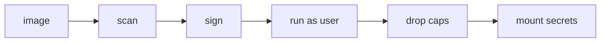

# Container Security

> Containers 101 시리즈 (8/10)


## 이 글에서 다룰 문제

기본 설정의 컨테이너는 root로 동작하고 권한도 과하게 열려 있는 경우가 많습니다. 이런 상태가 보안 사고의 출발점이 됩니다.

## 전체 흐름


## Before/After

**Before**: root와 넓은 권한을 그대로 둔 채 실행합니다.

**After**: non-root, 최소 capability, seccomp 조합으로 공격면을 줄입니다.

## 안전한 컨테이너 실행

### 1단계 — 이미지 스캔

```python
import subprocess

def scan(image):
    res = subprocess.run(
        ["trivy", "image", "--severity", "HIGH,CRITICAL", image],
        capture_output=True, text=True,
    )
    return res.returncode == 0
```

### 2단계 — non-root 강제

```python
def run_nonroot(image):
    subprocess.run([
        "docker", "run", "--rm", "-d",
        "--user", "1000:1000", image,
    ], check=True)
```

### 3단계 — capability 드롭

```python
def run_min_caps(image):
    subprocess.run([
        "docker", "run", "--rm", "-d",
        "--cap-drop=ALL", "--cap-add=NET_BIND_SERVICE", image,
    ], check=True)
```

### 4단계 — read-only fs

```python
def run_readonly(image):
    subprocess.run([
        "docker", "run", "--rm", "-d",
        "--read-only", "--tmpfs", "/tmp", image,
    ], check=True)
```

### 5단계 — 시크릿 마운트

```python
def run_with_secret(image, secret_path):
    subprocess.run([
        "docker", "run", "--rm", "-d",
        "-v", f"{secret_path}:/run/secrets/db_pw:ro", image,
    ], check=True)
```

## 이 코드에서 주목할 점

- `--user`로 root 실행을 피합니다.
- `--cap-drop=ALL`을 적용한 뒤 필요한 capability만 다시 추가합니다.
- 시크릿은 환경 변수보다 볼륨 마운트 방식이 안전합니다.

## 자주 하는 실수 5가지

1. **root로 실행한 뒤 내부 네트워크만 믿고 안심합니다.**
2. **시크릿을 환경 변수에 그대로 노출합니다.**
3. **이미지 스캔 없이 프로덕션에 바로 배포합니다.**
4. **privileged 컨테이너를 쉽게 남용합니다.**
5. **서명 검증을 생략해서 이미지 교체 공격 여지를 남깁니다.**

## 실무에서는 이렇게 쓰입니다

실무에서는 Kubernetes PodSecurity와 admission controller가 non-root, no privileged, signed only 같은 정책을 런타임에서 강제합니다.

## 체크리스트

- [ ] non-root 사용자를 적용했습니다.
- [ ] `cap-drop=ALL` 뒤에 필요한 capability만 추가했습니다.
- [ ] read-only 파일시스템을 검토했습니다.
- [ ] 시크릿은 볼륨이나 시크릿 매니저로 분리했습니다.

## 정리 및 다음 단계

보안 원칙을 이해했다면 이제 컨테이너와 VM의 근본 차이를 정리할 차례입니다. 다음 글은 Container와 VM 차이입니다.

<!-- toc:begin -->
- [Container란 무엇인가?](./01-what-is-a-container.md)
- [Image와 Layer](./02-image-and-layer.md)
- [Runtime](./03-runtime.md)
- [Dockerfile](./04-dockerfile.md)
- [Volume](./05-volume.md)
- [Network](./06-network.md)
- [Registry](./07-registry.md)
- **Container Security (현재 글)**
- Container와 VM 차이 (예정)
- 실전 컨테이너 앱 만들기 (예정)
<!-- toc:end -->

## 참고 자료

- [Docker security](https://docs.docker.com/engine/security/)
- [Kubernetes Pod Security Standards](https://kubernetes.io/docs/concepts/security/pod-security-standards/)
- [Trivy](https://aquasecurity.github.io/trivy/)
- [seccomp profiles](https://docs.docker.com/engine/security/seccomp/)

Tags: Containers, Security, seccomp, Cosign, DevOps
