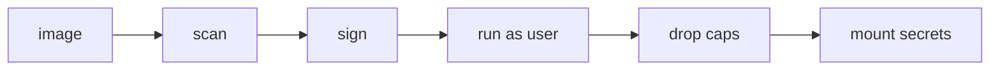

# Container Security

이 글은 Containers 101 시리즈의 여덟 번째 글입니다.

## 이 글에서 다룰 문제

- 격리된 컨테이너가 왜 자동으로 안전한 것은 아닐까요?
- non-root 실행은 어떤 보안 의미를 가질까요?
- capabilities와 seccomp는 무엇을 줄여 줄까요?
- 이미지 스캔과 시크릿 처리는 어디서부터 시작해야 할까요?
- 서명 강제는 왜 공급망 보안과 연결될까요?

> 컨테이너 보안의 기본은 최소 권한, 신뢰 가능한 이미지, 런타임 정책입니다. 격리 자체를 믿기보다 무엇을 줄이고 무엇을 검증할지 명시해야 안전해집니다.

## 왜 중요한가

기본 컨테이너는 생각보다 많은 권한을 가질 수 있습니다. 별도 조치를 하지 않으면 root로 실행되고, 불필요한 capability를 가진 채 시작하며, 시크릿도 환경 변수에 그대로 노출되기 쉽습니다.

그래서 컨테이너 보안은 “컨테이너를 썼으니 안전하다”가 아니라 “기본값을 얼마나 줄였는가”의 문제입니다. 보안 사고는 대개 복잡한 공격보다 느슨한 기본값에서 시작합니다.

## 한눈에 보는 개념



이미지는 먼저 검사하고, 가능하면 서명하고, 실행 시에는 비root·최소 capability·적절한 시크릿 마운트로 공격 표면을 줄입니다.

## 핵심 용어

- **non-root**: UID 1000 같은 일반 사용자로 실행하는 방식입니다.
- **capability**: root 권한을 잘게 나눈 조각입니다.
- **seccomp**: 허용할 시스템 콜을 제한하는 정책입니다.
- **image scanning**: 알려진 CVE를 기준으로 이미지를 검사하는 절차입니다.
- **secret**: 환경 변수보다 전용 시스템이나 볼륨 마운트로 다뤄야 하는 민감 값입니다.

특히 capability와 seccomp를 함께 이해하면 “root가 아니면 끝”이 아니라 실행 권한 표면을 단계적으로 줄여 가는 구조가 보입니다.

## Before / After

**Before**: root와 과도한 권한으로 컨테이너를 실행합니다.

**After**: non-root, 최소 capability, seccomp로 공격 표면을 줄입니다.

보안은 하나의 기능이 아니라 기본값을 덜 위험하게 바꾸는 연속된 선택입니다.

## 실습: 컨테이너를 더 안전하게 실행하기

### Step 1 — Scan the image

```python
import subprocess

def scan(image):
    res = subprocess.run(
        ["trivy", "image", "--severity", "HIGH,CRITICAL", image],
        capture_output=True, text=True,
    )
    return res.returncode == 0
```

실행 전 이미지 스캔을 먼저 합니다. 취약점은 런타임 정책만으로 해결되지 않기 때문에 공급망 입구부터 확인해야 합니다.

### Step 2 — Force non-root

```python
def run_nonroot(image):
    subprocess.run([
        "docker", "run", "--rm", "-d",
        "--user", "1000:1000", image,
    ], check=True)
```

비root 실행은 가장 기본적인 권한 축소입니다. root가 아니면 불가능한 공격 범위를 자연스럽게 줄일 수 있습니다.

### Step 3 — Drop capabilities

```python
def run_min_caps(image):
    subprocess.run([
        "docker", "run", "--rm", "-d",
        "--cap-drop=ALL", "--cap-add=NET_BIND_SERVICE", image,
    ], check=True)
```

필요한 capability만 다시 추가합니다. “모두 허용 후 일부 차단”보다 “모두 제거 후 필요한 것만 허용”이 더 안전한 기본값입니다.

### Step 4 — Read-only filesystem

```python
def run_readonly(image):
    subprocess.run([
        "docker", "run", "--rm", "-d",
        "--read-only", "--tmpfs", "/tmp", image,
    ], check=True)
```

읽기 전용 루트 파일시스템은 런타임에서 쓰기 가능 면적을 줄여 줍니다. 애플리케이션이 실제로 어디에 써야 하는지 더 명확하게 드러나는 장점도 있습니다.

### Step 5 — Mount a secret

```python
def run_with_secret(image, secret_path):
    subprocess.run([
        "docker", "run", "--rm", "-d",
        "-v", f"{secret_path}:/run/secrets/db_pw:ro", image,
    ], check=True)
```

시크릿은 환경 변수보다 읽기 전용 마운트나 전용 시크릿 시스템을 통해 다루는 편이 안전합니다.

## 이 코드에서 먼저 봐야 할 점

- `--user`는 root 실행을 피하게 합니다.
- `--cap-drop=ALL` 이후 필요한 capability만 다시 추가합니다.
- 시크릿은 볼륨처럼 마운트해서 전달합니다.

이 세 가지는 복잡한 보안 제품이 없어도 바로 적용할 수 있는 기본값입니다. 초반에 이 기준만 잡아도 보안 수준이 눈에 띄게 좋아집니다.

## 자주 하는 실수 5가지

1. **root로 실행하면서 내부를 믿습니다.**
2. **시크릿을 환경 변수로 그대로 노출합니다.**
3. **스캔 없이 운영에 배포합니다.**
4. **privileged 컨테이너를 과하게 사용합니다.**
5. **서명 검증을 생략해 이미지 바꿔치기 위험을 엽니다.**

보안 사고는 대개 고급 기법보다 기본값 방치에서 시작합니다. 그래서 가장 먼저 점검해야 할 것도 거창한 도구가 아니라 기본 실행 옵션입니다.

## 운영에서는 이렇게 나타납니다

Kubernetes에서는 Pod Security, admission controller 같은 정책을 통해 non-root, privileged 금지, signed image only 같은 규칙을 런타임에 강제하기도 합니다. 즉, 로컬에서 배운 보안 기본값이 오케스트레이션 환경에서는 정책으로 확장됩니다.

## 시니어 엔지니어는 이렇게 생각합니다

- 기본값은 대체로 위험하다고 전제합니다.
- capability는 명시적으로 필요한 것만 더합니다.
- 시크릿은 전용 시스템에 둡니다.
- 스캔은 CI 게이트의 일부라고 봅니다.
- 서명은 공급망 신뢰의 시작이라고 생각합니다.

시니어 엔지니어는 보안을 “특별한 모드”로 보지 않습니다. 평소 기본값이 곧 보안 수준을 만든다고 보기 때문에 Dockerfile, 런타임 옵션, CI 정책을 함께 설계합니다.

## 체크리스트

- [ ] non-root 사용자로 실행합니다.
- [ ] `cap-drop=ALL` 후 최소 capability만 추가합니다.
- [ ] 읽기 전용 파일시스템을 검토했습니다.
- [ ] 시크릿은 볼륨 또는 전용 시크릿 매니저로 전달합니다.

## 연습 문제

1. capability가 왜 존재하는지 한 줄로 설명해 보세요.
2. seccomp의 역할을 한 줄로 설명해 보세요.
3. 서명된 이미지가 막아 주는 공격 하나를 적어 보세요.

## 정리와 다음 글

컨테이너 보안은 격리를 믿는 태도가 아니라 권한을 줄이고 이미지를 검증하고 런타임 정책을 명시하는 태도에서 시작합니다. non-root, capability 축소, 시크릿 분리, 이미지 스캔과 서명을 함께 가져가야 기본이 갖춰집니다.

다음 글에서는 컨테이너와 VM의 차이를 비교하며, 어떤 격리 모델을 언제 선택해야 하는지 살펴보겠습니다.

<!-- toc:begin -->
- [Container란 무엇인가?](./01-what-is-a-container.md)
- [Image와 Layer](./02-image-and-layer.md)
- [Runtime](./03-runtime.md)
- [Dockerfile](./04-dockerfile.md)
- [Volume](./05-volume.md)
- [Network](./06-network.md)
- [Registry](./07-registry.md)
- **Container Security (현재 글)**
- Container와 VM 차이 (예정)
- 실전 컨테이너 앱 만들기 (예정)
<!-- toc:end -->

## 참고 자료

- [Docker security](https://docs.docker.com/engine/security/)
- [Kubernetes Pod Security Standards](https://kubernetes.io/docs/concepts/security/pod-security-standards/)
- [Trivy](https://aquasecurity.github.io/trivy/)
- [seccomp profiles](https://docs.docker.com/engine/security/seccomp/)

Tags: Containers, Security, seccomp, Cosign, DevOps
