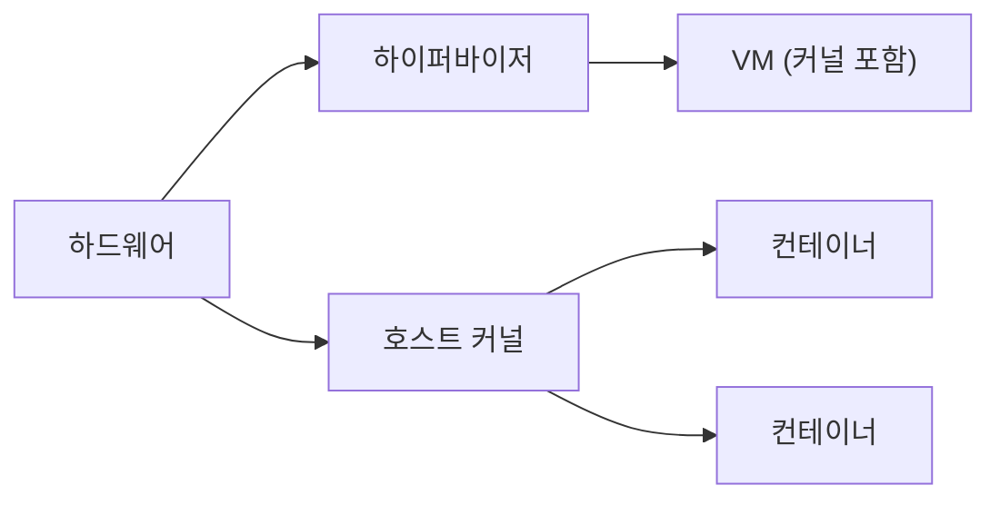

# Containers vs VMs

## 이 글에서 다룰 문제

- 컨테이너와 VM은 둘 다 격리를 제공하는데 무엇이 다를까요?
- 컨테이너가 가볍다고 말하는 이유는 정확히 어디에서 나올까요?
- VM이 더 강한 격리를 제공한다고 하는 이유는 무엇일까요?
- 시작 시간, 메모리 사용량, 운영 비용은 어떤 식으로 달라질까요?
- 어떤 워크로드는 컨테이너가 맞고, 어떤 워크로드는 VM이 더 나을까요?

> Containers 101 시리즈 (9/10)

컨테이너를 배우다 보면 종종 이런 오해가 생깁니다. 컨테이너가 VM을 완전히 대체한다는 생각입니다. 실제로는 그렇지 않습니다. 둘은 같은 문제를 다른 수준에서 푸는 도구이고, 어떤 환경에서는 함께 쓰이기도 합니다. 현대 클라우드 서비스가 컨테이너와 microVM을 같이 묶어 쓰는 이유도 바로 여기에 있습니다.

이 글에서는 컨테이너와 VM이 각각 어떤 격리 모델을 가지는지, 왜 시작 속도와 자원 사용이 다르게 나타나는지, 그리고 실무에서 두 기술을 어떻게 조합해 쓰는지 비교해 보겠습니다.

> 컨테이너는 호스트 커널을 공유하기 때문에 가볍고, VM은 자기 커널을 가지기 때문에 더 강한 격리를 제공합니다.

## 왜 중요한가

격리 수준을 워크로드에 맞게 고르면 비용과 보안을 함께 관리할 수 있습니다. 반대로 모든 것을 컨테이너로 몰아넣거나, 모든 것을 VM으로만 운영하면 둘 다 불필요한 대가를 치르게 됩니다. 이 둘은 경쟁 상대라기보다 서로 보완하는 도구라고 보는 편이 정확합니다.

## 한눈에 보는 구조



VM 쪽은 하이퍼바이저 위에서 게스트 운영체제와 커널까지 함께 부팅합니다. 컨테이너 쪽은 호스트 커널을 공유한 채 프로세스 격리 수준으로 실행됩니다. 그래서 둘의 무게감과 격리 특성이 달라집니다.

## 핵심 용어

- hypervisor: VM을 부팅하고 격리하는 가상화 계층입니다.
- guest kernel: VM 안에 들어 있는 전용 커널입니다.
- container: 호스트 커널을 공유하는 프로세스 격리 단위입니다.
- microVM: Firecracker처럼 가벼운 VM입니다.
- gVisor / Kata: 추가 격리를 더한 컨테이너 런타임 계열입니다.

## Before / After

Before에서는 모든 워크로드를 VM으로만 운영합니다. 이 방식은 격리는 강하지만 시작이 느리고 비용이 커지기 쉽습니다.

After에서는 일반 서비스는 컨테이너에 두고, 멀티 테넌트나 강한 경계가 필요한 워크로드는 VM 또는 microVM으로 분리합니다.

## 실습: 같은 앱을 두 방식으로 비교하기

### 1단계 — 컨테이너로 실행

```python
import subprocess, time

def run_container(image):
    t = time.time()
    subprocess.run(["docker", "run", "--rm", "-d", image], check=True)
    return time.time() - t
```

컨테이너는 운영체제를 새로 부팅하지 않으므로 시작 시간이 매우 짧습니다. 보통 밀리초에서 수초 안에 올라옵니다.

### 2단계 — VM으로 실행 (개념)

```python
def run_vm(image_path):
    t = time.time()
    subprocess.run([
        "qemu-system-x86_64", "-m", "1024", "-hda", image_path,
        "-display", "none", "-daemonize",
    ], check=True)
    return time.time() - t
```

여기서는 개념적으로 VM 부팅 시간을 재는 예시를 듭니다. 실제 운영체제와 커널을 올리는 과정이 들어가기 때문에 컨테이너보다 훨씬 무겁습니다.

### 3단계 — 메모리 사용 비교

```python
def mem_usage(pid):
    res = subprocess.run(
        ["ps", "-o", "rss=", "-p", str(pid)],
        capture_output=True, text=True, check=True,
    )
    return int(res.stdout.strip())
```

메모리 사용량은 격리 비용을 읽는 가장 현실적인 지표 가운데 하나입니다. 컨테이너는 프로세스 단위에 가깝고, VM은 운영체제 전체를 품기 때문에 기본 오버헤드가 더 큽니다.

### 4단계 — 시작 시간 비교

```python
def compare(image, vm_image):
    return {
        "container_sec": run_container(image),
        "vm_sec": run_vm(vm_image),
    }
```

두 실행 모델을 같은 기준으로 비교하면 추상적인 인상 대신 수치로 차이를 읽을 수 있습니다.

### 5단계 — 보고

```python
def report(stats):
    print(f"container={stats['container_sec']:.2f}s vm={stats['vm_sec']:.2f}s")
```

측정 자동화가 중요한 이유는 아키텍처 논의를 감으로 끝내지 않게 해 주기 때문입니다. 어떤 격리를 선택할지 이야기할 때는 실제 수치가 큰 도움이 됩니다.

## 이 코드에서 볼 점

- 컨테이너는 대체로 밀리초에서 수초 안에 시작합니다.
- VM은 보통 수초에서 수분 단위까지 걸릴 수 있습니다.
- 비교를 자동화하면 재현 가능한 의사결정 자료를 만들 수 있습니다.

## 자주 하는 실수 5가지

1. 모든 워크로드를 컨테이너에만 넣어 멀티 테넌트 격리를 약하게 만듭니다.
2. 모든 워크로드를 VM으로만 운영해 비용을 키웁니다.
3. 컨테이너 자체를 보안과 같은 말로 오해합니다.
4. Mac이나 Windows의 Docker가 내부적으로 VM을 사용한다는 점을 잊습니다.
5. 커널 의존성이 큰 워크로드를 무리하게 컨테이너로 밀어 넣습니다.

## 실무에서는 이렇게 쓰입니다

실무에서는 둘을 섞어 쓰는 사례가 많습니다. AWS Fargate나 Lambda가 Firecracker microVM 위에 컨테이너를 올리는 구조가 대표적입니다. 겉으로는 컨테이너처럼 빠르게 보이지만, 내부적으로는 VM 수준 격리를 더해 멀티 테넌트 안전성을 끌어올립니다.

## 실무에서는 이렇게 생각한다

- 격리 수준은 기술 취향이 아니라 비즈니스 요구를 따라갑니다.
- 컨테이너는 VM 안에서 돌아갈 수도 있습니다.
- 부팅 시간은 아키텍처 선택에 직접 영향을 줍니다.
- 멀티 테넌트 경계는 VM 쪽이 더 안전한 경우가 많습니다.
- 하이브리드 조합이 현대 운영의 기본값이 되고 있습니다.

## 체크리스트

- [ ] 서비스 격리는 컨테이너로 풀 수 있는지 검토했습니다.
- [ ] 테넌트 격리는 VM 또는 microVM이 필요한지 검토했습니다.
- [ ] 보안 등급을 문서화했습니다.
- [ ] 시작 시간 SLA를 실제로 측정했습니다.

## 연습 문제

1. 커널 공유가 왜 컨테이너를 가볍게 만드는지 한 줄로 설명해 보세요.
2. VM이 컨테이너보다 더 적합한 사례를 하나 적어 보세요.
3. Firecracker의 역할을 한 줄로 설명해 보세요.

## 정리 및 다음 단계

컨테이너와 VM은 누가 이기느냐의 문제가 아니라 어떤 경계를 어디에 둘 것이냐의 문제입니다. 컨테이너는 빠르고 가볍고, VM은 더 무겁지만 격리 경계가 강합니다. 이 차이를 이해하면 워크로드 성격에 맞춰 둘을 조합할 수 있습니다. 이제 핵심 개념 비교를 마쳤으니, 다음에는 지금까지 배운 내용을 묶어 실제 컨테이너 앱을 만들어 보겠습니다.

<!-- toc:begin -->
- [Container란 무엇인가?](./01-what-is-a-container.md)
- [Image와 Layer](./02-image-and-layer.md)
- [Runtime](./03-runtime.md)
- [Dockerfile](./04-dockerfile.md)
- [Volume](./05-volume.md)
- [Network](./06-network.md)
- [Registry](./07-registry.md)
- [Container Security](./08-container-security.md)
- **Container와 VM 차이 (현재 글)**
- 실전 컨테이너 앱 만들기 (예정)
<!-- toc:end -->

## 참고 자료

- [What is a container? (Docker)](https://www.docker.com/resources/what-container/)
- [Firecracker](https://firecracker-microvm.github.io/)
- [Kata Containers](https://katacontainers.io/)
- [gVisor](https://gvisor.dev/)

Tags: Containers, VM, Linux, Hypervisor, DevOps
