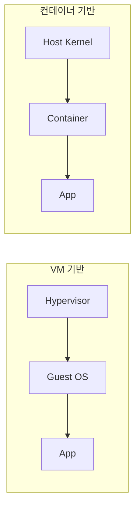

# Containers 101 (9/10): Containers vs VMs

이 글은 Containers 101 시리즈의 아홉 번째 글입니다.

컨테이너와 VM 비교는 속도만의 문제가 아닙니다. 어떤 격리 경계가 필요한지, 멀티테넌트 요구가 얼마나 강한지, 부팅 시간과 자원 밀도가 어디까지 중요한지에 따라 답이 달라집니다.

여기서는 호스트 커널 공유와 하이퍼바이저 기반 격리를 대비시키고, 어떤 워크로드에서 컨테이너·VM·microVM을 각각 먼저 검토해야 하는지 살펴봅니다.


*Containers 101 9장 흐름 개요*
> Containers vs VMs의 핵심은 '어느 게 낫다'는 게 아니라, 격리 수준과 리소스 오버헤드를 어느 정도 감수할지에 따라 선택하는 것입니다.

## 먼저 던지는 질문

- 컨테이너와 VM은 어떤 격리 모델 차이를 가질까요?
- 커널 공유와 하이퍼바이저 차이는 왜 중요한가요?
- 시작 속도와 자원 사용량은 얼마나 다르게 느껴질까요?

## 왜 중요한가

격리 수준을 워크로드에 맞게 고르는 일은 비용과 보안을 동시에 좌우합니다. 모든 것을 컨테이너로 밀어 넣어도 문제이고, 모든 것을 VM으로 감싸도 비효율이 커집니다.

특히 멀티테넌트 환경이나 강한 보안 경계가 필요한 워크로드에서는 VM이 더 적합할 수 있고, 빠른 배포와 높은 밀도가 중요한 서비스형 워크로드에서는 컨테이너가 훨씬 유리합니다. 중요한 것은 둘 중 하나를 신념처럼 고르는 것이 아니라 요구사항에 맞춰 격리 단위를 고르는 것입니다.

## 한눈에 보는 개념

VM은 하이퍼바이저 위에서 자체 커널을 부팅하고, 컨테이너는 호스트 커널 위에서 프로세스를 격리합니다. 출발 구조 자체가 다르기 때문에 격리, 속도, 밀도도 달라집니다.

```text
+-------------------------------+-------------------------------+
|  VM 기반                        |  컨테이너 기반                   |
+-------------------------------+-------------------------------+
|  App       App                |  App       App                |
|  Guest OS  Guest OS           |  Container Container          |
|  (각자 커널 보유)                |  (호스트 커널 공유)              |
+-------------------------------+-------------------------------+
|  Hypervisor (KVM/Xen/Hyper-V) |  Container Runtime            |
+-------------------------------+-------------------------------+
|  Host OS / Hardware           |  Host OS / Hardware           |
+-------------------------------+-------------------------------+
```

VM은 각자 Guest OS를 부팅하므로 수백 MB 메모리와 수초 부팅 시간이 필요합니다. 컨테이너는 호스트 커널을 그대로 쓰므로 수 MB 메모리와 밀리초 시작이 가능합니다. 이 차이가 밀도, 스케일링 속도, 비용을 좌우합니다.

## 핵심 용어

- **hypervisor**: VM을 부팅하고 관리하는 가상화 계층입니다. Type 1(베어메탈: KVM, Xen, Hyper-V)은 하드웨어 위에 직접 설치되고, Type 2(VirtualBox, VMware Workstation)는 호스트 OS 위에서 실행됩니다.
- **guest kernel**: VM 내부에서 독립적으로 실행되는 커널입니다. 호스트와 완전히 다른 커널 버전이나 다른 OS를 실행할 수 있습니다.
- **container**: 호스트 커널을 공유하는 프로세스 격리 단위입니다. namespace로 가시성을, cgroup으로 리소스를 격리합니다.
- **microVM**: Firecracker 같은 경량 VM입니다. 커널을 부팅하지만 최소한의 장치만 에뮬레이션해 125ms 이내에 시작합니다. AWS Lambda와 Fargate가 사용합니다.
- **gVisor / Kata**: 컨테이너에 추가 격리를 더하는 접근입니다. gVisor는 사용자 공간 커널을, Kata는 경량 VM을 사용합니다.

이 용어를 함께 이해하면 "컨테이너가 가볍다"는 말이 단순한 속도 자랑이 아니라 아키텍처 차이에서 나온 결과라는 점이 보입니다.

## 적용 전후

**Before** — 모든 워크로드를 VM으로만 돌려 느리고 비쌉니다.

```bash
# VM 기반: 3개 서비스에 필요한 리소스
# - 각 VM: 1 vCPU, 2GB RAM, 20GB disk
# - 총: 3 vCPU, 6GB RAM, 60GB disk
# - 부팅 시간: 각 30-60초
qemu-system-x86_64 -m 2048 -hda service-a.img -daemonize
qemu-system-x86_64 -m 2048 -hda service-b.img -daemonize
qemu-system-x86_64 -m 2048 -hda service-c.img -daemonize
```

**After** — 일반 서비스는 컨테이너에, 멀티테넌트 경계는 VM에 둡니다.

```bash
# 컨테이너 기반: 같은 3개 서비스
# - 각 컨테이너: 0.5 CPU, 256MB RAM
# - 총: 1.5 CPU, 768MB RAM
# - 시작 시간: 각 <1초
docker run -d --name svc-a --cpus=0.5 --memory=256m myorg/svc-a:1.0
docker run -d --name svc-b --cpus=0.5 --memory=256m myorg/svc-b:1.0
docker run -d --name svc-c --cpus=0.5 --memory=256m myorg/svc-c:1.0
```

현대 운영에서는 둘 중 하나를 버리는 것이 아니라 적절히 조합합니다. VM 위에 Kubernetes node를 띄우고 그 위에 컨테이너를 실행하는 하이브리드가 가장 흔한 패턴입니다.

## 실습: 같은 앱을 두 방식으로 비교하기

### 단계 1 — 컨테이너로 실행
```python
import subprocess, time

def run_container(image):
    t = time.time()
    subprocess.run(["docker", "run", "--rm", "-d", image], check=True)
    return time.time() - t
```

컨테이너는 보통 밀리초에서 수초 안에 시작합니다. 빠른 부팅은 오토스케일과 배포 전략에 직접 영향을 줍니다.

### 단계 2 — VM으로 실행 (개념)
```python
def run_vm(image_path):
    t = time.time()
    subprocess.run([
        "qemu-system-x86_64", "-m", "1024", "-hda", image_path,
        "-display", "none", "-daemonize",
    ], check=True)
    return time.time() - t
```

VM은 커널 부팅을 포함하므로 시작 비용이 더 큽니다. 대신 그만큼 강한 격리 경계를 제공합니다.

### 단계 3 — 메모리 비교
```python
def mem_usage(pid):
    res = subprocess.run(
        ["ps", "-o", "rss=", "-p", str(pid)],
        capture_output=True, text=True, check=True,
    )
    return int(res.stdout.strip())
```

메모리 사용량을 비교하면 프로세스 격리와 OS 격리의 비용 차이를 더 현실적으로 볼 수 있습니다.

### 단계 4 — 시작 시간 비교
```python
def compare(image, vm_image):
    return {
        "container_sec": run_container(image),
        "vm_sec": run_vm(vm_image),
    }
```

비교는 감상이 아니라 측정으로 해야 합니다. 그래야 워크로드에 맞는 격리 단위를 더 합리적으로 선택할 수 있습니다.

### 단계 5 — Report

```python
def report(stats):
    print(f"container={stats['container_sec']:.2f}s vm={stats['vm_sec']:.2f}s")
```

최종 결과를 수치로 남깁니다. 컨테이너와 VM의 차이는 개념 설명보다 측정 결과에서 더 잘 체감됩니다.

## 이 코드에서 먼저 봐야 할 점

- 컨테이너는 보통 밀리초에서 수초 안에 시작합니다.
- VM은 수초에서 수분이 걸릴 수 있습니다.
- 비교는 자동화해서 재현 가능하게 해야 합니다.

이 세 가지를 함께 보면 “가볍다”와 “강하게 격리된다”가 어떤 운영 비용 차이로 이어지는지 훨씬 선명해집니다.

## 빠른 검증과 장애 신호

```bash
# 컨테이너 시작 시간 측정
/usr/bin/time -p docker run --rm nginx:1.27-alpine true

# VM 시작 시간 측정 (QEMU)
/usr/bin/time -p qemu-system-x86_64 -m 1024 -display none -daemonize -hda vm.img

# 메모리 사용량 비교
docker stats --no-stream --format 'table {{.Name}}\t{{.MemUsage}}'

# 컨테이너 밀도 확인: 호스트에서 실행 중인 컨테이너 수
docker ps --format '{{.Names}}' | wc -l
```

**Expected output:**
- 컨테이너는 보통 밀리초~수초, VM은 수초 이상으로 차이가 드러납니다.
- 같은 앱이어도 격리 단위에 따라 부팅 비용과 기본 자원 사용량이 달라집니다.

**먼저 확인할 것:**
- 같은 호스트와 조건에서 반복 측정해야 비교가 의미 있습니다.
- QEMU가 실패하면 가상화 지원과 이미지 준비 상태를 먼저 확인합니다.
- 강한 멀티테넌트 환경이면 성능보다 경계 강도를 먼저 봅니다.

## 자주 하는 실수 5가지

1. **모든 워크로드를 컨테이너에 넣어 멀티테넌트 격리를 약하게 만듭니다.**
   컨테이너는 커널을 공유하므로 다른 테넌트의 워크로드가 커널 취약점으로 탈출하면 같은 호스트의 모든 컨테이너가 위험해집니다. 규제나 보안 요구가 강한 환경에서는 VM 또는 microVM 경계가 필요합니다.

2. **모든 워크로드를 VM으로만 운영해 비용이 과도하게 커집니다.**
   단순한 무상태 API를 VM으로 감싸면 부팅 시간, 메모리, 디스크 모두 불필요하게 커집니다. 오토스케일도 느려져 서비스 배포 속도에 영향을 줍니다.

3. **컨테이너를 곧 보안이라고 생각합니다.**
   namespace와 cgroup은 리소스 격리이지 보안 격리가 아닙니다. 커널 취약점이 나오면 컨테이너 격리는 우회될 수 있습니다. 보안이 중요하면 seccomp, AppArmor, VM 수준 격리를 추가로 고려해야 합니다.

4. **Mac/Windows의 Docker가 내부적으로 VM을 쓴다는 사실을 잊습니다.**
   Docker Desktop은 Linux VM(HyperKit/WSL2)을 띄우고 그 안에서 컨테이너를 실행합니다. 개발 환경 성능이 Linux 서버와 다를 수 있고, 파일시스템 공유 성능도 VM 레이어의 영향을 받습니다.

5. **커널 의존적인 워크로드를 무리하게 컨테이너에 욱여넣습니다.**
   커널 모듈이나 특정 커널 버전이 필요한 워크로드는 호스트 커널을 공유하는 컨테이너에서 정상 동작하지 않을 수 있습니다. 이런 경우 VM이 올바른 선택입니다.

이 실수들은 모두 격리 모델을 기능 목록으로만 볼 때 나옵니다. 실제로는 운영 목적과 보안 요구 수준을 함께 고려해야 합니다.

## 운영에서는 이렇게 나타납니다

| 환경 | 컨테이너 사용 | VM 사용 | 하이브리드 |
| --- | --- | --- | --- |
| AWS | ECS/EKS | EC2 | Fargate(microVM + 컨테이너) |
| GCP | GKE, Cloud Run | Compute Engine | gVisor 기본 적용 |
| Azure | AKS, Container Apps | Virtual Machines | Kata Containers 옵션 |
| On-premise | K8s + containerd | KVM/VMware | VM node 위 K8s |

AWS Fargate나 Lambda는 Firecracker microVM 위에 컨테이너 스타일 실행을 얹어, 컨테이너의 속도와 VM 수준 격리를 함께 가져갑니다. GCP Cloud Run은 gVisor를 기본 적용해 커널 공유의 위험을 줄입니다. 즉, 현대 인프라는 둘을 섹는 하이브리드 접근을 기본값으로 가져가고 있습니다.

## 시니어 엔지니어는 이렇게 생각합니다

- 격리 수준은 비즈니스 요구를 따라야 한다고 봅니다. "최신 기술"보다 "이 서비스에 맞는 격리 경계"를 먼저 묻습니다.
- 컨테이너는 VM 안에서 실행될 수도 있다고 생각합니다. 둘은 상호 배타적이 아니라 조합 가능합니다.
- 부팅 시간은 아키텍처 선택 요소라고 봅니다. cold start가 SLA를 위반하면 VM은 적합하지 않습니다.
- 멀티테넌트 경계는 VM 수준이 더 안전하다고 판단할 수 있습니다. 커널 공유는 편리하지만 위험도 공유합니다.
- 하이브리드가 현대적 기본값이라고 봅니다. 노드는 VM, 워크로드는 컨테이너로 나누는 것이 가장 흔한 패턴입니다.

| 의사결정 질문 | 컨테이너 우선 | VM 우선 |
| --- | --- | --- |
| 배포 빈도가 주 1회 이상? | O | - |
| 오토스케일이 수초 내 필요? | O | - |
| 다른 테넌트와 커널 격리 필수? | - | O |
| 커스텀 커널/OS 필요? | - | O |
| 규정상 하드웨어 수준 격리 요구? | - | O |
| 둘 다 필요? | K8s node=VM, workload=container | - |

시니어 엔지니어는 "무엇이 더 최신인가"보다 "어떤 격리 경계가 이 서비스에 맞는가"를 먼저 묻습니다. 그 질문이 맞아야 비용과 보안을 동시에 관리할 수 있기 때문입니다.

## 체크리스트

- [ ] 서비스 격리에는 컨테이너를 우선 검토합니다.
- [ ] 테넌트 격리에는 VM 또는 microVM을 검토합니다.
- [ ] 보안 등급을 문서화했습니다.
- [ ] 시작 시간 SLA를 측정합니다.
- [ ] 하이브리드 전략(VM node + container workload) 검토를 완료했습니다.
- [ ] 개발 환경(Docker Desktop)과 운영 환경(Linux 서버)의 차이를 팀에 공유했습니다.
- [ ] 커널 의존성이 있는 워크로드를 식별하고 VM으로 분리했습니다.

## 연습 문제

1. 커널 공유가 왜 컨테이너를 가볍게 만드는지 한 줄로 설명해 보세요.
2. VM이 컨테이너보다 유리한 사례 하나를 적어 보세요.
3. Firecracker의 역할을 한 줄로 설명해 보세요.

## 정리와 다음 글

컨테이너와 VM은 서로를 대체하는 절대적인 승자와 패자가 아닙니다. 컨테이너는 빠르고 가볍고, VM은 더 강한 격리를 제공합니다. 그래서 현대 운영에서는 둘을 적절히 섹는 하이브리드 전략이 자연스럽습니다.

실무에서는 다음 세 가지 질문을 기준으로 선택합니다:

1. 격리 경계가 커널 수준이어야 하는가? → VM 또는 microVM
2. 배포 속도와 밀도가 우선인가? → 컨테이너
3. 둘 다 필요한가? → VM node 위에 컨테이너 워크로드(하이브리드)

다음 글에서는 지금까지 배운 개념을 하나의 실제 애플리케이션으로 묶어, 실전 컨테이너 앱 만들기를 진행하겠습니다. Dockerfile 작성부터 네트워크, 볼륨, 보안 설정까지 하나의 흐름으로 연결합니다.


## 심화: Kubernetes 아키텍처로 보는 컨테이너 실행 단위

컨테이너와 VM 비교를 실무로 연결하려면 오케스트레이션 계층까지 포함해야 합니다. 현대 운영에서는 "컨테이너를 직접 실행"하기보다 Kubernetes가 Pod 단위로 실행을 조정합니다. 따라서 컨테이너의 장점과 한계는 Kubernetes 리소스 설계와 함께 이해해야 합니다.

아키텍처를 단순화하면 다음과 같습니다.

- Control Plane: API Server, Scheduler, Controller Manager
- Data Plane(Node): kubelet, container runtime, CNI, CSI
- 워크로드 단위: Pod
- 노출 단위: Service
- 선언형 배포 단위: Deployment

## Pod/Service/Deployment 최소 예시

```yaml
apiVersion: v1
kind: Pod
metadata:
  name: api-pod
  labels:
    app: api
spec:
  containers:
    - name: api
      image: ghcr.io/example/api:1.0.0
      ports:
        - containerPort: 8080
```

```yaml
apiVersion: v1
kind: Service
metadata:
  name: api-svc
spec:
  selector:
    app: api
  ports:
    - port: 80
      targetPort: 8080
```

```yaml
apiVersion: apps/v1
kind: Deployment
metadata:
  name: api-deploy
spec:
  replicas: 3
  selector:
    matchLabels:
      app: api
  template:
    metadata:
      labels:
        app: api
    spec:
      containers:
        - name: api
          image: ghcr.io/example/api:1.0.0
          ports:
            - containerPort: 8080
```

이 세 리소스는 컨테이너 운영의 기본 문법입니다. Pod는 실행 단위, Service는 접근 경계, Deployment는 원하는 상태 유지 역할을 맡습니다.

## 컨테이너와 VM 비교를 다시 정리

| 관점 | 컨테이너 + Kubernetes | VM 중심 운영 |
| --- | --- | --- |
| 배포 속도 | 매우 빠름(롤링 업데이트) | 상대적으로 느림 |
| 밀도 | 높은 편 | 낮은 편 |
| 격리 강도 | 커널 공유 전제 | 강한 경계 |
| 운영 복잡도 | 오케스트레이션 학습 필요 | 인프라 관리 부담 큼 |
| 대표 적합 사례 | 마이크로서비스, API 플랫폼 | 강한 경계 요구 테넌트 |

결국 컨테이너와 VM은 경쟁 관계라기보다 서로 다른 요구사항을 충족하는 도구입니다. Kubernetes 위에서도 node 자체는 VM으로 운영하는 하이브리드가 일반적입니다.

## 의사결정 프레임

- 응답 속도/배포 빈도가 최우선: 컨테이너 우선
- 테넌트 경계와 규제 준수가 최우선: VM 또는 microVM 우선
- 둘 다 중요: VM 위 Kubernetes(하이브리드)

이 프레임으로 논의하면 도구 선호 논쟁보다 요구사항 중심 의사결정이 가능해집니다.


## 추가 실무 노트: 리소스 제한과 HPA 기반 성능 최적화 관점

컨테이너가 빠르다고 해서 자동으로 성능이 최적화되지는 않습니다. Kubernetes 환경에서는 요청/제한(request/limit)과 HPA 정책이 함께 맞아야 안정적인 스케일링이 가능합니다.

```yaml
apiVersion: autoscaling/v2
kind: HorizontalPodAutoscaler
metadata:
  name: api-hpa
spec:
  scaleTargetRef:
    apiVersion: apps/v1
    kind: Deployment
    name: api-deploy
  minReplicas: 2
  maxReplicas: 10
  metrics:
    - type: Resource
      resource:
        name: cpu
        target:
          type: Utilization
          averageUtilization: 65
```

요청/제한이 비현실적이면 HPA가 과민 반응하거나 반응하지 못합니다. 따라서 성능 최적화는 컨테이너/VM 비교 논의를 넘어 실제 런타임 파라미터 조정까지 포함해야 합니다.


## 추가 정리: 운영 적용 전 최종 점검 질문

아래 질문은 도구 지식이 아니라 운영 준비도를 확인하기 위한 질문입니다. 각 질문에 문서와 명령으로 답할 수 있어야 실제 팀 운영에서 반복 가능한 품질을 만들 수 있습니다.

1. 이 구성은 새 팀원이 같은 절차로 재현할 수 있는가?
2. 실패했을 때 어디서 원인을 확인해야 하는지 런북이 있는가?
3. 보안 기본값(root 금지, 최소 권한, 시크릿 분리)이 강제되는가?
4. 버전과 아티팩트 동일성(digest, lock file)이 보장되는가?
5. 데이터/네트워크/권한 경계가 문서로 정의되어 있는가?

다음은 공통 점검 명령 예시입니다.

```bash
# 아티팩트 동일성
docker inspect --format '{{index .RepoDigests 0}}' <image>

# 실행 상태
docker ps --format 'table {{.Names}}	{{.Status}}	{{.Ports}}'

# 로그 관측
docker logs --tail 100 <container>

# 네트워크/볼륨 구조
docker network ls
docker volume ls
```

이 명령 자체가 중요한 것이 아니라, 팀이 같은 순서로 문제를 좁혀 가는 절차를 공유한다는 점이 중요합니다. 컨테이너 운영의 성숙도는 개인의 숙련도보다 팀의 표준화 수준에서 결정됩니다. 따라서 시리즈 학습의 최종 목표는 기능 이해가 아니라 운영 계약의 명문화입니다.

## 실무 확장: 선택 기준을 워크로드 특성으로 고정하기

컨테이너와 VM 비교는 기술 선호의 문제가 아니라 워크로드 특성의 문제입니다. 팀에서 선택 기준을 문서화해 두면 신규 서비스 설계가 빨라지고 논쟁이 줄어듭니다.

### 선택 매트릭스

- 빠른 배포/높은 밀도/짧은 수명: 컨테이너 우선
- 강한 격리/커스텀 커널/규제 요구: VM 우선
- 레거시 애플리케이션: VM에서 단계적 현대화

### 리소스 경계 예시

```yaml
services:
  api:
    image: myorg/api:latest
    deploy:
      resources:
        limits:
          cpus: "1.00"
          memory: 512M
```

컨테이너에서도 리소스 한계를 선언하지 않으면 노이즈 이웃 문제가 생깁니다. VM을 쓰든 컨테이너를 쓰든 경계 선언은 필수입니다.

### 아키텍처 비교 다이어그램



같은 워크로드라도 운영 요구가 바뀌면 선택이 바뀔 수 있습니다. 예를 들어 커널 모듈 제어가 필요해지면 VM이 더 적합할 수 있습니다.

## 실무 확장: 하이브리드 운영 전략

대부분 조직은 컨테이너와 VM을 함께 사용합니다. 경계를 분리해 운영하면 각 기술의 장점을 살릴 수 있습니다.

- 상태 저장 데이터베이스는 VM 또는 관리형 서비스
- 무상태 API와 배치 작업은 컨테이너
- 공통 관측 체계는 로그/메트릭 스택으로 통합

## 처음 질문으로 돌아가기

- **컨테이너와 VM은 어떤 격리 모델 차이를 가질까요?**
  - VM은 하이퍼바이저 위에서 guest kernel을 부팅해 호스트와 완전히 다른 OS를 실행합니다. 컨테이너는 호스트 커널을 공유하고 namespace/cgroup으로 프로세스를 격리합니다. VM은 커널 수준 격리를 제공하지만 무겁고, 컨테이너는 가볍지만 커널 취약점에 노출될 수 있습니다. microVM(Firecracker)은 이 두 가지를 절충하려는 중간 지점입니다.

- **커널 공유와 하이퍼바이저 차이는 왜 중요한가요?**
  - 커널 공유는 부팅 없이 프로세스만 시작하므로 빠르고 메모리도 적게 쓴니다. 하지만 같은 커널을 쓰므로 커널 취약점이 하나나면 모든 컨테이너가 영향받습니다. 하이퍼바이저는 각 VM에 독립 커널을 주므로 한 VM의 취약점이 다른 VM에 영향을 주지 않습니다. 이 차이가 멀티테넌트 환경에서 결정적입니다.

- **시작 속도와 자원 사용량은 얼마나 다르게 느껴질까요?**
  - 컨테이너는 수십~수백 밀리초에 시작하고 수 MB 메모리로 동작합니다. VM은 OS 부팅을 포함해 수십 초~수 분이 걸리고 수백 MB~수 GB 메모리를 차지합니다. 같은 호스트에서 컨테이너는 수십~수백 개를 띄울 수 있지만 VM은 수 개~수십 개가 한계입니다. 이 밀도 차이가 인프라 비용에 직접 영향을 줍니다.

<!-- toc:begin -->
## 시리즈 목차

- [Containers 101 (1/10): Container란 무엇인가?](./01-what-is-a-container.md)
- [Containers 101 (2/10): Image와 Layer](./02-image-and-layer.md)
- [Containers 101 (3/10): Runtime](./03-runtime.md)
- [Containers 101 (4/10): Dockerfile](./04-dockerfile.md)
- [Containers 101 (5/10): Volume](./05-volume.md)
- [Containers 101 (6/10): Network](./06-network.md)
- [Containers 101 (7/10): Registry](./07-registry.md)
- [Containers 101 (8/10): Container Security](./08-container-security.md)
- **Containers vs VMs (현재 글)**
- 실전 컨테이너 앱 만들기 (예정)

<!-- toc:end -->

## 참고 자료

- Containers 101 예제 코드: https://github.com/yeongseon-books/book-examples/tree/main/containers-101/ko
- [What is a container? (Docker)](https://www.docker.com/resources/what-container/)
- [Firecracker](https://firecracker-microvm.github.io/)
- [Kata Containers](https://katacontainers.io/)
- [gVisor](https://gvisor.dev/)

Tags: Containers, Docker, Kubernetes, DevOps
