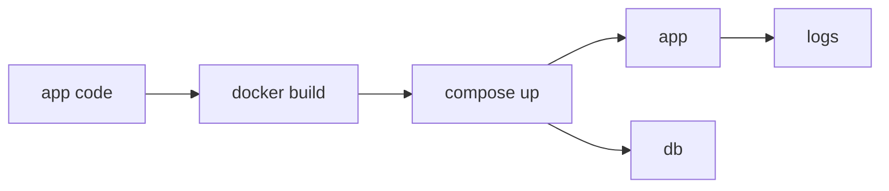

# 실전 컨테이너 앱 만들기

> Containers 101 시리즈 (10/10)


## 이 글에서 다룰 문제

지금까지의 모든 개념을 *하나의 결과물* 로 *통합* 해야 *체득* 됩니다. *마지막 글* 의 의미가 여기 있습니다.

## 개념 한눈에 보기



## Before/After

**Before**: *수동 docker run* 명령 *여러 줄* 로 환경 재현 어려움.

**After**: `docker compose up` *한 줄* 로 *전체 스택* 기동.

## 실습: FastAPI + Postgres 스택

### 1단계 — app/main.py

```python
from fastapi import FastAPI
import os, psycopg

app = FastAPI()

@app.get("/health")
def health():
    return {"ok": True}

@app.get("/users")
def users():
    with psycopg.connect(os.environ["DB_URL"]) as conn:
        with conn.cursor() as cur:
            cur.execute("SELECT count(*) FROM users")
            return {"count": cur.fetchone()[0]}
```

### 2단계 — Dockerfile

```python
"""
FROM python:3.12-slim
WORKDIR /app
COPY requirements.txt .
RUN pip install --no-cache-dir -r requirements.txt
COPY app ./app
USER 1000
EXPOSE 8080
HEALTHCHECK CMD curl -f http://localhost:8080/health || exit 1
CMD ["uvicorn", "app.main:app", "--host", "0.0.0.0", "--port", "8080"]
"""
```

### 3단계 — docker-compose.yml

```python
"""
services:
  app:
    build: .
    ports: ["8080:8080"]
    environment:
      DB_URL: postgresql://app:secret@db:5432/app
    depends_on:
      db: { condition: service_healthy }
    restart: unless-stopped
  db:
    image: postgres:16
    environment:
      POSTGRES_USER: app
      POSTGRES_PASSWORD: secret
      POSTGRES_DB: app
    healthcheck:
      test: ["CMD-SHELL", "pg_isready -U app"]
      interval: 5s
"""
```

### 4단계 — 기동 자동화

```python
import subprocess

def up():
    subprocess.run(["docker", "compose", "up", "-d", "--build"], check=True)

def logs():
    subprocess.run(["docker", "compose", "logs", "--tail=100"], check=False)
```

### 5단계 — 정리

```python
def down():
    subprocess.run(["docker", "compose", "down", "-v"], check=True)
```

## 이 코드에서 주목할 점

- *USER 1000* 으로 *non-root*.
- *healthcheck* 가 *Compose* 의 *의존성* 을 결정.
- *depends_on + service_healthy* 조합.

## 자주 하는 실수 5가지

1. ***DB 비밀번호* 를 *Compose* 에 *평문* 으로 영구 보관.**
2. ***healthcheck* 없이 *depends_on* 만 사용.**
3. ***restart policy* 누락으로 *장애 전파*.**
4. ***volumes* 누락으로 *데이터 손실*.**
5. ***로그* 를 *컨테이너 내부* 에만 적재.**

## 실무에서는 이렇게 쓰입니다

*로컬 개발* 은 *Compose*, *프로덕션* 은 *Kubernetes* 로 동일한 *이미지* 를 *다른 오케스트레이터* 에서 운영합니다.

## 체크리스트

- [ ] *non-root* 실행.
- [ ] *healthcheck* 정의.
- [ ] *시크릿* 분리.
- [ ] *teardown* 명령 문서화.

## 정리 및 다음 단계

여기까지가 *Containers 101* 의 *마지막* 입니다. 다음 단계는 *Kubernetes 101* 으로 *오케스트레이션* 의 세계로 들어가는 것입니다.

<!-- toc:begin -->
- [Container란 무엇인가?](./01-what-is-a-container.md)
- [Image와 Layer](./02-image-and-layer.md)
- [Runtime](./03-runtime.md)
- [Dockerfile](./04-dockerfile.md)
- [Volume](./05-volume.md)
- [Network](./06-network.md)
- [Registry](./07-registry.md)
- [Container Security](./08-container-security.md)
- [Container와 VM 차이](./09-container-vs-vm.md)
- **실전 컨테이너 앱 만들기 (현재 글)**
<!-- toc:end -->

## 참고 자료

- [Docker Compose](https://docs.docker.com/compose/)
- [FastAPI in containers](https://fastapi.tiangolo.com/deployment/docker/)
- [Dockerfile best practices](https://docs.docker.com/develop/develop-images/dockerfile_best-practices/)
- [HEALTHCHECK reference](https://docs.docker.com/engine/reference/builder/#healthcheck)

Tags: Containers, Docker, Compose, FastAPI, DevOps
