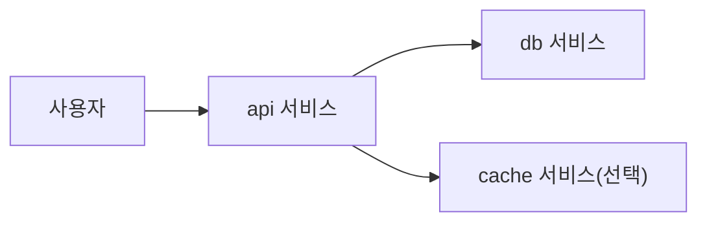

# Containers 101 (10/10): 실전 컨테이너 앱 만들기

이전 글에서 본 이미지, 네트워크, 볼륨, 보안, 헬스체크는 따로 보면 개념으로만 남기 쉽습니다. 마지막 단계에서는 이 요소들을 하나의 앱 조립 흐름으로 묶어, 누구나 같은 명령으로 올리고 확인하고 정리할 수 있는 작은 시스템으로 바꿔 보는 것이 중요합니다.

여기서는 FastAPI와 Postgres를 예시로 Dockerfile, Compose, healthcheck, 시크릿 분리, 로그 확인을 하나의 실행 스택으로 연결합니다.


*Containers 101 10장 흐름 개요*
> 실전 컨테이너 앱의 핵심은 개별 명령이 아니라, 로컬 개발 → CI 빌드 → 배포 → 운영 전체 파이프라인에서 재현성과 관찰성을 유지하는 것입니다.

## 먼저 던지는 질문

- FastAPI 앱용 Dockerfile은 어떤 기준으로 작성해야 할까요?
- Compose로 앱과 DB를 어떻게 함께 묶을 수 있을까요?
- healthcheck는 왜 orchestration 신호로 중요할까요?

## 왜 중요한가

앞에서 배운 개념은 실제 앱 하나로 묶어 봐야 비로소 손에 잡힙니다. 이미지, 네트워크, 볼륨, 보안, 헬스체크가 따로따로 기억되면 운영 설계로 이어지기 어렵습니다.

그래서 마지막 글의 목표는 기능을 하나 더 소개하는 데 있지 않습니다. 지금까지 배운 기본기를 한 번의 실행 흐름으로 연결해, “실제로는 이렇게 조립되는구나”라는 감각을 만드는 데 있습니다.

실무에서 자주 보는 패턴은 이렇습니다. 개발자가 README를 읽고 `docker compose up` 한 줄로 전체 스택을 올립니다. healthcheck가 통과하면 API를 호출해 봅니다. 문제가 생기면 `docker compose logs`로 원인을 찾고, 코드를 고친 뒤 다시 올립니다. 이 루프가 10분 안에 돌아가야 생산성이 유지됩니다. 만약 환경 설정에 30분이 걸린다면, 그 팀은 컨테이너를 쓰고 있지만 컨테이너의 가치를 누리지 못하는 것입니다.

또한 이 조립 경험은 면접에서도 그대로 드러납니다. "컨테이너로 앱을 만들어 본 적 있나요?"라는 질문에 Dockerfile 문법만 나열하는 것과, "FastAPI와 Postgres를 Compose로 묶고 healthcheck로 의존성 순서를 보장했습니다"라고 답하는 것은 완전히 다른 인상을 줍니다.
## 한눈에 보는 개념

애플리케이션 코드는 이미지가 되고, Compose는 앱과 DB를 함께 올리며, healthcheck와 로그가 운영 가능성을 받쳐 줍니다. 이제 컨테이너는 단일 명령이 아니라 하나의 작은 시스템이 됩니다.

```text
┌─────────────────────────────────────────────────────────┐
│                    docker compose up                     │
├─────────────────────────────────────────────────────────┤
│  ┌───────────────┐     ┌───────────────┐               │
│  │  app (FastAPI) │────▶│  db (Postgres) │               │
│  │  port 8080    │     │  port 5432    │               │
│  │  healthcheck  │     │  healthcheck  │               │
│  │  non-root     │     │  volume mount │               │
│  └───────────────┘     └───────────────┘               │
│         │                      │                        │
│         ▼                      ▼                        │
│   stdout logs             pgdata volume                 │
└─────────────────────────────────────────────────────────┘
```

이 그림에서 화살표 하나하나가 시리즈 전체에서 다룬 개념과 대응합니다. 이미지(2장), 런타임(3장), Dockerfile(4장), 볼륨(5장), 네트워크(6장), 레지스트리(7장), 보안(8장)이 모두 한 스택 안에 녹아 있습니다.

## 핵심 용어

- **Dockerfile**: 이미지를 만드는 레시피입니다. base image 선택, 의존성 설치, 소스 복사, 실행 명령까지 한 파일에 담습니다. 멀티스테이지 빌드를 적용하면 빌드 도구 없이 런타임 이미지만 남길 수 있습니다.
- **Compose**: 여러 컨테이너를 YAML로 묶는 도구입니다. 서비스 간 네트워크, 볼륨, 환경 변수, 의존성 순서를 선언적으로 정의합니다. `docker compose up` 한 줄로 전체 스택을 올리고 `docker compose down`으로 정리합니다.
- **healthcheck**: 애플리케이션이 살아 있는지 판단하는 신호입니다. HTTP 엔드포인트, TCP 포트, 또는 커맨드 실행 결과로 상태를 보고합니다. orchestrator는 이 신호를 기준으로 트래픽 라우팅과 재시작을 결정합니다.
- **restart policy**: 실패 시 자동 재시작 규칙입니다. `no`, `always`, `on-failure`, `unless-stopped` 네 가지가 있으며, 프로덕션에서는 `unless-stopped`가 기본 선택입니다.
- **logs driver**: 로그를 수집하고 전달하는 백엔드입니다. 기본값은 `json-file`이며, 운영 환경에서는 `fluentd`, `syslog`, `awslogs` 같은 외부 드라이버로 중앙화합니다.

이 다섯 요소를 함께 묶어 생각할 수 있어야 실습이 운영 감각으로 이어집니다. 하나라도 빠지면 "뜨긴 뜨는데 운영은 못 하는" 상태가 됩니다.

## 적용 전후

**Before — 재현 불가능한 수동 명령:**

```bash
# 터미널 1
docker run -d --name pg -e POSTGRES_PASSWORD=secret postgres:16
# 터미널 2 (DB가 준비됐는지 수동 확인 후)
docker run -d --name app -e DB_URL=postgresql://... -p 8080:8080 myapp
# 장애 시: docker rm -f app && docker run ... (매번 옵션 기억해야 함)
```

이 방식은 팀원마다 실행 순서가 다르고, 네트워크 연결이 빠지거나, 환경 변수가 틀리는 문제가 반복됩니다.

**After — 선언적 Compose 스택:**

```bash
docker compose up -d --build   # 빌드 + 기동 + 의존성 순서 + healthcheck 대기
docker compose ps              # 상태 확인
docker compose down -v         # 정리
```

누구나 같은 명령으로 동일한 결과를 냅니다. 기동 순서, 네트워크, 볼륨, 재시작 정책이 YAML에 선언되어 있으므로 실수가 줄고, 코드 리뷰도 가능해집니다.

## 실습: FastAPI + Postgres 스택 만들기

### 단계 1 — app/main.py

```python
from fastapi import FastAPI
import os, psycopg

app = FastAPI()

@app.get("/health")
def health():
    return {"ok": True}

@app.get("/users")
def users():
    with psycopg.connect(os.environ["DB_URL"]) as conn:
        with conn.cursor() as cur:
            cur.execute("SELECT count(*) FROM users")
            return {"count": cur.fetchone()[0]}
```

애플리케이션은 DB URL을 환경 변수로 받고, `/health`와 `/users` 같은 간단한 엔드포인트를 노출합니다. 이 정도만 있어도 healthcheck와 DB 연결 흐름을 검증하기에는 충분합니다.

### 단계 2 — Dockerfile

```dockerfile
FROM python:3.12-slim
WORKDIR /app
COPY requirements.txt .
RUN pip install --no-cache-dir -r requirements.txt
COPY app ./app
USER 1000
EXPOSE 8080
HEALTHCHECK CMD curl -f http://localhost:8080/health || exit 1
CMD ["uvicorn", "app.main:app", "--host", "0.0.0.0", "--port", "8080"]
```

비root 실행, 포트 노출, healthcheck까지 Dockerfile 안에 포함합니다. 이미지 단계에서부터 운영 기대치를 명시하는 구조입니다.

### 단계 3 — docker-compose.yml

```yaml
services:
  app:
    build: .
    ports: ["8080:8080"]
    environment:
      DB_URL: postgresql://app:secret@db:5432/app
    depends_on:
      db:
        condition: service_healthy
    restart: unless-stopped
  db:
    image: postgres:16
    environment:
      POSTGRES_USER: app
      POSTGRES_PASSWORD: secret
      POSTGRES_DB: app
    healthcheck:
      test: ["CMD-SHELL", "pg_isready -U app"]
      interval: 5s
      timeout: 3s
      retries: 10
```

Compose는 애플리케이션과 데이터베이스를 하나의 스택으로 묶습니다. 여기서 `depends_on + service_healthy` 조합이 중요한 이유는 단순 실행 순서가 아니라 준비 완료 신호까지 함께 보게 해 주기 때문입니다.

### 단계 4 — 시작 자동화
```python
import subprocess

def up():
    subprocess.run(["docker", "compose", "up", "-d", "--build"], check=True)

def logs():
    subprocess.run(["docker", "compose", "logs", "--tail=100"], check=False)
```

기동과 로그 확인도 명령으로 표준화합니다. 운영 가능성은 결국 “문제가 생겼을 때 어디를 보면 되는가”까지 포함해야 합니다.

### 단계 5 — 정리(tear down)
```python
def down():
    subprocess.run(["docker", "compose", "down", "-v"], check=True)
```

종료와 정리까지 자동화해야 재실행과 복구가 쉬워집니다. 특히 볼륨까지 함께 내릴지 여부는 개발·테스트 환경에서 매우 중요합니다.

## 이 코드에서 먼저 봐야 할 점

- `USER 1000`은 비root 실행을 강제합니다.
- healthcheck는 Compose 의존성 판단 신호가 됩니다.
- `depends_on + service_healthy`는 짝으로 이해해야 합니다.

이 세 포인트는 실습 앱을 넘어 실제 운영 체크리스트로 그대로 이어집니다. 보안, 기동 순서, 관측성이 이 안에 모두 들어 있습니다.

## 빠른 검증과 장애 신호

```bash
docker compose up -d --build
docker compose ps
curl http://127.0.0.1:8080/health
curl http://127.0.0.1:8080/users
docker compose logs --tail=100
```

**Expected output:**
- `docker compose ps`에서 app과 db가 모두 기동 상태로 보입니다.
- `/health`는 `{"ok": true}`를 반환합니다.
- `/users`는 DB 연결이 정상일 때 카운트 응답을 돌려줍니다.

**먼저 확인할 것:**
- app이 먼저 죽으면 `depends_on`과 healthcheck 정의를 함께 확인합니다.
- DB 연결 오류가 나면 Compose 네트워크 안에서 `db` 호스트명이 맞는지 봅니다.
- 평문 시크릿이 남아 있다면 `.env` 또는 전용 시크릿 시스템 분리부터 진행합니다.

## 자주 하는 실수 5가지

**1. DB 비밀번호를 Compose 파일에 영구 평문으로 남깁니다.**

개발 단계에서는 빠르지만, 이 파일이 Git에 올라가면 비밀번호가 이력에 영구 기록됩니다. `.env` 파일로 분리하고 `.gitignore`에 추가하거나, Docker secrets 또는 외부 vault를 사용합니다.

**2. healthcheck 없이 `depends_on`만 사용합니다.**

`depends_on`의 기본 동작은 컨테이너 시작 순서만 보장합니다. DB 프로세스가 올라왔지만 아직 연결을 받지 못하는 상태에서 앱이 기동되면 연결 오류가 발생합니다. 반드시 `condition: service_healthy`와 짝으로 사용합니다.

**3. restart policy를 두지 않아 장애가 전파됩니다.**

OOM이나 예외로 컨테이너가 죽으면 수동 재시작까지 서비스가 중단됩니다. `restart: unless-stopped`를 기본으로 두고, 무한 재시작 루프를 방지하려면 `on-failure`에 `max_retries`를 설정합니다.

**4. volume을 빠뜨려 데이터를 잃습니다.**

`docker compose down -v`는 볼륨까지 삭제합니다. 개발 환경에서는 편리하지만, 운영 DB에 같은 명령을 치면 데이터가 사라집니다. 운영 환경에서는 `-v` 없이 내리고, 볼륨 백업 정책을 별도로 둡니다.

**5. 로그를 컨테이너 내부에만 남깁니다.**

컨테이너가 재시작되면 내부 파일 시스템의 로그는 사라집니다. 반드시 stdout/stderr로 출력하고, 호스트 또는 중앙 로그 시스템으로 수집합니다. `docker compose logs`로 확인할 수 있는 구조가 기본입니다.

이 실수들은 "일단 뜨기만 하면 된다"는 태도에서 나옵니다. 하지만 실전에서는 기동 성공보다 재기동, 관측, 복구가 더 중요합니다.

## 운영에서는 이렇게 나타납니다

로컬 개발은 Compose로 스택을 올리고, 운영 환경은 Kubernetes 같은 오케스트레이터로 같은 이미지를 실행합니다. 즉, 도구는 달라도 이미지와 애플리케이션 계약은 그대로 유지됩니다.

| 환경 | 도구 | 이미지 출처 | 시크릿 관리 | 스케일링 |
| --- | --- | --- | --- | --- |
| 로컬 개발 | docker compose | 로컬 빌드 | .env 파일 | 수동 |
| CI/CD | docker build + push | Registry | CI 변수 | 파이프라인 |
| 스테이징 | Kubernetes | Registry digest | Sealed Secrets | HPA |
| 프로덕션 | Kubernetes | Registry digest | Vault/KMS | HPA + PDB |

이 표에서 핵심은 "이미지는 동일, 도구만 다름"이라는 점입니다. Dockerfile과 healthcheck를 제대로 만들어 두면, Compose에서 Kubernetes로 이전할 때 애플리케이션 코드는 변경 없이 그대로 쓸 수 있습니다. 변경되는 것은 오케스트레이션 매니페스트(Compose YAML → Kubernetes YAML)와 시크릿 주입 방식뿐입니다.

```bash
# Compose → Kubernetes 전환 예시 (kompose 도구)
kompose convert -f docker-compose.yml
# 생성되는 파일: app-deployment.yaml, db-deployment.yaml, ...
kubectl apply -f .
```

실무에서는 kompose를 그대로 쓰기보다 참고용으로 변환한 뒤, 프로덕션 요구사항에 맞게 수정하는 패턴이 일반적입니다.

## 시니어 엔지니어는 이렇게 생각합니다

| 관점 | 주니어 사고방식 | 시니어 사고방식 |
| --- | --- | --- |
| 기동 | "앱이 뜨면 된다" | "누구나 같은 명령으로 띄울 수 있는가" |
| healthcheck | "나중에 추가하짠" | "오케스트레이션 신호니까 처음부터" |
| 환경 차이 | "환경별 Dockerfile" | "환경 변수만 다르게, 이미지는 동일" |
| 로그 | "파일로 남기자" | "stdout으로 흐려야 수집 가능" |
| teardown | "수동으로 정리" | "자동화되어야 운영 친화적" |
| PR 리뷰 | "동작하는지 확인" | "Compose로 올려서 health 확인까지 되는지 확인" |

시니어 엔지니어는 "앱이 떴다"보다 "누구나 같은 명령으로 띄우고, 상태를 확인하고, 내려도 같은 결과가 나오는가"를 더 중요하게 봅니다. 이 기준을 코드 리뷰에서도 적용합니다. README에 `docker compose up` 한 줄로 끝나는 기동 가이드가 있는지, healthcheck가 CI에서도 돌아가는지를 확인합니다.

## 체크리스트

- [ ] 런타임에서 비root로 실행합니다.
- [ ] healthcheck를 정의했습니다.
- [ ] 시크릿 분리 방식을 정했습니다.
- [ ] teardown 명령을 문서화했습니다.

## 연습 문제

1. Dockerfile의 `USER`가 왜 중요한지 한 줄로 설명해 보세요.
2. `depends_on`만으로는 왜 부족한지 한 줄로 설명해 보세요.
3. Compose와 Kubernetes가 공유하는 개념 하나를 적어 보세요.

## 정리와 다음 글

이번 글은 Containers 101의 마무리로, 이미지, 네트워크, 상태, 보안, healthcheck를 하나의 실행 흐름으로 묶어 보았습니다. 결국 컨테이너 실전 감각은 개별 명령을 많이 아는 것보다, 이 요소들을 재현 가능한 스택으로 조립하는 능력에서 나옵니다.

이제 다음 단계는 Kubernetes 101처럼 오케스트레이션 세계로 넘어가, 여러 컨테이너를 더 큰 시스템으로 다루는 방향입니다.

## 심화: 프로덕션 컨테이너 운영 체크리스트와 Compose 실전 패턴

시리즈 마지막에서 가장 중요한 것은 "동작하는 예제"를 "운영 가능한 시스템"으로 바꾸는 기준입니다. 실전에서는 빌드 성공보다 장애 복구 가능성, 배포 재현성, 보안 기본값, 성능 예측 가능성이 더 중요합니다. 따라서 Compose 예제도 운영 체크리스트 관점에서 점검해야 합니다.

## 멀티서비스 Compose 예시(운영형)

```yaml
services:
  app:
    image: ghcr.io/example/app:1.0.0
    environment:
      DB_HOST: db
      DB_PORT: "5432"
    ports:
      - "8080:8080"
    depends_on:
      db:
        condition: service_healthy
    healthcheck:
      test: ["CMD", "curl", "-f", "http://localhost:8080/health"]
      interval: 10s
      timeout: 3s
      retries: 5
    restart: unless-stopped
    read_only: true
    tmpfs:
      - /tmp

  db:
    image: postgres:16
    environment:
      POSTGRES_USER: app
      POSTGRES_PASSWORD: secret
      POSTGRES_DB: app
    volumes:
      - pgdata:/var/lib/postgresql/data
    healthcheck:
      test: ["CMD-SHELL", "pg_isready -U app"]
      interval: 5s
      timeout: 3s
      retries: 10

volumes:
  pgdata: {}
```

이 구성은 서비스 의존성, 헬스체크, 볼륨 영속성, 최소권한 실행 방향을 모두 반영합니다.

## 프로덕션 체크리스트

| 영역 | 점검 항목 | Pass 기준 |
| --- | --- | --- |
| 이미지 | digest 고정 | 배포 매니페스트에 sha256 명시 |
| 보안 | non-root 실행 | `USER` 또는 runtime user 명시 |
| 네트워크 | 외부 노출 최소화 | 필요한 포트만 공개 |
| 상태 | 데이터 영속성 | DB는 volume/관리형 스토리지 사용 |
| 관측성 | 로그/헬스체크 | stdout 구조화 로그 + health endpoint |
| 복구 | 재기동/롤백 | restart policy + 이전 digest 롤백 경로 |

## 운영 모범사례

1. 빌드와 배포 식별자를 분리합니다. 태그는 사람용, 배포는 digest용입니다.
2. 헬스체크는 단순 200 응답이 아니라 의존성 상태까지 반영합니다.
3. 시크릿은 Compose 파일 평문 대신 외부 주입 경로를 사용합니다.
4. 로그는 파일보다 stdout 중심으로 수집해 중앙화합니다.
5. 성능 기준(CPU, 메모리, p95 latency)을 사전에 정하고 알람 임계값을 문서화합니다.

## 운영 전 검증 명령

```bash
docker compose config
docker compose up -d
docker compose ps
docker compose logs --tail=200
curl -f http://127.0.0.1:8080/health
```

이 다섯 단계는 배포 전후 점검의 최소 세트입니다. 특히 `docker compose config`를 먼저 실행하면 변수 치환과 문법 문제를 사전에 잡을 수 있어 장애를 줄일 수 있습니다.

## 시리즈 종합 결론

컨테이너 실전 역량은 명령어 암기가 아니라 경계 설계 능력입니다. 이미지, 런타임, 네트워크, 저장소, 보안, 오케스트레이션 신호를 하나의 운영 계약으로 엮을 수 있어야 합니다. 이 계약이 문서와 자동화로 남아 있을 때, 팀은 개인 숙련도에 의존하지 않고 안정적으로 서비스를 운영할 수 있습니다.

## 실무 확장: 빌드-실행-운영을 하나의 Compose 계약으로 묶기

입문 단계에서 가장 큰 실수는 로컬 개발, CI 빌드, 운영 실행 설정이 서로 다른 파일로 흩어지는 것입니다. 설정이 분산되면 재현성이 떨어지고 장애 재현이 어려워집니다.

### 운영형 Compose 예시

```yaml
services:
  api:
    build:
      context: .
      dockerfile: Dockerfile
      target: runtime
    image: myorg/containers101-api:latest
    environment:
      - APP_ENV=production
      - DB_HOST=db
    depends_on:
      db:
        condition: service_healthy
    ports:
      - "8000:8000"
    read_only: true
    cap_drop: ["ALL"]

  db:
    image: postgres:16
    environment:
      - POSTGRES_USER=app
      - POSTGRES_PASSWORD=app
      - POSTGRES_DB=app
    volumes:
      - pgdata:/var/lib/postgresql/data
    healthcheck:
      test: ["CMD-SHELL", "pg_isready -U app"]
      interval: 10s
      timeout: 3s
      retries: 5

volumes:
  pgdata:
```

### 멀티스테이지 Dockerfile 예시

```dockerfile
FROM python:3.12-slim AS builder
WORKDIR /src
COPY requirements.txt .
RUN pip install --prefix=/install -r requirements.txt
COPY . .
RUN pytest -q

FROM python:3.12-slim AS runtime
WORKDIR /app
COPY --from=builder /install /usr/local
COPY --from=builder /src/app /app
USER 10001:10001
CMD ["python", "main.py"]
```

### 애플리케이션 네트워크 흐름



## 실무 확장: 검증 루틴

```bash
docker compose config
docker compose up -d --build
docker compose ps
docker compose logs api --tail 100
curl -fsS http://127.0.0.1:8000/health
```

운영 직전에는 기능 테스트보다 먼저 재현성 테스트를 확인해야 합니다. 같은 Compose 파일로 개발자 노트북과 CI, 스테이징이 일관되게 올라오는지 확인하는 것이 컨테이너 앱 품질의 핵심입니다.

## 처음 질문으로 돌아가기
- **개발 환경과 프로덕션 환경의 Dockerfile을 어떻게 다르게 구성할까요?**
  - 개발은 hot-reload와 디버깅 도구 포함, 프로덕션은 최소한의 런타임만 포함합니다. multi-stage build로 두 가지를 한 Dockerfile에 정의할 수 있습니다.
- **CI/CD 파이프라인에서 컨테이너는 어떤 역할을 할까요?**
  - 빌드 환경 표준화, 테스트 환경 격리, 배포 아티팩트 생성입니다. 같은 Dockerfile을 CI에서 빌드하고 Registry에 push한 후, 모든 환경에서 같은 이미지를 실행합니다.
- **컨테이너 앱의 모니터링과 로깅은 어떻게 할까요?**
  - STDOUT/STDERR로 구조화된 로그를 출력하면 `docker logs`로 수집합니다. 프로덕션은 로그 수집 에이전트(Fluentd, Logstash 등)로 중앙화하고, metrics는 Prometheus 같은 시스템으로 수집합니다.

<!-- toc:begin -->
## 시리즈 목차

- [Containers 101 (1/10): Container란 무엇인가?](./01-what-is-a-container.md)
- [Containers 101 (2/10): Image와 Layer](./02-image-and-layer.md)
- [Containers 101 (3/10): Runtime](./03-runtime.md)
- [Containers 101 (4/10): Dockerfile](./04-dockerfile.md)
- [Containers 101 (5/10): Volume](./05-volume.md)
- [Containers 101 (6/10): Network](./06-network.md)
- [Containers 101 (7/10): Registry](./07-registry.md)
- [Containers 101 (8/10): Container Security](./08-container-security.md)
- [Containers 101 (9/10): Containers vs VMs](./09-container-vs-vm.md)
- **실전 컨테이너 앱 만들기 (현재 글)**

<!-- toc:end -->

## 참고 자료

- Containers 101 예제 코드: https://github.com/yeongseon-books/book-examples/tree/main/containers-101/ko
- [Docker Compose](https://docs.docker.com/compose/)
- [FastAPI in containers](https://fastapi.tiangolo.com/deployment/docker/)
- [Dockerfile best practices](https://docs.docker.com/develop/develop-images/dockerfile_best-practices/)
- [HEALTHCHECK reference](https://docs.docker.com/engine/reference/builder/#healthcheck)

Tags: Containers, Docker, Kubernetes, DevOps
