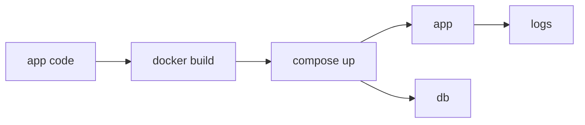

# 실전 컨테이너 앱 만들기

> Containers 101 시리즈 (10/10)


## 이 글에서 다룰 문제

지금까지 본 개념은 하나의 결과물로 묶어 봐야 몸에 붙습니다. 마지막 글의 의미도 바로 여기에 있습니다.

## 전체 흐름


## Before/After

**Before**: 수동 `docker run` 명령이 여러 줄이라 환경을 다시 띄우기 어렵습니다.

**After**: `docker compose up` 한 줄로 전체 스택을 기동합니다.

## FastAPI + Postgres 스택

### 1단계 — app/main.py

```python
from fastapi import FastAPI
import os, psycopg

app = FastAPI()

@app.get("/health")
def health():
    return {"ok": True}

@app.get("/users")
def users():
    with psycopg.connect(os.environ["DB_URL"]) as conn:
        with conn.cursor() as cur:
            cur.execute("SELECT count(*) FROM users")
            return {"count": cur.fetchone()[0]}
```

### 2단계 — Dockerfile

```python
"""
FROM python:3.12-slim
WORKDIR /app
COPY requirements.txt .
RUN pip install --no-cache-dir -r requirements.txt
COPY app ./app
USER 1000
EXPOSE 8080
HEALTHCHECK CMD curl -f http://localhost:8080/health || exit 1
CMD ["uvicorn", "app.main:app", "--host", "0.0.0.0", "--port", "8080"]
"""
```

### 3단계 — docker-compose.yml

```python
"""
services:
  app:
    build: .
    ports: ["8080:8080"]
    environment:
      DB_URL: postgresql://app:secret@db:5432/app
    depends_on:
      db: { condition: service_healthy }
    restart: unless-stopped
  db:
    image: postgres:16
    environment:
      POSTGRES_USER: app
      POSTGRES_PASSWORD: secret
      POSTGRES_DB: app
    healthcheck:
      test: ["CMD-SHELL", "pg_isready -U app"]
      interval: 5s
"""
```

### 4단계 — 기동 자동화

```python
import subprocess

def up():
    subprocess.run(["docker", "compose", "up", "-d", "--build"], check=True)

def logs():
    subprocess.run(["docker", "compose", "logs", "--tail=100"], check=False)
```

### 5단계 — 정리

```python
def down():
    subprocess.run(["docker", "compose", "down", "-v"], check=True)
```

## 이 코드에서 주목할 점

- `USER 1000`으로 non-root 실행을 강제합니다.
- healthcheck가 Compose 서비스 의존성 판단에 영향을 줍니다.
- `depends_on`과 `service_healthy`를 함께 써야 시작 순서를 더 안정적으로 맞출 수 있습니다.

## 자주 하는 실수 5가지

1. **DB 비밀번호를 Compose 파일에 평문으로 오래 남겨 둡니다.**
2. **healthcheck 없이 `depends_on`만 사용합니다.**
3. **restart policy를 빼먹어서 장애가 더 크게 번집니다.**
4. **volumes를 설정하지 않아 데이터가 쉽게 사라집니다.**
5. **로그를 컨테이너 내부에만 남겨 추적이 어려워집니다.**

## 실무에서는 이렇게 쓰입니다

로컬 개발은 Compose로 빠르게 반복하고, 프로덕션은 Kubernetes에서 같은 이미지를 다른 오케스트레이터로 운영하는 흐름이 흔합니다.

## 체크리스트

- [ ] non-root 실행을 적용했습니다.
- [ ] healthcheck를 정의했습니다.
- [ ] 시크릿을 분리했습니다.
- [ ] teardown 명령을 문서화했습니다.

## 정리 및 다음 단계

여기까지가 Containers 101의 마지막입니다. 다음 단계는 Kubernetes 101으로 넘어가 오케스트레이션 관점까지 확장하는 것입니다.

<!-- toc:begin -->
- [Container란 무엇인가?](./01-what-is-a-container.md)
- [Image와 Layer](./02-image-and-layer.md)
- [Runtime](./03-runtime.md)
- [Dockerfile](./04-dockerfile.md)
- [Volume](./05-volume.md)
- [Network](./06-network.md)
- [Registry](./07-registry.md)
- [Container Security](./08-container-security.md)
- [Container와 VM 차이](./09-container-vs-vm.md)
- **실전 컨테이너 앱 만들기 (현재 글)**
<!-- toc:end -->

## 참고 자료

- [Docker Compose](https://docs.docker.com/compose/)
- [FastAPI in containers](https://fastapi.tiangolo.com/deployment/docker/)
- [Dockerfile best practices](https://docs.docker.com/develop/develop-images/dockerfile_best-practices/)
- [HEALTHCHECK reference](https://docs.docker.com/engine/reference/builder/#healthcheck)

Tags: Containers, Docker, Compose, FastAPI, DevOps
