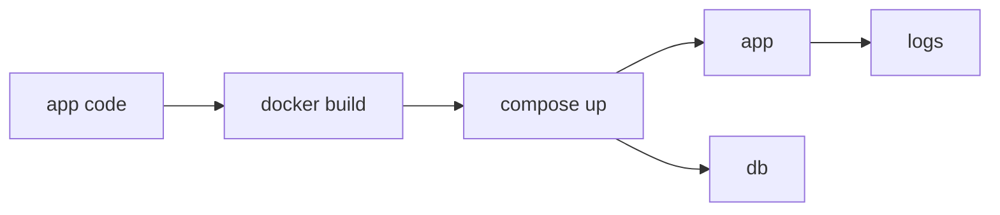

# 실전 컨테이너 앱 만들기

이 글은 Containers 101 시리즈의 마지막 글입니다.

## 이 글에서 다룰 문제

- FastAPI 앱용 Dockerfile은 어떤 기준으로 작성해야 할까요?
- Compose로 앱과 DB를 어떻게 함께 묶을 수 있을까요?
- healthcheck는 왜 orchestration 신호로 중요할까요?
- 시크릿과 로그는 어떤 원칙으로 분리해야 할까요?
- 하나의 명령으로 전체 스택을 올리는 구조가 왜 중요할까요?

> Dockerfile, Compose, healthcheck, 시크릿, 로그가 하나의 실행 흐름으로 연결될 때 비로소 컨테이너 기초가 실전 구조가 됩니다. 이 글은 그 전체 흐름을 하나의 앱으로 묶는 마무리 단계입니다.

## 왜 중요한가

앞에서 배운 개념은 실제 앱 하나로 묶어 봐야 비로소 손에 잡힙니다. 이미지, 네트워크, 볼륨, 보안, 헬스체크가 따로따로 기억되면 운영 설계로 이어지기 어렵습니다.

그래서 마지막 글의 목표는 기능을 하나 더 소개하는 데 있지 않습니다. 지금까지 배운 기본기를 한 번의 실행 흐름으로 연결해, “실제로는 이렇게 조립되는구나”라는 감각을 만드는 데 있습니다.

## 한눈에 보는 개념



애플리케이션 코드는 이미지가 되고, Compose는 앱과 DB를 함께 올리며, healthcheck와 로그가 운영 가능성을 받쳐 줍니다. 이제 컨테이너는 단일 명령이 아니라 하나의 작은 시스템이 됩니다.

## 핵심 용어

- **Dockerfile**: 이미지를 만드는 레시피입니다.
- **Compose**: 여러 컨테이너를 YAML로 묶는 도구입니다.
- **healthcheck**: 애플리케이션이 살아 있는지 판단하는 신호입니다.
- **restart policy**: 실패 시 자동 재시작 규칙입니다.
- **logs driver**: 로그를 수집하고 전달하는 백엔드입니다.

이 다섯 요소를 함께 묶어 생각할 수 있어야 실습이 운영 감각으로 이어집니다.

## Before / After

**Before**: 재현 불가능한 `docker run` 명령 여러 줄에 의존합니다.

**After**: `docker compose up` 한 줄로 전체 스택을 올립니다.

여기서 중요한 것은 편리함 자체보다, 누구나 같은 절차로 동일한 결과를 낼 수 있다는 점입니다.

## 실습: FastAPI + Postgres 스택 만들기

### Step 1 — app/main.py

```python
from fastapi import FastAPI
import os, psycopg

app = FastAPI()

@app.get("/health")
def health():
    return {"ok": True}

@app.get("/users")
def users():
    with psycopg.connect(os.environ["DB_URL"]) as conn:
        with conn.cursor() as cur:
            cur.execute("SELECT count(*) FROM users")
            return {"count": cur.fetchone()[0]}
```

애플리케이션은 DB URL을 환경 변수로 받고, `/health`와 `/users` 같은 간단한 엔드포인트를 노출합니다. 이 정도만 있어도 healthcheck와 DB 연결 흐름을 검증하기에는 충분합니다.

### Step 2 — Dockerfile

```python
"""
FROM python:3.12-slim
WORKDIR /app
COPY requirements.txt .
RUN pip install --no-cache-dir -r requirements.txt
COPY app ./app
USER 1000
EXPOSE 8080
HEALTHCHECK CMD curl -f http://localhost:8080/health || exit 1
CMD ["uvicorn", "app.main:app", "--host", "0.0.0.0", "--port", "8080"]
"""
```

비root 실행, 포트 노출, healthcheck까지 Dockerfile 안에 포함합니다. 이미지 단계에서부터 운영 기대치를 명시하는 구조입니다.

### Step 3 — docker-compose.yml

```python
"""
services:
  app:
    build: .
    ports: ["8080:8080"]
    environment:
      DB_URL: postgresql://app:secret@db:5432/app
    depends_on:
      db: { condition: service_healthy }
    restart: unless-stopped
  db:
    image: postgres:16
    environment:
      POSTGRES_USER: app
      POSTGRES_PASSWORD: secret
      POSTGRES_DB: app
    healthcheck:
      test: ["CMD-SHELL", "pg_isready -U app"]
      interval: 5s
"""
```

Compose는 애플리케이션과 데이터베이스를 하나의 스택으로 묶습니다. 여기서 `depends_on + service_healthy` 조합이 중요한 이유는 단순 실행 순서가 아니라 준비 완료 신호까지 함께 보게 해 주기 때문입니다.

### Step 4 — Automate startup

```python
import subprocess

def up():
    subprocess.run(["docker", "compose", "up", "-d", "--build"], check=True)

def logs():
    subprocess.run(["docker", "compose", "logs", "--tail=100"], check=False)
```

기동과 로그 확인도 명령으로 표준화합니다. 운영 가능성은 결국 “문제가 생겼을 때 어디를 보면 되는가”까지 포함해야 합니다.

### Step 5 — Tear down

```python
def down():
    subprocess.run(["docker", "compose", "down", "-v"], check=True)
```

종료와 정리까지 자동화해야 재실행과 복구가 쉬워집니다. 특히 볼륨까지 함께 내릴지 여부는 개발·테스트 환경에서 매우 중요합니다.

## 이 코드에서 먼저 봐야 할 점

- `USER 1000`은 비root 실행을 강제합니다.
- healthcheck는 Compose 의존성 판단 신호가 됩니다.
- `depends_on + service_healthy`는 짝으로 이해해야 합니다.

이 세 포인트는 실습 앱을 넘어 실제 운영 체크리스트로 그대로 이어집니다. 보안, 기동 순서, 관측성이 이 안에 모두 들어 있습니다.

## 자주 하는 실수 5가지

1. **DB 비밀번호를 Compose 파일에 영구 평문으로 남깁니다.**
2. **healthcheck 없이 `depends_on`만 사용합니다.**
3. **restart policy를 두지 않아 장애가 전파됩니다.**
4. **volume을 빠뜨려 데이터를 잃습니다.**
5. **로그를 컨테이너 내부에만 남깁니다.**

이 실수들은 “일단 뜨기만 하면 된다”는 태도에서 나옵니다. 하지만 실전에서는 기동 성공보다 재기동, 관측, 복구가 더 중요합니다.

## 운영에서는 이렇게 나타납니다

로컬 개발은 Compose로 스택을 올리고, 운영 환경은 Kubernetes 같은 오케스트레이터로 같은 이미지를 실행합니다. 즉, 도구는 달라도 이미지와 애플리케이션 계약은 그대로 유지됩니다.

## 시니어 엔지니어는 이렇게 생각합니다

- 한 줄 기동 경험이 곧 온보딩 비용이라고 봅니다.
- healthcheck는 오케스트레이션 신호라고 생각합니다.
- 환경 간 차이는 환경 변수 정도로만 남겨야 한다고 봅니다.
- 로그는 stdout으로 흘려 보내야 한다고 생각합니다.
- teardown까지 자동화되어야 운영 친화적이라고 판단합니다.

시니어 엔지니어는 “앱이 뜬다”보다 “누구나 같은 명령으로 띄우고, 상태를 확인하고, 내려도 같은 결과가 나오는가”를 더 중요하게 봅니다.

## 체크리스트

- [ ] 런타임에서 비root로 실행합니다.
- [ ] healthcheck를 정의했습니다.
- [ ] 시크릿 분리 방식을 정했습니다.
- [ ] teardown 명령을 문서화했습니다.

## 연습 문제

1. Dockerfile의 `USER`가 왜 중요한지 한 줄로 설명해 보세요.
2. `depends_on`만으로는 왜 부족한지 한 줄로 설명해 보세요.
3. Compose와 Kubernetes가 공유하는 개념 하나를 적어 보세요.

## 정리와 다음 글

이번 글은 Containers 101의 마무리로, 이미지, 네트워크, 상태, 보안, healthcheck를 하나의 실행 흐름으로 묶어 보았습니다. 결국 컨테이너 실전 감각은 개별 명령을 많이 아는 것보다, 이 요소들을 재현 가능한 스택으로 조립하는 능력에서 나옵니다.

이제 다음 단계는 Kubernetes 101처럼 오케스트레이션 세계로 넘어가, 여러 컨테이너를 더 큰 시스템으로 다루는 방향입니다.

<!-- toc:begin -->
- [Container란 무엇인가?](./01-what-is-a-container.md)
- [Image와 Layer](./02-image-and-layer.md)
- [Runtime](./03-runtime.md)
- [Dockerfile](./04-dockerfile.md)
- [Volume](./05-volume.md)
- [Network](./06-network.md)
- [Registry](./07-registry.md)
- [Container Security](./08-container-security.md)
- [Container와 VM 차이](./09-container-vs-vm.md)
- **실전 컨테이너 앱 만들기 (현재 글)**
<!-- toc:end -->

## 참고 자료

- [Docker Compose](https://docs.docker.com/compose/)
- [FastAPI in containers](https://fastapi.tiangolo.com/deployment/docker/)
- [Dockerfile best practices](https://docs.docker.com/develop/develop-images/dockerfile_best-practices/)
- [HEALTHCHECK reference](https://docs.docker.com/engine/reference/builder/#healthcheck)

Tags: Containers, Docker, Compose, FastAPI, DevOps
