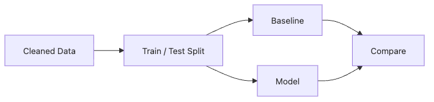

# Modeling

Modeling gets the spotlight, but it is easiest to misuse precisely because it looks sophisticated. A first model can produce a clean metric and still teach you nothing if you do not know what baseline it beat, whether preprocessing leaked information, or whether a different data split would change the story.

The safe way to start modeling is to reduce the room for self-deception. Build the simplest reference first, keep training and evaluation cleanly separated, and only then ask whether a more capable model is actually earning its complexity.

This is post 7 in the Data Science 101 series. Here we build that safer path: baseline first, pipeline second, and only then a model you can compare and trust.

## Questions This Post Answers

- Why is the baseline the real starting point of modeling?
- What does train/test separation protect you from in practice?
- Why is preprocessing outside the pipeline such a common leakage source?
- What extra signal does cross-validation variance add beyond a single score?

> A model only earns trust after it beats a baseline under a leakage-safe evaluation path.

## What You Will Learn

- The basic flow of *supervised learning*
- The role of a *baseline* model
- The principle of *train/test splitting*
- A 5-step modeling exercise
- Five common pitfalls

## Why It Matters

A *good baseline* is the real starting line — much more than a fancy model. Without a *reference*, you cannot prove a model adds value.

> *Every model competes against a *baseline*.*

## Concept at a Glance



*How cleaned data splits into train and test so a baseline and a model can be compared fairly*
## Key Terms

- **Baseline**: the *simplest possible* prediction (e.g., always majority class).
- **Train/test split**: separate data for *training* and *evaluation*.
- **Cross-validation**: repeat evaluation across *folds*.
- **Overfitting**: great on train, *poor* on test.
- **Pipeline**: preprocessing + model wrapped in *one object*.

## Before / After

**Before**: a complex model hits 95% accuracy. The baseline hits 96%. *Regression*, not progress.

**After**: record the *baseline 96%* first, then aim *above it*.

## Hands-on: 5-step Modeling

### Step 1 — Prepare data

```python
from sklearn.model_selection import train_test_split
import pandas as pd

df = pd.read_csv("churn.csv")
X = df.drop(columns=["churn"])
y = df["churn"]

X_train, X_test, y_train, y_test = train_test_split(
    X, y, test_size=0.2, random_state=42, stratify=y
)
```

### Step 2 — Baseline

```python
from sklearn.dummy import DummyClassifier
from sklearn.metrics import accuracy_score

base = DummyClassifier(strategy="most_frequent").fit(X_train, y_train)
print("baseline:", accuracy_score(y_test, base.predict(X_test)))
```

### Step 3 — Pipeline

```python
from sklearn.compose import ColumnTransformer
from sklearn.pipeline import Pipeline
from sklearn.preprocessing import OneHotEncoder, StandardScaler
from sklearn.linear_model import LogisticRegression

num = X.select_dtypes("number").columns.tolist()
cat = X.select_dtypes("object").columns.tolist()

pre = ColumnTransformer([
    ("num", StandardScaler(), num),
    ("cat", OneHotEncoder(handle_unknown="ignore"), cat),
])
model = Pipeline([("pre", pre), ("clf", LogisticRegression(max_iter=1000))])
```

### Step 4 — Train and evaluate

```python
model.fit(X_train, y_train)
print("model:", accuracy_score(y_test, model.predict(X_test)))
```

### Step 5 — Cross-validation

```python
from sklearn.model_selection import cross_val_score
scores = cross_val_score(model, X_train, y_train, cv=5, scoring="accuracy")
print(scores.mean(), "+/-", scores.std())
```

**Expected output:** one comparison view that shows baseline score, first-model score, and cross-validation mean plus variance.

## What to Notice in This Code

- *Baseline first*, every time.
- A *Pipeline* prevents *data leakage*.
- *Cross-validation* shows the *variance*, not just the mean.

## Five Common Mistakes

1. **Skipping the *baseline*.** You don't know if you improved anything.
2. **Fitting *preprocessing on the test set*.** That's *data leakage*.
3. **Looking only at *accuracy*.** Class *imbalance* fools you.
4. **Forgetting *random_state*.** *Reproducibility* breaks.
5. **Deciding from a *single split*.** You confuse *luck* with *skill*.

## How This Shows Up in Production

Teams log experiments with *MLflow / Weights & Biases*. The *baseline* is always experiment #1. Feature changes go *one at a time*.

## How a Senior Engineer Thinks

- The *baseline* is the most valuable experiment.
- Always wrap in a *Pipeline*.
- Pin *random_state*.
- Always look at *CV variance*.
- One *change* per one *metric move*.

## Checklist

- [ ] I can build a *baseline*.
- [ ] I understand a *Pipeline*.
- [ ] I know *why we split*.
- [ ] I look at *CV variance*.

## Practice Problems

1. Compare *baseline + logistic regression* on Titanic.
2. Document a case where a *missing Pipeline* caused *data leakage*.
3. Vary the *number of CV folds* and observe the *variance*.

## Wrap-up and Next Steps

Modeling is a *conversation with the baseline*. Next we step into the world of *evaluation metrics*.

<!-- toc:begin -->
- [What Is Data Science?](./01-what-is-data-science.md)
- [Turning a Problem into a Data Problem](./02-problem-to-data-problem.md)
- [Data Collection](./03-data-collection.md)
- [Data Cleaning](./04-data-cleaning.md)
- [Exploratory Data Analysis](./05-exploratory-data-analysis.md)
- [Visualization](./06-visualization.md)
- **Modeling (current)**
- Evaluation (upcoming)
- Result Interpretation (upcoming)
- End-to-End Data Project Flow (upcoming)
<!-- toc:end -->

## References

- [scikit-learn — User Guide](https://scikit-learn.org/stable/user_guide.html)
- [Google — Rules of Machine Learning](https://developers.google.com/machine-learning/guides/rules-of-ml)
- [Kaggle — Intro to Machine Learning](https://www.kaggle.com/learn/intro-to-machine-learning)
- [Hands-On Machine Learning with Scikit-Learn](https://github.com/ageron/handson-ml3)

Tags: DataScience, Modeling, ScikitLearn, MachineLearning, Beginner
