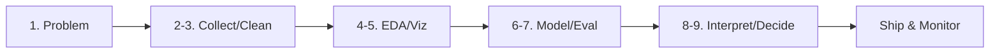

# End-to-End Data Project Flow

> Data Science 101 series (10/10)

<!-- a-grade-intro:begin -->

**Core question**: How do the nine steps we have learned look when *connected into one project*?

> *The final episode is the assembly episode.*

<!-- a-grade-intro:end -->

This is the final post in the Data Science 101 series.

## What You Will Learn

- A *churn prediction* project end to end
- How the nine steps form *one flow*
- The *deliverable* and *decision point* of each step
- A 5-step mini project exercise
- Five common mistakes

## Why It Matters

Looking at parts in isolation gives you *fragments*; following one project from start to finish gives you the *big picture*. Once you have done the *assembly* once, you can apply the same flow in *any domain*.

> *Whoever has built the whole once builds the next project faster.*

## Concept at a Glance



## Key Terms

- **Churn Prediction**: predicting which users are *about to leave*.
- **Baseline**: a *simple model* used as a *comparison anchor*.
- **Feature**: an *input signal* for the model.
- **Threshold**: the *cutoff* that turns a probability into a *decision*.
- **Decision**: the *sentence* that closes analysis into *action*.

## Before / After

**Before**: *“Churn is going up.”* — Who? How much? Why?

**After**: *“Send a re-engagement campaign to the top 10% of 30-day churn risk users (3,200 people) — projected churn reduction 12% (95% CI ±3%).”*

## Hands-on: 5-step Mini Project

### Step 1 — Define the problem

```text
Q: "How can we reduce churn?"
→ "Predict the top 10% most-likely-to-churn users in 30 days as a campaign target."
Decision: a campaign target list
```

### Step 2 — Data and cleaning

```python
import pandas as pd
df = pd.read_csv("events.csv", parse_dates=["ts"])
df = df.dropna(subset=["user_id"]).drop_duplicates(["user_id", "ts"])
```

### Step 3 — EDA and features

```python
features = (
    df.groupby("user_id")
      .agg(sessions=("ts", "count"),
           last_seen=("ts", "max"),
           plan=("plan", "last"))
)
features["days_since_last"] = (pd.Timestamp("2026-05-01") - features["last_seen"]).dt.days
```

### Step 4 — Model and evaluation

```python
from sklearn.linear_model import LogisticRegression
from sklearn.metrics import roc_auc_score

X, y = features[["sessions", "days_since_last"]], features["churned_30d"]
model = LogisticRegression().fit(X, y)
print("AUC:", roc_auc_score(y, model.predict_proba(X)[:, 1]))
```

### Step 5 — Interpret and decide

```text
Top 10% risk segment = 3,200 users
Expected churn reduction = 12% (95% CI ±3%)
Decision: send the re-engagement campaign this Friday
Owner: Growth team / Review: in 2 weeks
```

## What to Notice in This Code

- The flow *closes* from *problem to decision*.
- It starts at the *baseline* (logistic regression) — fancier models come later.
- A *decision sentence* turns the result into *action*.

## Five Common Mistakes

1. **Choosing the *tool* first.** Start with the *problem*.
2. **Falling in love with a *fancy model*.** *Skipping the baseline*.
3. **Choosing the *evaluation metric* at the *end*.** Decide it *up front* to avoid drift.
4. **Having *no decision owner*.** The analysis *disappears into a drawer*.
5. **Forgetting *monitoring*.** Models *age* with time.

## How This Shows Up in Production

Data teams write a *one-page project doc* (problem, metric, data, baseline, decision owner) and run it on *two-week sprints*. Models are wrapped in pipelines (*Airflow / dbt / MLflow*) for *reproducibility*, with *dashboards and alerts* watching for drift.

## How a Senior Engineer Thinks

- Build a *short loop* from *problem to decision*.
- *Respect the baseline.*
- *Always* write down the *owner*.
- Design *monitoring* on *Day 1*.
- Use *code* to guarantee *reproducibility*.

## Checklist

- [ ] I can write the *problem in one line*.
- [ ] I can run a *baseline*.
- [ ] I can write a *decision sentence*.
- [ ] I can name an *owner* and a *review date*.

## Practice Problems

1. Pick a service you use and *plan* a 5-step mini project around it.
2. For the churn example, propose *three features* that could beat the baseline.
3. Define *model drift* using *two metrics*.

## Wrap-up and Next Steps

This series was an assembly journey through the *problem → data → model → decision* flow. Next, the *Statistics 101*, *Machine Learning 101*, and *MLOps 101* series go *deeper into each step*.

<!-- toc:begin -->
- [What Is Data Science?](./01-what-is-data-science.md)
- [Turning a Problem into a Data Problem](./02-problem-to-data-problem.md)
- [Data Collection](./03-data-collection.md)
- [Data Cleaning](./04-data-cleaning.md)
- [Exploratory Data Analysis](./05-exploratory-data-analysis.md)
- [Visualization](./06-visualization.md)
- [Modeling](./07-modeling.md)
- [Evaluation](./08-evaluation.md)
- [Result Interpretation](./09-result-interpretation.md)
- **End-to-End Data Project Flow (current)**
<!-- toc:end -->

## References

- [Google — People + AI Research Guidebook](https://pair.withgoogle.com/guidebook/)
- [scikit-learn — Common Pitfalls and Recommended Practices](https://scikit-learn.org/stable/common_pitfalls.html)
- [Made With ML — End-to-End ML Course](https://madewithml.com/)
- [Full Stack Deep Learning](https://fullstackdeeplearning.com/)

Tags: DataScience, EndToEnd, Project, Workflow, Beginner
